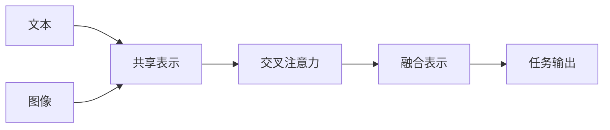

# 多模态大模型：技术原理与实战 工具和算法框架介绍

## 1. 背景介绍
### 1.1 多模态大模型的兴起
近年来,随着人工智能技术的飞速发展,多模态大模型(Multimodal Large Models)成为了学术界和工业界的研究热点。多模态大模型旨在通过融合不同模态的数据,如文本、图像、音频和视频等,构建一个统一的模型来处理和理解多模态信息。这种跨模态的学习方式能够更好地模拟人类的感知和认知过程,具有广阔的应用前景。

### 1.2 多模态大模型的优势
与传统的单模态模型相比,多模态大模型具有以下优势:

1. 信息融合:多模态大模型能够有效整合不同模态的信息,利用它们之间的互补性和关联性,从而获得更全面、准确的理解。

2. 鲁棒性:通过学习多种模态的表示,多模态大模型对噪声和缺失信息具有更强的鲁棒性,能够在复杂环境下保持稳定的性能。

3. 泛化能力:多模态大模型能够学习到更加通用的特征表示,有助于提高模型在新任务上的泛化能力和迁移学习效果。

4. 人机交互:多模态大模型为人机交互提供了更自然、友好的方式,用户可以通过文本、语音、手势等多种方式与系统进行交互。

### 1.3 多模态大模型的应用场景
多模态大模型在许多领域都有广泛的应用,例如:

1. 智能问答:通过融合文本、图像等信息,多模态大模型可以更准确地理解用户的问题,并给出相关的答案。

2. 情感分析:多模态大模型能够综合分析文本、语音、面部表情等多种模态的情感信息,实现更全面、细粒度的情感识别。

3. 视频理解:多模态大模型可以同时处理视频中的图像、音频和文本信息,实现视频内容的分析、检索和生成。

4. 医疗诊断:通过融合医学影像、病历、基因组数据等多模态信息,多模态大模型能够辅助医生进行疾病诊断和预后预测。

## 2. 核心概念与联系
### 2.1 多模态表示学习
多模态表示学习是多模态大模型的核心概念之一。它旨在学习不同模态数据的统一表示,以便于跨模态的信息融合和理解。常见的多模态表示学习方法包括:

1. 共享表示学习:通过设计共享的神经网络层,学习不同模态数据的共享表示。

2. 对齐表示学习:通过最小化不同模态表示之间的距离或最大化它们之间的相关性,实现表示对齐。

3. 交叉注意力机制:通过引入交叉注意力机制,让不同模态的表示相互影响,实现信息的交互和融合。

### 2.2 多模态融合
多模态融合是将不同模态的信息进行整合,以获得更全面、准确的理解。常见的多模态融合方法包括:

1. 早期融合:在特征提取之前,直接将不同模态的原始数据拼接在一起。

2. 晚期融合:在每个模态独立提取特征后,再将特征进行拼接或加权融合。

3. 中间融合:在特征提取的中间层引入融合机制,如交叉注意力或门控单元等。

### 2.3 预训练与微调
预训练是在大规模多模态数据上进行无监督或自监督学习,以获得通用的多模态表示。微调是在特定任务上,利用预训练得到的模型参数进行初始化,并在任务数据上进行进一步的训练。这种预训练-微调的范式能够显著提高模型的性能和泛化能力。

### 2.4 多模态大模型的架构
下面是一个典型的多模态大模型的架构示意图:



在这个架构中,不同模态的数据首先通过共享的神经网络层映射到共享表示空间。然后,通过交叉注意力机制实现不同模态表示之间的交互和融合。最后,融合后的表示被用于特定的任务,如分类、生成等。

## 3. 核心算法原理具体操作步骤
### 3.1 多模态预训练
多模态预训练的目标是在大规模多模态数据上学习通用的表示。以下是一个典型的多模态预训练算法的步骤:

1. 数据准备:收集大量的文本-图像对,并进行预处理,如tokenization、图像归一化等。

2. 模型构建:设计多模态模型的架构,如Transformer、BERT等,并初始化模型参数。

3. 预训练任务设计:设计适合多模态学习的预训练任务,如掩码语言建模(Masked Language Modeling)、图像-文本匹配(Image-Text Matching)等。

4. 训练过程:在预训练任务上对模型进行训练,通过最小化损失函数来优化模型参数。常用的优化算法包括Adam、AdamW等。

5. 模型评估:在验证集上评估模型的性能,如掩码语言建模的准确率、图像-文本匹配的准确率等。

6. 模型保存:将训练好的模型参数保存下来,以便后续的微调和应用。

### 3.2 多模态微调
多模态微调是在特定任务上,利用预训练得到的模型参数进行初始化,并在任务数据上进行进一步的训练。以下是一个典型的多模态微调算法的步骤:

1. 数据准备:收集特定任务的多模态数据,并进行预处理,如标注、数据增强等。

2. 模型构建:在预训练模型的基础上,根据任务的需求修改模型的输入、输出和损失函数。

3. 参数初始化:使用预训练得到的模型参数来初始化微调模型的参数。

4. 训练过程:在任务数据上对模型进行训练,通过最小化任务特定的损失函数来优化模型参数。常用的优化算法包括Adam、SGD等。

5. 模型评估:在测试集上评估模型的性能,如分类准确率、生成质量等。

6. 模型部署:将训练好的模型部署到实际应用中,进行推理和预测。

## 4. 数学模型和公式详细讲解举例说明
### 4.1 多模态表示学习的目标函数
多模态表示学习旨在学习不同模态数据的统一表示。以文本-图像表示学习为例,我们可以定义如下的目标函数:

$$
\mathcal{L} = \mathcal{L}_{text} + \mathcal{L}_{image} + \lambda \mathcal{L}_{alignment}
$$

其中,$\mathcal{L}_{text}$和$\mathcal{L}_{image}$分别表示文本和图像的重构损失,用于确保学习到的表示能够很好地重构原始数据。$\mathcal{L}_{alignment}$表示文本和图像表示之间的对齐损失,用于促进不同模态表示的对齐。$\lambda$是平衡不同损失项的超参数。

举例来说,我们可以使用均方误差(Mean Squared Error, MSE)来定义重构损失:

$$
\mathcal{L}_{text} = \frac{1}{N} \sum_{i=1}^N \left\| \mathbf{x}_i - \mathbf{\hat{x}}_i \right\|_2^2
$$

$$
\mathcal{L}_{image} = \frac{1}{N} \sum_{i=1}^N \left\| \mathbf{y}_i - \mathbf{\hat{y}}_i \right\|_2^2
$$

其中,$\mathbf{x}_i$和$\mathbf{y}_i$分别表示第$i$个文本和图像的原始特征,$\mathbf{\hat{x}}_i$和$\mathbf{\hat{y}}_i$表示重构得到的特征。

对于对齐损失,我们可以使用余弦相似度(Cosine Similarity)来度量不同模态表示之间的距离:

$$
\mathcal{L}_{alignment} = \frac{1}{N} \sum_{i=1}^N \left( 1 - \frac{\mathbf{z}_{text,i} \cdot \mathbf{z}_{image,i}}{\left\| \mathbf{z}_{text,i} \right\|_2 \left\| \mathbf{z}_{image,i} \right\|_2} \right)
$$

其中,$\mathbf{z}_{text,i}$和$\mathbf{z}_{image,i}$分别表示第$i$个文本和图像的共享表示。

通过最小化上述目标函数,我们可以学习到不同模态数据的统一表示,实现多模态信息的融合。

### 4.2 交叉注意力机制
交叉注意力机制是实现多模态信息交互和融合的重要方法。以文本-图像交互为例,我们可以定义如下的交叉注意力计算公式:

$$
\mathbf{A}_{text\rightarrow image} = \text{softmax}\left(\frac{\mathbf{Q}_{text} \mathbf{K}_{image}^T}{\sqrt{d}}\right) \mathbf{V}_{image}
$$

$$
\mathbf{A}_{image\rightarrow text} = \text{softmax}\left(\frac{\mathbf{Q}_{image} \mathbf{K}_{text}^T}{\sqrt{d}}\right) \mathbf{V}_{text}
$$

其中,$\mathbf{Q}_{text}$和$\mathbf{Q}_{image}$分别表示文本和图像的查询矩阵,$\mathbf{K}_{text}$和$\mathbf{K}_{image}$分别表示文本和图像的键矩阵,$\mathbf{V}_{text}$和$\mathbf{V}_{image}$分别表示文本和图像的值矩阵。$d$是查询和键矩阵的维度,用于缩放点积结果。

通过交叉注意力机制,文本表示可以根据图像表示进行更新,图像表示也可以根据文本表示进行更新,实现了不同模态信息的交互和融合。

## 5. 项目实践：代码实例和详细解释说明
下面是一个使用PyTorch实现多模态预训练的简单示例:

```python
import torch
import torch.nn as nn
import torch.optim as optim

# 定义多模态模型
class MultimodalModel(nn.Module):
    def __init__(self, text_dim, image_dim, hidden_dim):
        super(MultimodalModel, self).__init__()
        self.text_encoder = nn.Linear(text_dim, hidden_dim)
        self.image_encoder = nn.Linear(image_dim, hidden_dim)
        self.text_decoder = nn.Linear(hidden_dim, text_dim)
        self.image_decoder = nn.Linear(hidden_dim, image_dim)
        
    def forward(self, text, image):
        # 编码
        text_hidden = self.text_encoder(text)
        image_hidden = self.image_encoder(image)
        # 解码
        text_recon = self.text_decoder(text_hidden)
        image_recon = self.image_decoder(image_hidden)
        return text_hidden, image_hidden, text_recon, image_recon

# 定义损失函数
def loss_fn(text, image, text_recon, image_recon, text_hidden, image_hidden):
    text_loss = nn.MSELoss()(text, text_recon)
    image_loss = nn.MSELoss()(image, image_recon)
    alignment_loss = 1 - nn.CosineSimilarity()(text_hidden, image_hidden).mean()
    total_loss = text_loss + image_loss + 0.5 * alignment_loss
    return total_loss

# 设置超参数
text_dim = 100
image_dim = 200
hidden_dim = 50
learning_rate = 0.001
num_epochs = 10

# 创建模型和优化器
model = MultimodalModel(text_dim, image_dim, hidden_dim)
optimizer = optim.Adam(model.parameters(), lr=learning_rate)

# 训练循环
for epoch in range(num_epochs):
    # 前向传播
    text_hidden, image_hidden, text_recon, image_recon = model(text, image)
    # 计算损失
    loss = loss_fn(text, image, text_recon, image_recon, text_hidden, image_hidden)
    # 反向传播和优化
    optimizer.zero_grad()
    loss.backward()
    optimizer.step()
    
    print(f"Epoch [{epoch+1}/{num_epochs}], Loss: {loss.item():.4f}")
```

在这个示例中,我们定义了一个简单的多模态模型`MultimodalModel`,包含文本编码器