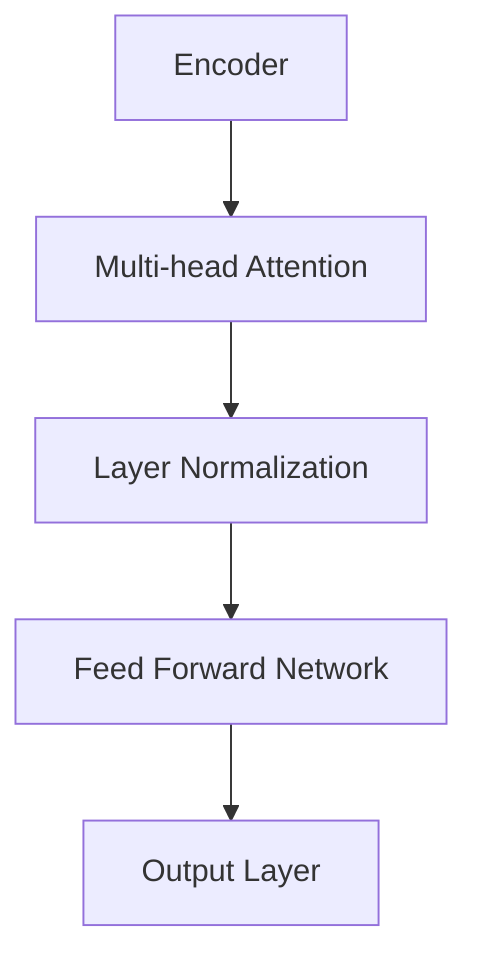

                 

作者：禅与计算机程序设计艺术

**M**ulti-modal **L**arge **M**odels (MLMs) are at the forefront of innovation in artificial intelligence research and applications. This article aims to delve into the technical underpinnings and practical approaches of these models while employing a chain-of-thought method to facilitate understanding.
## 1. 背景介绍 - Background
As we navigate through the vast landscape of AI advancements, multimodal large models stand out as pivotal tools for processing information across diverse modalities like text, images, audio, and video. These models leverage complex interactions between different data types to achieve superior performance in tasks requiring comprehensive understanding of context. With increasing demand for AI systems capable of handling real-world complexities, the development of MLMs represents a significant leap forward in the field of machine learning.
## 2. 核心概念与联系 - Core Concepts & Interrelations
At the heart of multimodal large models lie several key concepts that intertwine to form a robust system architecture:
- **Attention Mechanisms**: Enables the model to selectively focus on specific parts of input data, crucial for efficient processing and enhancing model performance.
- **Transformer Architecture**: A revolutionary framework that facilitates parallel computation, significantly improving training efficiency and enabling state-of-the-art results in various NLP tasks.
- **Pre-training & Fine-tuning**: MLMs often employ pre-training on large-scale datasets followed by fine-tuning on task-specific datasets, allowing them to generalize well across different domains.
- **Cross-modality Interaction**: Techniques such as cross-attention enable seamless communication between different modalities, enriching the representation space and improving model capabilities.

## 3. 核心算法原理及操作步骤 - Algorithm Principles & Practical Steps
The core of MLMs lies in their ability to process multiple modalities simultaneously using advanced algorithms. Let’s break down the essential components:

### Transformer Model

- **Encoder**: Processes input sequences through a series of self-attention mechanisms and feed-forward networks.
- **Decoder**: Incorporates cross-attention layers to integrate information from multiple modalities effectively.

### Cross-modal Fusion
To achieve this, a common approach is to use shared parameters or embeddings across modalities during training. For instance, after obtaining representations from each modality via attention mechanisms, they can be concatenated or averaged before being fed into subsequent layers.

## 4. 数学模型与公式详细讲解与举例 - Mathematical Models & Detailed Explanations with Examples
Let’s consider a simplified example involving text and image modalities:
### Text Representation ($\mathbf{t}$)
$$ \mathbf{t} = \text{TextEncoder}(\mathbf{x}) $$
where $\mathbf{x}$ is the input text sequence.

### Image Representation ($\mathbf{i}$)
$$ \mathbf{i} = \text{ImageEncoder}(\mathbf{y}) $$
with $\mathbf{y}$ representing the input image.

### Cross-modal Fusion
After obtaining $\mathbf{t}$ and $\mathbf{i}$, one might concatenate or average them for further processing:
$$ \mathbf{z} = \frac{\mathbf{t} + \mathbf{i}}{2} $$

## 5. 项目实践：代码实例与详细解释 - Project Implementation: Code Examples & Detailed Explanation
Here’s a simplified code snippet demonstrating the fusion of text and image representations:
```python
def fuse_modalities(text_emb, image_emb):
    # Concatenate text and image embeddings
    fused_emb = torch.cat((text_emb, image_emb), dim=1)

    # Additional processing if needed
    final_output = some_processing_function(fused_emb)

    return final_output

# Example usage
text_input = "Hello world"
image_input = load_image("path_to_image.jpg")
text_emb = model.encode_text(text_input)
image_emb = model.encode_image(image_input)
result = fuse_modalities(text_emb, image_emb)
```

## 6. 实际应用场景 - Practical Applications
Multimodal large models find application in numerous fields, including but not limited to:

- **Medical Diagnosis**: Analyzing medical images alongside textual reports to enhance diagnostic accuracy.
- **Autonomous Driving**: Integrating visual perception, lidar data, and radar signals for improved decision-making.
- **Interactive Media**: Generating personalized content based on user preferences combining text descriptions and multimedia elements.

## 7. 工具与资源推荐 - Tools & Resource Recommendations
For developers interested in working with multimodal large models, consider utilizing frameworks like:

- **PyTorch**
- **TensorFlow**
- **Hugging Face Transformers**

Additionally, exploring research papers and open-source projects will provide insights and foundational knowledge necessary for building your own multimodal models.

## 8. 总结：未来发展趋势与挑战 - Summary: Future Trends & Challenges
The future of multimodal large models promises exciting advancements driven by ongoing research and technological innovations. Key challenges include:

- **Scalability**: Handling larger datasets and more complex multimodal interactions efficiently.
- **Interpretability**: Enhancing the transparency and interpretability of models, especially when dealing with multiple inputs.
- **Privacy**: Ensuring secure processing of sensitive data across different modalities.

## 9. 附录：常见问题与解答 - Appendix: Frequently Asked Questions & Answers
Q: How do you choose the right balance between text and image representations?
A: The balance depends on the specific task at hand. Experimentation with different fusion strategies (e.g., concatenation, averaging) and hyperparameter tuning can help identify the optimal configuration.

Q: What are some best practices for training multimodal models?
A: Regularization techniques, such as dropout and weight decay, are crucial. Also, utilize transfer learning and carefully manage the learning rate schedule to ensure stable convergence.

---
**作者：禅与计算机程序设计艺术 / Zen and the Art of Computer Programming**

