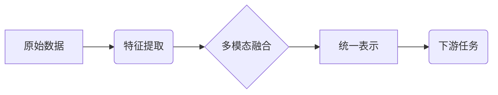
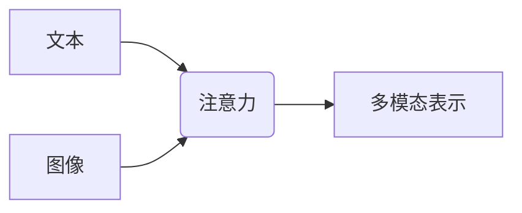
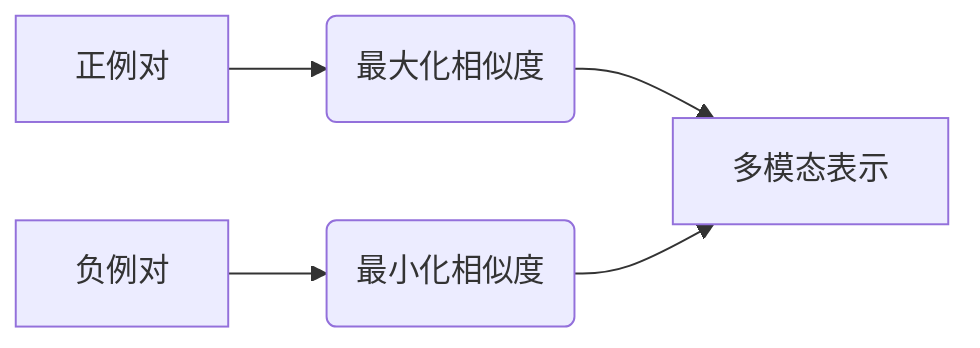
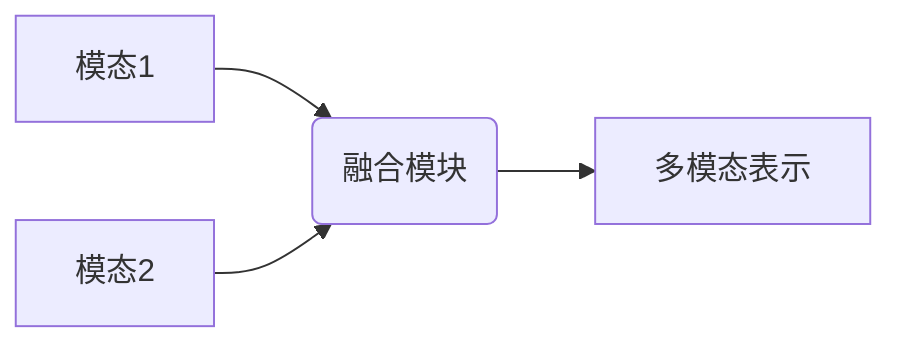

# 多模态大模型：技术原理与实战 文本多模态技术

## 1.背景介绍

### 1.1 人工智能的新时代

近年来,人工智能(AI)技术取得了长足进步,尤其是在自然语言处理(NLP)和计算机视觉(CV)等领域。传统的人工智能系统往往专注于单一模态,如文本或图像。然而,人类认知世界是多模态的,我们通过视觉、听觉、触觉等多种感官整合信息。为了更好地模拟人类认知,多模态人工智能应运而生。

### 1.2 多模态人工智能的兴起  

多模态人工智能旨在整合来自不同模态(如文本、图像、视频、音频等)的信息,实现更准确、更丰富的理解和表达。这种跨模态融合的能力使得人工智能系统能够更好地理解复杂的现实世界,并为人机交互提供更自然、更流畅的体验。

### 1.3 大模型时代的到来

随着计算能力的不断提高和海量数据的积累,大规模预训练语言模型(如GPT、BERT等)取得了巨大成功。这些大模型在自然语言处理任务上展现出了惊人的性能。然而,它们仍然局限于单一模态(文本),无法充分利用多模态信息。因此,多模态大模型(Multimodal Large Models)的研究和应用成为人工智能领域的新热点。

## 2.核心概念与联系

### 2.1 多模态表示学习

多模态表示学习(Multimodal Representation Learning)是多模态人工智能的核心概念。它旨在从不同模态的数据中学习统一的表示,捕捉模态之间的相关性和互补性。有效的多模态表示能够提高下游任务的性能,如文本-图像检索、视觉问答、多模态机器翻译等。



### 2.2 注意力机制

注意力机制(Attention Mechanism)是多模态模型中的关键技术。它允许模型动态地聚焦于不同模态的相关部分,并根据上下文自适应地分配注意力权重。注意力机制有助于模型捕捉模态之间的相互作用,提高多模态融合的效果。



### 2.3 预训练与微调

预训练(Pre-training)和微调(Fine-tuning)是训练多模态大模型的常用范式。首先在大规模多模态数据集上进行自监督预训练,学习通用的多模态表示。然后在特定任务上进行微调,将预训练模型迁移到下游任务。这种范式能够有效利用大量无标注数据,提高模型的泛化能力。


### 2.4 多模态对比学习

对比学习(Contrastive Learning)是一种有效的自监督学习方法,通过最大化正例对之间的相似性,最小化正负例对之间的相似性,学习出良好的表示。在多模态领域,对比学习可以捕捉不同模态之间的相关性,提高多模态表示的质量。



## 3.核心算法原理具体操作步骤

### 3.1 Transformer 模型

Transformer 是多模态大模型的核心架构之一。它基于自注意力机制,能够有效捕捉长距离依赖关系。在多模态场景下,Transformer 可以融合来自不同模态的信息,学习跨模态的表示。

1. 输入embedding:将不同模态的输入(如文本、图像)转换为embedding向量。
2. 多头自注意力:计算查询(Query)、键(Key)和值(Value)之间的注意力权重,捕捉输入序列中元素之间的关系。
3. 前馈神经网络:对注意力输出进行非线性变换,提取高级特征。
4. 残差连接和层归一化:引入残差连接和层归一化,提高模型的稳定性和收敛性。
5. 编码器-解码器架构:编码器捕捉输入的表示,解码器根据编码器输出生成目标序列。


### 3.2 Vision Transformer

Vision Transformer(ViT)是一种应用于计算机视觉任务的Transformer模型。它将图像分割为多个patch(图像块),并将每个patch投影为一个embedding向量,然后输入到Transformer编码器中进行处理。

1. 图像分割:将输入图像分割为多个patch。
2. 线性投影:将每个patch投影为一个embedding向量。
3. 位置编码:添加位置编码,赋予patch位置信息。
4. Transformer编码器:输入patch embedding序列,进行自注意力计算和前馈神经网络操作。
5. 分类头:对编码器输出进行分类或其他下游任务。


### 3.3 多模态融合

多模态融合是多模态模型的关键步骤,需要有效地整合来自不同模态的信息。常见的融合方法包括:

1. 早期融合:在输入层将不同模态的特征拼接或求和。
2. 晚期融合:在高层将不同模态的表示进行融合。
3. 层级融合:在不同层次上进行多模态融合。
4. 注意力融合:通过注意力机制动态分配不同模态的权重。
5. 对比学习融合:最大化正例对的相似度,最小化负例对的相似度。



## 4.数学模型和公式详细讲解举例说明

### 4.1 自注意力机制

自注意力机制是Transformer模型的核心,它能够捕捉输入序列中元素之间的长距离依赖关系。给定一个输入序列$X = (x_1, x_2, \dots, x_n)$,自注意力计算过程如下:

$$\begin{aligned}
Q &= XW^Q \\
K &= XW^K \\
V &= XW^V \\
\text{Attention}(Q, K, V) &= \text{softmax}\left(\frac{QK^T}{\sqrt{d_k}}\right)V
\end{aligned}$$

其中,$ Q $、$ K $、$ V $分别表示查询(Query)、键(Key)和值(Value),$W^Q$、$W^K$、$W^V$是可学习的权重矩阵,$ d_k $是缩放因子。

自注意力机制能够捕捉输入序列中任意两个位置之间的关系,并根据上下文动态分配注意力权重。这种灵活性使得Transformer模型在各种序列建模任务上表现出色。

### 4.2 多头注意力

为了进一步提高模型的表示能力,Transformer引入了多头注意力(Multi-Head Attention)机制。多头注意力将输入序列映射到多个子空间,并在每个子空间中计算注意力,最后将多个注意力头的结果拼接起来。

$$\begin{aligned}
\text{MultiHead}(Q, K, V) &= \text{Concat}(\text{head}_1, \dots, \text{head}_h)W^O \\
\text{where } \text{head}_i &= \text{Attention}(QW_i^Q, KW_i^K, VW_i^V)
\end{aligned}$$

其中,$ h $是注意力头的数量,$W_i^Q$、$W_i^K$、$W_i^V$是每个注意力头的可学习权重矩阵,$ W^O $是输出的线性变换矩阵。

多头注意力机制允许模型从不同的表示子空间捕捉不同的特征,提高了模型的表示能力和泛化性能。

### 4.3 对比学习损失函数

对比学习是一种有效的自监督学习方法,通过最大化正例对之间的相似性,最小化正负例对之间的相似性,学习出良好的表示。在多模态场景下,对比学习可以捕捉不同模态之间的相关性,提高多模态表示的质量。

给定一个正例对$(x_i, y_i)$和一个负例对$(x_i, y_j)$,其中$ x_i $和$ y_i $来自同一个实例的不同模态,$ y_j $来自另一个实例。对比学习的损失函数可以定义为:

$$\mathcal{L}_i = -\log \frac{\exp(\text{sim}(x_i, y_i) / \tau)}{\sum_{j=1}^{N} \exp(\text{sim}(x_i, y_j) / \tau)}$$

其中,$ \text{sim}(x, y) $是$ x $和$ y $之间的相似度函数(如点积或余弦相似度),$ \tau $是温度超参数,$ N $是负例的数量。

通过最小化这个损失函数,模型可以学习到能够最大化正例对相似度,最小化负例对相似度的表示,从而捕捉不同模态之间的相关性。

## 5.项目实践：代码实例和详细解释说明

以下是一个基于PyTorch实现的多模态Transformer模型示例,用于文本-图像检索任务。

```python
import torch
import torch.nn as nn

class MultimodalTransformer(nn.Module):
    def __init__(self, text_dim, image_dim, hidden_dim, num_heads, num_layers):
        super(MultimodalTransformer, self).__init__()
        self.text_embedding = nn.Linear(text_dim, hidden_dim)
        self.image_embedding = nn.Linear(image_dim, hidden_dim)
        self.pos_encoder = PositionalEncoding(hidden_dim)
        encoder_layer = nn.TransformerEncoderLayer(hidden_dim, num_heads, dim_feedforward=2048, dropout=0.1)
        self.transformer_encoder = nn.TransformerEncoder(encoder_layer, num_layers)
        self.output_layer = nn.Linear(hidden_dim, 1)

    def forward(self, text, image):
        text_emb = self.text_embedding(text)
        image_emb = self.image_embedding(image)
        input_emb = torch.cat((text_emb, image_emb), dim=1)
        input_emb = self.pos_encoder(input_emb)
        output = self.transformer_encoder(input_emb)
        scores = self.output_layer(output)
        return scores
```

1. `MultimodalTransformer`类继承自`nn.Module`，定义了多模态Transformer模型的结构。
2. `__init__`方法初始化模型的各个组件:
   - `text_embedding`和`image_embedding`将文本和图像特征投影到隐藏空间。
   - `pos_encoder`添加位置编码。
   - `transformer_encoder`是Transformer编码器模块,包含多个编码器层。
   - `output_layer`是输出层,用于计算文本-图像相似度分数。
3. `forward`方法定义了模型的前向传播过程:
   - 将文本和图像特征投影到隐藏空间。
   - 将文本和图像embedding拼接,并添加位置编码。
   - 将拼接后的embedding输入Transformer编码器。
   - 通过输出层计算文本-图像相似度分数。

在训练过程中,可以使用对比学习损失函数,最大化正例对的相似度分数,最小化负例对的相似度分数。在推理阶段,可以根据相似度分数进行文本-图像检索或其他下游任务。

## 6.实际应用场景

多模态大模型在各种领域都有广泛的应用前景,包括但不限于:

1. **多模态对话系统**: 集成视觉、语音和文本信息,实现更自然、更智能的人机交互。
2. **视觉问答**: 根据图像内容回答相关的自然语言问题。
3. **图像描述生成**: 根据图像内容自动生成相应的