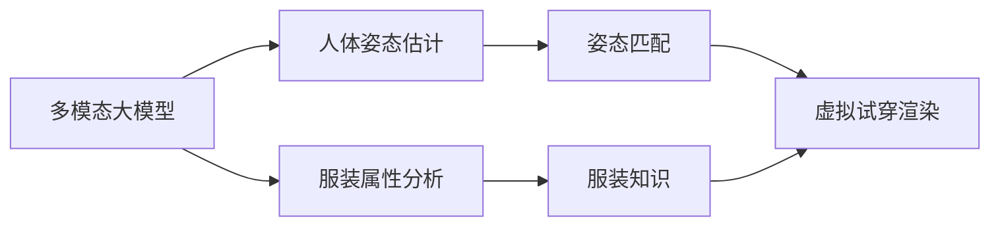

# 多模态大模型：技术原理与实战 智能试穿

## 1. 背景介绍

### 1.1 多模态大模型概述

多模态大模型是近年来人工智能领域的重要突破，它能够同时处理和理解文本、图像、语音等多种模态的数据，实现跨模态的信息理解和生成。这种模型通过海量数据的预训练，学习到了丰富的世界知识和多模态表示，可以应用于智能问答、图像描述、视频理解等多种任务。

### 1.2 智能试穿的需求与挑战

在电商和时尚领域，智能试穿是一个备受关注的应用场景。用户希望通过上传自己的照片，在虚拟环境中试穿不同的服装，从而获得身临其境的体验。这对于提升用户购物体验和购买转化率具有重要意义。然而，实现高质量的智能试穿面临诸多技术挑战，如服装与人体的精准匹配、逼真的服装渲染、姿态和体型的适配等。

### 1.3 多模态大模型在智能试穿中的应用前景

多模态大模型为解决智能试穿的难题提供了新的思路。通过学习大规模的人体图像和服装数据，模型可以理解人体姿态、体型特征以及服装款式、材质等属性。再结合先进的计算机视觉和图形学技术，多模态大模型有望生成高度拟真的虚拟试穿效果，让用户在虚拟环境中获得身临其境的试穿体验。这将极大地改变人们的购物方式，推动电商和时尚行业的智能化发展。

## 2. 核心概念与联系

### 2.1 多模态学习

多模态学习是指同时处理和融合多种模态（如文本、图像、语音等）的信息，以获得更全面和准确的理解。不同模态的数据蕴含着互补的信息，多模态学习旨在捕捉这些模态之间的关联和语义，从而实现跨模态的信息融合和推理。

### 2.2 大规模预训练

大规模预训练是指在海量数据上对模型进行自监督学习，使其掌握丰富的世界知识和多模态表示能力。这种预训练范式通过设计巧妙的预训练任务，让模型在无监督的情况下自主学习数据的内在结构和规律。预训练得到的模型可以作为下游任务的基础，显著提升模型的泛化能力和性能。

### 2.3 人体姿态估计

人体姿态估计是指从图像或视频中检测和定位人体关键点（如头部、肩部、手部等），并推断出人体的姿态和动作。准确的人体姿态估计是实现智能试穿的关键，它为服装与人体的匹配提供了基础。多模态大模型可以通过学习大量人体姿态数据，建立起对人体结构和运动的深入理解。

### 2.4 服装属性分析

服装属性分析是指从图像中识别和提取服装的各种属性，如款式、颜色、材质、纹理等。这些属性信息对于实现逼真的服装渲染和搭配推荐至关重要。多模态大模型通过学习大规模服装图像数据，可以掌握服装属性的多样性和搭配规律，为智能试穿提供丰富的服装知识。

### 2.5 虚拟试穿渲染

虚拟试穿渲染是指将选定的服装模型与用户照片进行融合，生成逼真的试穿效果图。这需要考虑服装的形状、纹理、光照等因素，以及与人体姿态的自然匹配。多模态大模型可以利用其对人体和服装的深度理解，结合先进的图形学渲染技术，生成高度拟真的虚拟试穿效果。

### 2.6 多模态大模型与智能试穿的关系

下图展示了多模态大模型在智能试穿中的作用和关键技术之间的联系：



多模态大模型通过学习人体姿态数据和服装图像数据，建立起对人体结构和服装属性的深度理解。这种理解为姿态匹配和服装知识提供了基础，进而实现逼真的虚拟试穿渲染。多模态大模型的强大学习能力和泛化能力，使其成为实现智能试穿的关键技术之一。

## 3. 核心算法原理具体操作步骤

### 3.1 多模态大模型的预训练

1. 数据准备：收集大规模的人体图像和服装图像数据，并进行清洗和标注。
2. 预训练任务设计：设计合适的预训练任务，如掩码语言建模、图像-文本匹配、跨模态对比学习等，以促进模型学习多模态表示。
3. 模型架构选择：选择适合多模态学习的模型架构，如Transformer、CLIP、DALL-E等。
4. 模型训练：在大规模数据上对模型进行预训练，通过优化预训练任务的目标函数，使模型掌握多模态表示能力。
5. 模型评估：在验证集上评估模型的预训练效果，如测试图像-文本检索、图像生成等任务的性能。

### 3.2 人体姿态估计

1. 关键点检测：使用预训练的人体姿态估计模型（如OpenPose、HRNet等），从输入图像中检测出人体关键点的位置。
2. 姿态解析：根据检测到的关键点，推断出人体的姿态结构，如骨骼拓扑、肢体方向等。
3. 姿态优化：结合人体运动学知识，对估计的姿态进行优化和平滑，以获得更准确和自然的姿态结果。

### 3.3 服装属性分析

1. 服装检测：使用目标检测模型（如Faster R-CNN、YOLO等）从图像中检测出服装区域。
2. 属性分类：对检测到的服装区域进行属性分类，如款式、颜色、材质等，可使用卷积神经网络（CNN）等分类模型。
3. 属性提取：将分类结果转化为结构化的服装属性表示，如属性向量或属性图。

### 3.4 虚拟试穿渲染

1. 人体模型构建：根据估计的人体姿态，构建3D人体模型，如SMPL、SCAPE等。
2. 服装模型匹配：将选定的服装模型与人体模型进行匹配，考虑服装的尺寸、形状和材质属性。
3. 变形和缝合：根据人体姿态和体型，对服装模型进行变形和缝合，使其与人体自然贴合。
4. 纹理映射：将服装纹理映射到变形后的服装模型上，考虑光照、阴影等效果。
5. 渲染合成：将渲染后的服装模型与原始人体图像进行合成，生成最终的虚拟试穿效果图。

## 4. 数学模型和公式详细讲解举例说明

### 4.1 多模态表示学习

多模态表示学习旨在将不同模态的数据映射到一个共同的语义空间，以捕捉模态之间的关联和语义。以图像-文本对比学习为例，给定一个图像$I$和一段文本$T$，我们希望学习它们的表示向量$f(I)$和$g(T)$，使得相似的图像-文本对在语义空间中距离较近，而不相似的图像-文本对距离较远。

这可以通过优化对比损失函数来实现：

$$
L(I,T) = -\log \frac{\exp(\text{sim}(f(I),g(T))/\tau)}{\sum_{T'}\exp(\text{sim}(f(I),g(T'))/\tau)}
$$

其中，$\text{sim}(\cdot,\cdot)$表示相似度度量，如点积或余弦相似度，$\tau$是温度超参数，$T'$是负样本文本。通过最小化这个损失函数，模型可以学习到对齐的图像-文本表示。

### 4.2 人体姿态估计

人体姿态估计可以看作是一个关键点回归问题。给定一个人体图像$I$，我们希望估计出$K$个关键点的坐标$\mathbf{y} = \{(x_k,y_k)\}_{k=1}^K$。这可以通过最小化关键点坐标的均方误差（MSE）损失函数来实现：

$$
L(\mathbf{y},\hat{\mathbf{y}}) = \frac{1}{K}\sum_{k=1}^K \left((x_k-\hat{x}_k)^2 + (y_k-\hat{y}_k)^2\right)
$$

其中，$\hat{\mathbf{y}} = \{(\hat{x}_k,\hat{y}_k)\}_{k=1}^K$是模型预测的关键点坐标。通过最小化这个损失函数，模型可以学习到准确的人体关键点位置。

### 4.3 服装属性分类

服装属性分类可以看作是一个多标签分类问题。给定一个服装图像$I$，我们希望预测其属于$M$个属性类别的概率$\mathbf{p} = [p_1,p_2,\dots,p_M]$。这可以通过最小化交叉熵损失函数来实现：

$$
L(\mathbf{y},\mathbf{p}) = -\sum_{m=1}^M y_m \log p_m + (1-y_m) \log (1-p_m)
$$

其中，$\mathbf{y} = [y_1,y_2,\dots,y_M]$是真实的属性标签，$y_m \in \{0,1\}$表示图像是否具有第$m$个属性。通过最小化这个损失函数，模型可以学习到准确的服装属性分类。

### 4.4 虚拟试穿渲染

虚拟试穿渲染涉及到服装模型的变形和纹理映射。给定一个服装模型$\mathcal{M}$和目标人体姿态$\mathbf{p}$，我们希望找到一个变形函数$\phi$，将服装模型变形到目标姿态：

$$
\mathcal{M}' = \phi(\mathcal{M},\mathbf{p})
$$

变形函数$\phi$可以通过优化一个能量函数来求解，该能量函数考虑了服装形状与人体姿态的匹配程度，以及变形的平滑性和真实性。

对于纹理映射，我们需要将服装纹理$\mathcal{T}$映射到变形后的服装模型$\mathcal{M}'$上。这可以通过定义一个纹理坐标映射函数$\psi$来实现：

$$
\mathcal{T}' = \psi(\mathcal{T},\mathcal{M}')
$$

纹理坐标映射函数$\psi$考虑了服装模型的形状和拓扑结构，将纹理坐标映射到变形后的服装模型表面。

通过变形函数$\phi$和纹理坐标映射函数$\psi$，我们可以将服装模型变形并映射纹理，以生成逼真的虚拟试穿效果。

## 5. 项目实践：代码实例和详细解释说明

下面是一个使用PyTorch实现多模态表示学习的简单示例：

```python
import torch
import torch.nn as nn
import torch.nn.functional as F

class ImageEncoder(nn.Module):
    def __init__(self, embedding_dim):
        super(ImageEncoder, self).__init__()
        self.conv = nn.Sequential(
            nn.Conv2d(3, 64, kernel_size=3, padding=1),
            nn.ReLU(inplace=True),
            nn.Conv2d(64, 64, kernel_size=3, padding=1),
            nn.ReLU(inplace=True),
            nn.MaxPool2d(kernel_size=2, stride=2),
            nn.Conv2d(64, 128, kernel_size=3, padding=1),
            nn.ReLU(inplace=True),
            nn.Conv2d(128, 128, kernel_size=3, padding=1),
            nn.ReLU(inplace=True),
            nn.MaxPool2d(kernel_size=2, stride=2)
        )
        self.fc = nn.Linear(128 * 7 * 7, embedding_dim)

    def forward(self, x):
        x = self.conv(x)
        x = x.view(x.size(0), -1)
        x = self.fc(x)
        return x

class TextEncoder(nn.Module):