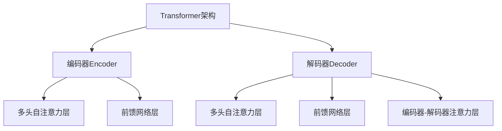
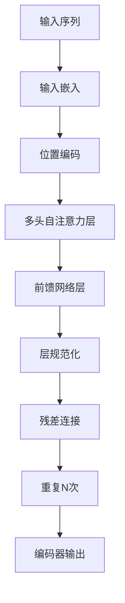
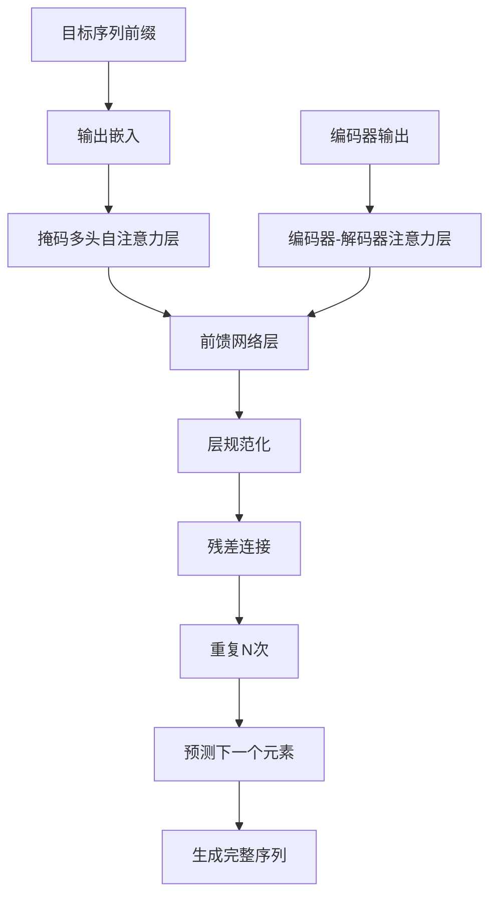

# 多模态大模型：技术原理与实战 看清GPT的进化史和创新点

## 1.背景介绍

### 1.1 人工智能发展简史

人工智能(Artificial Intelligence, AI)的发展可以追溯到20世纪50年代。在过去的几十年里,AI技术取得了长足的进步,尤其是在机器学习和深度学习领域。随着算力的不断提升和大数据时代的到来,AI开始在诸多领域展现出强大的能力。

### 1.2 自然语言处理(NLP)的兴起  

自然语言处理是AI的一个重要分支,旨在使计算机能够理解和生成人类语言。传统的NLP方法主要基于规则和统计模型,但由于语言的复杂性和多样性,这些方法往往效果有限。

### 1.3 神经网络语言模型的突破

2018年,谷歌发布了BERT(Bidirectional Encoder Representations from Transformers)模型,这是一种基于Transformer的预训练语言模型。BERT能够有效地捕捉语句中单词的上下文关系,在多项NLP任务上取得了突破性进展。这标志着神经网络语言模型进入了一个新的时代。

### 1.4 GPT系列模型的诞生

2019年,OpenAI发布了GPT(Generative Pre-trained Transformer)模型,这是一种基于Transformer的生成式预训练语言模型。GPT在自然语言生成任务上表现出色,成为了NLP领域的一个里程碑式的模型。

随后,GPT-2、GPT-3等更大更强的模型相继问世,展现出了令人惊叹的语言生成能力。这些模型被称为"大模型"(Large Language Model, LLM),标志着NLP进入了一个新的阶段。

## 2.核心概念与联系  

### 2.1 Transformer架构

Transformer是一种全新的基于注意力机制(Attention Mechanism)的神经网络架构,它不依赖于循环神经网络(RNN)和卷积神经网络(CNN),而是通过自注意力层(Self-Attention Layer)来捕捉输入序列中元素之间的长程依赖关系。

Transformer架构主要由编码器(Encoder)和解码器(Decoder)两部分组成,它们都由多个相同的层堆叠而成。每一层都包含一个多头自注意力子层(Multi-Head Attention Sublayer)和一个前馈神经网络子层(Feed-Forward Neural Network Sublayer)。

### 2.2 自注意力机制

自注意力机制是Transformer架构的核心,它允许模型在计算目标元素的表示时,关注整个输入序列中与之相关的所有元素。这种机制能够有效地捕捉长期依赖关系,克服了RNN在长序列建模中的梯度消失/爆炸问题。

在自注意力层中,每个元素会与其他元素进行注意力计算,得到一个注意力分数向量。然后,该元素的表示就是所有其他元素的加权和,其中权重由注意力分数向量决定。

### 2.3 多头注意力机制

多头注意力机制是在单头自注意力的基础上进行扩展,它允许模型从不同的"注意力空间"中捕捉不同的相关性。具体来说,它将输入分成多个"头"(Head),每个头单独执行自注意力操作,最后将所有头的结果拼接起来作为最终的输出。

多头注意力机制可以提高模型的表达能力,使其能够同时关注不同的位置和不同的子空间,从而更好地捕捉输入序列中的复杂模式。

### 2.4 预训练与微调

大模型通常采用"预训练+微调"的范式。在预训练阶段,模型会在大规模无标注语料库上进行自监督学习,学习通用的语言表示。在微调阶段,模型会在特定的下游任务数据集上进行进一步的监督fine-tuning,使其适应具体的任务。

这种范式的关键在于,预训练可以让模型学习到丰富的语言知识和上下文理解能力,而微调则使模型能够专注于特定的任务,从而在该任务上取得更好的性能。

## 3.核心算法原理具体操作步骤

### 3.1 Transformer编码器

Transformer编码器的主要作用是将输入序列映射为一系列连续的表示向量,这些向量捕捉了输入序列中每个元素的上下文信息。编码器的具体操作步骤如下:

1. **输入嵌入(Input Embeddings)**: 将输入序列中的每个元素(如单词)映射为一个连续的向量表示,称为嵌入向量。

2. **位置编码(Positional Encoding)**: 由于Transformer没有循环或卷积结构,因此需要一些方式来引入序列的位置信息。位置编码将位置信息编码到嵌入向量中。

3. **多头自注意力层(Multi-Head Attention Layer)**: 这是Transformer编码器的核心部分。它允许每个元素的表示向量关注输入序列中与之相关的所有其他元素,从而捕捉长期依赖关系。

4. **前馈网络层(Feed-Forward Network)**: 对自注意力层的输出进行进一步的非线性变换,以提取更高层次的特征表示。

5. **层规范化(Layer Normalization)**: 在每一层之后应用层规范化,以加速训练收敛并提高模型性能。

6. **残差连接(Residual Connection)**: 将每一层的输出与输入相加,以缓解深层网络的梯度消失/爆炸问题。

编码器会重复执行步骤3-6多次,形成一个深层的网络结构。最终,编码器会输出一系列捕捉了输入序列上下文信息的表示向量。

### 3.2 Transformer解码器

Transformer解码器的作用是根据编码器的输出和目标序列的前缀,生成目标序列的下一个元素。解码器的具体操作步骤如下:

1. **输出嵌入(Output Embeddings)**: 将目标序列的前缀映射为一系列嵌入向量。

2. **掩码多头自注意力层(Masked Multi-Head Attention Layer)**: 这一层允许每个元素关注其之前的所有元素,但被"掩码"以防止关注后续的元素,从而保证了自回归(auto-regressive)的属性。

3. **编码器-解码器注意力层(Encoder-Decoder Attention Layer)**: 这一层允许每个目标元素关注编码器输出中与之相关的所有源元素的表示,从而捕捉源序列和目标序列之间的依赖关系。

4. **前馈网络层(Feed-Forward Network)**: 对注意力层的输出进行进一步的非线性变换。

5. **层规范化(Layer Normalization)**: 在每一层之后应用层规范化。

6. **残差连接(Residual Connection)**: 将每一层的输出与输入相加。

解码器会重复执行步骤2-6多次,形成一个深层的网络结构。在每一步,解码器会根据之前生成的元素和编码器的输出,预测下一个目标元素。这个过程一直持续,直到生成完整的目标序列或达到预设的最大长度。

## 4.数学模型和公式详细讲解举例说明

### 4.1 注意力机制(Attention Mechanism)

注意力机制是Transformer的核心,它允许模型在计算目标元素的表示时,关注输入序列中与之相关的所有其他元素。具体来说,给定一个查询向量(Query) $\boldsymbol{q}$、一组键向量(Keys) $\boldsymbol{K}=\{\boldsymbol{k}_1, \boldsymbol{k}_2, \ldots, \boldsymbol{k}_n\}$和一组值向量(Values) $\boldsymbol{V}=\{\boldsymbol{v}_1, \boldsymbol{v}_2, \ldots, \boldsymbol{v}_n\}$,注意力机制会计算出一个上下文向量 $\boldsymbol{c}$,作为查询向量 $\boldsymbol{q}$ 关于键值对 $(\boldsymbol{K}, \boldsymbol{V})$ 的加权和:

$$\boldsymbol{c} = \sum_{i=1}^{n}\alpha_i\boldsymbol{v}_i$$

其中,权重 $\alpha_i$ 由查询向量 $\boldsymbol{q}$ 和键向量 $\boldsymbol{k}_i$ 的相似度决定:

$$\alpha_i = \frac{\exp(\operatorname{score}(\boldsymbol{q}, \boldsymbol{k}_i))}{\sum_{j=1}^{n}\exp(\operatorname{score}(\boldsymbol{q}, \boldsymbol{k}_j))}$$

$\operatorname{score}$ 函数通常采用点积或缩放点积的形式:

$$\operatorname{score}(\boldsymbol{q}, \boldsymbol{k}_i) = \frac{\boldsymbol{q}^\top\boldsymbol{k}_i}{\sqrt{d_k}}$$

其中 $d_k$ 是键向量的维度,用于缩放点积,以防止过大或过小的值导致梯度不稳定。

通过这种机制,模型可以自动学习到哪些输入元素对于计算目标元素的表示更加重要,从而有效地捕捉长期依赖关系。

### 4.2 多头注意力机制(Multi-Head Attention)

多头注意力机制是在单头自注意力的基础上进行扩展,它允许模型从不同的"注意力空间"中捕捉不同的相关性。具体来说,给定一个查询矩阵 $\boldsymbol{Q}$、键矩阵 $\boldsymbol{K}$ 和值矩阵 $\boldsymbol{V}$,多头注意力机制会将它们分别线性投影到 $h$ 个子空间,在每个子空间中执行缩放点积注意力,然后将所有子空间的结果拼接起来:

$$\begin{aligned}
\operatorname{MultiHead}(\boldsymbol{Q}, \boldsymbol{K}, \boldsymbol{V}) &= \operatorname{Concat}(\operatorname{head}_1, \ldots, \operatorname{head}_h)\boldsymbol{W}^O\\
\operatorname{where}\;\operatorname{head}_i &= \operatorname{Attention}(\boldsymbol{Q}\boldsymbol{W}_i^Q, \boldsymbol{K}\boldsymbol{W}_i^K, \boldsymbol{V}\boldsymbol{W}_i^V)
\end{aligned}$$

其中, $\boldsymbol{W}_i^Q\in\mathbb{R}^{d_\text{model}\times d_k}$、$\boldsymbol{W}_i^K\in\mathbb{R}^{d_\text{model}\times d_k}$、$\boldsymbol{W}_i^V\in\mathbb{R}^{d_\text{model}\times d_v}$ 和 $\boldsymbol{W}^O\in\mathbb{R}^{hd_v\times d_\text{model}}$ 是可学习的线性投影矩阵, $d_\text{model}$ 是模型的隐状态维度, $d_k$ 和 $d_v$ 分别是键向量和值向量的维度。

多头注意力机制可以提高模型的表达能力,使其能够同时关注不同的位置和不同的子空间,从而更好地捕捉输入序列中的复杂模式。

### 4.3 位置编码(Positional Encoding)

由于Transformer没有循环或卷积结构,因此需要一些方式来引入序列的位置信息。位置编码就是将位置信息编码到输入的嵌入向量中,以使模型能够