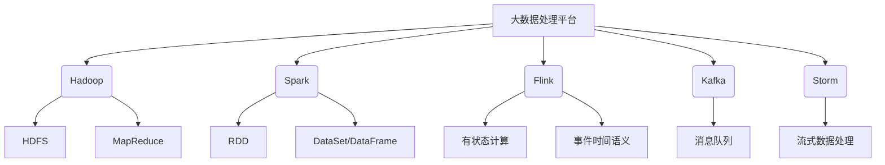
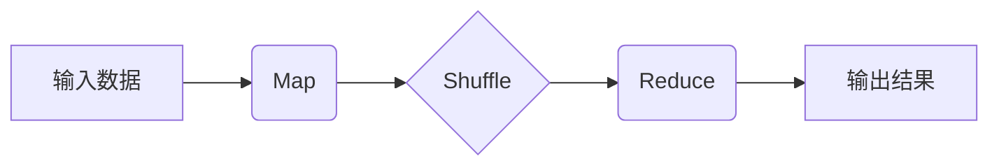
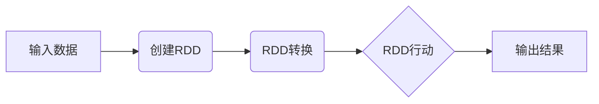
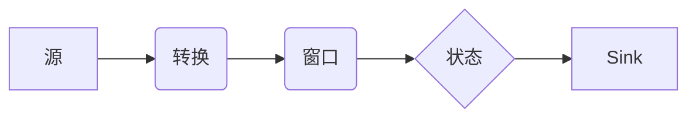

# 大数据处理框架原理与代码实战案例讲解

## 1.背景介绍

### 1.1 大数据时代的到来

随着互联网、移动互联网、物联网等新兴技术的快速发展,数据呈现出爆炸式增长。根据IDC(国际数据公司)的预测,到2025年全球数据总量将达到175ZB(1ZB=1万亿TB)。传统数据处理系统已经无法满足如此庞大数据量的存储和计算需求,大数据时代应运而生。

### 1.2 大数据的特点

大数据具有以下四个主要特点:

- 海量(Volume):数据量大到超出传统数据库系统的存储和处理能力范围。
- 多样(Variety):数据来源和格式种类繁多,包括结构化数据和非结构化数据。
- 高速(Velocity):数据产生和传输的速度非常快,需要实时处理。
-价值(Value):通过对大数据进行深度分析和挖掘,可以发现其中蕴含的巨大价值。

### 1.3 大数据处理的挑战

面对大数据,传统的数据处理系统面临诸多挑战:

- 数据存储:海量数据需要分布式存储系统支持。
- 数据处理:需要分布式计算框架高效并行处理。
- 数据集成:需要处理各种异构数据源。
- 实时处理:需要流式计算框架实时处理数据流。

为了应对这些挑战,出现了一系列大数据处理框架和系统。

## 2.核心概念与联系

### 2.1 大数据处理框架概述

主流的大数据处理框架包括:

- **Hadoop**:分布式文件存储系统HDFS和分布式计算框架MapReduce。
- **Spark**:内存计算框架,提供RDD、DataSet/DataFrame等数据抽象。
- **Flink**:流式计算框架,支持有状态计算和事件时间语义。
- **Kafka**:分布式流式处理平台,提供消息队列功能。
- **Storm**:分布式实时计算系统,专注于流式数据处理。

这些框架通常配合使用,构建完整的大数据处理平台。



### 2.2 大数据处理流程

典型的大数据处理流程包括:

1. 数据采集:从各种数据源获取数据,如日志、传感器、网络等。
2. 数据存储:将采集到的数据持久化存储到分布式文件系统(如HDFS)中。
3. 数据处理:使用分布式计算框架(如MapReduce、Spark)对存储的数据进行批处理或流式处理。
4. 数据分析:对处理后的数据进行统计分析、数据挖掘、机器学习等分析。
5. 数据可视化:将分析结果以图表、报告等形式进行展现。

## 3.核心算法原理具体操作步骤

### 3.1 MapReduce算法原理

MapReduce是Hadoop的核心计算模型,它将计算过程分为两个阶段:Map和Reduce。

1. **Map阶段**:输入数据被分割为多个数据块,每个数据块由一个Map任务处理,Map任务将输入的键值对转换为一系列新的键值对,作为中间结果输出。

$$
\begin{aligned}
Map: (k_1, v_1) \rightarrow \text{list}(k_2, v_2)
\end{aligned}
$$

2. **Shuffle阶段**:对Map阶段输出的中间结果进行分组和排序,将相同键对应的值组合在一起。

3. **Reduce阶段**:对Shuffle后的数据进行处理,将具有相同键的值进行合并,最终输出新的键值对作为计算结果。

$$
\begin{aligned}
Reduce: (k_2, \text{list}(v_2)) \rightarrow \text{list}(k_3, v_3)
\end{aligned}
$$



### 3.2 Spark RDD算法原理

Spark的核心数据结构是RDD(Resilient Distributed Dataset),它是一种分布式内存数据集,支持并行操作。

1. **创建RDD**:可以从HDFS、HBase等外部存储系统创建,也可以从驱动程序中的集合创建。

2. **RDD转换**:通过各种转换操作(如map、filter、join等)对RDD进行转换,生成新的RDD。

3. **RDD行动**:触发计算,将最终结果返回到驱动程序或者保存到外部存储系统。



Spark通过有向无环图(DAG)来描述RDD之间的依赖关系,实现了高效的容错和计算优化。

### 3.3 Flink流式计算原理

Flink是一个分布式流式数据处理框架,支持有状态计算和事件时间语义。

1. **源(Source)**:从外部系统(如Kafka)获取数据流。
2. **转换(Transformation)**:对数据流进行各种转换操作,如过滤、映射、聚合等。
3. **窗口(Window)**:将无限数据流拆分为有限的数据集,以进行有状态计算。
4. **状态(State)**:维护计算过程中的状态,实现有状态计算。
5. **Sink**:将计算结果输出到外部系统。



Flink采用了精确一次(Exactly-Once)语义,保证了数据处理的准确性和一致性。

## 4.数学模型和公式详细讲解举例说明

在大数据处理中,常用的数学模型和公式包括:

### 4.1 MapReduce模型

MapReduce模型可以用以下公式表示:

$$
\begin{aligned}
\text{Result} = \bigcup_{k_3} \text{Reduce}(k_3, \bigcup_{k_2} \{\text{Map}(k_1, v_1) | (k_1, v_1) \in \text{Input}, f(k_1) = k_2\})
\end{aligned}
$$

其中:

- $\text{Input}$是输入数据集
- $\text{Map}$是Map函数
- $f$是分区函数,用于将Map输出的键值对分配到不同的Reduce任务
- $\text{Reduce}$是Reduce函数

这个公式描述了MapReduce的整个计算过程:首先将输入数据集并行地传递给Map函数进行处理,生成中间键值对;然后根据分区函数将中间键值对分组,每个组由一个Reduce函数处理,最终得到结果。

### 4.2 PageRank算法

PageRank是Google用于网页排名的著名算法,它通过网页之间的链接关系计算每个网页的重要性。PageRank值可以用以下公式计算:

$$
PR(A) = (1-d) + d \left( \frac{PR(T_1)}{C(T_1)} + \frac{PR(T_2)}{C(T_2)} + \cdots + \frac{PR(T_n)}{C(T_n)} \right)
$$

其中:

- $PR(A)$是网页A的PageRank值
- $T_1, T_2, \cdots, T_n$是链接到A的网页
- $C(T_i)$是网页$T_i$的出链接数
- $d$是阻尼系数,通常取值0.85

这个公式表示,一个网页的PageRank值由两部分组成:一是固定的初始值$(1-d)$;二是其他网页传递过来的重要性之和,每个网页传递的重要性等于该网页的PageRank值除以其出链接数。

PageRank算法可以用MapReduce或Spark等大数据框架进行并行计算。

### 4.3 TF-IDF

TF-IDF(Term Frequency-Inverse Document Frequency)是一种常用的文本挖掘算法,用于评估一个词对一个文档集或语料库的重要程度。TF-IDF值可以用以下公式计算:

$$
\text{tfidf}(t, d, D) = \text{tf}(t, d) \times \text{idf}(t, D)
$$

其中:

- $\text{tf}(t, d)$是词$t$在文档$d$中出现的频率
- $\text{idf}(t, D) = \log \frac{|D|}{|\{d \in D: t \in d\}|}$是词$t$的逆文档频率

$\text{tf}(t, d)$可以用以下公式计算:

$$
\text{tf}(t, d) = \frac{n_{t,d}}{\sum_{t' \in d} n_{t',d}}
$$

其中$n_{t,d}$是词$t$在文档$d$中出现的次数。

TF-IDF算法可以用于文本分类、聚类、信息检索等任务,通常也需要利用大数据框架进行并行计算。

## 5.项目实践:代码实例和详细解释说明

### 5.1 Hadoop MapReduce实例

以下是一个使用Hadoop MapReduce进行单词计数的Java代码示例:

```java
// Mapper类
public static class TokenizerMapper extends Mapper<Object, Text, Text, IntWritable>{
    private final static IntWritable one = new IntWritable(1);
    private Text word = new Text();

    public void map(Object key, Text value, Context context) throws IOException, InterruptedException {
        StringTokenizer itr = new StringTokenizer(value.toString());
        while (itr.hasMoreTokens()) {
            word.set(itr.nextToken());
            context.write(word, one);
        }
    }
}

// Reducer类
public static class IntSumReducer extends Reducer<Text,IntWritable,Text,IntWritable> {
    private IntWritable result = new IntWritable();

    public void reduce(Text key, Iterable<IntWritable> values, Context context) throws IOException, InterruptedException {
        int sum = 0;
        for (IntWritable val : values) {
            sum += val.get();
        }
        result.set(sum);
        context.write(key, result);
    }
}

// 主函数
public static void main(String[] args) throws Exception {
    Configuration conf = new Configuration();
    Job job = Job.getInstance(conf, "word count");
    job.setJarByClass(WordCount.class);
    job.setMapperClass(TokenizerMapper.class);
    job.setCombinerClass(IntSumReducer.class);
    job.setReducerClass(IntSumReducer.class);
    job.setOutputKeyClass(Text.class);
    job.setOutputValueClass(IntWritable.class);
    FileInputFormat.addInputPath(job, new Path(args[0]));
    FileOutputFormat.setOutputPath(job, new Path(args[1]));
    System.exit(job.waitForCompletion(true) ? 0 : 1);
}
```

1. `TokenizerMapper`类实现Map函数,将输入文本按空格拆分为单词,每个单词输出`(word, 1)`键值对。
2. `IntSumReducer`类实现Reduce函数,将相同单词的计数值累加,输出`(word, count)`键值对。
3. 主函数设置作业配置,包括Mapper、Combiner(本地化Reducer)、Reducer类,以及输入输出路径。

### 5.2 Spark RDD实例

以下是一个使用Spark RDD进行单词计数的Scala代码示例:

```scala
import org.apache.spark.SparkContext

object WordCount {
  def main(args: Array[String]) {
    val sc = new SparkContext("local", "WordCount")
    val lines = sc.textFile("data.txt")
    val words = lines.flatMap(line => line.split(" "))
    val pairs = words.map(word => (word, 1))
    val counts = pairs.reduceByKey((a, b) => a + b)
    counts.saveAsTextFile("output")
  }
}
```

1. 创建SparkContext对象。
2. 从文件`data.txt`创建RDD `lines`。
3. 将每行拆分为单词,得到`words` RDD。
4. 将每个单词映射为`(word, 1)`键值对,得到`pairs` RDD。
5. 使用`reduceByKey`操作,将相同单词的计数值累加,得到`counts` RDD。
6. 将`counts` RDD保存到输出文件夹。

### 5.3 Flink流式计算实例

以下是一个使用Flink进行单词计数的Java代码示例:

```java