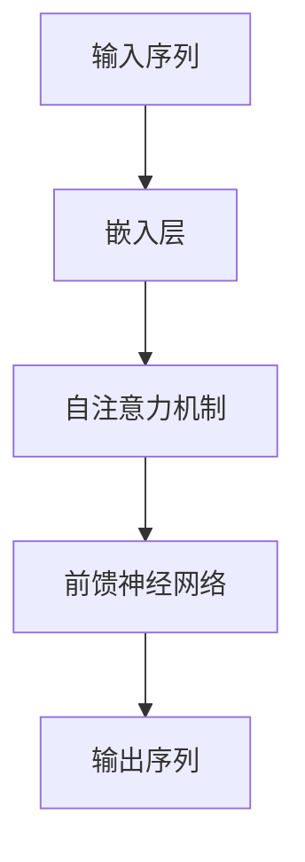

# 大规模语言模型从理论到实践 专业数据

## 1.背景介绍

大规模语言模型（Large Language Models, LLMs）近年来在自然语言处理（NLP）领域取得了显著的进展。自从OpenAI发布了GPT系列模型以来，LLMs在文本生成、翻译、问答系统等多个应用场景中展现了强大的能力。这些模型通过训练海量数据，能够理解和生成自然语言文本，极大地推动了人工智能的发展。

### 1.1 发展历程

从最初的简单统计模型到如今的深度学习模型，语言模型经历了多个发展阶段。早期的N-gram模型和隐马尔可夫模型（HMM）主要依赖于统计方法，而后来的循环神经网络（RNN）和长短期记忆网络（LSTM）则引入了深度学习的概念。近年来，基于Transformer架构的模型，如BERT、GPT等，进一步提升了语言模型的性能。

### 1.2 重要性和应用

LLMs在多个领域都有广泛的应用，包括但不限于：
- **文本生成**：自动生成高质量的文章、新闻报道等。
- **机器翻译**：实现多语言之间的高精度翻译。
- **问答系统**：构建智能客服、虚拟助手等。
- **情感分析**：分析用户评论、社交媒体内容等。

## 2.核心概念与联系

理解大规模语言模型的核心概念和它们之间的联系是深入研究这一领域的基础。

### 2.1 语言模型

语言模型的目标是估计一个给定序列的概率分布。具体来说，给定一个词序列 $w_1, w_2, ..., w_n$，语言模型试图估计 $P(w_1, w_2, ..., w_n)$。

### 2.2 Transformer架构

Transformer是当前最流行的语言模型架构之一。它通过自注意力机制（Self-Attention）和多头注意力机制（Multi-Head Attention）来捕捉序列中的长距离依赖关系。



### 2.3 预训练和微调

预训练（Pre-training）和微调（Fine-tuning）是LLMs的两个重要阶段。预训练阶段，模型在大规模无标签数据上进行训练；微调阶段，模型在特定任务的有标签数据上进行训练。

## 3.核心算法原理具体操作步骤

大规模语言模型的训练和应用涉及多个关键步骤。以下是一个典型的操作流程：

### 3.1 数据准备

数据准备是训练LLMs的第一步。需要收集和清洗大量的文本数据，以确保数据的多样性和质量。

### 3.2 模型设计

选择合适的模型架构，如Transformer，并确定模型的超参数，如层数、隐藏单元数等。

### 3.3 预训练

在大规模无标签数据上进行预训练，使用自监督学习方法，如掩码语言模型（Masked Language Model, MLM）或自回归语言模型（Autoregressive Language Model）。

### 3.4 微调

在特定任务的有标签数据上进行微调，以适应具体应用场景。

### 3.5 模型评估

使用标准评估指标，如准确率、F1分数等，对模型进行评估。

## 4.数学模型和公式详细讲解举例说明

在这一部分，我们将详细讲解大规模语言模型的数学原理和公式。

### 4.1 语言模型的概率分布

语言模型的目标是估计词序列的联合概率分布 $P(w_1, w_2, ..., w_n)$。根据链式法则，这一概率可以分解为条件概率的乘积：

$$
P(w_1, w_2, ..., w_n) = P(w_1) \cdot P(w_2 | w_1) \cdot P(w_3 | w_1, w_2) \cdot ... \cdot P(w_n | w_1, w_2, ..., w_{n-1})
$$

### 4.2 自注意力机制

自注意力机制的核心是计算输入序列中每个词对其他词的注意力权重。给定输入序列的表示 $X = [x_1, x_2, ..., x_n]$，自注意力机制的计算过程如下：

1. 计算查询（Query）、键（Key）和值（Value）矩阵：
$$
Q = XW_Q, \quad K = XW_K, \quad V = XW_V
$$

2. 计算注意力权重：
$$
\text{Attention}(Q, K, V) = \text{softmax}\left(\frac{QK^T}{\sqrt{d_k}}\right)V
$$

### 4.3 多头注意力机制

多头注意力机制通过并行计算多个自注意力机制来捕捉不同的特征表示：

$$
\text{MultiHead}(Q, K, V) = \text{Concat}(\text{head}_1, \text{head}_2, ..., \text{head}_h)W_O
$$

其中，每个头的计算方式与自注意力机制相同。

## 5.项目实践：代码实例和详细解释说明

在这一部分，我们将通过一个具体的代码实例来展示如何训练和应用大规模语言模型。

### 5.1 数据准备

首先，我们需要准备训练数据。以下是一个简单的数据准备示例：

```python
import pandas as pd

# 读取数据
data = pd.read_csv('text_data.csv')

# 数据清洗
data['text'] = data['text'].str.lower().str.replace('[^\w\s]', '')

# 分词
data['tokens'] = data['text'].apply(lambda x: x.split())
```

### 5.2 模型设计

接下来，我们设计一个基于Transformer的语言模型：

```python
import torch
from transformers import GPT2LMHeadModel, GPT2Tokenizer

# 加载预训练模型和分词器
model = GPT2LMHeadModel.from_pretrained('gpt2')
tokenizer = GPT2Tokenizer.from_pretrained('gpt2')

# 模型参数设置
model.config.max_length = 512
```

### 5.3 预训练和微调

在大规模数据上进行预训练，然后在特定任务上进行微调：

```python
from transformers import Trainer, TrainingArguments

# 数据集准备
train_dataset = ...
eval_dataset = ...

# 训练参数设置
training_args = TrainingArguments(
    output_dir='./results',
    num_train_epochs=3,
    per_device_train_batch_size=4,
    per_device_eval_batch_size=4,
    warmup_steps=500,
    weight_decay=0.01,
    logging_dir='./logs',
)

# 训练
trainer = Trainer(
    model=model,
    args=training_args,
    train_dataset=train_dataset,
    eval_dataset=eval_dataset,
)

trainer.train()
```

### 5.4 模型评估

使用标准评估指标对模型进行评估：

```python
results = trainer.evaluate()
print(results)
```

## 6.实际应用场景

大规模语言模型在多个实际应用场景中展现了强大的能力。

### 6.1 文本生成

LLMs可以用于自动生成高质量的文章、新闻报道等。例如，GPT-3可以生成连贯且有逻辑的长篇文章。

### 6.2 机器翻译

通过训练多语言数据，LLMs可以实现高精度的机器翻译。例如，Google Translate使用的模型能够在多种语言之间进行翻译。

### 6.3 问答系统

LLMs可以用于构建智能客服、虚拟助手等问答系统。例如，OpenAI的ChatGPT可以回答用户提出的各种问题。

### 6.4 情感分析

通过分析用户评论、社交媒体内容等，LLMs可以进行情感分析，帮助企业了解用户的情感倾向。

## 7.工具和资源推荐

在这一部分，我们将推荐一些常用的工具和资源，帮助读者更好地进行大规模语言模型的研究和应用。

### 7.1 开源框架

- **Transformers**：由Hugging Face提供的开源库，支持多种预训练语言模型。
- **TensorFlow**：谷歌开发的开源深度学习框架，广泛应用于NLP领域。
- **PyTorch**：Facebook开发的开源深度学习框架，具有灵活性和易用性。

### 7.2 数据集

- **Common Crawl**：一个包含海量网页数据的开源数据集，常用于预训练语言模型。
- **Wikipedia**：维基百科的文本数据，广泛用于NLP研究。
- **OpenWebText**：一个包含高质量网页文本的数据集，作为OpenAI GPT模型的训练数据之一。

### 7.3 在线资源

- **arXiv**：一个开放获取的学术论文预印本平台，包含大量NLP领域的最新研究成果。
- **GitHub**：一个开源代码托管平台，包含大量NLP相关的项目和代码。

## 8.总结：未来发展趋势与挑战

大规模语言模型在NLP领域取得了显著的进展，但仍然面临一些挑战和未来的发展方向。

### 8.1 未来发展趋势

- **模型规模和性能的提升**：随着计算资源的增加，未来的语言模型将更加庞大，性能也将进一步提升。
- **多模态学习**：结合文本、图像、音频等多种模态的数据，构建更加智能的模型。
- **个性化和定制化**：根据用户的需求，定制化训练语言模型，以满足特定应用场景的需求。

### 8.2 挑战

- **数据隐私和安全**：在使用大规模数据进行训练时，需要注意数据隐私和安全问题。
- **模型的可解释性**：当前的语言模型仍然是黑箱模型，如何提高模型的可解释性是一个重要的研究方向。
- **计算资源的需求**：训练大规模语言模型需要大量的计算资源，如何提高训练效率是一个亟待解决的问题。

## 9.附录：常见问题与解答

在这一部分，我们将解答一些关于大规模语言模型的常见问题。

### 9.1 什么是大规模语言模型？

大规模语言模型是指通过训练海量数据，能够理解和生成自然语言文本的模型。它们通常具有数亿到数千亿的参数。

### 9.2 如何选择合适的语言模型？

选择合适的语言模型需要考虑多个因素，包括模型的性能、计算资源的需求、应用场景等。可以根据具体需求选择预训练模型，并进行微调。

### 9.3 训练大规模语言模型需要哪些资源？

训练大规模语言模型需要大量的计算资源，包括高性能的GPU或TPU、大规模的存储空间等。此外，还需要高质量的训练数据和合适的模型架构。

### 9.4 如何评估语言模型的性能？

评估语言模型的性能可以使用多种指标，包括准确率、F1分数、BLEU分数等。可以根据具体任务选择合适的评估指标。

### 9.5 大规模语言模型的未来发展方向是什么？

大规模语言模型的未来发展方向包括模型规模和性能的提升、多模态学习、个性化和定制化等。此外，数据隐私和安全、模型的可解释性、计算资源的需求等也是未来需要解决的重要问题。

---

作者：禅与计算机程序设计艺术 / Zen and the Art of Computer Programming