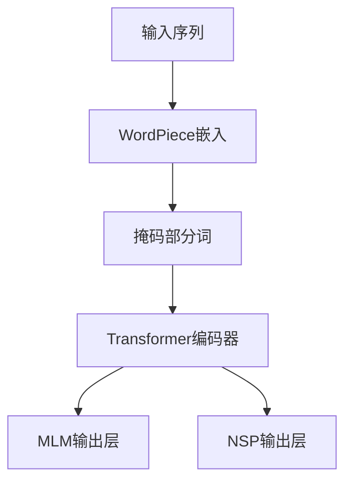
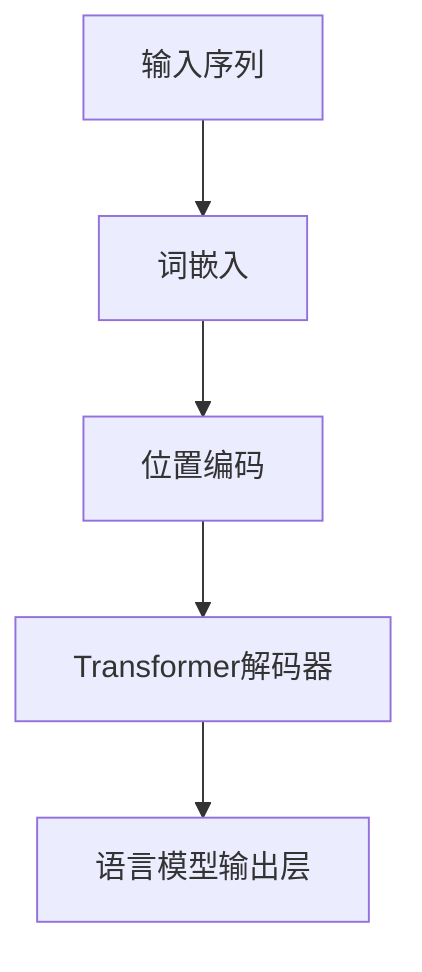

# 大规模语言模型从理论到实践 大语言模型的发展历程

## 1. 背景介绍

### 1.1 语言模型的重要性

语言是人类交流和传播信息的重要工具,也是人工智能领域中一个极具挑战性的研究方向。语言模型作为自然语言处理的核心技术,在机器翻译、问答系统、文本生成等诸多应用领域扮演着关键角色。随着数据和计算能力的不断增长,大规模语言模型(Large Language Model,LLM)近年来取得了突破性进展,成为自然语言处理领域的主导范式。

### 1.2 大规模语言模型的兴起

传统的语言模型通常基于n-gram统计或神经网络,但受限于数据和计算资源,模型规模和性能存在瓶颈。2018年,谷歌发布了Transformer模型,通过自注意力机制有效捕捉长距离依赖关系,为大规模语言模型的发展奠定了基础。随后,OpenAI、谷歌、微软等科技巨头相继推出GPT、BERT、T5等大规模语言模型,展现出令人惊叹的性能,在自然语言理解和生成任务上取得了突破性进展。

### 1.3 大规模语言模型的影响

大规模语言模型的出现,不仅推动了自然语言处理技术的飞速发展,也对人工智能领域产生了深远影响。这些模型展现出了强大的语言理解和生成能力,可以在多种下游任务中表现出色,为人工智能系统赋予了更强的语言交互能力。同时,大规模语言模型也引发了一系列伦理、隐私和安全等方面的挑战,需要我们谨慎应对。

## 2. 核心概念与联系

### 2.1 语言模型的基本概念

语言模型的核心任务是预测下一个词或字符的概率,即给定前面的文本序列,计算下一个词或字符出现的概率。形式化地,对于一个长度为n的序列$S = (x_1, x_2, ..., x_n)$,语言模型需要计算条件概率$P(x_n|x_1, x_2, ..., x_{n-1})$。

### 2.2 自回归语言模型

自回归语言模型(Autoregressive Language Model)是一种常见的语言模型架构,它将语言序列建模为一个马尔可夫链,每个词或字符的预测仅依赖于前面的序列。自回归模型的优点是可以很好地捕捉序列的上下文信息,但缺点是无法并行化,inference速度较慢。GPT系列模型就是典型的自回归语言模型。

### 2.3 掩码语言模型

掩码语言模型(Masked Language Model)是另一种常见的语言模型架构,它在输入序列中随机掩码部分词或字符,然后预测这些被掩码的位置应该是什么。这种架构允许并行化训练,提高了计算效率。BERT等模型采用了掩码语言模型的架构。

### 2.4 序列到序列模型

序列到序列模型(Sequence-to-Sequence Model)是一种通用的架构,可以用于机器翻译、文本摘要等任务。它由一个编码器和一个解码器组成,编码器将输入序列编码为一个上下文向量,解码器根据上下文向量生成输出序列。T5等模型采用了序列到序列的架构。

### 2.5 预训练与微调

大规模语言模型通常采用预训练与微调的范式。在预训练阶段,模型在大量无监督数据上进行自监督学习,获得通用的语言理解和生成能力。在微调阶段,模型在特定任务的标注数据上进行监督学习,使其适应特定任务。这种范式可以有效利用大量无监督数据,提高模型的泛化能力。

## 3. 核心算法原理具体操作步骤

### 3.1 Transformer模型

Transformer模型是大规模语言模型的核心架构,它完全基于注意力机制,不依赖于递归或卷积操作。Transformer的主要组件包括:

1. **输入嵌入层**: 将输入词或字符映射为向量表示。
2. **位置编码**: 为每个位置添加位置信息,以捕捉序列的位置依赖关系。
3. **多头自注意力层**: 通过自注意力机制捕捉输入序列中的长距离依赖关系。
4. **前馈神经网络**: 对每个位置的表示进行非线性变换。
5. **规范化层**: 用于加速训练和提高模型性能。

Transformer模型的核心是自注意力机制,它允许每个位置的表示与其他所有位置的表示进行交互,从而捕捉长距离依赖关系。

### 3.2 自注意力机制

自注意力机制是Transformer模型的核心,它允许每个位置的表示与其他所有位置的表示进行交互。具体来说,对于一个长度为n的序列$X = (x_1, x_2, ..., x_n)$,自注意力机制计算每个位置$i$的注意力权重$\alpha_{ij}$,表示$x_i$对$x_j$的关注程度。然后,将所有位置的加权和作为$x_i$的新表示。

$$
\alpha_{ij} = \frac{e^{score(x_i, x_j)}}{\sum_{k=1}^n e^{score(x_i, x_k)}}
$$

$$
x_i' = \sum_{j=1}^n \alpha_{ij} (Wx_j)
$$

其中,score函数可以是点积或其他相似度函数。自注意力机制允许模型捕捉长距离依赖关系,并且可以高效并行计算。

### 3.3 BERT模型

BERT(Bidirectional Encoder Representations from Transformers)是一种基于Transformer的掩码语言模型,它在预训练阶段采用了两个任务:

1. **掩码语言模型(Masked Language Model, MLM)**: 随机掩码部分输入词,然后预测这些被掩码的词。
2. **下一句预测(Next Sentence Prediction, NSP)**: 判断两个句子是否连续出现。

BERT通过这两个任务学习了双向的上下文表示,在下游任务上表现出色。BERT的训练过程如下:

### 3.4 GPT模型

GPT(Generative Pre-trained Transformer)是一种基于Transformer的自回归语言模型,它在预训练阶段采用了语言模型任务,即给定前面的序列,预测下一个词或字符。GPT模型的优势在于可以生成连贯的文本序列,适用于文本生成等任务。GPT的训练过程如下:

### 3.5 微调

大规模语言模型通常采用预训练与微调的范式。在预训练阶段,模型在大量无监督数据上进行自监督学习,获得通用的语言理解和生成能力。在微调阶段,模型在特定任务的标注数据上进行监督学习,使其适应特定任务。

微调过程通常包括以下步骤:

1. 加载预训练模型的权重
2. 根据任务需求,修改模型的输入或输出层
3. 在任务数据上进行监督学习,更新模型参数
4. 评估模型在任务上的性能

通过微调,大规模语言模型可以在保留预训练知识的同时,专门化于特定任务,提高任务性能。

## 4. 数学模型和公式详细讲解举例说明

### 4.1 语言模型的概率计算

语言模型的核心任务是计算一个序列的概率,即$P(x_1, x_2, ..., x_n)$。根据链式法则,我们可以将其分解为:

$$
P(x_1, x_2, ..., x_n) = \prod_{i=1}^n P(x_i|x_1, x_2, ..., x_{i-1})
$$

其中,每一项$P(x_i|x_1, x_2, ..., x_{i-1})$表示给定前面的序列,预测第i个词或字符的条件概率。

对于自回归语言模型,我们可以使用神经网络来建模这个条件概率分布。设$f_\theta$为参数化的神经网络模型,输入为前面的序列$x_1, x_2, ..., x_{i-1}$,输出为第i个词或字符的概率分布:

$$
P(x_i|x_1, x_2, ..., x_{i-1}) = f_\theta(x_1, x_2, ..., x_{i-1})
$$

训练目标是最大化训练数据的对数似然:

$$
\max_\theta \sum_{i=1}^n \log P(x_i|x_1, x_2, ..., x_{i-1})
$$

### 4.2 自注意力机制的计算

自注意力机制是Transformer模型的核心,它允许每个位置的表示与其他所有位置的表示进行交互。具体来说,对于一个长度为n的序列$X = (x_1, x_2, ..., x_n)$,自注意力机制计算每个位置$i$的注意力权重$\alpha_{ij}$,表示$x_i$对$x_j$的关注程度。然后,将所有位置的加权和作为$x_i$的新表示。

首先,我们计算每个位置对之间的分数:

$$
score(x_i, x_j) = x_iWx_j^T
$$

其中,W是一个可学习的权重矩阵。

然后,我们对分数进行softmax操作,得到注意力权重:

$$
\alpha_{ij} = \frac{e^{score(x_i, x_j)}}{\sum_{k=1}^n e^{score(x_i, x_k)}}
$$

最后,我们将所有位置的加权和作为$x_i$的新表示:

$$
x_i' = \sum_{j=1}^n \alpha_{ij} (Wx_j)
$$

其中,W是另一个可学习的权重矩阵,用于将$x_j$映射到一个新的空间。

自注意力机制允许模型捕捉长距离依赖关系,并且可以高效并行计算,是Transformer模型的核心创新。

### 4.3 掩码语言模型的训练目标

BERT等掩码语言模型在预训练阶段采用了掩码语言模型(Masked Language Model, MLM)任务。具体来说,我们随机掩码部分输入词,然后预测这些被掩码的词。

设$X = (x_1, x_2, ..., x_n)$为原始输入序列,$\hat{X} = (\hat{x_1}, \hat{x_2}, ..., \hat{x_n})$为掩码后的序列,其中$\hat{x_i}$可能是原始词$x_i$,也可能是一个特殊的掩码标记[MASK]。我们的目标是最大化被掩码词的对数似然:

$$
\max_\theta \sum_{i=1}^n \mathbb{1}(\hat{x_i} = \text{[MASK]}) \log P(x_i|\hat{X})
$$

其中,$P(x_i|\hat{X})$是模型预测的第i个位置为$x_i$的概率,由输出层计算得到。$\mathbb{1}(\hat{x_i} = \text{[MASK]})$是一个指示函数,只对被掩码的位置计算损失。

通过这种方式,BERT模型可以学习到双向的上下文表示,在下游任务上表现出色。

## 5. 项目实践:代码实