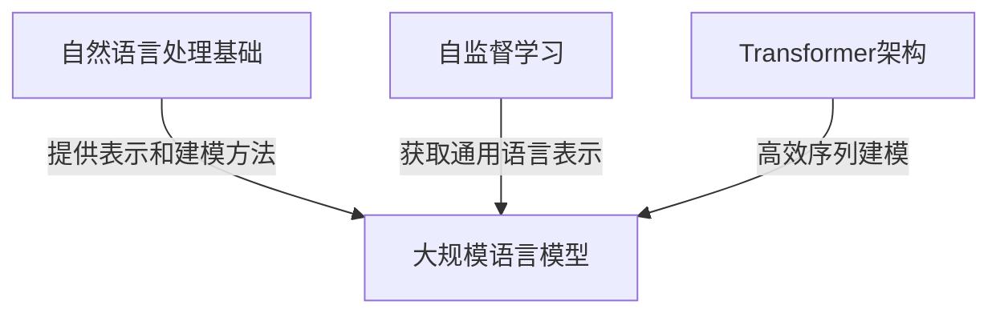
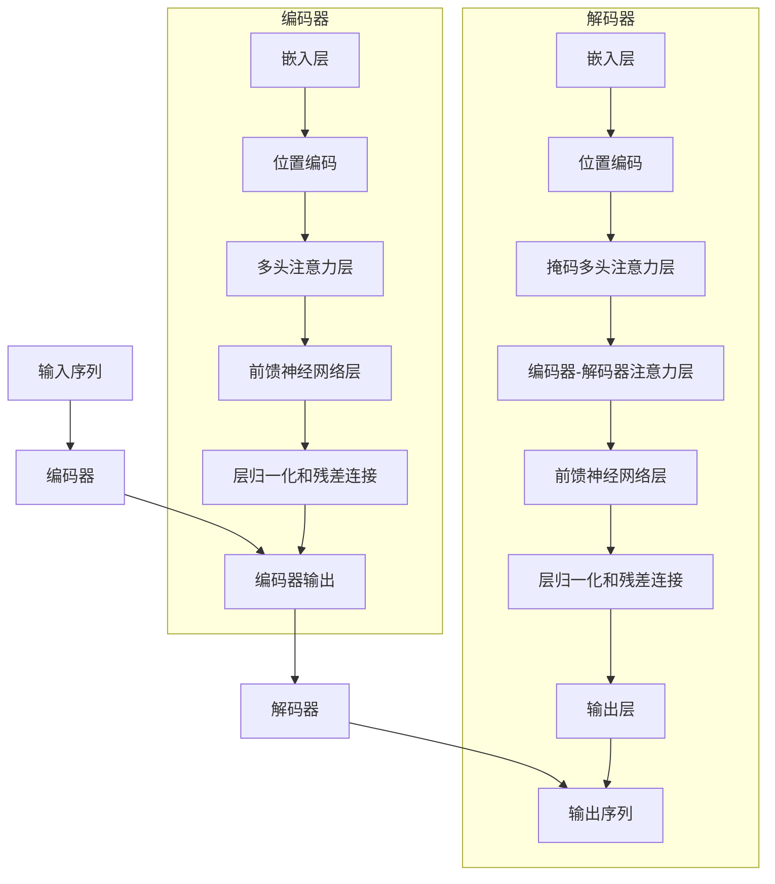

# 大规模语言模型从理论到实践：大语言模型的构建流程

## 1. 背景介绍

### 1.1 大规模语言模型的兴起

近年来,大规模语言模型(Large Language Models, LLMs)在自然语言处理(NLP)领域取得了令人瞩目的进展。LLMs是一种基于深度学习的人工智能模型,能够从海量文本数据中学习语言模式和知识,并对各种自然语言任务(如文本生成、问答、机器翻译等)提供强大的支持。

随着计算能力的不断提高和大数据时代的到来,训练大规模语言模型成为可能。一些知名的LLMs模型包括GPT(Generative Pre-trained Transformer)系列、BERT(Bidirectional Encoder Representations from Transformers)、T5(Text-to-Text Transfer Transformer)等,它们展现出了惊人的语言理解和生成能力,在各种NLP任务中取得了state-of-the-art的性能。

### 1.2 大规模语言模型的重要性

大规模语言模型的突破性进展为人工智能领域带来了新的机遇和挑战。LLMs不仅能够帮助我们更好地理解和处理自然语言,还可以为各种应用场景提供强大的语言支持,如智能助手、内容创作、知识提取、信息检索等。

然而,构建一个高质量的大规模语言模型并非易事。它需要大量的计算资源、海量的训练数据,以及复杂的模型架构和训练策略。本文将深入探讨大规模语言模型的构建流程,揭示其核心概念、算法原理和实践技巧,为读者提供一个全面的理解和指导。

## 2. 核心概念与联系

### 2.1 自然语言处理基础

在深入探讨大规模语言模型之前,我们需要了解一些自然语言处理(NLP)的基础概念。

1. **词嵌入(Word Embeddings)**: 将单词映射到连续的向量空间中,以捕捉单词之间的语义关系。常用的词嵌入方法包括Word2Vec、GloVe等。

2. **序列建模(Sequence Modeling)**: 处理序列数据(如文本)的任务,包括机器翻译、文本生成等。常用的序列建模模型包括RNN(Recurrent Neural Network)、LSTM(Long Short-Term Memory)等。

3. **注意力机制(Attention Mechanism)**: 一种允许模型在处理序列数据时关注不同位置的机制,能够有效捕捉长距离依赖关系。

4. **预训练与微调(Pre-training and Fine-tuning)**: 先在大量无监督数据上进行预训练,获得通用的语言表示;然后在特定任务上进行微调,以获得更好的性能。

5. **语言模型(Language Model)**: 一种基于上下文预测下一个词或序列的概率模型,是NLP任务的基础。

### 2.2 大规模语言模型的核心思想

大规模语言模型的核心思想是利用海量的无标注文本数据,通过自监督学习(Self-Supervised Learning)的方式,获得通用的语言表示。这种通用的语言表示能够捕捉丰富的语义和语法信息,可以用于各种下游NLP任务。

常见的自监督学习方式包括:

1. **掩码语言模型(Masked Language Modeling, MLM)**: 随机掩码部分输入tokens,模型需要预测被掩码的tokens。这种方式能够学习双向的语言表示,如BERT等模型。

2. **因果语言模型(Causal Language Modeling, CLM)**: 基于上文预测下一个token,这种方式能够学习单向的语言表示,如GPT等模型。

3. **序列到序列(Sequence-to-Sequence)**: 将输入序列映射到输出序列,常用于机器翻译、文本摘要等任务,如T5等模型。

通过这些自监督学习方式,大规模语言模型能够从海量文本数据中学习到丰富的语言知识,形成强大的语言理解和生成能力。

### 2.3 Transformer架构

Transformer是大规模语言模型中广泛采用的核心架构,它完全基于注意力机制,避免了RNN的长距离依赖问题。Transformer的主要组成部分包括:

1. **嵌入层(Embedding Layer)**: 将输入tokens映射到连续的向量空间中。

2. **多头注意力(Multi-Head Attention)**: 允许模型同时关注不同位置的信息。

3. **前馈神经网络(Feed-Forward Neural Network)**: 对每个位置的表示进行非线性转换。

4. **层归一化(Layer Normalization)**: 加速训练收敛并提高模型性能。

5. **残差连接(Residual Connection)**: 缓解深层网络的梯度消失问题。

Transformer架构的自注意力机制和并行计算能力,使其能够高效地处理长序列输入,并捕捉长距离依赖关系,因此被广泛应用于大规模语言模型中。

### 2.4 核心概念关系总结

以上介绍的核心概念相互关联,共同构建了大规模语言模型的理论基础。自然语言处理基础为语言模型提供了必要的表示和建模方法;自监督学习则是大规模语言模型获取通用语言表示的关键;Transformer架构则是实现高效序列建模的核心。这些概念相辅相成,共同推动了大规模语言模型的发展和应用。

## 3. 核心算法原理具体操作步骤

### 3.1 Transformer模型架构

Transformer模型架构是大规模语言模型的核心算法,它由编码器(Encoder)和解码器(Decoder)两个主要部分组成。编码器负责处理输入序列,解码器则根据编码器的输出生成目标序列。

1. **编码器(Encoder)流程**:
   - 嵌入层(Embedding Layer): 将输入tokens映射到连续的向量空间中。
   - 位置编码(Positional Encoding): 为每个token添加位置信息,以捕捉序列顺序。
   - 多头注意力层(Multi-Head Attention Layer): 计算每个token与其他tokens的注意力权重。
   - 前馈神经网络层(Feed-Forward Neural Network Layer): 对每个token的表示进行非线性转换。
   - 层归一化(Layer Normalization)和残差连接(Residual Connection): 加速训练收敛并提高模型性能。

2. **解码器(Decoder)流程**:
   - 嵌入层和位置编码: 与编码器类似,处理输入序列。
   - 掩码多头注意力层(Masked Multi-Head Attention Layer): 计算当前token与之前tokens的注意力权重,避免看到未来信息。
   - 编码器-解码器注意力层(Encoder-Decoder Attention Layer): 计算当前token与编码器输出的注意力权重,获取编码器的信息。
   - 前馈神经网络层、层归一化和残差连接: 与编码器类似。
   - 输出层(Output Layer): 根据解码器的输出,生成目标序列的tokens。

### 3.2 自监督学习算法

大规模语言模型通常采用自监督学习的方式进行预训练,以获取通用的语言表示。常见的自监督学习算法包括:

1. **掩码语言模型(Masked Language Modeling, MLM)**:
   - 随机选择输入序列中的一些tokens,并用特殊的[MASK]标记替换它们。
   - 模型需要根据上下文预测被掩码的tokens。
   - 损失函数为交叉熵损失,优化目标是最大化被掩码tokens的预测概率。

2. **因果语言模型(Causal Language Modeling, CLM)**:
   - 给定输入序列的前缀,模型需要预测下一个token。
   - 损失函数同样为交叉熵损失,优化目标是最大化下一个token的预测概率。
   - 这种方式能够学习单向的语言表示,常用于生成类任务。

3. **序列到序列(Sequence-to-Sequence)预训练**:
   - 将输入序列映射到输出序列,常用于机器翻译、文本摘要等任务。
   - 损失函数为输出序列与目标序列之间的交叉熵损失。
   - 模型需要同时学习理解输入和生成输出的能力。

通过上述自监督学习算法,大规模语言模型能够从海量无标注文本数据中学习到丰富的语言知识,形成通用的语言表示,为下游任务提供强大的基础。

### 3.3 微调算法

预训练后的大规模语言模型需要在特定的下游任务上进行微调(Fine-tuning),以获得更好的性能。常见的微调算法包括:

1. **监督微调**:
   - 在有标注数据的下游任务上进行监督式微调。
   - 根据任务的不同,设计合适的损失函数和优化目标。
   - 例如,对于文本分类任务,可以使用交叉熵损失函数;对于序列生成任务,可以使用teacher-forcing等策略。

2. **续写预训练(Continual Pre-training)**:
   - 在预训练的基础上,继续使用自监督学习算法进行预训练。
   - 可以利用与下游任务相关的数据进行续写预训练,以获得更好的领域适应性。

3. **提示微调(Prompt-based Fine-tuning)**:
   - 通过设计合适的提示(Prompt),将下游任务转化为掩码语言模型或因果语言模型的形式。
   - 在提示的基础上进行微调,避免对整个模型进行全部微调。
   - 这种方式能够保留预训练模型的大部分知识,降低过拟合风险。

通过合理的微调策略,大规模语言模型能够将通用的语言表示迁移到特定的下游任务上,发挥出更好的性能。

## 4. 数学模型和公式详细讲解举例说明

### 4.1 Transformer的注意力机制

Transformer模型中的注意力机制是一种计算每个token与其他tokens之间关系的方法。它能够捕捉长距离依赖关系,并且计算效率较高。

给定一个序列 $X = (x_1, x_2, \dots, x_n)$,其中 $x_i$ 表示第 $i$ 个token的嵌入向量。我们希望计算一个新的序列 $Z = (z_1, z_2, \dots, z_n)$,其中每个 $z_i$ 是基于 $x_i$ 和其他tokens的加权和。

具体来说,对于每个 $z_i$,我们首先计算 $x_i$ 与所有 $x_j$ 之间的注意力分数:

$$
e_{ij} = \frac{(x_iW^Q)(x_jW^K)^T}{\sqrt{d_k}}
$$

其中 $W^Q$ 和 $W^K$ 是可学习的权重矩阵,用于将 $x_i$ 和 $x_j$ 映射到查询(Query)和键(Key)空间。$d_k$ 是缩放因子,用于防止点积过大导致梯度饱和。

然后,我们对注意力分数进行软最大化操作,得到注意力权重:

$$
\alpha_{ij} = \frac{e^{e_{ij}}}{\sum_{k=1}^n e^{e_{ik}}}
$$

最后,我们将 $x_j$ 与对应的注意力权重 $\alpha_{ij}$ 相乘,并对所有 $j$ 求和,得到 $z_i$:

$$
z_