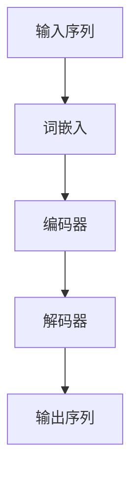

# 大规模语言模型从理论到实践 数据规模

## 1.背景介绍

大规模语言模型（Large Language Models, LLMs）近年来在自然语言处理（NLP）领域取得了显著的进展。随着计算能力和数据规模的不断提升，LLMs在各种任务中表现出色，如机器翻译、文本生成、问答系统等。本文将深入探讨大规模语言模型的理论基础、核心算法、数学模型、实际应用以及未来发展趋势。

## 2.核心概念与联系

### 2.1 语言模型的定义

语言模型是一种概率模型，用于预测一个句子中词语的出现概率。其目标是通过学习大量文本数据，捕捉语言的统计特性，从而生成符合语法和语义的文本。

### 2.2 数据规模的重要性

数据规模在训练语言模型中起着至关重要的作用。更多的数据意味着模型可以学习到更丰富的语言特性，从而提高其生成文本的质量和准确性。

### 2.3 大规模语言模型的特点

大规模语言模型通常具有以下特点：
- **参数量大**：模型参数量通常达到数十亿甚至上千亿。
- **数据量大**：训练数据集通常包含数百GB甚至TB级别的文本数据。
- **计算资源需求高**：训练过程需要大量的计算资源，通常依赖于高性能计算集群或专用硬件。

## 3.核心算法原理具体操作步骤

### 3.1 预训练与微调

大规模语言模型的训练通常分为两个阶段：预训练和微调。

#### 3.1.1 预训练

预训练阶段，模型在大规模无标签文本数据上进行训练，目标是学习语言的基本特性。常用的预训练任务包括：
- **自回归语言模型**：预测下一个词的概率。
- **掩码语言模型**：随机掩盖部分词语，预测被掩盖的词语。

#### 3.1.2 微调

微调阶段，模型在特定任务的数据集上进行训练，以适应具体任务的需求。常见的微调任务包括文本分类、问答系统、机器翻译等。

### 3.2 Transformer架构

大规模语言模型通常基于Transformer架构。Transformer通过自注意力机制（Self-Attention）实现对输入序列的全局依赖建模，具有并行计算效率高、捕捉长距离依赖能力强的特点。



### 3.3 自注意力机制

自注意力机制通过计算输入序列中每个词与其他词的相关性，生成加权表示，从而捕捉全局依赖关系。其核心计算步骤包括：
- **计算查询、键和值**：将输入序列映射到查询（Query）、键（Key）和值（Value）向量。
- **计算注意力权重**：通过点积计算查询和键的相似度，并进行归一化。
- **加权求和**：使用注意力权重对值向量进行加权求和，生成输出表示。

## 4.数学模型和公式详细讲解举例说明

### 4.1 自注意力机制的数学表示

自注意力机制的核心公式如下：

$$
\text{Attention}(Q, K, V) = \text{softmax}\left(\frac{QK^T}{\sqrt{d_k}}\right)V
$$

其中，$Q$、$K$、$V$分别表示查询、键和值向量，$d_k$表示键向量的维度。

### 4.2 Transformer的多头注意力机制

多头注意力机制通过并行计算多个自注意力，增强模型的表达能力。其数学表示如下：

$$
\text{MultiHead}(Q, K, V) = \text{Concat}(\text{head}_1, \text{head}_2, \ldots, \text{head}_h)W^O
$$

其中，每个头的计算方式为：

$$
\text{head}_i = \text{Attention}(QW_i^Q, KW_i^K, VW_i^V)
$$

$W_i^Q$、$W_i^K$、$W_i^V$和$W^O$为可训练的权重矩阵。

### 4.3 位置编码

由于Transformer不具备序列信息，需引入位置编码（Positional Encoding）来表示词语在序列中的位置。位置编码的公式如下：

$$
PE_{(pos, 2i)} = \sin\left(\frac{pos}{10000^{2i/d_{model}}}\right)
$$

$$
PE_{(pos, 2i+1)} = \cos\left(\frac{pos}{10000^{2i/d_{model}}}\right)
$$

其中，$pos$表示词语的位置，$i$表示维度索引，$d_{model}$表示模型的维度。

## 5.项目实践：代码实例和详细解释说明

### 5.1 环境准备

首先，确保安装了必要的库，如TensorFlow或PyTorch。

```bash
pip install torch transformers
```

### 5.2 数据预处理

加载并预处理训练数据。

```python
from transformers import BertTokenizer

tokenizer = BertTokenizer.from_pretrained('bert-base-uncased')
text = "Hello, how are you?"
inputs = tokenizer(text, return_tensors='pt')
```

### 5.3 模型定义

定义基于Transformer的语言模型。

```python
from transformers import BertModel

model = BertModel.from_pretrained('bert-base-uncased')
outputs = model(**inputs)
```

### 5.4 模型训练

使用预训练模型进行微调。

```python
from transformers import Trainer, TrainingArguments

training_args = TrainingArguments(
    output_dir='./results',
    num_train_epochs=3,
    per_device_train_batch_size=8,
    per_device_eval_batch_size=8,
    warmup_steps=500,
    weight_decay=0.01,
    logging_dir='./logs',
)

trainer = Trainer(
    model=model,
    args=training_args,
    train_dataset=train_dataset,
    eval_dataset=eval_dataset
)

trainer.train()
```

### 5.5 模型评估

评估模型在验证集上的表现。

```python
results = trainer.evaluate()
print(results)
```

## 6.实际应用场景

### 6.1 机器翻译

大规模语言模型在机器翻译任务中表现出色，能够生成高质量的翻译文本。

### 6.2 文本生成

通过大规模语言模型，可以生成符合语法和语义的自然语言文本，应用于对话系统、内容创作等领域。

### 6.3 问答系统

大规模语言模型在问答系统中能够理解用户的问题，并生成准确的回答。

### 6.4 情感分析

通过微调大规模语言模型，可以实现对文本情感的准确分析，应用于舆情监控、市场分析等领域。

## 7.工具和资源推荐

### 7.1 开源框架

- **TensorFlow**：谷歌开发的开源机器学习框架，支持大规模语言模型的训练和部署。
- **PyTorch**：Facebook开发的开源深度学习框架，广泛应用于研究和工业界。

### 7.2 预训练模型

- **BERT**：谷歌发布的双向编码器表示模型，适用于多种NLP任务。
- **GPT-3**：OpenAI发布的生成式预训练模型，具有强大的文本生成能力。

### 7.3 数据集

- **Wikipedia**：包含丰富的百科知识，是训练语言模型的优质数据源。
- **Common Crawl**：包含大量的网页数据，适用于大规模语言模型的预训练。

## 8.总结：未来发展趋势与挑战

### 8.1 未来发展趋势

- **模型规模继续扩大**：随着计算能力的提升，未来大规模语言模型的参数量和数据规模将继续扩大。
- **多模态融合**：未来的语言模型将不仅限于文本数据，还将融合图像、音频等多模态数据，提升模型的综合能力。
- **高效训练方法**：研究高效的训练方法，降低大规模语言模型的训练成本和时间。

### 8.2 挑战

- **计算资源需求高**：大规模语言模型的训练和部署需要大量的计算资源，限制了其广泛应用。
- **数据隐私和安全**：大规模语言模型的训练数据可能包含敏感信息，需注意数据隐私和安全问题。
- **模型解释性**：大规模语言模型的内部机制复杂，难以解释其决策过程，影响其在某些领域的应用。

## 9.附录：常见问题与解答

### 9.1 如何选择合适的预训练模型？

选择预训练模型时，应根据具体任务的需求和数据特点进行选择。例如，BERT适用于需要双向上下文信息的任务，而GPT-3适用于文本生成任务。

### 9.2 如何处理训练数据不足的问题？

当训练数据不足时，可以考虑以下方法：
- **数据增强**：通过数据增强技术生成更多的训练数据。
- **迁移学习**：使用在大规模数据上预训练的模型进行微调。
- **半监督学习**：结合少量标注数据和大量未标注数据进行训练。

### 9.3 如何优化模型的训练效率？

优化模型训练效率的方法包括：
- **使用高效的优化算法**：如Adam、LAMB等。
- **分布式训练**：利用多GPU或多节点进行分布式训练。
- **混合精度训练**：使用混合精度训练技术，减少计算和内存开销。

作者：禅与计算机程序设计艺术 / Zen and the Art of Computer Programming