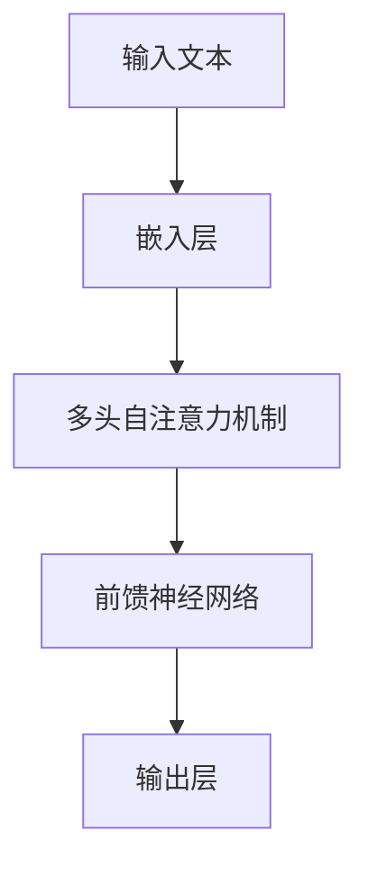

# 大规模语言模型从理论到实践 有监督微调

## 1.背景介绍

大规模语言模型（Large Language Models, LLMs）近年来在自然语言处理（NLP）领域取得了显著的进展。诸如GPT-3、BERT等模型在各种任务中表现出色，从文本生成到翻译，再到问答系统，几乎无所不能。然而，这些模型的成功离不开有监督微调（Supervised Fine-Tuning），这一过程使得预训练模型能够适应特定任务，从而达到最佳性能。

有监督微调的核心思想是利用标注数据对预训练模型进行进一步训练，使其在特定任务上表现更佳。本文将深入探讨大规模语言模型的有监督微调，从理论到实践，涵盖核心概念、算法原理、数学模型、代码实例、实际应用场景、工具和资源推荐等多个方面。

## 2.核心概念与联系

### 2.1 预训练与微调

预训练（Pre-training）是指在大规模无标注数据上训练语言模型，使其学习语言的基本结构和语义。微调（Fine-Tuning）则是在特定任务的标注数据上进一步训练模型，使其适应该任务的需求。

### 2.2 有监督学习

有监督学习（Supervised Learning）是指利用标注数据进行训练，使模型能够从输入数据中学习到输出标签的映射关系。在有监督微调中，我们使用特定任务的标注数据对预训练模型进行微调。

### 2.3 迁移学习

迁移学习（Transfer Learning）是指将一个任务上学到的知识应用到另一个相关任务中。在大规模语言模型中，预训练和微调的过程实际上就是一种迁移学习。

### 2.4 语言模型架构

大规模语言模型通常采用Transformer架构，其核心组件包括多头自注意力机制（Multi-Head Self-Attention）和前馈神经网络（Feed-Forward Neural Network）。这些组件使得模型能够高效地捕捉语言中的长距离依赖关系。



## 3.核心算法原理具体操作步骤

### 3.1 数据准备

首先，需要准备标注数据集。数据集应包含输入文本和对应的输出标签。常见的数据集格式包括CSV、JSON等。

### 3.2 数据预处理

数据预处理包括文本清洗、分词、编码等步骤。文本清洗可以去除无关字符，分词将文本分解为单词或子词，编码则将分词结果转换为模型可接受的数值形式。

### 3.3 模型加载与初始化

加载预训练模型，并根据任务需求初始化模型参数。常见的预训练模型包括GPT、BERT、RoBERTa等。

### 3.4 微调训练

使用标注数据对预训练模型进行微调。训练过程中需要设置超参数，如学习率、批次大小、训练轮数等。

### 3.5 模型评估与优化

在验证集上评估模型性能，并根据评估结果调整模型参数和超参数，以达到最佳性能。

## 4.数学模型和公式详细讲解举例说明

### 4.1 预训练目标

预训练通常采用自回归（Autoregressive）或自编码（Autoencoding）目标。以自回归模型为例，其目标是最大化条件概率：

$$
P(x) = \prod_{t=1}^{T} P(x_t | x_{<t})
$$

其中，$x_t$ 表示第 $t$ 个词，$x_{<t}$ 表示第 $t$ 个词之前的所有词。

### 4.2 微调目标

微调过程中，目标是最小化损失函数，如交叉熵损失：

$$
L = -\frac{1}{N} \sum_{i=1}^{N} \sum_{j=1}^{C} y_{ij} \log(\hat{y}_{ij})
$$

其中，$N$ 表示样本数量，$C$ 表示类别数量，$y_{ij}$ 表示第 $i$ 个样本的第 $j$ 个类别的真实标签，$\hat{y}_{ij}$ 表示模型预测的概率。

### 4.3 优化算法

常用的优化算法包括随机梯度下降（SGD）、Adam等。以Adam优化算法为例，其更新公式为：

$$
m_t = \beta_1 m_{t-1} + (1 - \beta_1) g_t
$$

$$
v_t = \beta_2 v_{t-1} + (1 - \beta_2) g_t^2
$$

$$
\hat{m}_t = \frac{m_t}{1 - \beta_1^t}
$$

$$
\hat{v}_t = \frac{v_t}{1 - \beta_2^t}
$$

$$
\theta_t = \theta_{t-1} - \alpha \frac{\hat{m}_t}{\sqrt{\hat{v}_t} + \epsilon}
$$

其中，$m_t$ 和 $v_t$ 分别表示一阶和二阶动量，$\beta_1$ 和 $\beta_2$ 是动量衰减系数，$g_t$ 是梯度，$\alpha$ 是学习率，$\epsilon$ 是一个小常数。

## 5.项目实践：代码实例和详细解释说明

### 5.1 数据准备

假设我们使用IMDb电影评论数据集进行情感分析任务。首先，下载并加载数据集：

```python
import pandas as pd

# 下载数据集
url = "https://ai.stanford.edu/~amaas/data/sentiment/aclImdb_v1.tar.gz"
data = pd.read_csv(url, compression='gzip', header=0, delimiter='\t', quotechar='"')

# 查看数据集
print(data.head())
```

### 5.2 数据预处理

进行文本清洗、分词和编码：

```python
from transformers import BertTokenizer

# 初始化BERT分词器
tokenizer = BertTokenizer.from_pretrained('bert-base-uncased')

# 分词和编码
data['input_ids'] = data['review'].apply(lambda x: tokenizer.encode(x, add_special_tokens=True))
```

### 5.3 模型加载与初始化

加载预训练的BERT模型：

```python
from transformers import BertForSequenceClassification

# 加载预训练模型
model = BertForSequenceClassification.from_pretrained('bert-base-uncased', num_labels=2)
```

### 5.4 微调训练

使用PyTorch进行微调训练：

```python
import torch
from torch.utils.data import DataLoader, TensorDataset

# 准备数据
input_ids = torch.tensor(data['input_ids'].tolist())
labels = torch.tensor(data['label'].tolist())
dataset = TensorDataset(input_ids, labels)
dataloader = DataLoader(dataset, batch_size=32, shuffle=True)

# 定义优化器
optimizer = torch.optim.AdamW(model.parameters(), lr=2e-5)

# 训练模型
model.train()
for epoch in range(3):
    for batch in dataloader:
        optimizer.zero_grad()
        input_ids, labels = batch
        outputs = model(input_ids, labels=labels)
        loss = outputs.loss
        loss.backward()
        optimizer.step()
```

### 5.5 模型评估与优化

在验证集上评估模型性能：

```python
from sklearn.metrics import accuracy_score

# 准备验证数据
val_input_ids = torch.tensor(val_data['input_ids'].tolist())
val_labels = torch.tensor(val_data['label'].tolist())
val_dataset = TensorDataset(val_input_ids, val_labels)
val_dataloader = DataLoader(val_dataset, batch_size=32, shuffle=False)

# 评估模型
model.eval()
predictions, true_labels = [], []
for batch in val_dataloader:
    input_ids, labels = batch
    with torch.no_grad():
        outputs = model(input_ids)
    logits = outputs.logits
    predictions.extend(torch.argmax(logits, dim=1).tolist())
    true_labels.extend(labels.tolist())

# 计算准确率
accuracy = accuracy_score(true_labels, predictions)
print(f'Validation Accuracy: {accuracy}')
```

## 6.实际应用场景

### 6.1 文本分类

有监督微调在文本分类任务中表现出色，如情感分析、垃圾邮件检测等。通过微调预训练模型，可以显著提升分类准确率。

### 6.2 机器翻译

在机器翻译任务中，有监督微调可以使预训练模型更好地适应特定语言对，从而提高翻译质量。

### 6.3 问答系统

有监督微调在问答系统中也有广泛应用。通过微调，模型可以更准确地理解问题并生成合适的答案。

### 6.4 信息抽取

在信息抽取任务中，有监督微调可以帮助模型更准确地从文本中提取出关键信息，如命名实体识别（NER）、关系抽取等。

## 7.工具和资源推荐

### 7.1 预训练模型

- [Hugging Face Transformers](https://huggingface.co/transformers/): 提供了多种预训练模型和微调工具。
- [TensorFlow Hub](https://tfhub.dev/): 提供了多种预训练模型和微调工具。

### 7.2 数据集

- [IMDb电影评论数据集](https://ai.stanford.edu/~amaas/data/sentiment/): 用于情感分析任务。
- [SQuAD问答数据集](https://rajpurkar.github.io/SQuAD-explorer/): 用于问答系统任务。

### 7.3 开发工具

- [PyTorch](https://pytorch.org/): 强大的深度学习框架，支持大规模语言模型的训练和微调。
- [TensorFlow](https://www.tensorflow.org/): 另一个流行的深度学习框架，支持大规模语言模型的训练和微调。

## 8.总结：未来发展趋势与挑战

### 8.1 发展趋势

大规模语言模型的有监督微调在未来将继续发展，主要趋势包括：

- **模型规模进一步扩大**：随着计算资源的增加，模型规模将继续扩大，从而提升性能。
- **多任务学习**：通过在多个任务上进行联合微调，模型可以更好地泛化到新任务。
- **自监督学习**：结合自监督学习方法，可以减少对标注数据的依赖。

### 8.2 挑战

尽管有监督微调取得了显著进展，但仍面临一些挑战：

- **数据标注成本高**：高质量的标注数据集成本高，限制了微调的应用范围。
- **模型解释性差**：大规模语言模型的内部机制复杂，难以解释其决策过程。
- **计算资源需求高**：微调大规模模型需要大量计算资源，限制了其普及性。

## 9.附录：常见问题与解答

### 9.1 什么是有监督微调？

有监督微调是指利用标注数据对预训练模型进行进一步训练，使其在特定任务上表现更佳。

### 9.2 有监督微调的主要步骤是什么？

主要步骤包括数据准备、数据预处理、模型加载与初始化、微调训练、模型评估与优化。

### 9.3 有监督微调的常见应用场景有哪些？

常见应用场景包括文本分类、机器翻译、问答系统、信息抽取等。

### 9.4 有监督微调面临哪些挑战？

主要挑战包括数据标注成本高、模型解释性差、计算资源需求高等。

### 9.5 如何选择预训练模型？

选择预训练模型时，应考虑任务需求、模型性能、计算资源等因素。常见的预训练模型包括GPT、BERT、RoBERTa等。

---

作者：禅与计算机程序设计艺术 / Zen and the Art of Computer Programming