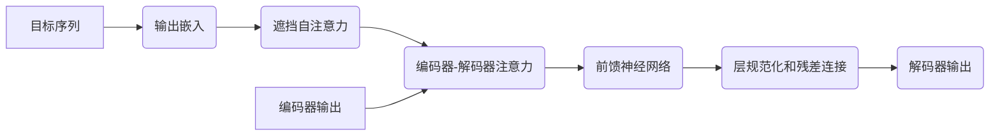

# 大规模语言模型从理论到实践：编码器和解码器结构

## 1. 背景介绍

### 1.1 自然语言处理的重要性

在当今的数字时代,自然语言处理(NLP)已成为人工智能领域中最重要和最具挑战性的任务之一。它旨在使计算机能够理解、解释和生成人类语言,这对于构建智能系统至关重要,如虚拟助手、机器翻译、文本摘要和情感分析等。

### 1.2 神经网络语言模型的兴起

传统的NLP方法主要依赖于规则和统计模型,但随着深度学习的发展,基于神经网络的语言模型展现出了强大的语言理解和生成能力。这些模型能够从大量文本数据中自动学习语言模式和语义表示,从而克服了传统方法的局限性。

### 1.3 大规模语言模型的重要性

随着计算能力和数据可用性的提高,训练大规模语言模型成为可能。这些模型在海量文本数据上进行预训练,获得了丰富的语言知识,并可以通过微调(fine-tuning)来适应各种下游NLP任务。大规模语言模型已成为NLP领域的重要突破,推动了许多应用的发展。

## 2. 核心概念与联系

### 2.1 自注意力机制(Self-Attention)

自注意力机制是大规模语言模型中的关键组成部分。它允许模型捕捉输入序列中任意两个位置之间的关系,而不受位置距离的限制。这种灵活的关注机制有助于模型更好地建模长期依赖关系,并提高了语言理解能力。


### 2.2 transformer架构

Transformer是一种全新的基于注意力机制的神经网络架构,它完全放弃了传统的循环神经网络(RNN)和卷积神经网络(CNN)结构。Transformer由编码器(Encoder)和解码器(Decoder)组成,两者都采用了多头自注意力机制和位置编码,能够高效地建模长期依赖关系。


### 2.3 预训练与微调(Pre-training and Fine-tuning)

大规模语言模型通常采用两阶段训练策略:预训练和微调。在预训练阶段,模型在海量无标注文本数据上进行自监督学习,获得通用的语言表示能力。在微调阶段,预训练模型被进一步调整以适应特定的下游NLP任务,如文本分类、机器翻译等。这种策略大大提高了模型的性能和泛化能力。

## 3. 核心算法原理具体操作步骤

### 3.1 编码器(Encoder)

编码器的主要任务是将输入序列(如自然语言文本)映射到一系列连续的表示向量,捕捉输入序列中的重要信息。

1. **输入嵌入(Input Embeddings)**: 将输入符号(如单词或子词)映射到连续的向量空间。
2. **位置编码(Positional Encoding)**: 由于自注意力机制没有捕捉序列顺序的能力,因此需要添加位置信息。
3. **多头自注意力(Multi-Head Self-Attention)**: 计算每个位置与其他所有位置之间的注意力权重,并将加权和作为该位置的新表示。
4. **前馈神经网络(Feed-Forward Neural Network)**: 对每个位置的表示进行进一步的非线性转换。
5. **层规范化(Layer Normalization)** 和 **残差连接(Residual Connection)**: 用于稳定训练过程和提高梯度流动。

编码器由多个相同的层堆叠而成,每一层都重复执行上述步骤。最终输出是编码器的最后一层对应的表示向量序列。


### 3.2 解码器(Decoder)

解码器的任务是根据编码器的输出和目标序列(如机器翻译的目标语言)生成新的序列。

1. **输出嵌入(Output Embeddings)**: 将目标序列的符号映射到连续的向量空间。
2. **遮挡自注意力(Masked Self-Attention)**: 在自注意力计算中,遮挡掉当前位置之后的所有位置,以保留自回归属性。
3. **编码器-解码器注意力(Encoder-Decoder Attention)**: 计算目标序列每个位置与编码器输出序列之间的注意力权重,捕捉输入和输出之间的依赖关系。
4. **前馈神经网络(Feed-Forward Neural Network)**: 对每个位置的表示进行进一步的非线性转换。
5. **层规范化(Layer Normalization)** 和 **残差连接(Residual Connection)**: 用于稳定训练过程和提高梯度流动。

解码器也由多个相同的层堆叠而成,每一层都重复执行上述步骤。最终输出是解码器的最后一层对应的表示向量序列,通过线性投影和softmax操作可以得到下一个符号的概率分布。



## 4. 数学模型和公式详细讲解举例说明

### 4.1 缩放点积注意力(Scaled Dot-Product Attention)

自注意力机制的核心是缩放点积注意力,它计算查询(Query)与键(Key)之间的相似性,并根据相似性分配注意力权重。

给定一个查询向量 $\mathbf{q} \in \mathbb{R}^{d_k}$、一组键向量 $\mathbf{K} = [\mathbf{k}_1, \mathbf{k}_2, \ldots, \mathbf{k}_n] \in \mathbb{R}^{n \times d_k}$ 和一组值向量 $\mathbf{V} = [\mathbf{v}_1, \mathbf{v}_2, \ldots, \mathbf{v}_n] \in \mathbb{R}^{n \times d_v}$,缩放点积注意力的计算过程如下:

1. 计算查询与每个键向量的点积,得到未缩放的注意力分数:

$$
e_i = \mathbf{q} \cdot \mathbf{k}_i
$$

2. 对注意力分数进行缩放,防止过大的值导致softmax函数饱和:

$$
\alpha_i = \frac{e_i}{\sqrt{d_k}}
$$

3. 对缩放后的注意力分数应用softmax函数,得到注意力权重:

$$
\text{Attention}(\mathbf{Q}, \mathbf{K}, \mathbf{V}) = \text{softmax}(\alpha_1, \alpha_2, \ldots, \alpha_n) \mathbf{V}
$$

其中,

$$
\text{softmax}(\alpha_1, \alpha_2, \ldots, \alpha_n) = \left(\frac{e^{\alpha_1}}{\sum_{j=1}^n e^{\alpha_j}}, \frac{e^{\alpha_2}}{\sum_{j=1}^n e^{\alpha_j}}, \ldots, \frac{e^{\alpha_n}}{\sum_{j=1}^n e^{\alpha_j}}\right)
$$

最终输出是注意力权重与值向量的加权和。

### 4.2 多头注意力(Multi-Head Attention)

为了捕捉不同的注意力模式,transformer采用了多头注意力机制。它将查询、键和值投影到不同的子空间,并在每个子空间中计算缩放点积注意力,最后将所有子空间的注意力输出进行拼接。

给定一个查询矩阵 $\mathbf{Q} \in \mathbb{R}^{n \times d_q}$、一个键矩阵 $\mathbf{K} \in \mathbb{R}^{n \times d_k}$ 和一个值矩阵 $\mathbf{V} \in \mathbb{R}^{n \times d_v}$,以及投影矩阵 $\mathbf{W}_Q^i \in \mathbb{R}^{d_q \times d_{q'}}$、$\mathbf{W}_K^i \in \mathbb{R}^{d_k \times d_{k'}}$ 和 $\mathbf{W}_V^i \in \mathbb{R}^{d_v \times d_{v'}}$,多头注意力的计算过程如下:

1. 将查询、键和值投影到子空间:

$$
\mathbf{Q}^i = \mathbf{Q} \mathbf{W}_Q^i, \quad \mathbf{K}^i = \mathbf{K} \mathbf{W}_K^i, \quad \mathbf{V}^i = \mathbf{V} \mathbf{W}_V^i
$$

2. 在每个子空间中计算缩放点积注意力:

$$
\text{head}_i = \text{Attention}(\mathbf{Q}^i, \mathbf{K}^i, \mathbf{V}^i)
$$

3. 拼接所有子空间的注意力输出:

$$
\text{MultiHead}(\mathbf{Q}, \mathbf{K}, \mathbf{V}) = \text{Concat}(\text{head}_1, \text{head}_2, \ldots, \text{head}_h) \mathbf{W}^O
$$

其中, $\mathbf{W}^O \in \mathbb{R}^{hd_v \times d_\text{model}}$ 是一个可学习的线性投影矩阵,用于将拼接后的向量映射回模型的维度 $d_\text{model}$。

多头注意力机制不仅提高了模型的表示能力,还通过并行计算提高了计算效率。

### 4.3 位置编码(Positional Encoding)

由于自注意力机制没有捕捉序列顺序的能力,transformer引入了位置编码来为每个位置提供位置信息。位置编码是一个固定的向量,它根据位置的不同而不同,并被添加到输入的嵌入向量中。

对于位置 $p$,其位置编码 $\text{PE}_{(p, 2i)}$ 和 $\text{PE}_{(p, 2i+1)}$ 分别定义为:

$$
\begin{aligned}
\text{PE}_{(p, 2i)} &= \sin\left(p / 10000^{2i / d_\text{model}}\right) \\
\text{PE}_{(p, 2i+1)} &= \cos\left(p / 10000^{2i / d_\text{model}}\right)
\end{aligned}
$$

其中, $i$ 是维度索引,而 $d_\text{model}$ 是模型的嵌入维度。这种基于三角函数的位置编码能够很好地捕捉序列中不同位置之间的相对位置信息。

## 5. 项目实践: 代码实例和详细解释说明

在这一部分,我们将提供一个基于PyTorch实现的transformer模型示例,并详细解释每个组件的实现细节。

### 5.1 缩放点积注意力实现

```python
import torch
import torch.nn as nn
import math

class ScaledDotProductAttention(nn.Module):
    def __init__(self, d_k):
        super().__init__()
        self.d_k = d_k

    def forward(self, q, k, v, mask=None):
        # 计算注意力分数
        attn_scores = torch.matmul(q, k.transpose(-2, -1)) / math.sqrt(self.d_k)

        # 应用遮挡
        if mask is not None:
            attn_scores = attn_scores.masked_fill(mask == 0, -1e9)

        # 计算注意力权重
        attn_weights = nn.functional.softmax(attn_scores, dim=-1)

        # 计算加权和
        output = torch.matmul(attn_weights, v)

        return output, attn_weights
```

在上面的代码中,我们实现了缩放点积注意力的核心计算过程。`forward`函数接受查询 `q`、键 `k` 和值 `v`,以及可选的遮挡掩码 `mask`。首先,我们计算查询与键的点积,并对其进行缩放。然后,如果提供了遮挡掩码,我们将遮挡掩码应用于注意力分数。接下来,我们使用softmax函数计算注意力权重