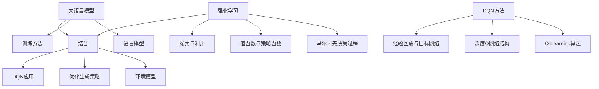

# 大语言模型原理与工程实践：DQN 方法

## 1. 背景介绍
### 1.1 大语言模型的发展历程
#### 1.1.1 早期的统计语言模型
#### 1.1.2 神经网络语言模型的兴起
#### 1.1.3 Transformer 架构的革命性突破

### 1.2 强化学习在自然语言处理中的应用
#### 1.2.1 强化学习的基本原理
#### 1.2.2 强化学习在对话系统中的应用
#### 1.2.3 强化学习在文本生成中的应用

### 1.3 DQN 方法的提出与意义
#### 1.3.1 DQN 的基本思想
#### 1.3.2 DQN 在游戏领域的成功应用
#### 1.3.3 DQN 在自然语言处理领域的潜力

## 2. 核心概念与联系
### 2.1 大语言模型
#### 2.1.1 语言模型的定义与作用
#### 2.1.2 大语言模型的特点与优势
#### 2.1.3 大语言模型的训练方法

### 2.2 强化学习
#### 2.2.1 马尔可夫决策过程
#### 2.2.2 值函数与策略函数
#### 2.2.3 探索与利用的权衡

### 2.3 DQN 方法
#### 2.3.1 Q-Learning 算法
#### 2.3.2 深度 Q 网络的结构
#### 2.3.3 经验回放与目标网络

### 2.4 大语言模型与强化学习的结合
#### 2.4.1 大语言模型作为环境模型
#### 2.4.2 强化学习优化语言模型的生成策略
#### 2.4.3 DQN 在大语言模型中的应用



## 3. 核心算法原理具体操作步骤
### 3.1 Q-Learning 算法
#### 3.1.1 Q 值的定义与更新
#### 3.1.2 Q-Learning 的伪代码
#### 3.1.3 Q-Learning 的收敛性证明

### 3.2 深度 Q 网络
#### 3.2.1 将深度神经网络作为 Q 函数近似器
#### 3.2.2 损失函数的设计
#### 3.2.3 网络结构的选择

### 3.3 经验回放
#### 3.3.1 经验回放的作用与优势
#### 3.3.2 回放缓冲区的设计
#### 3.3.3 从回放缓冲区中采样

### 3.4 目标网络
#### 3.4.1 目标网络的作用
#### 3.4.2 目标网络的更新策略
#### 3.4.3 Double DQN 的改进

### 3.5 DQN 在大语言模型中的应用步骤
#### 3.5.1 定义状态空间与动作空间
#### 3.5.2 设计奖励函数
#### 3.5.3 训练 DQN 模型
#### 3.5.4 使用 DQN 模型生成文本

## 4. 数学模型和公式详细讲解举例说明
### 4.1 马尔可夫决策过程
#### 4.1.1 状态转移概率与奖励函数
$P(s'|s,a)$表示在状态$s$下执行动作$a$后转移到状态$s'$的概率，$R(s,a)$表示在状态$s$下执行动作$a$获得的即时奖励。

#### 4.1.2 策略与值函数
策略$\pi(a|s)$表示在状态$s$下选择动作$a$的概率，状态值函数$V^\pi(s)$表示在状态$s$下遵循策略$\pi$的期望回报：

$$V^\pi(s)=\mathbb{E}_{\pi}[\sum_{t=0}^{\infty}\gamma^tR(s_t,a_t)|s_0=s]$$

其中$\gamma$为折扣因子，$t$为时间步。

#### 4.1.3 贝尔曼方程
最优状态值函数$V^*(s)$满足贝尔曼最优方程：

$$V^*(s)=\max_a\sum_{s'}P(s'|s,a)[R(s,a)+\gamma V^*(s')]$$

### 4.2 Q-Learning
#### 4.2.1 Q 值与最优 Q 值
$Q^\pi(s,a)$表示在状态$s$下执行动作$a$并遵循策略$\pi$的期望回报：

$$Q^\pi(s,a)=\mathbb{E}_{\pi}[\sum_{t=0}^{\infty}\gamma^tR(s_t,a_t)|s_0=s,a_0=a]$$

最优 Q 值$Q^*(s,a)$满足贝尔曼最优方程：

$$Q^*(s,a)=\sum_{s'}P(s'|s,a)[R(s,a)+\gamma \max_{a'}Q^*(s',a')]$$

#### 4.2.2 Q 值更新公式
Q-Learning 使用如下公式更新 Q 值：

$$Q(s_t,a_t) \leftarrow Q(s_t,a_t)+\alpha[R(s_t,a_t)+\gamma \max_aQ(s_{t+1},a)-Q(s_t,a_t)]$$

其中$\alpha$为学习率。

### 4.3 深度 Q 网络
#### 4.3.1 Q 网络的损失函数
假设 Q 网络为$Q(s,a;\theta)$，其中$\theta$为网络参数，损失函数定义为：

$$L(\theta)=\mathbb{E}_{(s,a,r,s')\sim D}[(r+\gamma \max_{a'}Q(s',a';\theta^-)-Q(s,a;\theta))^2]$$

其中$D$为经验回放缓冲区，$\theta^-$为目标网络参数。

#### 4.3.2 目标网络的更新
每隔$C$步更新一次目标网络参数：

$$\theta^-\leftarrow\theta$$

### 4.4 DQN 在大语言模型中的应用
#### 4.4.1 状态表示
将语言模型的隐藏状态作为 DQN 的状态表示：

$$s_t=h_t$$

其中$h_t$为语言模型在时间步$t$的隐藏状态。

#### 4.4.2 动作空间
将语言模型的词表作为 DQN 的动作空间：

$$\mathcal{A}=\mathcal{V}$$

其中$\mathcal{V}$为语言模型的词表。

#### 4.4.3 奖励函数设计
可以根据生成文本的质量设计奖励函数，例如：

$$R(s_t,a_t)=\begin{cases}
1, & \text{if } a_t \text{ is coherent and informative} \\
0, & \text{otherwise}
\end{cases}$$

其中$a_t$为在时间步$t$生成的单词。

## 5. 项目实践：代码实例和详细解释说明
下面是一个使用 PyTorch 实现 DQN 在大语言模型中应用的简单示例：

```python
import torch
import torch.nn as nn
import torch.optim as optim
import numpy as np

# 定义 Q 网络
class QNetwork(nn.Module):
    def __init__(self, state_dim, action_dim):
        super(QNetwork, self).__init__()
        self.fc1 = nn.Linear(state_dim, 256)
        self.fc2 = nn.Linear(256, 256)
        self.fc3 = nn.Linear(256, action_dim)
        
    def forward(self, x):
        x = torch.relu(self.fc1(x))
        x = torch.relu(self.fc2(x))
        x = self.fc3(x)
        return x

# 定义 DQN 智能体
class DQNAgent:
    def __init__(self, state_dim, action_dim, lr, gamma, epsilon, target_update):
        self.q_network = QNetwork(state_dim, action_dim)
        self.target_network = QNetwork(state_dim, action_dim)
        self.optimizer = optim.Adam(self.q_network.parameters(), lr=lr)
        self.gamma = gamma
        self.epsilon = epsilon
        self.target_update = target_update
        self.update_step = 0
        
    def act(self, state):
        if np.random.rand() < self.epsilon:
            return np.random.randint(action_dim)
        else:
            state = torch.tensor(state, dtype=torch.float32)
            q_values = self.q_network(state)
            return torch.argmax(q_values).item()
    
    def train(self, state, action, reward, next_state, done):
        state = torch.tensor(state, dtype=torch.float32)
        next_state = torch.tensor(next_state, dtype=torch.float32)
        action = torch.tensor(action, dtype=torch.long)
        reward = torch.tensor(reward, dtype=torch.float32)
        
        q_values = self.q_network(state)
        next_q_values = self.target_network(next_state)
        
        q_value = q_values.gather(0, action.unsqueeze(0)).squeeze(0)
        next_q_value = next_q_values.max(0)[0]
        expected_q_value = reward + (1 - done) * self.gamma * next_q_value
        
        loss = (q_value - expected_q_value.detach()).pow(2).mean()
        
        self.optimizer.zero_grad()
        loss.backward()
        self.optimizer.step()
        
        self.update_step += 1
        if self.update_step % self.target_update == 0:
            self.target_network.load_state_dict(self.q_network.state_dict())

# 主循环
state_dim = ... # 定义状态维度
action_dim = ... # 定义动作维度
lr = 1e-4
gamma = 0.99
epsilon = 0.1
target_update = 100

agent = DQNAgent(state_dim, action_dim, lr, gamma, epsilon, target_update)

for episode in range(num_episodes):
    state = env.reset()
    done = False
    
    while not done:
        action = agent.act(state)
        next_state, reward, done, _ = env.step(action)
        agent.train(state, action, reward, next_state, done)
        state = next_state
```

代码解释：
1. 定义了一个简单的三层全连接神经网络作为 Q 网络，输入为状态，输出为各个动作的 Q 值。
2. 定义了 DQN 智能体，包含两个 Q 网络（在线网络和目标网络），以及优化器、超参数等。
3. `act` 方法根据 $\epsilon$-贪婪策略选择动作，以一定概率随机探索，否则选择 Q 值最大的动作。
4. `train` 方法根据贝尔曼方程更新在线网络的参数，并定期将在线网络的参数复制给目标网络。
5. 主循环中，智能体与环境交互，根据当前状态选择动作，获得奖励和下一个状态，并将转移样本用于训练。

实际应用中，还需要加入经验回放机制，并根据具体任务设计合适的状态表示、动作空间和奖励函数。

## 6. 实际应用场景
### 6.1 对话系统
#### 6.1.1 任务导向型对话
#### 6.1.2 开放域对话
#### 6.1.3 个性化对话生成

### 6.2 文本生成
#### 6.2.1 新闻写作
#### 6.2.2 故事创作
#### 6.2.3 诗歌生成

### 6.3 机器翻译
#### 6.3.1 提高翻译质量
#### 6.3.2 优化翻译策略
#### 6.3.3 无监督机器翻译

### 6.4 文本摘要
#### 6.4.1 提取式摘要
#### 6.4.2 生成式摘要
#### 6.4.3 个性化摘要生成

### 6.5 问答系统
#### 6.5.1 知识库问答
#### 6.5.2 常识问答
#### 6.5.3 多轮对话问答

## 7. 工具和资源推荐
### 7.1 深度学习框架
#### 7.1.1 PyTorch
#### 7.1.2 TensorFlow
#### 7.1.3 Keras

### 7.2 强化学习库
#### 7.2.1 OpenAI Gym
#### 7.2.2 Stable Baselines
#### 7.2.3 RLlib

### 7.3 预训练语言模型
#### 7.3.1 BERT
#### 7.3.2 GPT-2
#### 7.3.3 T5

### 7.4 数据集
#### 7.4.1 WikiText
#### 7.4.2 Penn