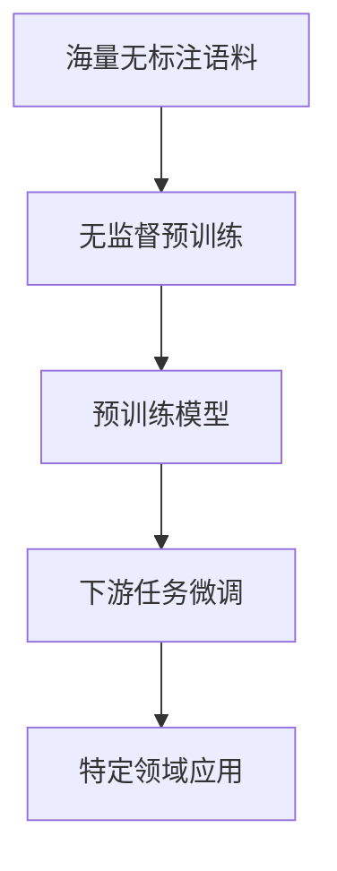

# 大语言模型原理与工程实践：大语言模型为什么这么强

## 1. 背景介绍
### 1.1 大语言模型的发展历程
#### 1.1.1 早期的语言模型
#### 1.1.2 神经网络语言模型的兴起
#### 1.1.3 Transformer架构的突破

### 1.2 大语言模型的应用领域
#### 1.2.1 自然语言处理
#### 1.2.2 信息检索与问答系统
#### 1.2.3 机器翻译与文本生成

### 1.3 大语言模型的优势与挑战
#### 1.3.1 海量数据与强大的泛化能力
#### 1.3.2 计算资源与训练成本的考量
#### 1.3.3 模型可解释性与伦理问题

## 2. 核心概念与联系
### 2.1 语言模型的定义与分类
#### 2.1.1 统计语言模型
#### 2.1.2 神经网络语言模型
#### 2.1.3 大语言模型的特点

### 2.2 Transformer架构与自注意力机制
#### 2.2.1 Transformer的核心思想
#### 2.2.2 自注意力机制的优势
#### 2.2.3 位置编码与多头注意力

### 2.3 预训练与微调范式
#### 2.3.1 无监督预训练的意义
#### 2.3.2 有监督微调的流程
#### 2.3.3 迁移学习与领域适应



## 3. 核心算法原理与具体操作步骤
### 3.1 Transformer的编码器-解码器结构
#### 3.1.1 编码器的组成与功能
#### 3.1.2 解码器的组成与功能
#### 3.1.3 编码器-解码器的交互

### 3.2 自注意力机制的计算过程
#### 3.2.1 查询、键、值的计算
#### 3.2.2 注意力权重的计算与归一化
#### 3.2.3 注意力输出的计算

### 3.3 位置编码与层归一化
#### 3.3.1 位置编码的作用与实现
#### 3.3.2 层归一化的作用与实现
#### 3.3.3 残差连接与前馈网络

## 4. 数学模型与公式详细讲解举例说明
### 4.1 语言模型的概率公式
给定一个单词序列 $w_1, w_2, \ldots, w_n$，语言模型的目标是估计该序列的概率：

$$P(w_1, w_2, \ldots, w_n) = \prod_{i=1}^n P(w_i | w_1, w_2, \ldots, w_{i-1})$$

其中，$P(w_i | w_1, w_2, \ldots, w_{i-1})$ 表示在给定前 $i-1$ 个单词的条件下，第 $i$ 个单词为 $w_i$ 的条件概率。

### 4.2 自注意力机制的数学表示
对于一个输入序列 $\mathbf{X} = (\mathbf{x}_1, \mathbf{x}_2, \ldots, \mathbf{x}_n)$，自注意力机制可以表示为：

$$\text{Attention}(\mathbf{Q}, \mathbf{K}, \mathbf{V}) = \text{softmax}(\frac{\mathbf{Q}\mathbf{K}^T}{\sqrt{d_k}})\mathbf{V}$$

其中，$\mathbf{Q}$、$\mathbf{K}$、$\mathbf{V}$ 分别表示查询、键、值矩阵，$d_k$ 表示键向量的维度。

### 4.3 位置编码的数学表示
对于位置 $pos$ 和维度 $i$，位置编码可以表示为：

$$\text{PE}(pos, 2i) = \sin(pos / 10000^{2i/d_{\text{model}}})$$
$$\text{PE}(pos, 2i+1) = \cos(pos / 10000^{2i/d_{\text{model}}})$$

其中，$d_{\text{model}}$ 表示模型的维度。

## 5. 项目实践：代码实例与详细解释说明
### 5.1 使用PyTorch实现Transformer
```python
import torch
import torch.nn as nn

class Transformer(nn.Module):
    def __init__(self, d_model, nhead, num_layers):
        super(Transformer, self).__init__()
        self.encoder = TransformerEncoder(d_model, nhead, num_layers)
        self.decoder = TransformerDecoder(d_model, nhead, num_layers)
        
    def forward(self, src, tgt):
        memory = self.encoder(src)
        output = self.decoder(tgt, memory)
        return output
```

### 5.2 自注意力机制的PyTorch实现
```python
import torch
import torch.nn as nn

class MultiHeadAttention(nn.Module):
    def __init__(self, d_model, nhead):
        super(MultiHeadAttention, self).__init__()
        self.d_model = d_model
        self.nhead = nhead
        self.q_proj = nn.Linear(d_model, d_model)
        self.k_proj = nn.Linear(d_model, d_model)
        self.v_proj = nn.Linear(d_model, d_model)
        self.out_proj = nn.Linear(d_model, d_model)
        
    def forward(self, query, key, value):
        batch_size = query.size(0)
        Q = self.q_proj(query).view(batch_size, -1, self.nhead, self.d_model // self.nhead).transpose(1, 2)
        K = self.k_proj(key).view(batch_size, -1, self.nhead, self.d_model // self.nhead).transpose(1, 2)
        V = self.v_proj(value).view(batch_size, -1, self.nhead, self.d_model // self.nhead).transpose(1, 2)
        
        scores = torch.matmul(Q, K.transpose(-2, -1)) / math.sqrt(self.d_model // self.nhead)
        attn_weights = nn.functional.softmax(scores, dim=-1)
        attn_output = torch.matmul(attn_weights, V)
        
        attn_output = attn_output.transpose(1, 2).contiguous().view(batch_size, -1, self.d_model)
        output = self.out_proj(attn_output)
        return output
```

### 5.3 使用HuggingFace的Transformers库进行预训练与微调
```python
from transformers import BertTokenizer, BertForSequenceClassification
from transformers import TrainingArguments, Trainer

# 加载预训练模型与分词器
model = BertForSequenceClassification.from_pretrained('bert-base-uncased')
tokenizer = BertTokenizer.from_pretrained('bert-base-uncased')

# 准备训练数据
train_dataset = ...
eval_dataset = ...

# 定义训练参数
training_args = TrainingArguments(
    output_dir='./results',
    num_train_epochs=3,
    per_device_train_batch_size=16,
    per_device_eval_batch_size=64,
    warmup_steps=500,
    weight_decay=0.01,
    logging_dir='./logs',
)

# 创建Trainer并开始训练
trainer = Trainer(
    model=model,
    args=training_args,
    train_dataset=train_dataset,
    eval_dataset=eval_dataset,
)

trainer.train()
```

## 6. 实际应用场景
### 6.1 智能客服与对话系统
#### 6.1.1 基于大语言模型的问答系统
#### 6.1.2 多轮对话与上下文理解
#### 6.1.3 个性化回复生成

### 6.2 文本摘要与生成
#### 6.2.1 抽取式摘要
#### 6.2.2 生成式摘要
#### 6.2.3 创意写作辅助

### 6.3 语义搜索与推荐系统
#### 6.3.1 基于语义相似度的搜索
#### 6.3.2 个性化推荐与用户画像
#### 6.3.3 跨模态检索与推荐

## 7. 工具与资源推荐
### 7.1 开源框架与库
#### 7.1.1 PyTorch与TensorFlow
#### 7.1.2 HuggingFace的Transformers库
#### 7.1.3 OpenAI的GPT系列模型

### 7.2 预训练模型与数据集
#### 7.2.1 BERT与RoBERTa
#### 7.2.2 GPT-2与GPT-3
#### 7.2.3 Common Crawl与Wikipedia数据集

### 7.3 学习资源与社区
#### 7.3.1 在线课程与教程
#### 7.3.2 学术论文与技术博客
#### 7.3.3 开发者社区与论坛

## 8. 总结：未来发展趋势与挑战
### 8.1 大语言模型的发展趋势
#### 8.1.1 模型规模与性能的持续提升
#### 8.1.2 多模态融合与跨领域应用
#### 8.1.3 模型压缩与推理加速

### 8.2 面临的挑战与问题
#### 8.2.1 计算资源与训练成本的限制
#### 8.2.2 数据偏差与公平性问题
#### 8.2.3 隐私保护与伦理考量

### 8.3 未来研究方向与展望
#### 8.3.1 模型可解释性与可控性
#### 8.3.2 无监督学习与自监督学习
#### 8.3.3 人机协同与增强智能

## 9. 附录：常见问题与解答
### 9.1 如何选择合适的预训练模型？
根据任务的特点和数据的性质，选择适合的预训练模型。对于通用的自然语言处理任务，可以考虑使用BERT、RoBERTa等模型；对于生成任务，可以考虑使用GPT系列模型。同时，也要权衡模型的大小和性能，选择合适的模型规模。

### 9.2 如何处理不同语言和领域的数据？
对于不同语言的数据，可以使用多语言预训练模型，如mBERT、XLM-R等。对于特定领域的数据，可以在通用预训练模型的基础上，使用领域内的数据进行二次预训练或微调，以提高模型在该领域的性能。

### 9.3 如何平衡模型的性能和效率？
可以通过以下方法平衡模型的性能和效率：
1. 使用模型压缩技术，如剪枝、量化、知识蒸馏等，减小模型的大小和推理时间。
2. 采用模型并行和数据并行的方式，利用多个GPU或TPU加速训练和推理。
3. 使用更高效的模型架构，如Transformer-XL、Reformer等，减少计算复杂度。
4. 在推理时，根据任务的需求，动态调整模型的规模和深度，平衡性能和效率。

大语言模型的出现，为自然语言处理领域带来了革命性的变化。它们强大的语言理解和生成能力，使得许多任务的性能得到显著提升。然而，大语言模型的训练和应用也面临着诸多挑战，如计算资源的限制、数据偏差、伦理问题等。未来，大语言模型的研究将继续朝着模型可解释性、可控性、无监督学习等方向发展，同时也将更加注重人机协同和增强智能。相信通过研究者和工程师的不断努力，大语言模型将在更广泛的领域发挥重要作用，为人类社会的发展做出更大的贡献。

作者：禅与计算机程序设计艺术 / Zen and the Art of Computer Programming