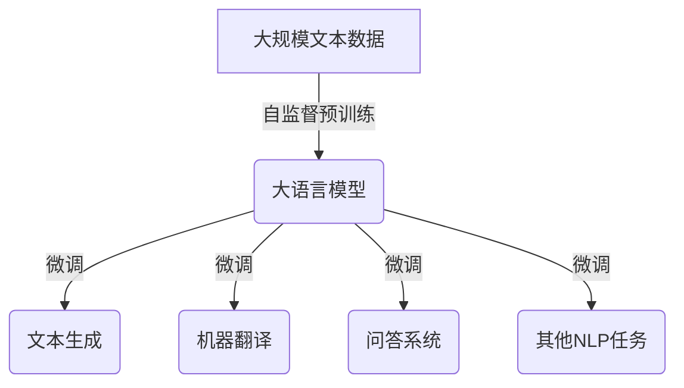

# 大语言模型原理与工程实践：大语言模型基础技术

## 1.背景介绍

### 1.1 人工智能的发展历程

人工智能(Artificial Intelligence, AI)是当代科技发展的热点领域之一。自20世纪50年代AI概念被正式提出以来,AI经历了几个重要的发展阶段。早期的AI系统主要基于规则和逻辑推理,如专家系统等。20世纪80年代,机器学习和神经网络的兴起,使AI进入了一个新的发展时期。

### 1.2 大数据与深度学习时代

21世纪以来,随着计算能力的飞速提升和大数据的积累,深度学习成为AI发展的主流技术范式。深度学习能够从海量数据中自动学习特征表示,在计算机视觉、自然语言处理等领域取得了突破性进展。

### 1.3 大语言模型的崛起

在自然语言处理领域,大规模预训练语言模型(Large Pre-trained Language Model, PLM)的出现,标志着AI进入了一个新的里程碑式时期。这些基于深度学习的大型语言模型,通过在海量文本数据上进行预训练,掌握了丰富的语言知识和上下文理解能力,为各种自然语言处理任务提供了强大的基础模型。

## 2.核心概念与联系

### 2.1 什么是大语言模型?

大语言模型是指基于深度学习技术,在海量文本数据上训练的大型神经网络模型。这些模型能够捕捉语言的深层次统计规律和语义信息,为下游的自然语言处理任务提供通用的语言表示和预训练知识。

大语言模型的核心思想是:先在大规模无标注文本数据上进行自监督预训练,获得通用的语言表示能力;然后在特定的自然语言处理任务上进行微调(fine-tuning),将预训练的语言知识迁移并应用到目标任务中。



### 2.2 大语言模型的关键技术

大语言模型的核心技术主要包括:

1. **自注意力机制(Self-Attention)**: 能够有效捕捉长距离依赖关系,是构建大语言模型的关键技术。
2. **Transformer架构**: 基于自注意力机制的全新神经网络架构,在机器翻译等任务中表现优异。
3. **掩码语言模型(Masked Language Model)**: 通过随机掩码部分输入,预测被掩码的词语,是大语言模型的主要预训练目标之一。
4. **下一句预测(Next Sentence Prediction)**: 判断两个句子是否相邻,用于捕捉上下文关系。
5. **模型压缩**: 通过知识蒸馏、量化等技术,压缩大语言模型的体积,以便部署到终端设备。

## 3.核心算法原理具体操作步骤

### 3.1 自注意力机制

自注意力机制是大语言模型的核心技术之一。传统的循环神经网络(RNN)和长短期记忆网络(LSTM)在处理长序列时存在梯度消失或爆炸的问题。自注意力机制通过计算输入序列中所有位置之间的加权关系,能够直接捕捉长距离依赖,从而更好地建模长序列数据。

自注意力机制的具体操作步骤如下:

1. **构建Query、Key和Value矩阵**

对于输入序列$X = (x_1, x_2, \dots, x_n)$,我们将其线性映射到Query、Key和Value空间:

$$Q = XW^Q$$
$$K = XW^K$$
$$V = XW^V$$

其中$W^Q, W^K, W^V$是可学习的权重矩阵。

2. **计算注意力分数**

计算Query与所有Key的点积,得到注意力分数矩阵:

$$\text{Attention}(Q, K, V) = \text{softmax}(\frac{QK^T}{\sqrt{d_k}})V$$

其中$d_k$是缩放因子,用于防止点积值过大导致梯度饱和。

3. **多头注意力**

为了捕捉不同的子空间关系,我们将注意力机制扩展为多头注意力(Multi-Head Attention):

$$\text{MultiHead}(Q, K, V) = \text{Concat}(head_1, \dots, head_h)W^O$$
$$\text{where } head_i = \text{Attention}(QW_i^Q, KW_i^K, VW_i^V)$$

$W_i^Q, W_i^K, W_i^V$是每个注意力头的可学习权重矩阵,$W^O$是用于线性变换的权重矩阵。

通过多头注意力机制,大语言模型能够从不同的子空间中捕捉到丰富的上下文信息。

### 3.2 Transformer架构

Transformer是基于自注意力机制构建的全新神经网络架构,它完全摒弃了RNN和CNN,使用全连接的注意力层来捕捉输入序列的上下文信息。

Transformer的核心结构包括编码器(Encoder)和解码器(Decoder)两部分:


1. **编码器(Encoder)**

编码器由多个相同的层组成,每一层包括:
- 多头自注意力层: 捕捉输入序列中的上下文信息。
- 前馈全连接层: 对序列进行非线性变换。
- 残差连接和层归一化: 提高训练稳定性。

2. **解码器(Decoder)**

解码器也由多个相同的层组成,每一层包括:
- 掩码多头自注意力层: 只关注当前位置之前的输出。
- 多头注意力层: 与编码器的输出进行注意力计算。
- 前馈全连接层: 对序列进行非线性变换。
- 残差连接和层归一化: 提高训练稳定性。

通过编码器-解码器的架构,Transformer能够高效地捕捉输入和输出序列之间的依赖关系,在机器翻译等序列到序列的任务中表现出色。

## 4.数学模型和公式详细讲解举例说明

### 4.1 掩码语言模型

掩码语言模型(Masked Language Model, MLM)是大语言模型预训练的核心目标之一。它的基本思想是:在输入序列中随机掩码部分词语,然后让模型基于上下文预测被掩码的词语。

给定输入序列$X = (x_1, x_2, \dots, x_n)$,我们随机选择一些位置进行掩码,得到掩码序列$\tilde{X} = (\tilde{x}_1, \tilde{x}_2, \dots, \tilde{x}_n)$,其中$\tilde{x}_i$可能是原始词语、掩码标记[MASK]或随机替换的词语。

模型的目标是最大化被掩码位置的词语概率:

$$\mathcal{L}_\text{MLM} = \sum_{i=1}^n \mathbb{1}_{\tilde{x}_i = \text{[MASK]}} \log P(x_i | \tilde{X})$$

其中$\mathbb{1}$是指示函数,用于判断$\tilde{x}_i$是否为掩码标记。

通过掩码语言模型的预训练,大语言模型能够学习到丰富的语义和上下文信息,为下游任务提供强大的语言表示能力。

### 4.2 下一句预测

除了掩码语言模型,下一句预测(Next Sentence Prediction, NSP)也是大语言模型预训练的重要目标之一。它的目标是判断两个句子是否相邻,从而捕捉更长距离的上下文关系。

具体来说,给定两个句子$A$和$B$,模型需要预测它们是否为连续的句子对。我们将句子对表示为$[CLS] A [SEP] B [SEP]$,其中$[CLS]$和$[SEP]$分别是分类和分隔符的特殊标记。

模型的目标是最大化下一句预测的二值交叉熵损失:

$$\mathcal{L}_\text{NSP} = -y \log P_\text{NSP} - (1 - y) \log (1 - P_\text{NSP})$$

其中$y \in \{0, 1\}$表示$A$和$B$是否为连续句子对,$P_\text{NSP}$是模型预测它们为连续句子对的概率。

通过下一句预测的预训练,大语言模型能够捕捉更长距离的上下文关系,提高对篇章级语义的理解能力。

### 4.3 知识蒸馏

由于大语言模型通常包含数十亿甚至上百亿的参数,因此模型体积庞大,难以部署到终端设备上。知识蒸馏(Knowledge Distillation)是一种常用的模型压缩技术,可以将大型教师模型(Teacher Model)的知识迁移到小型学生模型(Student Model)中。

知识蒸馏的基本思想是:在训练学生模型时,除了使用硬标签(Hard Label)作为监督信号,还利用教师模型的软预测(Soft Prediction)作为额外的知识来指导学生模型。

具体来说,给定输入$x$和标签$y$,学生模型的损失函数为:

$$\mathcal{L}_\text{distill} = (1 - \alpha) \mathcal{L}_\text{hard}(y, P_S(x)) + \alpha T^2 \mathcal{L}_\text{soft}(P_T(x), P_S(x))$$

其中:
- $\mathcal{L}_\text{hard}$是硬标签损失,如交叉熵损失。
- $\mathcal{L}_\text{soft}$是软标签损失,如KL散度,用于衡量学生模型与教师模型的输出分布差异。
- $P_S(x)$和$P_T(x)$分别是学生模型和教师模型对输入$x$的预测概率分布。
- $T$是温度超参数,用于控制softmax输出的平滑程度。
- $\alpha$是平衡两个损失项的超参数。

通过知识蒸馏,我们可以将大型教师模型的知识有效地迁移到小型学生模型中,从而在保持较高性能的同时,大幅减小模型体积,便于部署到终端设备上。

## 5.项目实践：代码实例和详细解释说明

为了更好地理解大语言模型的原理和实现,我们将基于PyTorch深度学习框架,实现一个简化版的BERT模型。

### 5.1 自注意力层

```python
import torch
import torch.nn as nn

class MultiHeadAttention(nn.Module):
    def __init__(self, d_model, num_heads):
        super().__init__()
        self.num_heads = num_heads
        self.d_model = d_model
        
        self.W_q = nn.Linear(d_model, d_model)
        self.W_k = nn.Linear(d_model, d_model)
        self.W_v = nn.Linear(d_model, d_model)
        self.W_o = nn.Linear(d_model, d_model)
        
    def forward(self, query, key, value, mask=None):
        batch_size = query.size(0)
        
        # 1. 计算Query, Key, Value
        q = self.W_q(query)  # (batch_size, seq_len, d_model)
        k = self.W_k(key)  # (batch_size, seq_len, d_model)
        v = self.W_v(value)  # (batch_size, seq_len, d_model)
        
        # 2. 分头
        q = q.view(batch_size, -1, self.num_heads, self.d_model // self.num_heads).permute(0, 2, 1, 3)
        k = k.view(batch_size, -1, self.num_heads, self.d_model // self.num_heads).permute(0, 2, 1, 3)
        v = v.view(batch_size, -1, self.num_heads, self.d_model // self.num_heads).permute(0, 2, 1, 3)
        
        # 3. 计算注意力分数
        scores =