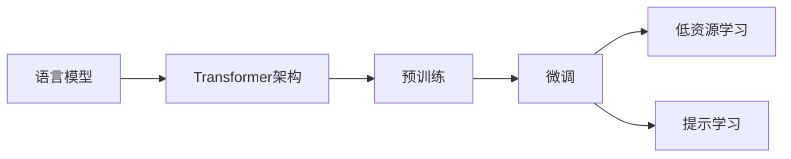

# 大语言模型原理与工程实践：大语言模型微调面临的挑战

## 1.背景介绍
### 1.1 大语言模型的兴起
近年来,随着深度学习技术的快速发展,尤其是 Transformer 架构的出现,大语言模型(Large Language Model,LLM)在自然语言处理(NLP)领域取得了突破性进展。从 GPT、BERT 到最新的 GPT-3、PaLM 等,大语言模型展现出了惊人的语言理解和生成能力,在问答、对话、摘要、翻译等多个 NLP 任务上取得了超越人类的表现。

### 1.2 预训练范式的优势
大语言模型的成功很大程度上归功于预训练(Pre-training)范式。通过在大规模无标注语料上进行自监督学习,模型可以学习到丰富的语言知识和通用语义表示。这种"先学习语言,再完成任务"的范式大大降低了对标注数据的依赖,使得模型可以更好地泛化和适应新任务。

### 1.3 微调的必要性
尽管预训练的大语言模型已经具备强大的语言能力,但直接应用于下游任务往往还无法达到最优效果。因此,针对特定任务对预训练模型进行微调(Fine-tuning)就显得尤为重要。通过在目标任务的标注数据上对模型进行额外的训练,可以使模型更好地适应任务的特点和分布,从而获得更好的性能。

### 1.4 微调面临的挑战
然而,大语言模型的微调并非易事。由于模型参数量巨大(动辄数十亿、上百亿),微调过程面临诸多挑战:
1. 计算资源要求高,训练时间长
2. 容易过拟合,泛化能力不足 
3. 需要较多的标注数据
4. 模型脆弱,容易受到对抗攻击
5. 可解释性差,难以分析模型行为

本文将围绕大语言模型微调中的这些问题展开讨论,介绍相关的原理与工程实践,为研究者和工程师提供参考和指导。

## 2.核心概念与联系
### 2.1 语言模型
语言模型是对语言概率分布的建模。给定前 $n-1$ 个词 $w_1, w_2, ..., w_{n-1}$,语言模型的目标是估计第 $n$ 个词 $w_n$ 的条件概率:

$$
P(w_n|w_1, w_2, ..., w_{n-1}) = \frac{P(w_1, w_2, ..., w_n)}{P(w_1, w_2, ..., w_{n-1})}
$$

传统的 N-gram 语言模型受限于平滑问题和数据稀疏问题。神经网络语言模型(Neural Language Model)使用神经网络来学习词嵌入和上下文表示,克服了这些局限性。

### 2.2 Transformer 架构
Transformer 是一种基于自注意力机制(Self-Attention)的序列建模架构。不同于 RNN 等模型,Transformer 可以并行计算,训练速度更快。Transformer 的核心是多头自注意力层(Multi-Head Self-Attention)和前馈神经网络(Feed-Forward Network)。

### 2.3 预训练与微调
预训练通过在大规模无标注语料上进行自监督学习,使模型学习通用语言知识。常见的预训练任务包括:
- 语言模型:预测下一个词(GPT)
- 掩码语言模型:预测被掩码的词(BERT) 
- 句子连续性判别:判断两个句子是否连贯(ALBERT)

微调是在预训练的基础上,使用目标任务的标注数据对模型进行额外的训练,使其适应特定任务。微调一般只需训练很少的轮数,学习率也较小。

### 2.4 低资源学习
低资源学习是指在标注数据很少的情况下进行学习。Few-shot learning 和 Zero-shot learning 是两种常见的低资源学习范式。前者通过学习少量样本来快速适应新任务,后者不需要任何目标任务的标注数据,直接进行推理。大语言模型在低资源学习方面展现出了很大的潜力。

### 2.5 提示学习
提示学习(Prompt Learning)是一种新兴的微调范式。不同于传统的微调,提示学习将任务转化为语言模型的格式,通过设计提示模板(prompt template)引导模型进行推理。这种范式可以更好地利用预训练模型的语言知识,在少样本情况下也能取得不错的效果。

下图展示了以上核心概念之间的联系:



## 3.核心算法原理与具体操作步骤
### 3.1 预训练算法
#### 3.1.1 GPT(Generative Pre-training)
GPT 是基于 Transformer Decoder 的语言模型预训练方法。其训练目标是最大化下一个词的条件概率:

$$
\mathcal{L}(\theta) = -\sum_{i=1}^{n} \log P(w_i|w_{<i};\theta)
$$

其中 $w_{<i}$ 表示第 $i$ 个词之前的所有词, $\theta$ 为模型参数。

训练步骤如下:
1. 准备大规模无标注文本语料
2. 对语料进行预处理(分词、构建词表等)
3. 初始化 GPT 模型参数
4. 将语料分成多个 batch,每个 batch 包含固定长度的序列
5. 对每个 batch,通过 Transformer Decoder 计算下一个词的概率分布
6. 计算损失函数,进行梯度反向传播和参数更新
7. 重复步骤 4-6,直到模型收敛或达到预设的训练轮数

#### 3.1.2 BERT(Bidirectional Encoder Representations from Transformers)
BERT 是基于 Transformer Encoder 的预训练方法,通过掩码语言模型(MLM)和下一句预测(NSP)两个任务进行训练。

MLM 的训练目标是最大化被掩码词的条件概率:

$$
\mathcal{L}_{MLM}(\theta) = -\sum_{i=1}^{m} \log P(w_{m_i}|w_{\backslash m_i};\theta) 
$$

其中 $m_i$ 为第 $i$ 个被掩码的词, $w_{\backslash m_i}$ 为其他未被掩码的词。

NSP 是一个二分类任务,判断两个句子在原文中是否相邻。设 $y$ 为标签(相邻为1,不相邻为0),NSP 的训练目标为:

$$
\mathcal{L}_{NSP}(\theta) = -\log P(y|\text{sent}_1,\text{sent}_2;\theta)
$$

BERT 的训练步骤与 GPT 类似,区别在于:
1. 对每个序列,以一定概率随机掩码部分词(如15%)
2. 将两个句子拼接成一个序列,中间插入特殊符号[SEP],在序列开头添加[CLS]符号
3. 对每个 batch,通过 Transformer Encoder 计算 MLM 和 NSP 的损失,再相加得到总损失
4. 对总损失进行梯度反向传播和参数更新

### 3.2 微调算法
#### 3.2.1 常规微调
常规微调是指在预训练模型的基础上,根据下游任务的标注数据对整个模型或部分层进行训练。以文本分类任务为例,微调步骤如下:
1. 加载预训练模型参数
2. 在预训练模型上添加一个与类别数相同的全连接层,随机初始化该层参数
3. 准备文本分类任务的标注数据,对数据进行预处理
4. 将数据分成多个 batch,每个 batch 包含文本和对应的标签
5. 对每个 batch,通过预训练模型得到文本表示,再通过新增的全连接层计算分类概率分布
6. 计算交叉熵损失,进行梯度反向传播和参数更新
7. 重复步骤 4-6,直到模型收敛或达到预设的训练轮数

微调一般使用较小的学习率(如2e-5),训练轮数也较少(如3-5轮),以防止过拟合。

#### 3.2.2 提示微调
提示微调将下游任务转化为预训练模型已经学习过的格式,通过设计提示模板引导模型进行推理。以情感分类为例,可以设计如下模板:

```
[CLS] 文本: $text [SEP] 问题: 这段文本的情感是什么? 回答: $label [SEP]
```

其中 $text 为输入文本, $label 为情感标签。将标注数据转化为上述格式后,就可以与预训练阶段一样对语言模型进行微调。这种方法可以更好地利用预训练模型学到的语言知识,在小样本场景下效果更好。

提示微调的步骤如下:
1. 对于每个样本,根据设计好的提示模板构造输入序列
2. 将标签词替换为特殊的掩码符号[MASK]
3. 通过预训练模型对[MASK]位置进行预测,得到标签词的概率分布
4. 计算交叉熵损失,进行梯度反向传播和参数更新
5. 重复步骤 3-4,直到模型收敛或达到预设的训练轮数

提示微调通常只需要训练很少的轮数(如1-2轮),且可以固定大部分参数,只训练最后几层,从而进一步减少所需的计算资源。

## 4.数学模型与公式详解
### 4.1 Transformer 中的自注意力机制
Transformer 的核心是自注意力机制,可以捕捉序列中任意两个位置之间的依赖关系。设输入序列为 $X \in \mathbb{R}^{n \times d}$,自注意力的计算过程如下:

$$
\begin{aligned}
Q &= XW_Q \\
K &= XW_K \\
V &= XW_V \\
\text{Attention}(Q,K,V) &= \text{softmax}(\frac{QK^T}{\sqrt{d_k}})V
\end{aligned}
$$

其中 $Q,K,V$ 分别为查询(query)、键(key)、值(value)矩阵, $W_Q, W_K, W_V$ 为可学习的参数矩阵。将 $Q$ 与 $K$ 的转置相乘并除以 $\sqrt{d_k}$ (缩放因子,避免内积过大),再经过 softmax 归一化,得到注意力权重矩阵。最后将权重矩阵与 $V$ 相乘,得到输出表示。

多头自注意力机制使用多组参数矩阵计算注意力,再将结果拼接起来:

$$
\begin{aligned}
\text{MultiHead}(Q,K,V) &= \text{Concat}(\text{head}_1, ..., \text{head}_h)W_O \\
\text{head}_i &= \text{Attention}(QW_{Q_i}, KW_{K_i}, VW_{V_i})
\end{aligned}
$$

其中 $h$ 为注意力头数, $W_{Q_i}, W_{K_i}, W_{V_i}, W_O$ 为可学习的参数矩阵。多头注意力可以捕捉不同子空间的信息,提高模型的表达能力。

### 4.2 语言模型的评估指标
语言模型的常用评估指标是困惑度(perplexity,PPL)。PPL 衡量模型对测试集的预测能力,定义为:

$$
\text{PPL} = \exp(-\frac{1}{n}\sum_{i=1}^{n} \log P(w_i|w_{<i}))
$$

其中 $n$ 为测试集词数。PPL 越低,说明模型对测试集的预测越准确。

此外,还可以用 BLEU、ROUGE 等指标评估语言模型在机器翻译、摘要等任务上的表现。这些指标通过比较生成结果与参考答案之间的 n-gram 重叠度来计算得分。

### 4.3 微调中的梯度更新
设 $\theta$ 为预训练模型参数, $\phi$ 为新增层参数,微调过程的梯度更新公式为:

$$
\begin{aligned}
\theta &\leftarrow \theta - \alpha \nabla_{\theta}\mathcal{L}(\theta,\phi) \\
\phi &\leftarrow \phi - \beta \nabla_{\phi}\mathcal{L}(\theta,\phi)
\end{aligned}
$$