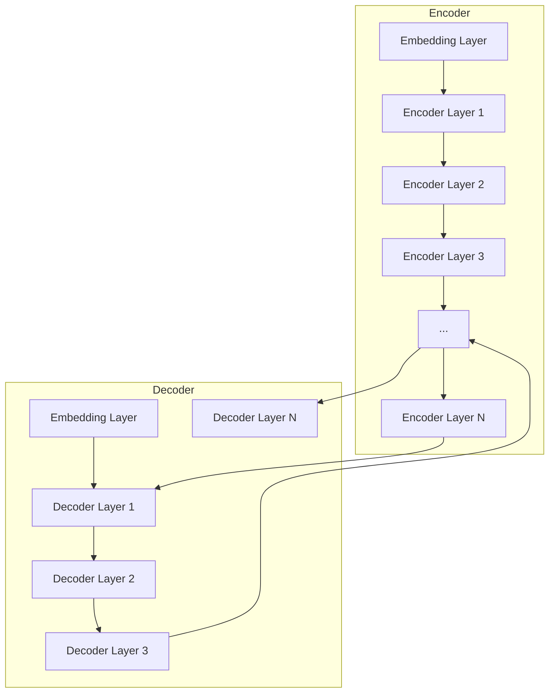

# 大语言模型原理与工程实践：大语言模型的关键技术

## 1. 背景介绍

### 1.1 大语言模型的崛起

近年来,大型语言模型(Large Language Models, LLMs)在自然语言处理(Natural Language Processing, NLP)领域取得了令人瞩目的成就。这种基于深度学习的语言模型通过在海量文本数据上进行预训练,学习了丰富的语言知识和上下文关系,从而在下游任务中展现出强大的泛化能力。

大语言模型的出现,标志着NLP领域进入了一个新的里程碑。传统的NLP系统通常依赖于手工设计的特征和规则,而大语言模型则能够自动从数据中学习语义和语法知识,极大地降低了人工干预的需求。这种数据驱动的范式为NLP系统带来了前所未有的灵活性和可扩展性。

### 1.2 大语言模型的影响

大语言模型的出现,不仅推动了NLP技术的飞速发展,也对其他领域产生了深远影响。以下是一些典型的应用场景:

- **自然语言理解与生成**: 大语言模型可用于文本摘要、机器翻译、问答系统、对话系统等任务,显著提高了自然语言理解和生成的质量。
- **多模态学习**: 通过预训练,大语言模型可以同时学习文本、图像、视频等多种模态的表示,为多模态任务提供了强大的支持。
- **知识推理**: 大语言模型能够从训练数据中获取丰富的知识,并在推理任务中展现出惊人的推理能力。
- **低资源场景**: 大语言模型可以通过少量的微调(fine-tuning)来适应新的任务和领域,为低资源场景提供了可行的解决方案。

然而,大语言模型也面临着一些挑战和局限性,例如需要海量计算资源、存在偏差和不确定性、缺乏可解释性等。因此,深入理解大语言模型的原理和工程实践,对于充分发挥其潜力并规避潜在风险至关重要。

## 2. 核心概念与联系

### 2.1 自然语言处理基础

在探讨大语言模型的核心概念之前,我们需要先了解一些自然语言处理的基础知识。

#### 2.1.1 文本表示

自然语言处理的核心任务之一是将文本转换为机器可理解的数值表示。常见的文本表示方法包括:

- **One-hot编码**: 将每个单词表示为一个高维稀疏向量,维度等于词汇表大小。
- **Word Embedding**: 将单词映射到低维密集向量空间,相似的单词具有相近的向量表示。
- **子词(Subword)表示**: 将单词分解为更小的子词单元(如字符或字节对),以缓解未登录词(Out-of-Vocabulary, OOV)问题。

#### 2.1.2 语言模型

语言模型是自然语言处理的基础,旨在学习语言的统计规律。给定一个文本序列$X=(x_1, x_2, \dots, x_n)$,语言模型的目标是估计该序列的概率$P(X)$。根据链式法则,我们可以将$P(X)$分解为:

$$P(X) = \prod_{i=1}^{n} P(x_i | x_1, \dots, x_{i-1})$$

其中,$ P(x_i | x_1, \dots, x_{i-1})$表示在给定前缀$x_1, \dots, x_{i-1}$的条件下,生成下一个词$x_i$的概率。

传统的语言模型通常基于n-gram统计或者最大熵模型,而现代的神经网络语言模型则能够通过深度学习的方式直接对上述条件概率进行建模。

#### 2.1.3 序列到序列模型

除了语言模型外,序列到序列(Sequence-to-Sequence, Seq2Seq)模型也是自然语言处理中一个重要的范式。Seq2Seq模型将一个输入序列$X$映射到一个输出序列$Y$,常用于机器翻译、文本摘要等任务。

典型的Seq2Seq模型由两部分组成:编码器(Encoder)和解码器(Decoder)。编码器将输入序列$X$编码为上下文向量$C$,解码器则根据$C$生成输出序列$Y$。注意,解码器本身也是一种语言模型,需要估计$P(Y|X)$或$P(Y|C)$。

### 2.2 transformer与自注意力机制

Transformer是一种全新的基于自注意力机制的序列模型,它在2017年被提出后,迅速成为自然语言处理领域的主流模型。相比于传统的基于RNN或CNN的序列模型,Transformer具有并行计算、长距离依赖捕获等优势,大大提升了模型的性能和训练效率。

#### 2.2.1 自注意力机制

自注意力机制是Transformer的核心,它允许模型在计算目标位置的表示时,直接关注整个输入序列中的所有位置。具体来说,给定一个查询向量$q$、键向量$k$和值向量$v$,自注意力机制通过计算查询和键之间的相似性分数,对值向量进行加权求和,得到目标位置的表示:

$$\text{Attention}(Q, K, V) = \text{softmax}(\frac{QK^T}{\sqrt{d_k}})V$$

其中,$d_k$是缩放因子,用于防止点积过大导致的梯度不稳定问题。

自注意力机制不仅可以应用于单个序列(如自编码器中),也可以扩展到不同的序列之间(如机器翻译任务中的编码器-解码器注意力)。

#### 2.2.2 多头注意力

为了捕获不同的子空间表示,Transformer引入了多头注意力(Multi-Head Attention)机制。多头注意力将查询、键和值分别线性投影到不同的子空间,并在每个子空间中并行计算注意力,最后将所有头的结果拼接起来:

$$\text{MultiHead}(Q, K, V) = \text{Concat}(\text{head}_1, \dots, \text{head}_h)W^O$$
$$\text{where, head}_i = \text{Attention}(QW_i^Q, KW_i^K, VW_i^V)$$

其中,$W_i^Q, W_i^K, W_i^V$分别是第$i$个头对应的线性投影矩阵,$W^O$是最终的线性变换。

### 2.3 transformer编码器与解码器

基于自注意力机制,Transformer的编码器和解码器都采用了类似的多层结构,每一层包含两个核心子层:多头自注意力子层和前馈网络子层。

#### 2.3.1 transformer编码器

编码器的输入是源序列$X=(x_1, x_2, \dots, x_n)$,输出是一系列的上下文向量表示$C=(c_1, c_2, \dots, c_n)$。编码器的计算过程如下:

1. 将输入序列$X$通过词嵌入层映射为词向量序列。
2. 在每一层中,先通过多头自注意力子层捕获序列内的长距离依赖关系,得到注意力表示。
3. 将注意力表示送入前馈网络子层,对每个位置的表示进行独立的非线性变换。
4. 对于每一层,在子层的输出上施加残差连接和层归一化,以缓解梯度消失/爆炸问题。
5. 重复2-4步骤,直到达到预设的编码器层数。

编码器的最终输出$C$将作为解码器的输入,用于生成目标序列。

#### 2.3.2 transformer解码器

解码器的输入是目标序列$Y=(y_1, y_2, \dots, y_m)$,以及编码器的输出$C$。解码器的计算过程类似于编码器,但有以下几点不同:

1. 除了编码器自注意力子层外,解码器还引入了掩码的编码器-解码器注意力子层,用于关注输入序列的不同位置。
2. 在自注意力子层中,解码器采用了"后续掩码"(Future Masking),确保每个位置的表示只能关注之前的位置,而不能关注之后的信息。
3. 解码器的输出是一系列条件概率分布,表示生成下一个词的概率。

通过上述机制,解码器可以自回归地生成目标序列,同时利用编码器的输出来获取输入序列的信息。

### 2.4 预训练与微调

大语言模型的关键在于预训练(Pre-training)和微调(Fine-tuning)范式。预训练旨在在大规模无监督数据上学习通用的语言表示,而微调则是在特定的下游任务上进行监督fine-tuning,将预训练模型的知识迁移到目标任务。

#### 2.4.1 预训练目标

常见的预训练目标包括:

- **掩码语言模型**(Masked Language Modeling, MLM):随机掩码部分输入词,并预测被掩码的词。
- **下一句预测**(Next Sentence Prediction, NSP):判断两个句子是否相邻。
- **自回归语言模型**(Autoregressive Language Modeling):基于前缀预测下一个词。
- **替换词预测**(Replaced Token Detection):判断一个词是否被替换。

通过这些预训练目标,大语言模型可以学习到丰富的语义和语法知识,为下游任务提供有力的基础表示。

#### 2.4.2 微调策略

在特定的下游任务上,我们可以对预训练模型进行微调,使其适应目标任务的数据分布和目标函数。常见的微调策略包括:

- **全模型微调**:对整个预训练模型(包括embedding层和transformer层)进行端到端的微调。
- **层级微调**:先微调transformer的高层,再逐步微调低层,以实现更好的迁移。
- **discriminative微调**:在预训练模型的输出上添加一个小的任务特定的头(head),只微调该头部分。

不同的微调策略在计算成本、性能和泛化能力之间存在权衡,需要根据具体任务和资源情况进行选择。

### 2.5 大语言模型的挑战

尽管大语言模型取得了卓越的成就,但它们也面临着一些挑战和局限性:

1. **计算资源需求**:训练大型语言模型需要海量的计算资源,包括GPU/TPU等加速硬件和大规模的数据中心基础设施。
2. **偏差和不确定性**:大语言模型可能会从训练数据中继承偏差,并在推理过程中产生不确定的输出。
3. **缺乏可解释性**:大语言模型是一种黑盒模型,难以解释其内部的决策过程和知识表示。
4. **安全和隐私风险**:大语言模型可能会生成有害或违法的内容,也可能泄露训练数据中的隐私信息。
5. **鲁棒性问题**:大语言模型对于对抗样本和噪声数据缺乏鲁棒性,容易受到攻击和误导。

因此,在部署和应用大语言模型时,我们需要采取适当的策略来缓解这些风险和挑战,确保模型的安全性、公平性和可解释性。

## 3. 核心算法原理具体操作步骤

在上一节中,我们介绍了大语言模型的核心概念和关键技术。在本节中,我们将深入探讨transformer模型的核心算法原理和具体操作步骤。

### 3.1 transformer模型架构

transformer模型由编码器(Encoder)和解码器(Decoder)两个主要部分组成,如下图所示:

编码器(Encoder)的主要任务是将输入序列(如源语言句子)编码为一系列向量表示,称为上下文向量(Context