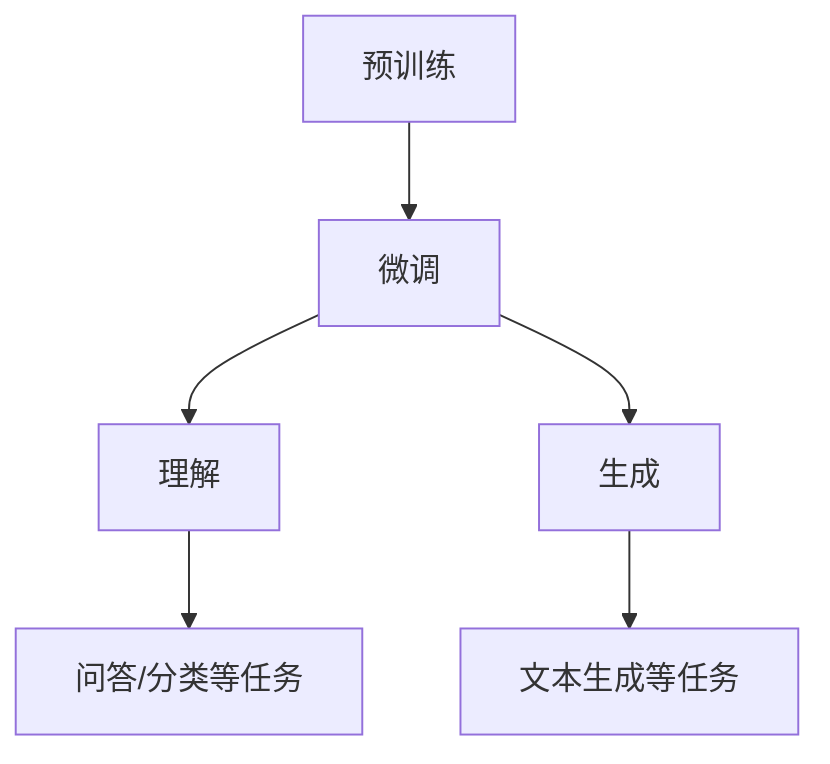

# 大语言模型原理与工程实践：大语言模型的评测

## 1. 背景介绍

### 1.1 大语言模型的兴起

近年来,大型语言模型(Large Language Models, LLMs)在自然语言处理(Natural Language Processing, NLP)领域掀起了一场革命。这些模型通过在海量文本数据上进行预训练,获得了强大的语言理解和生成能力,在诸多NLP任务上取得了突破性进展。

大语言模型的兴起可以追溯到2018年,当时谷歌发布了Transformer模型,展示了其在机器翻译等任务上的卓越表现。随后,OpenAI发布了GPT(Generative Pre-trained Transformer)模型,进一步推动了大语言模型的发展。

### 1.2 大语言模型的重要性

大语言模型在自然语言处理领域扮演着越来越重要的角色,原因如下:

1. **强大的语言理解和生成能力**:大语言模型通过预训练,获得了对自然语言的深刻理解,能够生成流畅、连贯的文本。
2. **通用性**:大语言模型具有很强的通用性,可以应用于多种NLP任务,如文本生成、机器翻译、问答系统等。
3. **高效学习**:大语言模型可以通过少量的任务特定数据进行微调(fine-tuning),快速适应新任务。
4. **商业价值**:大语言模型在智能助手、内容创作、客户服务等领域具有广阔的商业应用前景。

### 1.3 评测的重要性

随着大语言模型在学术界和工业界的广泛应用,对其性能的评测变得越来越重要。评测不仅能够衡量模型的实际能力,还能够揭示其优缺点,为进一步改进提供指导。此外,公平、客观的评测也有助于推动整个领域的健康发展。

## 2. 核心概念与联系

### 2.1 大语言模型的核心概念

#### 2.1.1 预训练(Pre-training)

预训练是大语言模型的核心概念之一。在预训练阶段,模型会在海量的文本数据上进行训练,目标是学习语言的一般性规律和知识。常见的预训练目标包括:

- **掩码语言模型(Masked Language Modeling, MLM)**: 模型需要预测被掩码的单词。
- **下一句预测(Next Sentence Prediction, NSP)**: 模型需要判断两个句子是否连贯。
- **因果语言模型(Causal Language Modeling, CLM)**: 模型需要预测下一个单词。

通过预训练,模型可以获得对语言的深刻理解,为后续的微调奠定基础。

#### 2.1.2 微调(Fine-tuning)

微调是将预训练模型应用于特定任务的过程。在微调阶段,模型会在任务相关的数据集上进行进一步训练,目标是使模型适应特定任务。微调通常只需要少量的数据和较少的训练时间,就能获得良好的性能。

#### 2.1.3 生成(Generation)

生成是大语言模型的核心能力之一。模型可以根据给定的提示(prompt)生成连贯、流畅的文本。生成过程通常采用自回归(auto-regressive)方式,即模型根据之前生成的内容,预测下一个单词或标记。

#### 2.1.4 理解(Understanding)

理解是大语言模型另一个核心能力。模型需要理解输入文本的语义,才能完成诸如问答、文本分类等任务。理解能力来源于预训练阶段对语言规律的学习,以及微调阶段对特定任务的适应。

### 2.2 核心概念之间的联系

上述核心概念相互关联,构成了大语言模型的基本框架:

1. 预训练为模型提供了对语言的一般性理解,奠定了后续微调和应用的基础。
2. 微调使模型适应特定任务,发挥出理解和生成的能力。
3. 理解能力使模型能够完成诸如问答、分类等任务。
4. 生成能力使模型能够产生连贯、流畅的文本输出。

这四个概念环环相扣,共同支撑了大语言模型的强大性能。

## 3. 核心算法原理具体操作步骤

### 3.1 预训练算法

大语言模型的预训练算法主要包括以下步骤:

1. **数据预处理**:将原始文本数据进行tokenization、数据清洗等预处理操作。
2. **构建数据集**:根据预训练目标(MLM、NSP或CLM),构建预训练数据集。
3. **模型初始化**:初始化模型参数,通常采用随机初始化或预训练权重初始化。
4. **前向传播**:将输入数据输入模型,计算预测结果。
5. **计算损失**:根据预训练目标,计算模型预测与真实标签之间的损失。
6. **反向传播**:计算损失对模型参数的梯度,并更新模型参数。
7. **迭代训练**:重复步骤4-6,直到模型收敛或达到预设的训练轮数。

以掩码语言模型(MLM)为例,具体操作步骤如下:

1. 随机选择输入序列中的15%的token进行掩码。
2. 将掩码后的序列输入模型,模型需要预测被掩码的token。
3. 计算模型预测与真实token之间的交叉熵损失。
4. 根据损失进行反向传播,更新模型参数。

### 3.2 微调算法

微调算法的步骤与预训练算法类似,但有以下不同之处:

1. **初始化**:使用预训练好的模型参数作为初始化参数。
2. **数据集**:使用任务相关的数据集进行微调。
3. **损失函数**:根据任务目标定义合适的损失函数,如交叉熵损失(分类任务)或序列生成损失(生成任务)。

以文本分类任务为例,微调算法步骤如下:

1. 将预训练模型作为初始化模型。
2. 准备文本分类数据集,包括输入文本和类别标签。
3. 将输入文本输入模型,获取模型输出的类别分布。
4. 计算模型预测与真实类别标签之间的交叉熵损失。
5. 根据损失进行反向传播,更新模型参数。
6. 重复步骤3-5,直到模型收敛或达到预设的训练轮数。

### 3.3 生成算法

生成算法用于让模型生成连贯、流畅的文本输出。常见的生成算法包括:

1. **贪婪搜索(Greedy Search)**:每次选择概率最大的token作为下一个token。
2. **束搜索(Beam Search)**:维护多个候选序列,每次选择概率最大的前K个token进行扩展。
3. **Top-k采样(Top-k Sampling)**:从概率最大的前K个token中随机采样一个token作为下一个token。
4. **Top-p采样(Top-p Sampling 或 Nucleus Sampling)**:从累积概率达到阈值p的token中随机采样一个token作为下一个token。

以Top-k采样为例,生成算法步骤如下:

1. 给定一个起始提示(prompt)。
2. 将提示输入模型,获取下一个token的概率分布。
3. 从概率最大的前K个token中随机采样一个token,将其添加到输出序列中。
4. 重复步骤2-3,直到达到预设的最大长度或生成结束标记。

生成算法通常会结合其他技术来提高输出质量,如:

- **温度(Temperature)**: 控制输出的多样性。
- **顶部对抗(Top-p Topping)**: 惩罚概率过高的token,增加多样性。
- **Beam Search与Top-k/Top-p采样相结合**: 结合探索和利用,平衡质量和多样性。

## 4. 数学模型和公式详细讲解举例说明

### 4.1 Transformer模型

Transformer是大语言模型的核心架构之一,其数学模型如下:

#### 4.1.1 输入表示

给定一个长度为$n$的输入序列$X = (x_1, x_2, \dots, x_n)$,其中$x_i$是第$i$个token的embedding向量。我们首先通过位置编码将位置信息编码到embedding中:

$$
z_i = x_i + \text{PositionEncoding}(i)
$$

其中$\text{PositionEncoding}(i)$是一个可学习的位置embedding向量。

#### 4.1.2 多头注意力机制

多头注意力机制是Transformer的核心组件,用于捕获输入序列中token之间的依赖关系。给定查询向量$Q$、键向量$K$和值向量$V$,注意力计算如下:

$$
\begin{aligned}
\text{Attention}(Q, K, V) &= \text{softmax}\left(\frac{QK^T}{\sqrt{d_k}}\right)V \\
\text{MultiHead}(Q, K, V) &= \text{Concat}(\text{head}_1, \dots, \text{head}_h)W^O\\
\text{where}\ \text{head}_i &= \text{Attention}(QW_i^Q, KW_i^K, VW_i^V)
\end{aligned}
$$

其中$d_k$是缩放因子,用于防止点积过大导致的梯度饱和;$W_i^Q, W_i^K, W_i^V, W^O$是可学习的线性变换参数。

多头注意力机制允许模型从不同的表示子空间捕获不同的依赖关系,提高了模型的表达能力。

#### 4.1.3 前馈网络

前馈网络是Transformer的另一个核心组件,用于对每个位置的表示进行非线性变换:

$$
\text{FFN}(x) = \max(0, xW_1 + b_1)W_2 + b_2
$$

其中$W_1, W_2, b_1, b_2$是可学习的参数。

#### 4.1.4 编码器和解码器

Transformer由编码器(Encoder)和解码器(Decoder)两部分组成。编码器是由多个相同的层堆叠而成,每一层包含一个多头注意力子层和一个前馈网络子层。解码器除了包含与编码器相同的子层外,还包含一个额外的注意力子层,用于捕获输出序列中token之间的依赖关系。

编码器和解码器的计算过程如下:

$$
\begin{aligned}
&\text{Encoder}:&&\\
&z_0 &=& X\\
&z_i &=& \text{EncoderLayer}(z_{i-1})&&\text{for}\ i = 1, \dots, N\\
&\text{EncoderOutput} &=& z_N&&\\
&\text{Decoder}:&&\\
&y_0 &=& Y\\
&y_i &=& \text{DecoderLayer}(y_{i-1}, \text{EncoderOutput})&&\text{for}\ i = 1, \dots, M\\
&\text{DecoderOutput} &=& y_M
\end{aligned}
$$

其中$X$和$Y$分别是输入序列和输出序列的embedding表示,包含位置编码;$N$和$M$分别是编码器和解码器的层数。

通过上述计算,Transformer能够学习到输入序列和输出序列之间的映射关系,从而完成诸如机器翻译、文本生成等任务。

### 4.2 生成算法的数学模型

#### 4.2.1 贪婪搜索

贪婪搜索的数学模型如下:

$$
y_t = \arg\max_{y'} P(y'|y_{<t}, X)
$$

其中$y_t$是时间步$t$的输出token,$y_{<t}$是之前生成的token序列,$X$是输入序列。贪婪搜索每次选择概率最大的token作为下一个token。

#### 4.2.2 束搜索

束搜索的数学模型如下:

$$
\begin{aligned}
\text{Candidates} &= \text{TopK}(P(y'|y_{<t}, X), K)\\
\text{Beams} &= \text{ExtendBeams}(\text{Beams}, \text{Candidates})\\
\text{Beams} &= \text{PruneBeams}(\text{Beams}, K)
\end{aligned}
$$

其中$\text{TopK}(P, K)$返回概率最大的前$K$个token,$\text{ExtendBeams}$将每个候选token添加到每个beam的末尾,形成新的