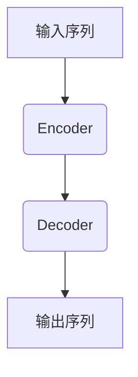
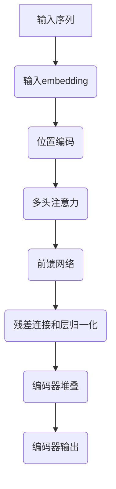
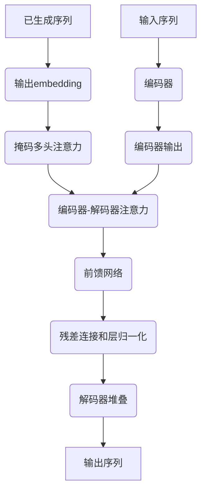

# 大语言模型原理与工程实践：局限和发展

## 1.背景介绍

### 1.1 大语言模型的兴起

近年来,大型语言模型(Large Language Models, LLMs)在自然语言处理(NLP)领域取得了巨大的突破,引起了广泛关注。LLMs是一种基于深度学习的语言模型,通过在大规模文本语料库上进行预训练,学习语言的统计规律和语义信息,从而获得强大的语言理解和生成能力。

代表性的LLMs包括GPT(Generative Pre-trained Transformer)系列模型、BERT(Bidirectional Encoder Representations from Transformers)、XLNet、RoBERTa等。这些模型在各种NLP任务中表现出色,如机器翻译、文本摘要、问答系统、语言生成等,极大推动了NLP技术的发展。

### 1.2 LLMs的关键特征

LLMs的核心特征包括:

1. **大规模参数**:LLMs通常包含数十亿甚至上百亿个参数,这使得它们能够捕捉复杂的语言模式和语义信息。

2. **自回归(Auto-regressive)架构**:LLMs采用自回归架构,每个时间步预测下一个词,从而实现语言生成。

3. **transformer结构**:transformer结构使用注意力机制,能够有效地捕捉长距离依赖关系,提高模型性能。

4. **大规模预训练**:在海量文本数据上进行预训练,使模型学习到丰富的语言知识。

5. **迁移学习**:预训练的LLMs可以通过微调(fine-tuning)等方法,迁移到各种下游NLP任务中。

### 1.3 LLMs的影响

LLMs的出现极大推动了NLP技术的发展,为各种语言相关应用带来了新的机遇。然而,LLMs也面临一些挑战和局限性,如计算资源需求巨大、对抗性样本易导致错误输出、缺乏鲁棒性等。本文将深入探讨LLMs的核心原理、工程实践,以及未来的发展趋势和挑战。

## 2.核心概念与联系 

### 2.1 transformer架构

Transformer是LLMs的核心架构,由编码器(Encoder)和解码器(Decoder)组成。编码器将输入序列映射为上下文表示,解码器则基于编码器的输出和自身的输出生成目标序列。

编码器和解码器均采用多头注意力机制(Multi-Head Attention)和前馈神经网络(Feed-Forward Neural Network)构建,通过残差连接(Residual Connection)和层归一化(Layer Normalization)提高模型性能。

### 2.2 注意力机制

注意力机制是transformer的核心,能够捕捉输入序列中任意两个位置之间的依赖关系,解决了RNN等序列模型难以捕捉长距离依赖的问题。

scaled dot-product attention:

$$\mathrm{Attention}(Q, K, V) = \mathrm{softmax}(\frac{QK^T}{\sqrt{d_k}})V$$

其中 $Q$ 为查询(Query)、$K$ 为键(Key)、$V$ 为值(Value),$d_k$ 为缩放因子。

多头注意力机制将注意力分成多个子空间,捕捉不同的依赖关系,最后将多头注意力的结果拼接:

$$\mathrm{MultiHead}(Q, K, V) = \mathrm{Concat}(head_1, ..., head_h)W^O$$
$$\text{where } head_i = \mathrm{Attention}(QW_i^Q, KW_i^K, VW_i^V)$$

### 2.3 自回归语言模型

自回归语言模型是LLMs的核心,基于给定的上文 $x_1,...,x_{t-1}$ 预测下一个词 $x_t$ 的概率分布:

$$P(x_t|x_1,...,x_{t-1}) = \mathrm{softmax}(h_tW+b)$$

其中 $h_t$ 为transformer解码器在时间步 $t$ 的隐状态向量。通过最大化训练语料库的似然函数,模型可以学习到语言的统计规律。

### 2.4 迁移学习

预训练的LLMs可以通过迁移学习(Transfer Learning)的方式,将在大规模语料库上学习到的知识迁移到下游NLP任务中。常见的迁移学习方法包括:

1. **微调(Fine-tuning)**:在目标任务的数据上继续训练预训练模型,调整模型参数以适应新任务。

2. **prompt学习(Prompt Learning)**:通过设计合适的提示词(Prompt),指导预训练模型完成特定的任务。

3. **prompt tuning**:在保持预训练模型参数不变的情况下,只微调prompt embedding,降低计算代价。

## 3.核心算法原理具体操作步骤

### 3.1 transformer编码器

transformer编码器的核心步骤如下:

1. **输入embedding**:将输入序列的每个词映射为embedding向量。

2. **位置编码**:为每个位置添加位置信息,捕捉序列的位置依赖关系。

3. **多头注意力**:计算输入序列中每个位置与其他位置的注意力权重,捕捉长距离依赖关系。

4. **前馈网络**:对注意力输出进行非线性变换,提取更高级的特征表示。

5. **残差连接和层归一化**:通过残差连接和层归一化,提高模型性能和训练稳定性。

6. **编码器堆叠**:将上述操作重复堆叠多层,提取更抽象的特征表示。

### 3.2 transformer解码器

transformer解码器在编码器的基础上,引入了掩码多头注意力(Masked Multi-Head Attention)和编码器-解码器注意力(Encoder-Decoder Attention)机制,用于生成目标序列。具体步骤如下:

1. **输出embedding**:将已生成的序列映射为embedding向量。

2. **掩码多头注意力**:计算当前位置与之前位置的注意力权重,避免attending未来位置的信息。

3. **编码器-解码器注意力**:计算当前位置与编码器输出的注意力权重,融合编码器的上下文信息。

4. **前馈网络**:对注意力输出进行非线性变换,提取更高级的特征表示。

5. **残差连接和层归一化**:提高模型性能和训练稳定性。

6. **解码器堆叠**:将上述操作重复堆叠多层,生成最终的输出序列。

### 3.3 自回归语言模型训练

自回归语言模型的训练过程如下:

1. **数据预处理**:将训练语料库切分为序列,构建输入和目标序列对。

2. **前向传播**:将输入序列输入transformer解码器,生成预测的概率分布。

3. **计算损失**:将预测的概率分布与真实的目标序列计算交叉熵损失。

4. **反向传播**:计算损失对模型参数的梯度,并使用优化器(如Adam)更新模型参数。

5. **迭代训练**:重复上述步骤,直到模型收敛或达到预设的训练轮次。

通过最大化训练语料库的似然函数,模型可以学习到语言的统计规律和语义信息,从而获得强大的语言生成能力。

## 4.数学模型和公式详细讲解举例说明

### 4.1 transformer中的注意力机制

注意力机制是transformer的核心,能够捕捉输入序列中任意两个位置之间的依赖关系。以scaled dot-product attention为例:

$$\mathrm{Attention}(Q, K, V) = \mathrm{softmax}(\frac{QK^T}{\sqrt{d_k}})V$$

其中:

- $Q\in\mathbb{R}^{n\times d_k}$为查询(Query)矩阵,每一行对应一个查询向量。
- $K\in\mathbb{R}^{m\times d_k}$为键(Key)矩阵,每一行对应一个键向量。
- $V\in\mathbb{R}^{m\times d_v}$为值(Value)矩阵,每一行对应一个值向量。
- $d_k$为缩放因子,用于防止内积过大导致softmax函数的梯度较小。

计算过程如下:

1. 计算查询和键的点积: $QK^T\in\mathbb{R}^{n\times m}$,得到注意力分数矩阵。
2. 对注意力分数矩阵进行缩放: $\frac{QK^T}{\sqrt{d_k}}$,防止梯度过小。
3. 对缩放后的注意力分数矩阵执行softmax操作,得到注意力权重矩阵。
4. 将注意力权重矩阵与值矩阵相乘: $\mathrm{softmax}(\frac{QK^T}{\sqrt{d_k}})V$,得到加权后的值向量。

通过注意力机制,transformer可以自适应地为每个查询向量分配注意力权重,捕捉输入序列中不同位置之间的依赖关系。

### 4.2 transformer中的多头注意力机制

为了捕捉不同的依赖关系,transformer采用了多头注意力机制。多头注意力机制将注意力分成多个子空间,每个子空间关注不同的依赖关系,最后将多个子空间的注意力结果拼接起来。具体计算过程如下:

$$\mathrm{MultiHead}(Q, K, V) = \mathrm{Concat}(head_1, ..., head_h)W^O$$
$$\text{where } head_i = \mathrm{Attention}(QW_i^Q, KW_i^K, VW_i^V)$$

其中:

- $h$为头数,通常设置为8或16。
- $W_i^Q\in\mathbb{R}^{d_\text{model}\times d_k}$、$W_i^K\in\mathbb{R}^{d_\text{model}\times d_k}$、$W_i^V\in\mathbb{R}^{d_\text{model}\times d_v}$为可学习的线性投影矩阵,用于将查询、键和值映射到不同的子空间。
- $W^O\in\mathbb{R}^{hd_v\times d_\text{model}}$为可学习的线性投影矩阵,用于将多头注意力的输出拼接后映射回模型维度$d_\text{model}$。

通过多头注意力机制,transformer可以同时关注不同的依赖关系,提高模型的表示能力。

### 4.3 自回归语言模型的目标函数

自回归语言模型的目标是最大化训练语料库的似然函数,即最大化模型预测正确序列的概率。对于一个长度为$T$的序列$\mathbf{x}=(x_1, x_2, ..., x_T)$,其似然函数可以表示为:

$$\mathcal{L}(\theta) = \log P_\theta(\mathbf{x}) = \sum_{t=1}^T \log P_\theta(x_t|x_1, ..., x_{t-1})$$

其中$\theta$为模型参数,$P_\theta(x_t|x_1, ..., x_{t-1})$为模型在给定上文$x_1, ..., x_{t-1}$的条件下,预测下一个词$x_t$的概率。

通常采用交叉熵损失函数来最大化似然函数,即最小化负对数似然:

$$\mathcal{J}(\theta) = -\frac{1}{T}\sum_{t=1}^T \log P_\theta(x_t|x_1, ..., x_{t-1})$$

在训练过程中,通过反向传播算法计算损失函数对模型参数$\theta$的梯度,并使用优化器(如Adam)更新模型参数,从而最小化损失函数,提高模型在训练语料库上的似然概率。

## 5.项目实践:代码实