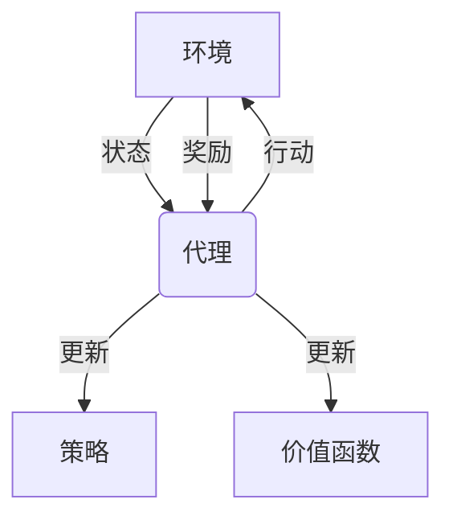
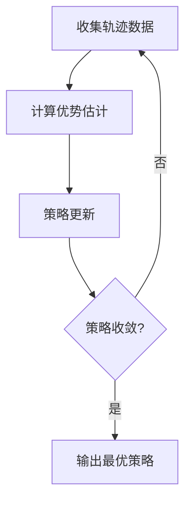

# 大语言模型原理与工程实践：强化学习基础

## 1. 背景介绍

### 1.1 大语言模型的兴起

近年来,大型语言模型(Large Language Models, LLMs)在自然语言处理(NLP)领域掀起了一场革命。这些模型通过在海量文本数据上进行预训练,学习了丰富的语言知识和上下文信息,展现出惊人的语言生成和理解能力。

代表性的大语言模型包括 GPT-3、PaLM、ChatGPT 等,它们能够生成看似人类水平的自然语言文本,在机器翻译、问答系统、文本摘要等多个 NLP 任务上取得了卓越的表现。

### 1.2 强化学习在大语言模型中的作用

尽管大语言模型在生成高质量文本方面表现出色,但它们存在一些固有缺陷,如缺乏持续的交互能力、容易产生不一致和有害的输出等。为了解决这些问题,研究人员开始探索将强化学习(Reinforcement Learning, RL)与大语言模型相结合的方法。

强化学习是一种基于环境交互的机器学习范式,旨在通过试错和反馈来学习最优策略。将其应用于大语言模型,可以使模型在与人类的对话交互中不断优化和调整策略,从而提高输出的一致性、安全性和有用性。

## 2. 核心概念与联系

### 2.1 强化学习基本概念

强化学习系统由以下几个核心组件构成:

- **环境(Environment)**: 代理与之交互的外部世界。
- **状态(State)**: 环境的当前状况。
- **奖励(Reward)**: 环境对代理行为的反馈,用于指导代理学习。
- **策略(Policy)**: 代理在给定状态下采取行动的规则。
- **价值函数(Value Function)**: 评估状态或状态-行动对的预期累积奖励。

强化学习的目标是通过与环境的持续交互,学习一个最优策略,使得代理在未来能够获得最大的累积奖励。



### 2.2 与大语言模型的结合

将强化学习应用于大语言模型时,可以将对话视为一个环境,语言模型作为代理与之交互。每一次对话回合,模型会根据当前对话状态生成一个回复,环境(即人类用户)会对该回复给出反馈(奖励或惩罚)。通过不断优化策略,模型可以学习生成更加合适、一致和安全的回复。

此外,强化学习还可以帮助语言模型获得一些人类偏好的隐式知识,如风格、语气等,从而生成更加自然、人性化的语言。

## 3. 核心算法原理具体操作步骤

### 3.1 强化学习算法概述

强化学习算法可分为三大类:

1. **基于价值的方法**: 通过估计状态或状态-行动对的价值函数,从而得到最优策略。代表算法包括 Q-Learning、Sarsa 等。

2. **基于策略的方法**: 直接对策略进行参数化,通过策略梯度等优化方法来学习最优策略。代表算法包括 REINFORCE、PPO 等。

3. **基于模型的方法**: 首先学习环境的转移模型和奖励模型,然后基于模型进行规划和控制。代表算法包括 Dyna、AlphaZero 等。

在将强化学习应用于大语言模型时,基于策略的方法由于其简单性和高效性而受到广泛关注。

### 3.2 PPO 算法

PPO(Proximal Policy Optimization)是一种常用的基于策略的强化学习算法,它通过约束新旧策略之间的差异,在保证稳定性的同时实现了高效的策略优化。PPO 算法的核心步骤如下:

1. **收集轨迹数据**: 使用当前策略与环境交互,收集一批状态-行动-奖励的轨迹数据。

2. **计算优势估计**: 对于每个状态-行动对,计算其优势估计值(Advantage Estimation),即相对于当前策略的期望奖励的偏差。

3. **策略更新**: 使用收集到的数据,通过最大化以下目标函数来更新策略参数:

   $$J_\theta(\pi_\theta) = \mathbb{E}_t[\min(r_t(\theta)\hat{A}_t, \text{clip}(r_t(\theta), 1-\epsilon, 1+\epsilon)\hat{A}_t)]$$

   其中 $r_t(\theta)$ 是新旧策略的比值,用于约束策略更新的幅度;$\hat{A}_t$ 是优势估计值;$\epsilon$ 是一个超参数,控制策略更新的剪裁范围。

4. **重复迭代**: 重复执行上述步骤,直至策略收敛。



通过 PPO 算法,语言模型可以逐步优化其生成策略,使得生成的回复更加符合人类偏好和期望。

## 4. 数学模型和公式详细讲解举例说明

在强化学习中,价值函数和策略梯度是两个重要的数学概念,对于理解和实现算法至关重要。

### 4.1 价值函数

价值函数用于评估状态或状态-行动对的预期累积奖励,是强化学习中的核心概念之一。

对于任意策略 $\pi$,状态 $s$ 的价值函数 $V^\pi(s)$ 定义为:

$$V^\pi(s) = \mathbb{E}_\pi\left[\sum_{t=0}^\infty \gamma^t r_{t+1} | s_0 = s\right]$$

其中 $r_t$ 是时间步 $t$ 的即时奖励,$\gamma \in [0, 1]$ 是折现因子,用于权衡当前和未来奖励的重要性。

类似地,状态-行动对 $(s, a)$ 的价值函数 $Q^\pi(s, a)$ 定义为:

$$Q^\pi(s, a) = \mathbb{E}_\pi\left[\sum_{t=0}^\infty \gamma^t r_{t+1} | s_0 = s, a_0 = a\right]$$

通过估计价值函数,我们可以评估当前策略的好坏,并据此优化策略。

### 4.2 策略梯度

策略梯度是一种直接对策略进行优化的方法。对于参数化的策略 $\pi_\theta(a|s)$,我们希望最大化其期望回报:

$$J(\theta) = \mathbb{E}_{\pi_\theta}\left[\sum_{t=0}^\infty \gamma^t r_t\right]$$

根据策略梯度定理,我们可以计算目标函数 $J(\theta)$ 关于策略参数 $\theta$ 的梯度:

$$\nabla_\theta J(\theta) = \mathbb{E}_{\pi_\theta}\left[\sum_{t=0}^\infty \nabla_\theta \log \pi_\theta(a_t|s_t)Q^{\pi_\theta}(s_t, a_t)\right]$$

通过梯度上升法,我们可以不断更新策略参数 $\theta$,使期望回报最大化。

### 4.3 实例说明

考虑一个简单的网格世界环境,其中代理需要从起点移动到终点。每一步移动都会获得一个小的负奖励,到达终点则获得大的正奖励。我们希望通过强化学习,让代理学习到一个最优策略,能够找到从起点到终点的最短路径。

假设代理的策略由一个神经网络参数化,输入为当前状态,输出为每个可能动作的概率分布。我们可以使用 PPO 算法来优化该策略:

1. 收集一批轨迹数据,包括状态、动作和奖励。
2. 对于每个状态-动作对,计算其优势估计值,即相对于当前策略的期望奖励的偏差。
3. 使用 PPO 目标函数更新策略参数:

   $$J_\theta(\pi_\theta) = \mathbb{E}_t\left[\min\left(r_t(\theta)\hat{A}_t, \text{clip}\left(r_t(\theta), 1-\epsilon, 1+\epsilon\right)\hat{A}_t\right)\right]$$

   其中 $r_t(\theta) = \frac{\pi_\theta(a_t|s_t)}{\pi_{\text{old}}(a_t|s_t)}$ 是新旧策略的比值,$\hat{A}_t$ 是优势估计值,$\epsilon$ 是一个超参数,用于控制策略更新的剪裁范围。

4. 重复上述步骤,直至策略收敛。

通过不断优化,代理最终会学习到一个最优策略,能够有效地从起点到达终点。

## 5. 项目实践: 代码实例和详细解释说明

以下是一个使用 PyTorch 和 Stable Baselines3 库实现 PPO 算法的简单示例,用于解决 CartPole 环境(一个经典的控制问题,需要通过移动推车来保持杆子直立)。

### 5.1 导入必要的库

```python
import gym
import numpy as np
from stable_baselines3 import PPO
from stable_baselines3.common.env_util import make_vec_env
```

### 5.2 创建环境

```python
env = make_vec_env("CartPole-v1", n_envs=1)
```

### 5.3 定义模型

```python
model = PPO("MlpPolicy", env, verbose=1)
```

这里我们使用 `MlpPolicy`,即一个多层感知机策略网络。

### 5.4 训练模型

```python
model.learn(total_timesteps=100000)
```

我们将模型训练 100,000 个时间步,期间模型会不断与环境交互并优化策略。

### 5.5 评估模型

```python
obs = env.reset()
for i in range(1000):
    action, _states = model.predict(obs)
    obs, rewards, dones, info = env.step(action)
    env.render()
    if dones:
        break
```

我们将训练好的模型在环境中运行 1000 个时间步,观察其表现。

### 5.6 代码解释

- `make_vec_env` 函数用于创建一个向量化的环境,以提高训练效率。
- `PPO` 是 Stable Baselines3 库中实现的 PPO 算法。
- `model.learn` 函数用于训练模型,其中 `total_timesteps` 参数指定了训练的总时间步数。
- `model.predict` 函数用于让模型根据当前观测值预测动作。
- `env.step` 函数用于让环境执行指定的动作,并返回下一个状态、奖励等信息。
- `env.render` 函数用于渲染环境的可视化效果。

通过这个简单的示例,我们可以看到如何使用 PyTorch 和 Stable Baselines3 库实现 PPO 算法,并将其应用于强化学习环境中。在实际项目中,我们可以将这种方法扩展到更复杂的环境和任务,如大语言模型的对话生成等。

## 6. 实际应用场景

### 6.1 对话系统优化

将强化学习应用于大语言模型最直接的场景就是对话系统优化。传统的基于规则或检索的对话系统存在一些固有缺陷,如缺乏上下文理解能力、回复缺乏连贯性等。通过将对话视为一个强化学习环境,语言模型可以根据人类用户的反馈不断优化其生成策略,从而提高对话质量和用户体验。

例如,在客服对话系统中,我们可以根据用户对系统回复的满意度作为奖励信号,引导语言模型生成更加贴切、友好的回复。在教育对话系统中,我们可以根据学生对知识点的掌握程度作为奖励信号,引导语言模型生成更加清晰、易懂的解释。

### 6.2 内容生成优化

除了对话系统,强化学习还可以应用于其他自然语言生成任务,如文本摘要、机器翻译、故事创作等。通过设计合理的奖励函数,我们可以引导语言模型生成更加符合特定目标和偏好的内容。

例如,在文本摘要任务中,我们可以根据摘要的信息完整性、连贯性等指标设计