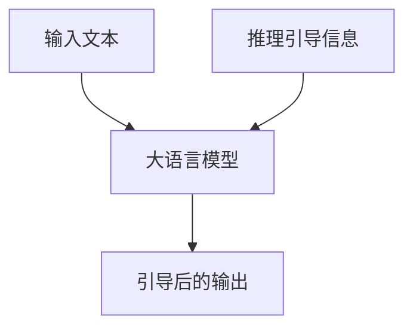

# 大语言模型原理与工程实践：推理引导

## 1. 背景介绍
### 1.1 大语言模型的发展历程
#### 1.1.1 早期的语言模型
#### 1.1.2 神经网络语言模型的崛起
#### 1.1.3 Transformer时代的来临
### 1.2 大语言模型的应用现状
#### 1.2.1 自然语言处理领域的应用
#### 1.2.2 知识图谱构建与问答系统
#### 1.2.3 智能对话与文本生成
### 1.3 推理引导技术的提出
#### 1.3.1 传统方法的局限性
#### 1.3.2 推理引导的核心思想
#### 1.3.3 推理引导在大语言模型中的意义

## 2. 核心概念与联系
### 2.1 大语言模型
#### 2.1.1 定义与特点
#### 2.1.2 训练数据与预处理
#### 2.1.3 模型架构与优化目标
### 2.2 推理引导
#### 2.2.1 推理的定义与分类
#### 2.2.2 引导的概念与作用
#### 2.2.3 推理引导的形式化表示
### 2.3 推理引导与大语言模型的结合
#### 2.3.1 推理引导在大语言模型中的应用
#### 2.3.2 推理引导对大语言模型性能的影响
#### 2.3.3 推理引导与大语言模型的互补关系

## 3. 核心算法原理具体操作步骤
### 3.1 基于推理引导的大语言模型训练
#### 3.1.1 数据准备与预处理
#### 3.1.2 模型初始化与参数设置
#### 3.1.3 引入推理引导信息
#### 3.1.4 模型训练与优化
### 3.2 基于推理引导的大语言模型推断
#### 3.2.1 输入序列的构建
#### 3.2.2 推理引导信息的生成
#### 3.2.3 解码策略与结果生成
### 3.3 推理引导的优化技巧
#### 3.3.1 引导信息的选择与过滤
#### 3.3.2 引导信息的动态调整
#### 3.3.3 多任务学习与迁移学习

## 4. 数学模型和公式详细讲解举例说明
### 4.1 语言模型的数学表示
#### 4.1.1 概率语言模型
#### 4.1.2 神经网络语言模型
#### 4.1.3 Transformer语言模型
### 4.2 推理引导的数学表示
#### 4.2.1 推理规则的形式化定义
#### 4.2.2 推理过程的数学建模
#### 4.2.3 推理引导的目标函数
### 4.3 推理引导在大语言模型中的数学实现
#### 4.3.1 引导信息的向量化表示
#### 4.3.2 引导信息与语言模型的融合
#### 4.3.3 推理引导的损失函数设计

## 5. 项目实践：代码实例和详细解释说明
### 5.1 数据准备与预处理
#### 5.1.1 数据集的选择与下载
#### 5.1.2 数据清洗与格式转换
#### 5.1.3 数据增强与特征提取
### 5.2 模型构建与训练
#### 5.2.1 模型结构的定义与实现
#### 5.2.2 模型超参数的设置与调优
#### 5.2.3 模型训练与验证
### 5.3 推理引导的实现
#### 5.3.1 引导信息的生成与表示
#### 5.3.2 引导信息与模型的融合
#### 5.3.3 推理过程的控制与优化
### 5.4 模型评估与结果分析
#### 5.4.1 评估指标的选择与计算
#### 5.4.2 不同模型的性能对比
#### 5.4.3 推理引导的效果分析

## 6. 实际应用场景
### 6.1 智能问答系统
#### 6.1.1 场景描述与需求分析
#### 6.1.2 基于推理引导的问答模型构建
#### 6.1.3 系统部署与性能评估
### 6.2 文本生成与创作
#### 6.2.1 场景描述与需求分析
#### 6.2.2 基于推理引导的文本生成模型构建
#### 6.2.3 生成结果的评估与优化
### 6.3 知识图谱构建
#### 6.3.1 场景描述与需求分析
#### 6.3.2 基于推理引导的知识抽取与融合
#### 6.3.3 知识图谱的构建与应用

## 7. 工具和资源推荐
### 7.1 开源工具包
#### 7.1.1 TensorFlow
#### 7.1.2 PyTorch
#### 7.1.3 Hugging Face Transformers
### 7.2 预训练模型
#### 7.2.1 BERT
#### 7.2.2 GPT系列
#### 7.2.3 T5
### 7.3 数据集资源
#### 7.3.1 Wikipedia
#### 7.3.2 Common Crawl
#### 7.3.3 BookCorpus

## 8. 总结：未来发展趋势与挑战
### 8.1 大语言模型的发展趋势
#### 8.1.1 模型规模的持续增长
#### 8.1.2 多模态融合与跨领域应用
#### 8.1.3 个性化与领域适应
### 8.2 推理引导技术的发展方向
#### 8.2.1 引导信息的自动生成
#### 8.2.2 推理过程的可解释性
#### 8.2.3 推理引导与知识融合
### 8.3 面临的挑战与机遇
#### 8.3.1 计算资源与训练效率
#### 8.3.2 数据隐私与安全
#### 8.3.3 模型的泛化能力与鲁棒性

## 9. 附录：常见问题与解答
### 9.1 大语言模型的训练需要多少计算资源？
### 9.2 推理引导技术适用于哪些任务场景？
### 9.3 如何选择合适的预训练模型进行微调？
### 9.4 推理引导对模型推断速度有何影响？
### 9.5 如何平衡推理引导与语言模型的权重？

大语言模型（Large Language Model，LLM）是近年来自然语言处理领域的重要突破。它们通过在海量文本数据上进行预训练，学习到丰富的语言知识和生成能力，在各类自然语言理解与生成任务上取得了显著的性能提升。然而，大语言模型在推理与决策方面仍然存在局限性，难以充分利用外部知识与规则进行推理。为了解决这一问题，推理引导（Inference Guiding）技术应运而生。

推理引导的核心思想是在大语言模型的基础上，引入额外的推理知识与规则，指导模型进行更加准确、合理的推理。通过将显式的推理引导信息融入到语言模型中，可以增强模型的逻辑推理能力，提高生成结果的可靠性与一致性。推理引导信息可以来自人工构建的知识库、逻辑规则或领域先验知识等。

下图展示了推理引导与大语言模型结合的整体架构：

在该架构中，输入文本首先经过大语言模型的编码与表示学习，得到语义丰富的向量表示。同时，推理引导信息也被编码为向量形式，与语言模型的表示进行融合。融合后的表示既包含了输入文本的语义信息，又蕴含了推理引导的知识与规则。最后，模型根据融合后的表示生成引导后的输出结果。

推理引导在大语言模型中的应用可以分为两个阶段：训练阶段和推断阶段。在训练阶段，我们需要准备好训练数据和对应的推理引导信息。通过在目标函数中引入推理引导相关的损失项，使模型学习如何利用引导信息进行推理。在推断阶段，给定输入文本和相应的推理引导信息，模型可以生成符合引导逻辑的输出结果。

推理引导技术的引入为大语言模型赋予了更强的推理与决策能力，使其能够更好地理解和生成符合人类逻辑的文本。在智能问答、文本生成、知识图谱构建等场景中，推理引导都发挥着重要作用。例如，在智能问答系统中，推理引导可以帮助模型根据问题的逻辑关系与领域知识，生成更加准确、完整的答案。在文本生成与创作领域，推理引导可以为生成过程提供合理的逻辑框架，使生成的文本更加连贯、合理。

尽管推理引导技术取得了可喜的进展，但仍然面临着诸多挑战。其中，如何自动生成高质量的推理引导信息是一个关键问题。目前主要依赖人工构建或半自动生成的方式，存在成本高、覆盖不足等限制。未来需要探索更加智能化、自动化的引导信息生成方法。此外，推理过程的可解释性也是一大挑战。我们不仅要让模型生成符合引导逻辑的结果，还需要了解其内部的推理过程与依据。这对于提高模型的可信度与应用价值至关重要。

总之，大语言模型与推理引导技术的结合为自然语言处理领域带来了新的突破口。通过引入显式的推理知识与规则，我们可以赋予语言模型更强大的推理与决策能力，使其能够更好地理解和生成符合人类逻辑的文本。未来，随着大语言模型的不断发展和推理引导技术的日益成熟，我们有望构建出更加智能、高效、可靠的自然语言处理系统，为人机交互、知识挖掘、智能决策等领域带来革命性的变革。

作者：禅与计算机程序设计艺术 / Zen and the Art of Computer Programming