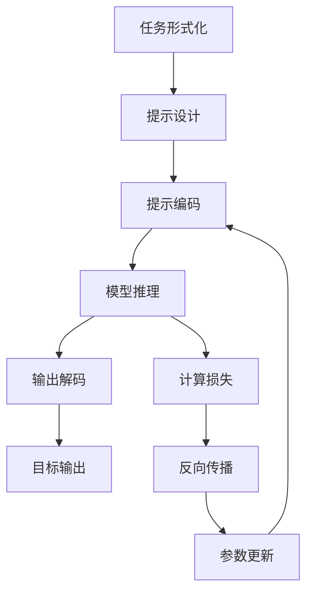

# 大语言模型原理与工程实践：提示微调

## 1.背景介绍

### 1.1 大语言模型的兴起

近年来,大型语言模型(Large Language Models, LLMs)在自然语言处理(NLP)领域掀起了一股热潮。这些模型通过在大量文本数据上进行预训练,学习了丰富的语言知识和上下文信息,展现出令人惊叹的语言生成能力。

代表性的大语言模型包括GPT-3、BERT、T5等,它们在各种NLP任务上取得了卓越的表现,如文本生成、机器翻译、问答系统等。这些模型的出现,标志着NLP领域迈入了一个新的里程碑。

### 1.2 提示微调的兴起

尽管大语言模型表现出色,但直接将它们应用于特定任务时,仍然存在一些挑战。例如,模型在特定领域的数据上可能表现不佳,或者需要对模型进行微调以适应特定任务。

为了解决这些问题,提示微调(Prompt Tuning)技术应运而生。提示微调是一种新颖的微调方法,它通过设计合适的提示(Prompt),引导大语言模型生成所需的输出,从而避免了对整个模型进行昂贵的微调。

提示微调技术的核心思想是,通过精心设计的提示,将任务转化为大语言模型在预训练过程中遇到过的形式,从而利用模型已有的知识来完成任务。这种方法不仅高效,而且可以避免过拟合,同时保留了模型在预训练阶段学习到的有价值的知识。

### 1.3 本文概述

本文将深入探讨大语言模型和提示微调的原理与实践。我们将从提示微调的基本概念出发,介绍其核心算法和数学模型,并通过实例代码详细说明其实现细节。此外,我们还将分享提示微调在各种实际应用场景中的应用,以及相关工具和资源。最后,我们将总结提示微调的发展趋势和未来挑战。

通过本文,读者将全面了解提示微调的理论基础和实践技巧,为将这一前沿技术应用于实际项目做好充分准备。

## 2.核心概念与联系

### 2.1 大语言模型

大语言模型是一种基于自然语言的深度学习模型,通过在大量文本数据上进行预训练,学习丰富的语言知识和上下文信息。这些模型通常采用自回归(Autoregressive)结构,即根据前面的词预测下一个词,从而生成连贯的文本。

常见的大语言模型架构包括:

- **Transformer**:由多个编码器和解码器堆叠而成,使用自注意力机制捕捉长距离依赖关系。
- **GPT(Generative Pre-trained Transformer)**:基于Transformer的自回归语言模型,广泛应用于文本生成任务。
- **BERT(Bidirectional Encoder Representations from Transformers)**:基于Transformer的双向编码器,在预训练阶段同时考虑左右上下文,适用于各种NLP任务。

这些大语言模型通过在海量文本数据上进行预训练,学习到了丰富的语言知识和上下文信息,展现出令人惊叹的语言生成能力。然而,直接将它们应用于特定任务时,仍然存在一些挑战,需要进一步微调或调整。

### 2.2 提示微调

提示微调(Prompt Tuning)是一种新颖的微调方法,旨在通过设计合适的提示(Prompt),引导大语言模型生成所需的输出,从而避免了对整个模型进行昂贵的微调。

提示微调的核心思想是,通过精心设计的提示,将任务转化为大语言模型在预训练过程中遇到过的形式,从而利用模型已有的知识来完成任务。这种方法不仅高效,而且可以避免过拟合,同时保留了模型在预训练阶段学习到的有价值的知识。

提示微调通常包括以下几个步骤:

1. **任务形式化**:将目标任务转化为大语言模型在预训练过程中遇到过的形式,例如文本生成、填空等。
2. **提示设计**:设计合适的提示,引导模型生成所需的输出。
3. **提示编码**:将设计好的提示编码为模型可理解的形式,例如将其表示为模型输入的一部分。
4. **模型推理**:使用编码后的提示作为模型输入,获取模型生成的输出。
5. **输出解码**:将模型生成的输出解码为目标任务所需的形式。

提示微调技术的关键在于设计合适的提示,以最大限度利用大语言模型在预训练阶段学习到的知识。不同的任务和场景可能需要不同的提示设计策略,这也是提示微调研究的重点之一。

### 2.3 提示微调与传统微调的区别

与传统的微调方法相比,提示微调具有以下优势:

1. **高效**:提示微调只需要对少量参数(提示参数)进行微调,避免了对整个模型进行昂贵的微调,从而大大提高了效率。
2. **泛化能力强**:提示微调可以保留模型在预训练阶段学习到的有价值的知识,从而提高了模型的泛化能力。
3. **灵活性**:提示微调可以通过设计不同的提示,应用于各种不同的任务和场景,展现出了极大的灵活性。

然而,提示微调也存在一些挑战和限制:

1. **提示设计**:设计合适的提示是提示微调的关键,但也是一个具有挑战性的问题,需要深入的领域知识和经验。
2. **任务复杂度**:对于一些复杂的任务,单一的提示可能无法完全捕捉任务的语义,需要结合其他技术来提高性能。
3. **计算资源**:尽管提示微调比传统微调更高效,但对于大型语言模型而言,仍然需要大量的计算资源进行推理和微调。

综上所述,提示微调是一种极具潜力的技术,它为大语言模型在各种任务和场景中的应用提供了一种高效、灵活的解决方案。但同时,我们也需要认识到它的局限性,并继续探索如何更好地利用和发展这一技术。

## 3.核心算法原理具体操作步骤

### 3.1 提示微调算法概述

提示微调算法的核心思想是,通过设计合适的提示(Prompt),将目标任务转化为大语言模型在预训练过程中遇到过的形式,从而利用模型已有的知识来完成任务。算法的具体步骤如下:

1. **任务形式化**:将目标任务转化为大语言模型在预训练过程中遇到过的形式,例如文本生成、填空等。
2. **提示设计**:设计合适的提示,引导模型生成所需的输出。
3. **提示编码**:将设计好的提示编码为模型可理解的形式,例如将其表示为模型输入的一部分。
4. **模型推理**:使用编码后的提示作为模型输入,获取模型生成的输出。
5. **输出解码**:将模型生成的输出解码为目标任务所需的形式。

在上述步骤中,提示设计是最关键的环节。设计合适的提示需要深入理解任务的语义,并结合大语言模型在预训练过程中学习到的知识,巧妙地将任务转化为模型熟悉的形式。

### 3.2 提示设计策略

提示设计是提示微调算法中最具挑战性的部分,也是研究的重点之一。常见的提示设计策略包括:

1. **手工设计提示**:由人工设计合适的提示,需要深入的领域知识和经验。
2. **自动提示生成**:通过机器学习算法自动生成合适的提示,减轻人工设计的工作量。
3. **提示挖掘**:从大型语料库中挖掘与目标任务相关的提示,作为初始提示。
4. **提示优化**:通过优化算法,对初始提示进行迭代优化,获得更优的提示。
5. **多提示融合**:结合多种不同的提示,融合它们的优势,提高性能。

不同的任务和场景可能需要采用不同的提示设计策略,或者结合多种策略,以获得最佳效果。

### 3.3 提示编码方式

将设计好的提示编码为模型可理解的形式,是提示微调算法的另一个关键步骤。常见的提示编码方式包括:

1. **前缀提示编码**:将提示作为模型输入的前缀,例如"问题:XXX 答案:"。
2. **中缀提示编码**:将提示嵌入到模型输入的中间,例如"XXX [MASK] YYY"。
3. **后缀提示编码**:将提示作为模型输入的后缀,例如"XXX YYY 结果:"。
4. **控制码编码**:使用特殊的控制码(Control Codes)表示提示,例如"<cls> XXX <sep> YYY"。
5. **连续提示编码**:将提示表示为一系列连续的标记,作为模型输入的一部分。

不同的编码方式可能对模型的性能产生影响,需要根据具体任务和场景进行选择和调优。

### 3.4 提示微调训练过程

在设计和编码好提示之后,我们需要对提示参数进行微调,以使模型能够更好地生成目标输出。提示微调训练过程通常包括以下步骤:

1. **初始化提示参数**:将提示参数初始化为随机值或预训练值。
2. **构建训练数据**:根据任务需求,构建包含提示和目标输出的训练数据集。
3. **前向传播**:使用编码后的提示作为模型输入,获取模型生成的输出。
4. **计算损失**:将模型输出与目标输出进行比较,计算损失函数值。
5. **反向传播**:根据损失函数值,计算提示参数的梯度。
6. **参数更新**:使用优化算法(如Adam)更新提示参数。
7. **迭代训练**:重复上述步骤,直到模型收敛或达到预期性能。

在训练过程中,我们只需要微调提示参数,而大语言模型的其他参数保持不变。这种方式不仅高效,而且可以避免过拟合,同时保留了模型在预训练阶段学习到的有价值的知识。

### 3.5 算法流程图

为了更好地理解提示微调算法的工作流程,我们使用Mermaid流程图进行可视化说明:

上图展示了提示微调算法的整体流程,包括提示设计、编码、模型推理、输出解码等步骤,以及在训练过程中的损失计算、反向传播和参数更新。通过不断迭代这个过程,我们可以获得更优的提示参数,从而提高模型在目标任务上的性能。

## 4.数学模型和公式详细讲解举例说明

### 4.1 语言模型基础

在介绍提示微调的数学模型之前,我们先回顾一下语言模型的基本概念。

语言模型旨在学习一个概率分布 $P(X)$,其中 $X = (x_1, x_2, \dots, x_n)$ 表示一个长度为 $n$ 的词序列。根据链式法则,我们可以将 $P(X)$ 分解为:

$$P(X) = P(x_1, x_2, \dots, x_n) = \prod_{t=1}^n P(x_t | x_1, \dots, x_{t-1})$$

其中 $P(x_t | x_1, \dots, x_{t-1})$ 表示在给定前 $t-1$ 个词的情况下,第 $t$ 个词出现的条件概率。

语言模型的目标是最大化训练数据的对数似然:

$$\mathcal{L}(\theta) = \sum_{X \in \mathcal{D}} \log P_\theta(X)$$

其中 $\theta$ 表示模型参数, $\mathc