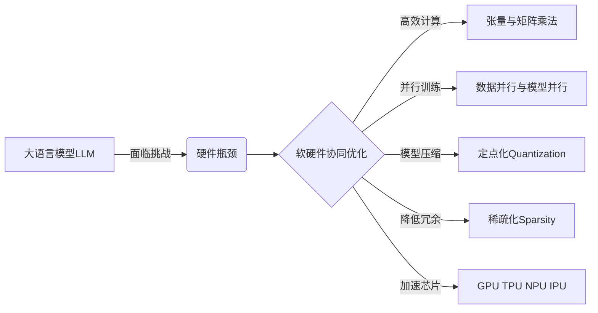

# 大语言模型原理与工程实践：硬件瓶颈

## 1. 背景介绍
### 1.1 大语言模型的兴起
近年来,随着深度学习技术的飞速发展,自然语言处理(NLP)领域取得了突破性的进展。其中,大语言模型(Large Language Model, LLM)的出现,更是掀起了 NLP 领域的一场革命。LLM 通过在海量文本数据上进行预训练,学习到了丰富的语言知识和常识,具备了强大的语言理解和生成能力。从 GPT、BERT 到 GPT-3、PaLM 等,LLM 的参数规模和性能不断刷新着记录。

### 1.2 LLM 面临的挑战
然而,LLM 的训练和推理对计算资源提出了极高的要求,也暴露出了一些亟待解决的问题:
- 模型参数量巨大,动辄上百亿甚至上千亿,给存储和内存带来巨大压力
- 训练和推理计算量大,需要强大的算力支持,训练成本高昂
- 推理延迟较高,难以满足实时交互等场景的需求
- 能耗问题突出,碳排放不容忽视

这些问题在很大程度上源于硬件基础设施的局限性。因此,探讨如何突破 LLM 所面临的硬件瓶颈,优化软硬件协同,提升训练和推理效率,已成为业界的重要课题。

## 2. 核心概念与联系
### 2.1 张量(Tensor)与矩阵乘法
张量是深度学习框架中描述多维数组的基本数据结构。对于 LLM,输入序列、词嵌入、注意力矩阵、参数矩阵等都以张量的形式表示和存储。模型的前向和反向传播本质上是大量的矩阵-矩阵、矩阵-向量乘法运算。因此,高效的张量计算和矩阵乘法是 LLM 加速的关键。

### 2.2 数据并行与模型并行
并行计算是提升 LLM 训练效率的重要手段。数据并行是指将训练数据分片,在多个设备上同时进行训练,并同步梯度更新参数。模型并行则是将模型切分到不同设备,通过设备间通信完成前向和反向传播。对于超大规模 LLM,往往需要混合使用数据并行和模型并行。

### 2.3 定点化(Quantization)
定点化是一种常用的模型压缩方法,即将浮点数(如 FP32)量化为定点数(如 INT8),从而减小模型存储和内存占用,加速计算。定点化可以在训练过程中(Quantization-Aware Training)或训练后(Post-Training Quantization)进行。对于 LLM,定点化有望显著降低训练和推理成本。

### 2.4 稀疏化(Sparsity)
LLM 中存在大量冗余的连接和权重。通过稀疏化,可以将部分权重置零或剪枝,在保持模型性能的同时,大幅降低计算和存储开销。结构化稀疏(Structured Sparsity)和非结构化稀疏(Unstructured Sparsity)是两种主要的稀疏化方式。

### 2.5 专用加速芯片
为了高效支持 LLM 的计算模式,一些专用加速芯片应运而生:
- GPU:通用并行计算芯片,适合密集矩阵运算,是目前 LLM 训练的主力
- TPU:谷歌推出的张量处理器,针对机器学习任务优化,支持高带宽内存
- NPU:神经网络处理器,支持低精度高并发计算,可用于 LLM 推理
- IPU:智能处理器,内置大容量片上内存,减少数据搬运,加速稀疏计算



## 3. 核心算法原理与具体步骤
### 3.1 混合并行训练
#### 3.1.1 流水线并行
将 LLM 切分为多个子模块,分布到不同设备,前一个设备的输出作为后一个设备的输入,形成流水线。正向传播时,各设备可以并行计算不同的微批次数据。
1. 将模型切分为 N 个阶段,分配到 N 个设备
2. 将训练数据分为 M 个微批次
3. 对于每个微批次,依次在 N 个设备上进行前向传播
4. 各设备同步进行反向传播,更新参数

#### 3.1.2 张量切片并行 
将张量切片到不同维度,分布到多个设备,各设备分别计算子张量,再进行归并。以矩阵乘法 $C=A \times B$ 为例:
1. 将矩阵 A 横向切片为 $A_1,A_2$,矩阵 B 纵向切片为 $B_1,B_2$
2. 在设备1计算 $C_{11}=A_1 \times B_1$,设备2计算 $C_{12}=A_1 \times B_2$ 
3. 在设备3计算 $C_{21}=A_2 \times B_1$,设备4计算 $C_{22}=A_2 \times B_2$
4. 将 $C_{11},C_{12},C_{21},C_{22}$ 拼接得到 C

### 3.2 自适应定点量化
#### 3.2.1 对称量化
1. 确定量化比特数 n(如8位)
2. 计算张量 T 的绝对值最大值 $|T|_{max}$
3. 计算缩放因子 $scale = \frac{|T|_{max}}{2^{n-1}-1}$
4. 量化: $T_q = round(\frac{T}{scale})$
5. 反量化: $\hat{T} = T_q \times scale$

#### 3.2.2 非对称量化
1. 确定量化比特数 n
2. 计算张量 T 的最小值 $T_{min}$ 和最大值 $T_{max}$
3. 计算 zero_point 和 scale:
   $zero_point = round(-\frac{T_{min}}{T_{max}-T_{min}} \times (2^n-1))$
   $scale = \frac{T_{max}-T_{min}}{2^n-1}$
4. 量化: $T_q = round(\frac{T}{scale})+zero_point$
5. 反量化: $\hat{T} = (T_q-zero_point) \times scale$

### 3.3 动态稀疏化
1. 初始化掩码矩阵 $M$,与权重矩阵 $W$ 形状相同
2. 根据设定的稀疏度,随机将 $M$ 中部分元素置零
3. 在前向传播时,用 $M$ 对 $W$ 进行掩码: $W_{sparse} = W \odot M$
4. 反向传播时,根据梯度 $g$ 的幅值,按比例对 $M$ 中的 0 元素进行更新:
   若 $|g_i|$ 大于阈值,则 $M_i$ 置为1
   若 $|g_i|$ 小于阈值,则 $M_i$ 仍为0
5. 重复步骤3-4,实现动态稀疏模式学习

## 4. 数学模型与公式详解
### 4.1 注意力机制
注意力分数计算:
$$
e_{ij} = \frac{(W_QX_i)^T(W_KX_j)}{\sqrt{d_k}} \\
\alpha_{ij} = \frac{exp(e_{ij})}{\sum_{k=1}^{n}exp(e_{ik})}
$$
其中,$X_i$ 是查询向量,$X_j$ 是键向量,$W_Q,W_K$ 是投影矩阵,$d_k$ 是缩放因子。

注意力输出:
$$
Attention(X) = \sum_{j=1}^{n}\alpha_{ij}(W_VX_j)
$$
其中,$W_V$ 是值向量的投影矩阵。

多头注意力:
$$
MultiHead(X) = Concat(head_1,...,head_h)W^O \\
head_i = Attention(XW_i^Q, XW_i^K, XW_i^V)
$$
$W_i^Q,W_i^K,W_i^V$ 是第 i 个头的投影矩阵,$W^O$ 是输出投影矩阵。

### 4.2 前馈神经网络
$$
FFN(X) = max(0, XW_1+b_1)W_2+b_2
$$
$W_1,W_2$ 是权重矩阵,$b_1,b_2$ 是偏置项。

### 4.3 LayerNorm 层
$$
\mu = \frac{1}{n}\sum_{i=1}^{n}x_i \\
\sigma = \sqrt{\frac{1}{n}\sum_{i=1}^{n}(x_i-\mu)^2} \\
LayerNorm(x) = \frac{x-\mu}{\sigma+\epsilon} \odot \gamma + \beta
$$
其中,$\mu$ 是均值,$\sigma$ 是标准差,$\epsilon$ 是平滑项,$\gamma,\beta$ 是可学习的缩放和偏移参数。

### 4.4 嵌入层
$$
E = Embedding(X) = XW_E
$$
$X$ 是输入的 token ID 序列,$W_E$ 是嵌入矩阵。

### 4.5 损失函数
以语言模型为例,采用交叉熵损失:
$$
L = -\frac{1}{N}\sum_{i=1}^{N}\sum_{j=1}^{|V|}y_{ij}log(\hat{y}_{ij})
$$
其中,$y_{ij}$ 是第 i 个样本第 j 个 token 的真实标签,$\hat{y}_{ij}$ 是模型预测的概率分布,$|V|$ 是词表大小。

## 5. 代码实例详解
以 PyTorch 为例,实现 LLM 的核心组件:

### 5.1 注意力层
```python
import torch
import torch.nn as nn

class Attention(nn.Module):
    def __init__(self, hidden_size, num_heads):
        super().__init__()
        self.hidden_size = hidden_size
        self.num_heads = num_heads
        self.head_size = hidden_size // num_heads
        
        self.query = nn.Linear(hidden_size, hidden_size)
        self.key = nn.Linear(hidden_size, hidden_size)
        self.value = nn.Linear(hidden_size, hidden_size)
        self.out = nn.Linear(hidden_size, hidden_size)
    
    def forward(self, x):
        batch_size, seq_len, _ = x.size()
        q = self.query(x).view(batch_size, seq_len, self.num_heads, self.head_size).transpose(1, 2)
        k = self.key(x).view(batch_size, seq_len, self.num_heads, self.head_size).transpose(1, 2)
        v = self.value(x).view(batch_size, seq_len, self.num_heads, self.head_size).transpose(1, 2)
        
        scores = torch.matmul(q, k.transpose(-2, -1)) / (self.head_size ** 0.5)
        attn_weights = torch.softmax(scores, dim=-1)
        attn_output = torch.matmul(attn_weights, v)
        attn_output = attn_output.transpose(1, 2).contiguous().view(batch_size, seq_len, self.hidden_size)
        
        output = self.out(attn_output)
        return output
```

### 5.2 前馈层
```python
class FeedForward(nn.Module):
    def __init__(self, hidden_size, ffn_size, dropout_rate):
        super().__init__()
        self.fc1 = nn.Linear(hidden_size, ffn_size)
        self.fc2 = nn.Linear(ffn_size, hidden_size)
        self.dropout = nn.Dropout(dropout_rate)
        
    def forward(self, x):
        x = self.dropout(torch.relu(self.fc1(x)))
        x = self.fc2(x)
        return x
```

### 5.3 LayerNorm 层
```python
class LayerNorm(nn.Module):
    def __init__(self, hidden_size, eps=1e-12):
        super().__init__()
        self.weight = nn.Parameter(torch.ones(hidden_size))
        self.bias = nn.Parameter(torch.zeros(hidden_size))
        self.eps = eps

    def forward(self, x):
        mean = x.mean(-1, keepdim=True)
        std = x.std(-1, keepdim=True)
        return self.weight * (x - mean) / (std + self.eps) + self.bias
```

### 5.4