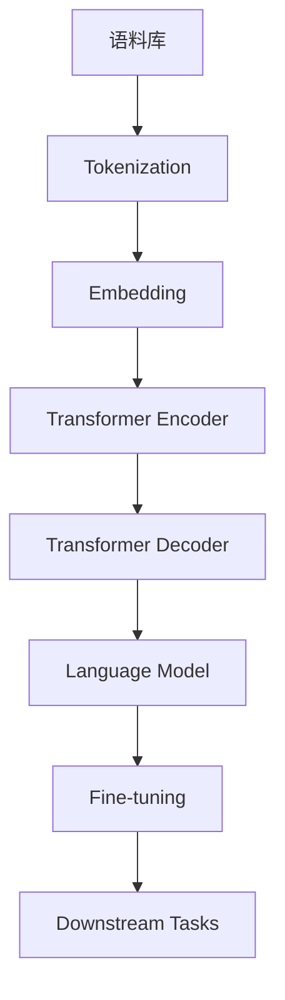

# 大语言模型原理基础与前沿 其他改进措施

## 1. 背景介绍
### 1.1 大语言模型的发展历程
#### 1.1.1 早期的语言模型
#### 1.1.2 神经网络语言模型的兴起
#### 1.1.3 Transformer 的革命性突破

### 1.2 大语言模型的应用场景
#### 1.2.1 自然语言处理任务
#### 1.2.2 对话系统与问答系统
#### 1.2.3 文本生成与创作

## 2. 核心概念与联系
### 2.1 语言模型的定义与目标
#### 2.1.1 语言模型的数学定义
#### 2.1.2 语言模型的目标函数

### 2.2 自注意力机制与 Transformer 架构
#### 2.2.1 自注意力机制的原理
#### 2.2.2 Transformer 的编码器-解码器架构
#### 2.2.3 位置编码与残差连接

### 2.3 预训练与微调
#### 2.3.1 无监督预训练的优势
#### 2.3.2 掩码语言模型与下一句预测
#### 2.3.3 微调技术与应用



## 3. 核心算法原理具体操作步骤
### 3.1 Transformer 的编码器
#### 3.1.1 输入嵌入与位置编码
#### 3.1.2 多头自注意力机制
#### 3.1.3 前馈神经网络

### 3.2 Transformer 的解码器
#### 3.2.1 自回归生成过程
#### 3.2.2 掩码自注意力机制
#### 3.2.3 编码器-解码器注意力机制

### 3.3 训练与优化
#### 3.3.1 损失函数与优化器
#### 3.3.2 学习率调度与梯度裁剪
#### 3.3.3 并行化训练技术

## 4. 数学模型和公式详细讲解举例说明
### 4.1 语言模型的概率公式
$$P(w_1, w_2, ..., w_n) = \prod_{i=1}^n P(w_i | w_1, w_2, ..., w_{i-1})$$

### 4.2 自注意力机制的计算过程
$$Attention(Q, K, V) = softmax(\frac{QK^T}{\sqrt{d_k}})V$$

### 4.3 Transformer 的损失函数
$$L(\theta) = -\frac{1}{N} \sum_{i=1}^N \log P(y_i | x_i; \theta)$$

## 5. 项目实践：代码实例和详细解释说明
### 5.1 数据预处理与词汇表构建
```python
import torch
from transformers import BertTokenizer

tokenizer = BertTokenizer.from_pretrained('bert-base-uncased')
input_ids = tokenizer.encode("Hello, world!", add_special_tokens=True)
```

### 5.2 模型定义与初始化
```python
from transformers import BertForMaskedLM

model = BertForMaskedLM.from_pretrained('bert-base-uncased')
```

### 5.3 模型训练与微调
```python
from transformers import AdamW

optimizer = AdamW(model.parameters(), lr=1e-5)
model.train()
for epoch in range(num_epochs):
    for batch in dataloader:
        optimizer.zero_grad()
        outputs = model(**batch)
        loss = outputs.loss
        loss.backward()
        optimizer.step()
```

## 6. 实际应用场景
### 6.1 文本分类
#### 6.1.1 情感分析
#### 6.1.2 主题分类
#### 6.1.3 意图识别

### 6.2 文本生成
#### 6.2.1 摘要生成
#### 6.2.2 对话生成
#### 6.2.3 故事创作

### 6.3 问答系统
#### 6.3.1 阅读理解
#### 6.3.2 知识库问答
#### 6.3.3 常识推理

## 7. 工具和资源推荐
### 7.1 开源框架与库
#### 7.1.1 Transformers
#### 7.1.2 Fairseq
#### 7.1.3 OpenNMT

### 7.2 预训练模型
#### 7.2.1 BERT
#### 7.2.2 GPT-2/GPT-3
#### 7.2.3 XLNet

### 7.3 数据集与评测基准
#### 7.3.1 GLUE
#### 7.3.2 SQuAD
#### 7.3.3 CNN/Daily Mail

## 8. 总结：未来发展趋势与挑战
### 8.1 模型效率与可解释性
#### 8.1.1 模型压缩与加速
#### 8.1.2 可解释性与可控性

### 8.2 多模态与跨语言
#### 8.2.1 视觉-语言预训练模型
#### 8.2.2 多语言与跨语言模型

### 8.3 领域适应与知识融合
#### 8.3.1 领域自适应技术
#### 8.3.2 知识增强的语言模型

## 9. 附录：常见问题与解答
### 9.1 如何选择合适的预训练模型？
### 9.2 如何处理低资源语言的建模问题？
### 9.3 如何平衡模型的泛化能力与领域适应能力？

大语言模型自 Transformer 架构提出以来取得了革命性的进展，极大地推动了自然语言处理领域的发展。通过海量语料的无监督预训练，大语言模型能够学习到丰富的语言知识和通用表示，并在下游任务中表现出优异的性能。

然而，大语言模型的训练和应用仍然面临着诸多挑战。模型的参数量巨大，训练成本高昂，且对计算资源要求较高。此外，模型的可解释性和可控性仍有待提高，以确保其在实际应用中的安全性和可靠性。

未来，大语言模型的研究方向可能包括以下几个方面：

1. 模型效率与可解释性：通过模型压缩、知识蒸馏等技术，降低模型的参数量和计算复杂度，同时提高模型的可解释性和可控性。

2. 多模态与跨语言：探索视觉-语言预训练模型，实现多模态信息的融合；开发多语言与跨语言模型，提高模型在不同语言间的迁移能力。

3. 领域适应与知识融合：研究领域自适应技术，提高模型在特定领域的性能；将外部知识引入语言模型，增强模型的推理和决策能力。

总之，大语言模型已经成为自然语言处理领域的重要工具和研究热点。随着技术的不断进步和创新，相信大语言模型将在更广泛的应用场景中发挥重要作用，为人机交互和人工智能的发展做出更大的贡献。

作者：禅与计算机程序设计艺术 / Zen and the Art of Computer Programming