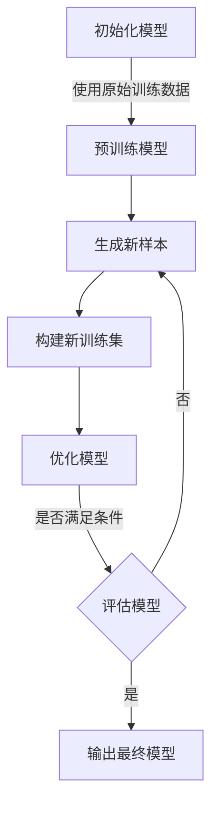

# 大语言模型原理基础与前沿 基于自我反馈进行迭代优化

## 1. 背景介绍

### 1.1 大语言模型的兴起

近年来,自然语言处理(NLP)领域取得了长足的进步,很大程度上归功于大型语言模型的出现和发展。大型语言模型是一种基于深度学习的人工智能模型,能够从大量文本数据中学习语言模式和语义关系,从而实现各种自然语言处理任务,如机器翻译、文本摘要、问答系统等。

大型语言模型的核心思想是利用海量文本数据对神经网络模型进行预训练,使其捕捉丰富的语言知识。经过预训练后,这些模型可以在下游任务中进行微调,从而快速适应特定的应用场景。这种预训练-微调范式大大提高了模型的性能,推动了 NLP 技术的飞速发展。

### 1.2 自我反馈迭代优化

尽管大型语言模型已经取得了令人瞩目的成就,但它们仍然存在一些局限性和挑战。其中之一是模型输出的一致性和连贯性问题。由于训练数据的多样性和噪声,模型可能会产生矛盾或不合逻辑的输出,影响其在实际应用中的可靠性。

为了解决这一问题,研究人员提出了基于自我反馈的迭代优化方法。这种方法的核心思想是利用模型自身的输出作为额外的训练数据,通过不断地自我纠正和优化,提高模型的一致性和连贯性。这种自我反馈机制可以有效地减少模型输出中的噪声和矛盾,从而提高模型的鲁棒性和可靠性。

本文将深入探讨大型语言模型的基础原理,并重点介绍基于自我反馈的迭代优化方法。我们将详细阐述该方法的理论基础、算法流程,并通过实例和代码示例帮助读者更好地理解和掌握这一前沿技术。

## 2. 核心概念与联系

### 2.1 大型语言模型概述

大型语言模型是一种基于深度学习的自然语言处理模型,旨在从海量文本数据中学习语言模式和语义关系。这些模型通常采用transformer等神经网络架构,具有极大的参数量和计算能力,能够捕捉丰富的语言知识。

常见的大型语言模型包括 GPT(Generative Pre-trained Transformer)、BERT(Bidirectional Encoder Representations from Transformers)、XLNet、RoBERTa 等。这些模型通过在大规模文本语料库上进行预训练,学习到了通用的语言表示,可以在下游任务中进行微调,快速适应特定的应用场景。

大型语言模型的核心优势在于其强大的泛化能力和迁移学习能力。通过预训练,模型可以捕捉到丰富的语言知识,包括语法、语义、世界知识等,从而在各种自然语言处理任务中表现出色。同时,由于预训练和微调的分离,模型可以在不同的下游任务之间共享知识,提高了训练效率和泛化能力。

### 2.2 自我反馈迭代优化

尽管大型语言模型取得了卓越的成绩,但它们仍然存在一些局限性和挑战。其中之一是模型输出的一致性和连贯性问题。由于训练数据的多样性和噪声,模型可能会产生矛盾或不合逻辑的输出,影响其在实际应用中的可靠性。

为了解决这一问题,研究人员提出了基于自我反馈的迭代优化方法。这种方法的核心思想是利用模型自身的输出作为额外的训练数据,通过不断地自我纠正和优化,提高模型的一致性和连贯性。

自我反馈迭代优化的基本流程如下:

1. 初始化模型,使用原始训练数据进行预训练。
2. 使用预训练模型生成新的输出样本。
3. 将生成的样本与原始训练数据合并,构建新的训练集。
4. 使用新的训练集对模型进行进一步的训练,获得优化后的模型。
5. 重复步骤2-4,直到模型达到预期的性能或迭代次数。

通过这种自我反馈机制,模型可以不断地纠正和优化自身的输出,从而提高输出的一致性和连贯性。同时,由于引入了模型自身生成的数据,这种方法还可以有效地缓解训练数据不足的问题,提高模型的泛化能力。

自我反馈迭代优化方法为大型语言模型的优化提供了一种新的思路,有望进一步提高模型的性能和可靠性,推动自然语言处理技术的发展。

## 3. 核心算法原理具体操作步骤

基于自我反馈的迭代优化算法可以分为以下几个主要步骤:



### 3.1 初始化模型

首先,我们需要初始化一个大型语言模型,例如 GPT、BERT 或其他transformer架构的模型。这个初始模型可以是从头开始训练的,也可以是基于现有的预训练模型进行初始化。

### 3.2 预训练模型

使用原始训练数据(如大规模文本语料库)对初始化模型进行预训练。预训练的目标是让模型学习到通用的语言表示,捕捉丰富的语言知识。常见的预训练目标包括掩码语言模型(Masked Language Modeling)、下一句预测(Next Sentence Prediction)等。

### 3.3 生成新样本

使用预训练模型生成新的输出样本。这些样本可以是对特定输入的响应,也可以是无条件生成的文本。生成样本的方式可以是贪婪解码(Greedy Decoding)、束搜索(Beam Search)或其他解码策略。

### 3.4 构建新训练集

将生成的新样本与原始训练数据合并,构建新的训练集。在合并过程中,可以对新样本进行过滤和清理,去除低质量或不合理的样本。同时,也可以对新样本进行人工标注和校对,以提高其质量。

### 3.5 优化模型

使用新构建的训练集对模型进行进一步的训练,获得优化后的模型。在这个过程中,可以采用与预训练阶段相同或不同的训练目标和优化策略。

### 3.6 评估模型

评估优化后模型的性能,判断是否满足预期要求。评估指标可以包括生成质量、一致性、连贯性等。如果模型性能尚未达到预期,则返回步骤3,使用优化后的模型生成新的样本,并重复后续步骤。

### 3.7 输出最终模型

当模型性能满足要求或达到迭代次数限制时,输出最终优化后的模型,用于实际应用或部署。

通过上述迭代过程,模型可以不断地纠正和优化自身的输出,提高生成质量和一致性。同时,由于引入了模型自身生成的数据,这种方法还可以有效地缓解训练数据不足的问题,提高模型的泛化能力。

## 4. 数学模型和公式详细讲解举例说明

在自我反馈迭代优化过程中,我们需要定义一些数学模型和公式来量化和优化模型的性能。下面将详细介绍一些常用的数学模型和公式。

### 4.1 语言模型概率

语言模型的核心目标是估计一个句子或文本序列的概率。对于一个长度为 $n$ 的token序列 $x = (x_1, x_2, ..., x_n)$,其概率可以表示为:

$$P(x) = \prod_{i=1}^{n} P(x_i | x_1, x_2, ..., x_{i-1})$$

其中 $P(x_i | x_1, x_2, ..., x_{i-1})$ 表示在给定前面token的情况下,当前token $x_i$ 的条件概率。

在自回归语言模型(如GPT)中,我们通常使用transformer解码器来估计上述条件概率。对于每个位置 $i$,解码器会输出一个概率分布 $P(x_i | x_1, x_2, ..., x_{i-1})$,然后使用交叉熵损失函数进行优化。

### 4.2 生成质量评估

为了评估生成样本的质量,我们可以使用一些自动评估指标,如 BLEU、ROUGE、METEOR 等。这些指标通常基于生成样本与参考样本之间的 n-gram 重叠程度来计算分数。

例如,BLEU(Bilingual Evaluation Understudy)指标定义如下:

$$BLEU = BP \cdot \exp\left(\sum_{n=1}^{N} w_n \log p_n\right)$$

其中 $BP$ 是一个惩罚项,用于惩罚过短的生成结果。$p_n$ 表示生成样本与参考样本之间的 n-gram 精确度,即重叠的 n-gram 数量与总 n-gram 数量的比值。$w_n$ 是对应 n-gram 的权重。

通过优化这些自动评估指标,我们可以在一定程度上提高生成样本的质量和流畅度。

### 4.3 一致性评估

除了生成质量,我们还需要评估模型输出的一致性和连贯性。一种常见的方法是计算生成样本与参考样本之间的语义相似度。

假设我们有一个语义相似度函数 $sim(x, y)$,用于计算两个句子或文本 $x$ 和 $y$ 之间的语义相似度分数。我们可以定义一个一致性评估指标 $C$,表示生成样本与参考样本之间的平均语义相似度:

$$C = \frac{1}{N} \sum_{i=1}^{N} sim(x_i, y_i)$$

其中 $N$ 是样本数量,$(x_i, y_i)$ 是第 $i$ 对生成样本和参考样本。

语义相似度函数 $sim(x, y)$ 可以基于各种技术实现,如词嵌入相似度、句子编码相似度等。通过优化一致性评估指标 $C$,我们可以提高模型输出的一致性和连贯性。

### 4.4 损失函数优化

在自我反馈迭代优化过程中,我们需要定义一个损失函数 $\mathcal{L}$ 来综合考虑生成质量、一致性等多个目标。损失函数可以是上述评估指标的加权组合,例如:

$$\mathcal{L} = \alpha \cdot BLEU^{-1} + \beta \cdot C^{-1} + \gamma \cdot \mathcal{L}_{LM}$$

其中 $\alpha$、$\beta$、$\gamma$ 是对应的权重系数,用于平衡不同目标的重要性。$BLEU^{-1}$ 和 $C^{-1}$ 分别表示 BLEU 指标和一致性指标的倒数,目的是将它们转换为损失值进行优化。$\mathcal{L}_{LM}$ 是语言模型的原始损失函数,如交叉熵损失。

通过优化上述损失函数,我们可以同时提高模型输出的生成质量、一致性和语言流畅度。在实际应用中,我们还可以根据具体需求调整损失函数的形式和权重系数。

## 5. 项目实践: 代码实例和详细解释说明

为了更好地理解自我反馈迭代优化算法,我们将提供一个基于 Python 和 Hugging Face Transformers 库的代码示例。该示例将演示如何使用 GPT-2 模型进行自我反馈迭代优化,提高模型输出的一致性和连贯性。

### 5.1 导入必要的库

```python
import torch
from transformers import GPT2LMHeadModel, GPT2Tokenizer
from tqdm import tqdm
import random
```

我们将使用 Hugging Face Transformers 库中的 GPT-2 模型和 tokenizer。同时,我们还导入了 `tqdm` 库用于显示进度条,以及 `random` 库用于随机采样。

### 5.2 初