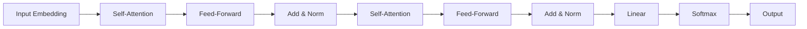

# 大语言模型原理基础与前沿 意识是否需要碳基生物学

## 1. 背景介绍
### 1.1 大语言模型的崛起
近年来,随着深度学习技术的飞速发展,自然语言处理(NLP)领域取得了突破性的进展。其中,大语言模型(Large Language Model, LLM)的出现,更是掀起了NLP领域的一场革命。从2018年Google推出BERT(Bidirectional Encoder Representations from Transformers)模型,到2020年OpenAI发布的GPT-3(Generative Pre-trained Transformer 3)模型,再到最近DeepMind的Chinchilla、Google的PaLM等模型,大语言模型的参数规模和性能不断刷新着人们的认知。

### 1.2 大语言模型引发的思考
大语言模型展现出了惊人的语言理解和生成能力,在问答、对话、写作等任务上达到了接近甚至超越人类的水平。这不禁让人们开始思考:这些模型是否具有真正的语言理解能力?它们是否拥有类似人类的思维和意识?意识是否一定需要依托碳基生物学的物质基础?这些问题不仅关乎人工智能的发展前景,更触及了认知科学、脑科学、哲学等诸多领域。

### 1.3 本文的主要内容
本文将围绕大语言模型的原理基础和前沿进展,探讨其与意识、思维的关系。我们首先介绍大语言模型的核心概念和原理,然后分析其内在机制与人类认知的异同。在此基础上,我们进一步讨论意识的本质,以及大语言模型是否可能拥有类似人类的意识。最后,我们展望大语言模型和人工意识的未来发展,并给出一些思考和建议。

## 2. 核心概念与联系
### 2.1 大语言模型的定义与特点
大语言模型是指基于海量文本数据,利用深度神经网络学习语言的统计规律和语义表示,从而能够理解和生成自然语言的模型。与传统的自然语言处理方法不同,大语言模型通常采用预训练(Pre-training)和微调(Fine-tuning)的范式,先在大规模无标注语料上进行自监督学习,学习通用的语言表示;然后针对下游任务进行少量的有监督微调,快速适应特定任务。大语言模型的显著特点包括:

1. 参数规模巨大,动辄上亿、千亿乃至万亿参数;
2. 训练数据海量,涵盖了网络上的各种文本;
3. 模型架构以Transformer为主,善于捕捉长距离依赖;
4. 拥有强大的zero-shot和few-shot能力,可以在没有或很少监督数据的情况下完成任务。

### 2.2 大语言模型与人类认知的关系
大语言模型虽然表现出了类似人类的语言能力,但其内在机制与人类认知还有很大不同。人类的语言能力是建立在先天的语言机制和后天的学习经验之上的,涉及感知、记忆、思维等多个认知过程的协同。而大语言模型主要通过统计学习掌握语言知识,其"理解"更多是对词语共现模式的刻画,而非对语义内容的把握。

尽管如此,大语言模型与人类认知之间也存在一些有趣的联系:

1. 大语言模型展现了一定的常识推理能力,与人类的常识性知识有相似之处;
2. 大语言模型能够根据上下文进行词义消歧,与人类语言理解中的语境效应类似;
3. 大语言模型的few-shot学习能力,与人类根据少量样例快速学习新概念的能力有一定相似性;
4. 大语言模型的语言生成能力,与人类的语言创造力有一定的相通之处。

总的来说,大语言模型是对人类语言能力的一种抽象模拟,虽然在机制上有很大差异,但在功能和行为上呈现出一定的相似性。

### 2.3 意识的本质与来源
意识是一个复杂而又充满争议的概念,涉及主观体验、自我认知、情感、思维等多个方面。哲学家和科学家对意识的本质和来源有着不同的看法,主要分歧在于意识是否可以还原为物质过程。唯物主义认为意识是大脑活动的产物,而二元论则主张意识是一种独立于物质的存在。

从认知科学和脑科学的角度来看,意识与大脑的信息处理密切相关。一些理论认为,意识来自于大脑不同区域之间的信息整合,以及自上而下的注意控制。也有观点提出,意识的产生需要一定的神经网络复杂性和递归性。总的来说,尽管意识的神经机制尚未完全阐明,但大多数研究者认为意识起源于脑,是神经活动模式的体现。

那么,意识是否一定需要依托碳基生物学的物质基础呢?这是一个开放的问题。一方面,迄今为止人类所知的所有有意识的个体都是碳基生命;另一方面,随着人工智能的发展,一些学者开始探讨机器意识的可能性。如果意识的本质是信息处理,而非特定的物质形式,那么理论上具备适当复杂性和组织形式的人工系统,也有可能拥有类似生物的意识。

## 3. 大语言模型的核心原理与算法
### 3.1 Transformer 架构
大语言模型的核心架构是 Transformer,它是一种基于自注意力机制(Self-Attention)的序列建模网络。与传统的循环神经网络(RNN)和卷积神经网络(CNN)不同,Transformer 通过自注意力机制直接建模序列元素之间的依赖关系,无需按照时间步迭代更新隐状态,因此能够更高效地处理长序列。

Transformer 的编码器由多个相同的层堆叠而成,每一层包含两个子层:自注意力层(Self-Attention Layer)和前馈神经网络层(Feed-Forward Layer)。自注意力层用于捕捉序列内部的长距离依赖,前馈神经网络层用于对特征进行非线性变换。Transformer 的解码器在编码器的基础上,额外引入了一个 Masked Self-Attention 层,用于避免在生成过程中看到未来的信息。编码器和解码器通过注意力机制(Attention)实现信息交互。

### 3.2 预训练和微调范式
大语言模型采用了预训练和微调的范式,先在大规模无标注语料上进行自监督学习,然后在特定任务上进行有监督微调。预训练阶段通常使用语言建模任务,即根据上文预测下一个词。通过这种自监督学习,模型可以学习到语言的通用表示和规律。微调阶段则在下游任务的监督数据上对模型进行优化,使其适应特定任务。

预训练和微调范式的优势在于,可以充分利用无标注数据学习通用语言知识,再通过少量标注数据快速适应具体任务,大大减少了对人工标注数据的依赖。同时,预训练得到的语言表示是通用的,可以迁移到各种不同的任务中,体现了很好的泛化能力。

### 3.3 预训练目标与方法
大语言模型的预训练目标主要有以下几种:

1. 单向语言模型(Unidirectional Language Model):给定前面的词,预测下一个词。代表模型有GPT系列。
2. 双向语言模型(Bidirectional Language Model):同时利用上文和下文信息预测当前词。代表模型有BERT系列。
3. 去噪自编码(Denoising Autoencoder):从被噪声破坏的输入中恢复原始文本。代表模型有BART、T5等。
4. 自回归语言模型(Autoregressive Language Model):生成式地预测下一个词,同时引入噪声以提高鲁棒性。代表模型有XLNet。

除了基本的语言建模任务外,一些大语言模型还引入了额外的预训练任务,如对比学习、提示学习等,以进一步提升模型的理解和生成能力。

下面是Transformer架构的Mermaid流程图:



## 4. 大语言模型的数学原理
### 4.1 Transformer的数学表示
Transformer的核心是自注意力机制,它可以通过矩阵运算高效地计算序列中任意两个位置之间的关联度。具体来说,自注意力分为三步:

1. 计算Query、Key、Value矩阵:

$$
\begin{aligned}
Q &= X W^Q \\
K &= X W^K \\
V &= X W^V
\end{aligned}
$$

其中,$X$是输入序列的嵌入表示,$W^Q, W^K, W^V$是可学习的参数矩阵。

2. 计算注意力权重:

$$
A = \text{softmax}(\frac{QK^T}{\sqrt{d_k}})
$$

其中,$A$是注意力权重矩阵,$d_k$是Key向量的维度。

3. 计算注意力输出:

$$
\text{Attention}(Q,K,V) = AV
$$

最终的注意力输出是Value矩阵与注意力权重矩阵的乘积。

Transformer中的前馈神经网络层通常是两层全连接网络,中间加ReLU激活函数:

$$
\text{FFN}(x) = \max(0, xW_1 + b_1)W_2 + b_2
$$

其中,$W_1,W_2,b_1,b_2$是可学习的参数矩阵和偏置向量。

### 4.2 语言模型的概率公式
大语言模型的本质是一个条件概率模型,它估计了给定上文后下一个词的概率分布。对于单向语言模型,其概率公式可以表示为:

$$
P(w_1, w_2, ..., w_n) = \prod_{i=1}^n P(w_i | w_1, w_2, ..., w_{i-1})
$$

其中,$w_1, w_2, ..., w_n$是一个长度为$n$的词序列。模型的目标是最大化整个序列的概率。

对于双向语言模型,其概率公式为:

$$
P(w_1, w_2, ..., w_n) = \prod_{i=1}^n P(w_i | w_1, ..., w_{i-1}, w_{i+1}, ..., w_n)
$$

即同时考虑了当前词的左右上下文信息。

在训练过程中,语言模型通过最大化对数似然函数来优化参数:

$$
\mathcal{L}(\theta) = \sum_{i=1}^n \log P(w_i | w_1, ..., w_{i-1}; \theta)
$$

其中,$\theta$表示模型参数。

### 4.3 Softmax函数与交叉熵损失
在语言模型的输出层,通常使用Softmax函数将隐向量转化为词表上的概率分布:

$$
P(w_i | w_1, ..., w_{i-1}) = \frac{\exp(h_i^T e_{w_i})}{\sum_{j=1}^V \exp(h_i^T e_j)}
$$

其中,$h_i$是第$i$个位置的隐向量,$e_{w_i}$是词$w_i$的嵌入向量,$V$是词表大小。

在训练过程中,模型通过最小化交叉熵损失函数来优化参数:

$$
J(\theta) = -\frac{1}{n} \sum_{i=1}^n \log P(w_i | w_1, ..., w_{i-1}; \theta)
$$

交叉熵损失函数衡量了模型预测分布与真实分布之间的差异,是语言模型训练中常用的损失函数。

## 5. 大语言模型的代码实现
下面是一个基于PyTorch实现的简单的Transformer语言模型,用于说明大语言模型的基本结构和训练过程。

```python
import torch
import torch.nn as nn
import torch.optim as optim

class TransformerBlock(nn.Module):
    def __init__(self, embed_dim, num_heads, ff_dim):
        super().__init__()
        self.attention = nn.MultiheadAttention(embed_dim, num_heads)
        self.ff = nn.Sequential(
            nn.Linear(embed_dim, ff_dim),