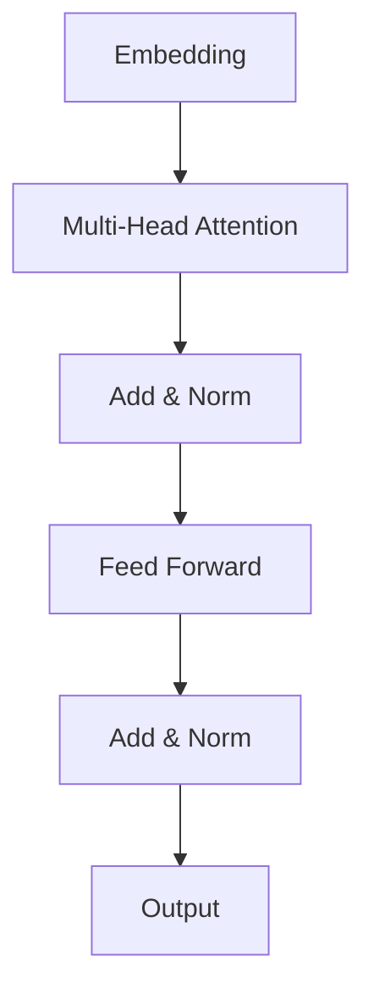

# 大语言模型原理基础与前沿 环境影响

## 1.背景介绍

### 1.1 大语言模型的兴起

近年来,大型语言模型(Large Language Models, LLMs)在自然语言处理(Natural Language Processing, NLP)领域掀起了一场革命。这些模型通过在大规模文本语料库上进行预训练,学习了丰富的语言知识和上下文信息,展现出令人惊叹的语言生成能力。

LLMs的兴起可以追溯到2018年,当时谷歌发布了Transformer模型,为序列到序列(Sequence-to-Sequence)任务提供了一种全新的架构。随后,OpenAI推出了GPT(Generative Pre-trained Transformer)系列模型,其中GPT-3拥有惊人的1750亿个参数,在各种NLP任务上取得了卓越的表现。

与此同时,其他科技巨头和研究机构也加入了LLMs的竞争,例如谷歌的PaLM、Meta的OPT、DeepMind的Chinchilla等。这些模型不仅在规模上不断扩大,而且在架构和训练方法上也在持续创新。

### 1.2 大语言模型的影响

大语言模型的出现对整个AI领域产生了深远的影响。它们展示了通过大规模预训练,模型可以获取广泛的知识,并在下游任务中表现出惊人的泛化能力。这种范式极大地推动了NLP技术的发展,使得许多以前被认为是"人工智能硬骨头"的任务变得可行,例如对话系统、文本摘要、机器翻译等。

然而,LLMs也面临着一些挑战和争议。它们的训练过程需要消耗大量的计算资源和能源,引发了环境可持续性的担忧。此外,LLMs在输出中可能会存在偏见、不当内容和事实错误,这对它们在敏感领域的应用构成了风险。

因此,探索LLMs的原理、优化它们的性能、评估它们的影响,并努力缓解相关风险,已经成为当前AI研究的重点领域之一。

## 2.核心概念与联系

### 2.1 自注意力机制(Self-Attention Mechanism)

自注意力机制是Transformer模型的核心,它允许模型在处理序列数据时,捕捉到远距离的依赖关系。与传统的循环神经网络(RNN)和卷积神经网络(CNN)不同,自注意力机制不受序列长度的限制,可以并行计算,从而提高了计算效率。

在自注意力机制中,每个输入元素都会与其他元素进行注意力计算,生成一个注意力分数矩阵。该矩阵捕捉了元素之间的相关性,并用于计算加权和,产生新的表示。这种机制使模型能够动态地关注输入序列中的不同部分,从而更好地捕捉上下文信息。

自注意力机制的数学表达式如下:

$$
\begin{aligned}
\text{Attention}(Q, K, V) &= \text{softmax}\left(\frac{QK^T}{\sqrt{d_k}}\right)V \\
\text{MultiHead}(Q, K, V) &= \text{Concat}(\text{head}_1, \ldots, \text{head}_h)W^O\\
\text{where}\ \text{head}_i &= \text{Attention}(QW_i^Q, KW_i^K, VW_i^V)
\end{aligned}
$$

其中, $Q$、$K$和$V$分别代表查询(Query)、键(Key)和值(Value)。多头注意力机制(Multi-Head Attention)通过将注意力计算分成多个"头"(head)并并行计算,进一步提高了模型的表现力。

### 2.2 transformer模型架构

Transformer模型由编码器(Encoder)和解码器(Decoder)两部分组成。编码器将输入序列映射到一个连续的表示,而解码器则根据该表示生成目标序列。

编码器和解码器都由多个相同的层组成,每一层包含以下子层:

1. 多头自注意力子层(Multi-Head Self-Attention Sublayer)
2. 全连接前馈网络子层(Fully Connected Feed-Forward Sublayer)

在编码器中,每个位置的输出都是通过自注意力机制计算得到的,捕捉到了整个输入序列的信息。而在解码器中,除了编码器输出的信息外,自注意力机制还会考虑已生成的输出序列,以捕捉目标序列的内部依赖关系。

上图展示了Transformer编码器的基本架构。首先,输入序列被映射到嵌入空间,然后经过多头自注意力子层和前馈网络子层的处理,最终得到编码器的输出表示。

### 2.3 大语言模型预训练

LLMs通常采用自监督学习(Self-Supervised Learning)的方式进行预训练,利用大规模的文本语料库学习通用的语言表示。常见的预训练目标包括:

1. **掩码语言模型(Masked Language Modeling, MLM)**: 随机掩蔽输入序列中的一些token,并训练模型预测被掩码的token。
2. **下一句预测(Next Sentence Prediction, NSP)**: 判断两个句子是否连续出现在语料库中。
3. **因果语言模型(Causal Language Modeling, CLM)**: 给定前缀,预测下一个token。

通过预训练,LLMs可以学习到丰富的语言知识,包括词汇、语法、语义和上下文信息。这种通用的语言表示为下游的NLP任务奠定了基础,使得模型可以通过少量的任务特定fine-tuning就获得出色的性能。

## 3.核心算法原理具体操作步骤

大语言模型的训练过程可以分为两个主要阶段:预训练(Pre-training)和微调(Fine-tuning)。

### 3.1 预训练阶段

1. **数据准备**: 收集大规模的文本语料库,可以是网页、书籍、论文等各种来源。对语料库进行预处理,如去重、分词、标记化等。

2. **模型初始化**: 初始化Transformer模型的参数,包括嵌入矩阵、注意力层权重和前馈网络权重。

3. **预训练目标设置**: 选择合适的预训练目标,如MLM、NSP或CLM。

4. **预训练过程**:
   a. 从语料库中采样一个小批量(mini-batch)的文本序列。
   b. 根据预训练目标对输入序列进行掩码或切分。
   c. 将处理后的序列输入模型,计算预训练目标的损失函数。
   d. 使用优化算法(如Adam)反向传播,更新模型参数。
   e. 重复上述步骤,直到模型在验证集上的性能不再提升为止。

5. **模型保存**: 保存预训练好的模型权重,以便后续的微调和部署。

### 3.2 微调阶段

1. **任务数据准备**: 收集与目标NLP任务相关的数据集,如文本分类、机器翻译、问答等。

2. **数据预处理**: 对任务数据进行必要的预处理,如分词、标记化、填充等。

3. **模型加载**: 加载预训练模型的权重。

4. **微调过程**:
   a. 从任务数据集中采样一个小批量的样本。
   b. 将样本输入预训练模型,计算任务相关的损失函数。
   c. 使用优化算法反向传播,更新模型参数。
   d. 重复上述步骤,直到模型在验证集上的性能不再提升为止。

5. **模型评估**: 在测试集上评估微调后模型的性能。

6. **模型部署**: 根据应用场景,将微调后的模型部署到生产环境中。

需要注意的是,在微调过程中,通常只需要更新模型的一部分参数,而保留大部分预训练参数不变。这种策略可以充分利用预训练模型学习到的通用语言知识,并将计算资源集中在任务相关的参数上,从而提高微调效率。

## 4.数学模型和公式详细讲解举例说明

### 4.1 自注意力机制(Self-Attention)

自注意力机制是Transformer模型的核心,它允许模型捕捉输入序列中任意两个位置之间的依赖关系。我们以一个简单的例子来说明自注意力的计算过程。

假设我们有一个长度为4的输入序列$X = (x_1, x_2, x_3, x_4)$,其中每个$x_i$是一个向量,表示该位置的嵌入表示。我们希望计算一个新的序列$Z = (z_1, z_2, z_3, z_4)$,其中每个$z_i$是对应位置$x_i$的加权和,权重由$x_i$与其他位置的相关性决定。

首先,我们将输入序列$X$线性映射到查询(Query)、键(Key)和值(Value)三个向量空间:

$$
\begin{aligned}
Q &= XW^Q\\
K &= XW^K\\
V &= XW^V
\end{aligned}
$$

其中,$W^Q$、$W^K$和$W^V$是可学习的权重矩阵。

接下来,我们计算查询$Q$与所有键$K$的点积,并除以一个缩放因子$\sqrt{d_k}$(其中$d_k$是键向量的维度),得到注意力分数矩阵:

$$
\text{Attention}(Q, K, V) = \text{softmax}\left(\frac{QK^T}{\sqrt{d_k}}\right)V
$$

注意力分数矩阵捕捉了输入序列中每个位置与其他位置之间的相关性。我们对该矩阵的每一行进行softmax操作,得到一个概率分布,表示当前位置对其他位置的注意力权重。

最后,我们将注意力分数矩阵与值向量$V$相乘,得到新的序列表示$Z$:

$$
Z = \text{Attention}(Q, K, V)
$$

每个$z_i$都是对应位置$x_i$的加权和,权重由$x_i$与其他位置的相关性决定。

为了增加模型的表现力,Transformer采用了多头注意力机制(Multi-Head Attention),将注意力计算分成多个"头"(head)并并行计算,最后将各头的结果拼接起来:

$$
\begin{aligned}
\text{MultiHead}(Q, K, V) &= \text{Concat}(\text{head}_1, \ldots, \text{head}_h)W^O\\
\text{where}\ \text{head}_i &= \text{Attention}(QW_i^Q, KW_i^K, VW_i^V)
\end{aligned}
$$

其中,$W_i^Q$、$W_i^K$、$W_i^V$和$W^O$都是可学习的权重矩阵。

通过自注意力机制,Transformer模型可以动态地关注输入序列中的不同部分,捕捉长距离依赖关系,从而提高了序列建模的能力。

### 4.2 掩码语言模型(Masked Language Modeling, MLM)

MLM是LLMs常用的预训练目标之一,它要求模型预测被掩码的token。我们以一个简单的例子来说明MLM的工作原理。

假设我们有一个输入序列"今天天气很好,我们去[MASK]公园玩吧。"其中[MASK]表示被掩码的token。我们的目标是训练模型预测[MASK]处应该是什么token。

首先,我们将输入序列输入到预训练的Transformer模型中,得到每个token位置的隐藏状态表示$H = (h_1, h_2, \ldots, h_n)$。对于被掩码的token位置$i$,我们将其隐藏状态$h_i$输入到一个分类器(通常是一个线性层followed by softmax)中,得到一个概率分布$P(x_i)$,表示该位置可能是词表中每个token的概率。

$$
P(x_i) = \text{softmax}(W^Th_i + b)
$$

其中,$W$和$b$是分类器的可学习参数。

我们的目标是最大化被掩码token的对数似然:

$$
\mathcal{L}_\text{MLM} = -\log P(x_i^\text{true} | h_i)
$$

其中,$x_i^\text{true}$是该位置的真实token。

在训练过程中,我们随机选择一些token进行掩码(通常掩码15%的token),并最小化所有被掩码token的交叉