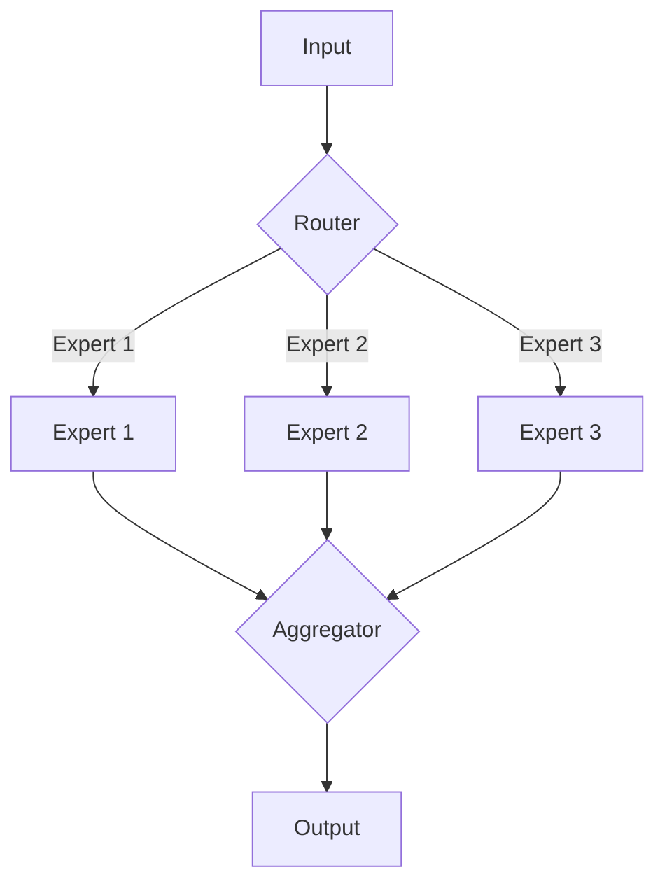

# 大语言模型原理基础与前沿 稀疏专家模型

## 1. 背景介绍
### 1.1 大语言模型的发展历程
#### 1.1.1 早期的语言模型
#### 1.1.2 神经网络语言模型的兴起 
#### 1.1.3 Transformer模型的突破

### 1.2 大语言模型面临的挑战
#### 1.2.1 模型参数量急剧增加
#### 1.2.2 训练和推理效率瓶颈
#### 1.2.3 模型泛化能力有待提升

### 1.3 稀疏专家模型的提出
#### 1.3.1 稀疏专家模型的核心思想
#### 1.3.2 稀疏专家模型的优势
#### 1.3.3 稀疏专家模型的发展现状

## 2. 核心概念与联系
### 2.1 稀疏性(Sparsity)
#### 2.1.1 稀疏性的定义
#### 2.1.2 稀疏性在神经网络中的应用
#### 2.1.3 稀疏性带来的优势

### 2.2 专家(Expert)
#### 2.2.1 专家的定义
#### 2.2.2 专家在稀疏专家模型中的作用
#### 2.2.3 专家的选择与训练

### 2.3 混合专家(Mixture of Experts, MoE)
#### 2.3.1 混合专家的基本原理
#### 2.3.2 混合专家与稀疏专家模型的关系
#### 2.3.3 混合专家的优缺点

### 2.4 路由(Routing)
#### 2.4.1 路由的定义与作用
#### 2.4.2 不同的路由策略
#### 2.4.3 路由对模型性能的影响

## 3. 核心算法原理具体操作步骤
### 3.1 稀疏专家模型的整体架构
#### 3.1.1 编码器(Encoder)
#### 3.1.2 解码器(Decoder)  
#### 3.1.3 专家层(Expert Layer)

### 3.2 前向传播过程
#### 3.2.1 输入编码
#### 3.2.2 专家选择与路由
#### 3.2.3 专家计算与输出合并

### 3.3 反向传播与参数更新
#### 3.3.1 损失函数的计算
#### 3.3.2 梯度的计算与传播
#### 3.3.3 参数的更新策略

### 3.4 训练技巧与优化
#### 3.4.1 专家数量与模型规模的平衡
#### 3.4.2 路由策略的选择与优化
#### 3.4.3 正则化与早停策略

## 4. 数学模型和公式详细讲解举例说明
### 4.1 专家选择的数学建模
#### 4.1.1 Gumbel-Softmax 技巧
#### 4.1.2 Top-K 路由策略
#### 4.1.3 专家选择的概率计算

### 4.2 专家输出的合并方式
#### 4.2.1 加权平均
#### 4.2.2 门控机制
#### 4.2.3 注意力机制

### 4.3 损失函数的设计
#### 4.3.1 交叉熵损失
#### 4.3.2 专家负载均衡损失
#### 4.3.3 多任务联合训练损失

### 4.4 公式推导与说明
#### 4.4.1 前向传播公式推导
#### 4.4.2 反向传播公式推导
#### 4.4.3 参数更新公式说明

## 5. 项目实践：代码实例和详细解释说明
### 5.1 稀疏专家模型的代码实现
#### 5.1.1 编码器的实现
#### 5.1.2 解码器的实现
#### 5.1.3 专家层的实现

### 5.2 路由策略的代码实现
#### 5.2.1 Top-K 路由
#### 5.2.2 Gumbel-Softmax 路由
#### 5.2.3 其他路由策略

### 5.3 训练流程的代码实现  
#### 5.3.1 数据准备与预处理
#### 5.3.2 模型初始化与配置
#### 5.3.3 训练循环与验证评估

### 5.4 推理与应用的代码实现
#### 5.4.1 模型加载与初始化
#### 5.4.2 输入数据的预处理
#### 5.4.3 推理过程与结果解释

## 6. 实际应用场景
### 6.1 自然语言处理
#### 6.1.1 机器翻译
#### 6.1.2 文本摘要
#### 6.1.3 问答系统

### 6.2 语音识别与合成
#### 6.2.1 语音识别
#### 6.2.2 语音合成
#### 6.2.3 语音翻译

### 6.3 推荐系统
#### 6.3.1 用户行为建模
#### 6.3.2 个性化推荐
#### 6.3.3 跨域推荐

### 6.4 其他领域
#### 6.4.1 计算机视觉
#### 6.4.2 生物信息学
#### 6.4.3 金融风控

## 7. 工具和资源推荐 
### 7.1 开源框架
#### 7.1.1 TensorFlow
#### 7.1.2 PyTorch
#### 7.1.3 Jax

### 7.2 预训练模型
#### 7.2.1 BERT
#### 7.2.2 GPT系列
#### 7.2.3 T5

### 7.3 数据集
#### 7.3.1 WikiText
#### 7.3.2 Penn Treebank
#### 7.3.3 WMT翻译数据集

### 7.4 学习资源
#### 7.4.1 论文与综述
#### 7.4.2 在线课程
#### 7.4.3 技术博客

## 8. 总结：未来发展趋势与挑战
### 8.1 稀疏专家模型的优势总结
#### 8.1.1 提高模型效率
#### 8.1.2 增强模型表达能力
#### 8.1.3 支持更大规模的模型训练

### 8.2 稀疏专家模型面临的挑战 
#### 8.2.1 专家选择与路由策略优化
#### 8.2.2 专家之间的协作与知识共享
#### 8.2.3 模型的可解释性与稳定性

### 8.3 未来的发展方向
#### 8.3.1 更高效的稀疏专家模型架构
#### 8.3.2 多模态稀疏专家模型
#### 8.3.3 自适应与动态路由机制

## 9. 附录：常见问题与解答
### 9.1 稀疏专家模型与传统语言模型的区别是什么？
### 9.2 如何选择合适的专家数量和模型规模？
### 9.3 稀疏专家模型在训练过程中需要注意哪些问题？
### 9.4 稀疏专家模型的推理效率如何优化？
### 9.5 稀疏专家模型是否适用于所有的自然语言处理任务？

以上是稀疏专家模型的核心架构示意图。输入数据首先经过路由器(Router)进行专家的选择,然后分别送入对应的专家网络中进行计算。各个专家的输出结果再通过聚合器(Aggregator)进行整合,得到最终的输出。

稀疏专家模型通过引入多个专家网络和动态路由机制,在提高模型容量的同时,也大幅降低了计算开销。每个专家网络可以专注于处理特定的子任务或领域,从而提升了模型的表达能力和泛化性能。而动态路由策略则可以根据输入数据的特点,自适应地选择最合适的专家组合,充分发挥各个专家的专长。

稀疏专家模型的训练过程涉及到多个关键步骤,包括专家选择、专家计算、梯度传播等。其中专家选择可以采用Gumbel-Softmax技巧或Top-K路由等策略,以平衡专家负载和模型性能。专家计算则通过前向传播完成,并将结果进行合并。在反向传播阶段,需要根据损失函数计算梯度,并更新各个专家网络的参数。为了提高训练效率和模型泛化能力,还可以引入专家负载均衡损失、多任务联合训练等优化技术。

在实际应用中,稀疏专家模型已经在多个自然语言处理任务上取得了显著的性能提升,如机器翻译、文本摘要、问答系统等。此外,稀疏专家模型还可以拓展到语音识别、推荐系统、计算机视觉等领域,展现出广阔的应用前景。

未来,稀疏专家模型的研究重点将集中在设计更高效的模型架构、探索多模态专家协作、开发自适应路由机制等方面。同时,也需要进一步提高稀疏专家模型的可解释性和稳定性,以满足实际应用的需求。

总之,稀疏专家模型为大语言模型的发展带来了新的思路和突破口。通过引入稀疏性和专家机制,稀疏专家模型在提升模型性能的同时,也大大降低了计算资源的消耗,为构建更加智能高效的自然语言处理系统奠定了基础。相信随着研究的不断深入,稀疏专家模型必将在人工智能领域发挥越来越重要的作用。

作者：禅与计算机程序设计艺术 / Zen and the Art of Computer Programming