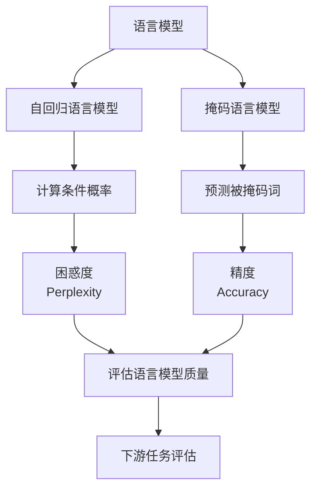

# 大语言模型原理基础与前沿 评估语言模型

## 1.背景介绍

### 1.1 什么是语言模型

语言模型是自然语言处理领域的一个核心概念,旨在捕捉语言的统计规律。它是一种概率分布模型,用于计算一个句子或者一个语序列的概率。语言模型广泛应用于机器翻译、语音识别、文本生成、问答系统等自然语言处理任务。

### 1.2 语言模型的发展历程

早期的语言模型主要基于 N-gram 统计模型,利用有限长度的上下文来预测下一个词的概率。随着深度学习的兴起,神经网络语言模型(Neural Network Language Model)逐渐取代了传统的 N-gram 模型,能够更好地捕捉长程依赖关系。

近年来,随着计算能力和数据量的不断增长,大型预训练语言模型(Large Pre-trained Language Model)成为自然语言处理领域的主流方向。这些模型通过在大规模语料库上进行自监督预训练,学习通用的语言表示,再通过微调(fine-tuning)将这些通用表示应用到下游任务中。代表性的大型预训练语言模型包括 GPT、BERT、XLNet、T5 等。

### 1.3 评估语言模型的重要性

评估语言模型的质量对于模型的改进和应用都至关重要。合理的评估指标可以反映模型的优劣,指导模型的优化方向。同时,评估语言模型也是验证模型在实际应用场景中表现的重要手段。

## 2.核心概念与联系

### 2.1 语言模型的核心任务

语言模型的核心任务是计算一个语序列的概率,即 $P(w_1, w_2, ..., w_n)$,其中 $w_i$ 表示序列中的第 i 个词。根据链式法则,该概率可以分解为:

$$P(w_1, w_2, ..., w_n) = \prod_{i=1}^{n}P(w_i|w_1, ..., w_{i-1})$$

语言模型的目标是估计上述条件概率,即给定前面的词,预测下一个词的概率。

### 2.2 自回归语言模型

自回归语言模型(Autoregressive Language Model)是一种常见的语言模型架构,它将语序列建模为一个标量序列,每一步都依赖于之前的输出。形式化地,自回归语言模型计算:

$$P(w_1, w_2, ..., w_n) = \prod_{i=1}^{n}P(w_i|w_1, ..., w_{i-1})$$

自回归模型的优点是能够很好地捕捉语言的顺序性,但缺点是无法并行化计算,导致inference速度较慢。

### 2.3 掩码语言模型

掩码语言模型(Masked Language Model)是另一种常见的语言模型架构,它将语序列中的某些词进行掩码,然后预测被掩码的词。形式化地,掩码语言模型计算:

$$P(w_1, w_2, ..., w_n) = \prod_{i \in M}P(w_i|w_1, ..., w_{i-1}, w_{i+1}, ..., w_n)$$

其中 $M$ 表示被掩码的词的位置集合。掩码语言模型的优点是可以并行化计算,inference速度较快,但缺点是无法很好地捕捉语言的顺序性。

### 2.4 评估指标与语言模型

评估语言模型的质量需要合理的评估指标。常见的评估指标包括:

- 困惑度(Perplexity):反映语言模型对语料的建模能力,值越小表示模型越好。
- 精度(Accuracy):在掩码语言模型中,用于评估模型预测被掩码词的准确率。
- BLEU:在机器翻译任务中,用于评估译文与参考译文的相似度。

除了上述内在评估指标外,还需要结合下游任务的指标(如问答准确率、文本生成质量等)来全面评估语言模型的质量。

## 3.核心算法原理具体操作步骤

### 3.1 自回归语言模型原理

自回归语言模型的核心思想是将语序列建模为一个标量序列,每一步都依赖于之前的输出。具体来说,给定一个长度为 $n$ 的语序列 $(w_1, w_2, ..., w_n)$,自回归语言模型计算:

$$P(w_1, w_2, ..., w_n) = \prod_{i=1}^{n}P(w_i|w_1, ..., w_{i-1})$$

其中,每一步的条件概率 $P(w_i|w_1, ..., w_{i-1})$ 可以由神经网络模型(如 RNN、Transformer 等)来估计。

自回归语言模型的训练过程如下:

1. 准备语料库,将其切分为多个语序列。
2. 对每个语序列,将其前 $i-1$ 个词作为输入,第 i 个词作为标签,构建训练样本。
3. 使用神经网络模型(如 RNN、Transformer)对训练样本进行建模,优化目标是最大化标签词的条件概率。
4. 在训练过程中,通常采用教师强制(Teacher Forcing)策略,即每一步都使用真实的前缀词作为输入。

在inference阶段,自回归语言模型按照如下步骤生成语序列:

1. 给定一个起始词(或空序列)作为初始输入。
2. 使用训练好的神经网络模型,预测下一个词的概率分布。
3. 从概率分布中采样(或选择概率最大)的词,作为下一步的输入。
4. 重复步骤2和3,直到达到预设的最大长度或生成终止符。

自回归语言模型的优点是能够很好地捕捉语言的顺序性,但缺点是无法并行化计算,导致inference速度较慢。

### 3.2 掩码语言模型原理

掩码语言模型(Masked Language Model)是另一种常见的语言模型架构,它将语序列中的某些词进行掩码,然后预测被掩码的词。形式化地,掩码语言模型计算:

$$P(w_1, w_2, ..., w_n) = \prod_{i \in M}P(w_i|w_1, ..., w_{i-1}, w_{i+1}, ..., w_n)$$

其中 $M$ 表示被掩码的词的位置集合。

掩码语言模型的训练过程如下:

1. 准备语料库,将其切分为多个语序列。
2. 对每个语序列,随机选择一些词的位置进行掩码(通常使用特殊的 [MASK] 标记)。
3. 使用神经网络模型(如 BERT、XLNet)对掩码后的语序列进行建模,优化目标是最大化被掩码词的条件概率。

在inference阶段,掩码语言模型可以用于以下任务:

1. 文本填充(Cloze Test):给定一个带有 [MASK] 标记的语序列,预测被掩码的词。
2. 下游任务微调(Fine-tuning):将预训练的掩码语言模型作为初始化,在特定的下游任务数据上进行进一步微调。

掩码语言模型的优点是可以并行化计算,inference速度较快,但缺点是无法很好地捕捉语言的顺序性。

## 4.数学模型和公式详细讲解举例说明

### 4.1 N-gram 语言模型

N-gram 语言模型是基于统计学习的传统语言模型,它利用有限长度的上下文来预测下一个词的概率。具体来说,给定一个长度为 n 的语序列 $(w_1, w_2, ..., w_n)$,N-gram 语言模型计算:

$$P(w_1, w_2, ..., w_n) = \prod_{i=1}^{n}P(w_i|w_{i-N+1}, ..., w_{i-1})$$

其中,N 表示 N-gram 的长度。当 N=1 时,即为一元语言模型(Unigram Language Model),只考虑单个词的概率;当 N=2 时,即为二元语言模型(Bigram Language Model),考虑相邻两个词的概率;当 N=3 时,即为三元语言模型(Trigram Language Model),考虑相邻三个词的概率,以此类推。

N-gram 语言模型的参数估计通常采用最大似然估计(Maximum Likelihood Estimation)方法。以二元语言模型为例,参数估计公式如下:

$$P(w_i|w_{i-1}) = \frac{C(w_{i-1}, w_i)}{C(w_{i-1})}$$

其中,C(w_{i-1}, w_i) 表示语料库中 $(w_{i-1}, w_i)$ 这个二元组出现的次数,C(w_{i-1}) 表示 $w_{i-1}$ 出现的次数。

N-gram 语言模型的优点是简单高效,缺点是无法捕捉长程依赖关系,且受限于数据稀疏问题。

### 4.2 神经网络语言模型

神经网络语言模型(Neural Network Language Model)是在深度学习兴起后出现的一种新型语言模型,它利用神经网络来建模语言的概率分布。

以自回归语言模型为例,给定一个长度为 n 的语序列 $(w_1, w_2, ..., w_n)$,神经网络语言模型计算:

$$P(w_1, w_2, ..., w_n) = \prod_{i=1}^{n}P(w_i|w_1, ..., w_{i-1}; \theta)$$

其中,$ \theta $ 表示神经网络的参数。

神经网络语言模型通常采用如下架构:

1. 将词映射为向量表示(Word Embedding)。
2. 使用递归神经网络(RNN)或者Transformer等神经网络模型对输入序列进行编码。
3. 对编码后的序列使用全连接层和Softmax层进行分类,输出每个词的概率分布。

在训练过程中,通过最小化交叉熵损失函数来优化神经网络参数 $\theta$:

$$\mathcal{L}(\theta) = -\frac{1}{N}\sum_{i=1}^{N}\log P(w_i|w_1, ..., w_{i-1}; \theta)$$

其中,N 表示训练样本的数量。

神经网络语言模型的优点是能够捕捉长程依赖关系,并且可以通过增加网络深度和宽度来提高模型容量。缺点是训练数据需求量大,训练时间较长。

### 4.3 大型预训练语言模型

大型预训练语言模型(Large Pre-trained Language Model)是近年来自然语言处理领域的一个重要突破。这些模型通过在大规模语料库上进行自监督预训练,学习通用的语言表示,再通过微调(fine-tuning)将这些通用表示应用到下游任务中。

代表性的大型预训练语言模型包括 GPT、BERT、XLNet、T5 等。以 BERT 为例,它采用了掩码语言模型和下一句预测两个预训练任务,目标函数如下:

$$\mathcal{L} = \mathcal{L}_{\text{MLM}} + \lambda \mathcal{L}_{\text{NSP}}$$

其中,$ \mathcal{L}_{\text{MLM}} $ 表示掩码语言模型的目标函数,用于预测被掩码的词;$ \mathcal{L}_{\text{NSP}} $ 表示下一句预测的目标函数,用于判断两个句子是否相邻;$ \lambda $ 是一个权重系数。

在预训练阶段,BERT 模型在大规模语料库上优化上述目标函数,学习通用的语言表示。在微调阶段,BERT 模型将预训练的参数作为初始化,在特定的下游任务数据上进行进一步微调,以适应特定任务。

大型预训练语言模型的优点是能够从大规模语料库中学习通用的语言表示,并且可以通过微调的方式快速适应各种下游任务。缺点是预训练过程计算量巨大,需要大量的计算资源。

## 5.项目实践:代码实例和详细解释说明

### 5.1 N-gram 语言模型实现

以下是使用 