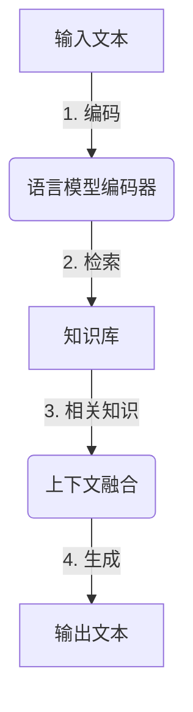
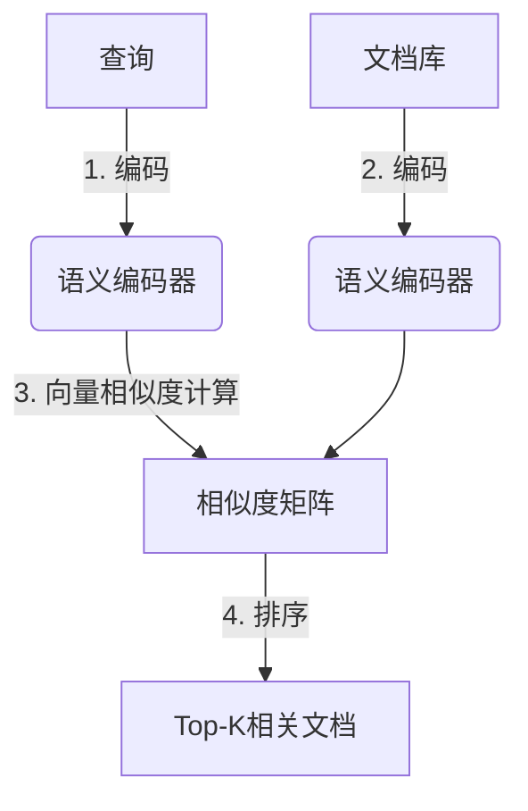
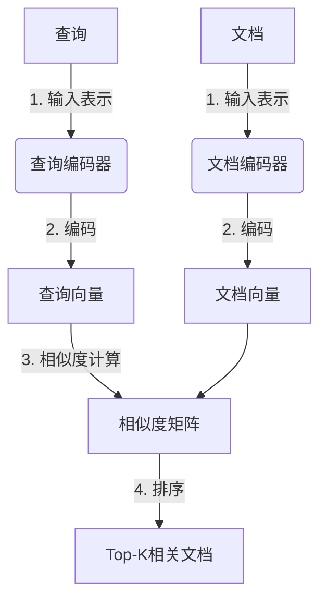
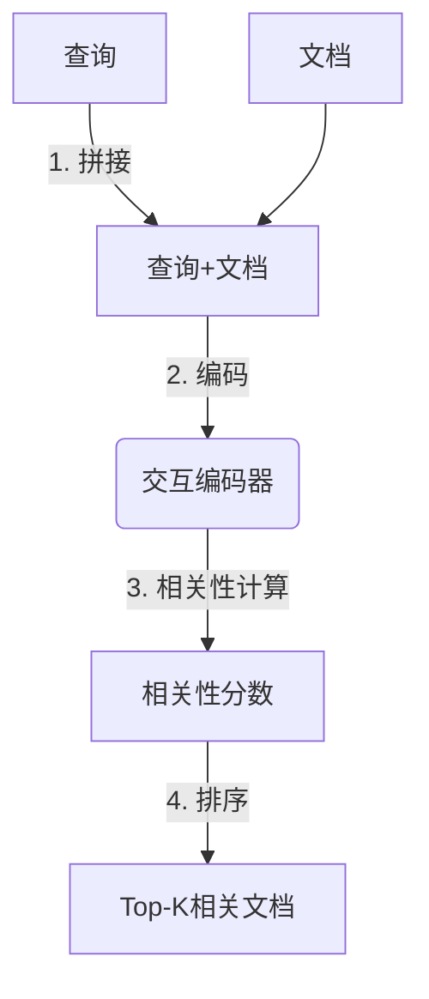

# 大语言模型原理基础与前沿 通过高效和精简检索进行问答和多跳推理

## 1.背景介绍

### 1.1 大语言模型的兴起

近年来,大型语言模型(Large Language Models, LLMs)在自然语言处理(NLP)领域取得了令人瞩目的进展。这些模型通过在海量文本数据上进行预训练,学习了丰富的语言知识和上下文信息,展现出惊人的泛化能力,能够应用于多种自然语言处理任务,如机器翻译、文本摘要、问答系统等。

代表性的大语言模型包括GPT(Generative Pre-trained Transformer)系列、BERT(Bidirectional Encoder Representations from Transformers)、XLNet、RoBERTa等。其中,GPT-3凭借高达1750亿个参数的庞大规模,在多项基准测试中取得了超越人类的成绩,引发了学术界和工业界的广泛关注。

### 1.2 大语言模型的挑战

尽管大语言模型取得了令人鼓舞的成就,但它们仍然面临着一些重大挑战:

1. **参数规模与计算资源**:训练大规模语言模型需要海量的计算资源和存储空间,这对于大多数组织来说是一个巨大的挑战。
2. **知识一致性和事实准确性**:大语言模型容易产生自相矛盾或与事实不符的输出,缺乏对知识的全面把控。
3. **推理能力有限**:现有模型在复杂的多跳推理和因果推理等方面能力有限,难以处理需要多步骤推理的问题。
4. **可解释性和透明度**:大语言模型的内部机理往往是一个黑箱,缺乏可解释性和透明度,难以获得用户的信任。
5. **数据隐私和安全性**:训练数据中可能包含敏感信息,存在潜在的隐私和安全风险。

为了解决这些挑战,研究人员正在探索各种创新方法,包括高效和精简的检索机制、多模态融合、知识增强、可解释性增强等,旨在提高大语言模型的性能、可靠性和可解释性。

## 2.核心概念与联系

### 2.1 检索增强语言模型(Retrieval-Augmented Language Models)

检索增强语言模型(Retrieval-Augmented Language Models, RALMs)是一种新兴的范式,旨在通过将外部知识库与大语言模型相结合,来增强模型的推理能力和知识一致性。这种方法的核心思想是:在生成过程中,模型不仅依赖于自身的参数,还可以从外部知识库中检索相关信息,作为额外的上下文信息输入。

这种范式的关键在于如何高效地从海量知识库中检索相关信息。传统的基于关键词的检索方法效率低下,难以捕捉语义相似性。因此,研究人员提出了基于密集向量的检索方法,利用语言模型学习到的语义表示,在向量空间中进行相似性搜索,从而实现高效和精确的检索。

### 2.2 密集检索(Dense Retrieval)

密集检索是一种基于密集向量表示的高效检索方法。它的核心思想是:将文本(如查询、文档等)映射到一个低维的连续向量空间中,然后在该向量空间中计算相似性,从而实现快速和精确的检索。

这种方法的优势在于:

1. **高效性**:通过近似最近邻搜索算法(如FAISS、ScaNN等),可以在海量数据中快速检索相似向量。
2. **语义相关性**:利用语言模型学习到的语义表示,能够捕捉文本的语义相似性,而不仅仅是关键词匹配。
3. **端到端可训练**:整个检索系统可以通过监督学习的方式进行端到端的优化,提高检索质量。

密集检索已经在多个领域取得了卓越的成绩,如开放域问答、对话系统、文本检索等。通过与大语言模型相结合,密集检索为构建高效和智能的问答系统提供了强大的工具。

## 3.核心算法原理具体操作步骤

### 3.1 双塔模型(Dual-Encoder Model)

双塔模型是密集检索中常用的一种架构,它将查询和文档分别编码为向量表示,然后计算两个向量之间的相似度,用于排序和检索。

具体步骤如下:

1. **输入表示**:将查询和文档分别转换为适当的输入表示,如词汇序列、字符序列等。
2. **编码器**:使用两个独立的编码器(通常是transformer模型)分别对查询和文档进行编码,得到固定长度的向量表示。
3. **相似度计算**:计算查询向量和文档向量之间的相似度,常用的度量包括内积、余弦相似度等。
4. **排序与检索**:根据相似度对文档进行排序,选取Top-K个最相关的文档作为检索结果。

双塔模型的优点是结构简单、计算高效,缺点是查询和文档的编码是独立的,无法捕捉跨编码器的交互信息。

### 3.2 交互模型(Interaction-based Model)

为了解决双塔模型的局限性,研究人员提出了交互模型,允许查询和文档在编码过程中进行交互,从而捕捉更丰富的相关性信息。

具体步骤如下:

1. **输入表示**:将查询和文档拼接为单个序列,作为模型的输入。
2. **交互编码器**:使用一个transformer编码器对拼接序列进行编码,得到查询和文档的上下文感知表示。
3. **相关性计算**:从编码器的输出中提取查询和文档的向量表示,计算它们之间的相关性分数。
4. **排序与检索**:根据相关性分数对文档进行排序,选取Top-K个最相关的文档作为检索结果。

交互模型的优点是能够捕捉查询和文档之间的交互信息,提高检索质量。缺点是计算代价较高,需要对每个(查询,文档)对进行单独编码,难以扩展到大规模数据。

### 3.3 近年来的进展

近年来,研究人员提出了多种改进和创新方法,以提高密集检索的性能和效率:

1. **预训练语言模型**:利用大规模预训练语言模型(如BERT、RoBERTa等)作为编码器,能够获得更好的语义表示,提高检索质量。
2. **对比学习**:通过对比学习的方式,使相关样本的向量表示更加接近,不相关样本的向量表示更加远离,从而提高向量空间的discriminative能力。
3. **层次索引**:采用层次索引结构(如SPLADE、ANCE等),先粗略检索,再细粒度重排,提高检索效率。
4. **多模态融合**:将文本、图像、视频等多模态信息融合到检索系统中,实现跨模态检索。
5. **知识增强**:将结构化知识(如知识图谱)或非结构化知识(如维基百科)融入语言模型,增强模型的知识理解能力。
6. **高效索引**:采用高效的近似最近邻搜索算法和索引结构(如FAISS、ScaNN等),加速大规模检索。

这些创新方法不断推进着密集检索技术的发展,使其能够应对越来越复杂的检索需求,为构建智能问答系统提供强有力的支持。

## 4.数学模型和公式详细讲解举例说明

### 4.1 向量相似度度量

在密集检索中,计算查询向量和文档向量之间的相似度是一个关键步骤。常用的相似度度量包括:

1. **内积(Dot Product)**

$$\text{sim}_{\text{dot}}(\mathbf{q}, \mathbf{d}) = \mathbf{q}^\top \mathbf{d}$$

内积直接测量两个向量的夹角余弦值,值越大表示越相似。

2. **余弦相似度(Cosine Similarity)**

$$\text{sim}_{\text{cos}}(\mathbf{q}, \mathbf{d}) = \frac{\mathbf{q}^\top \mathbf{d}}{\|\mathbf{q}\| \|\mathbf{d}\|}$$

余弦相似度测量两个向量的夹角余弦值,范围在[-1, 1]之间,值越接近1表示越相似。

3. **点积核(Dot Product Kernel)**

$$\text{sim}_{\text{dpk}}(\mathbf{q}, \mathbf{d}) = \sigma(\mathbf{q}^\top \mathbf{d})$$

其中$\sigma$是sigmoid函数,将内积值映射到(0, 1)范围内,作为相似度分数。

这些度量方法各有优缺点,在实际应用中需要根据具体场景进行选择和调优。

### 4.2 近似最近邻搜索

在大规模检索场景下,需要在海量文档中快速找到与查询最相似的Top-K个文档。暴力搜索的时间复杂度为$O(Nd)$($N$为文档数量,$d$为向量维度),当数据规模很大时,计算代价是不可接受的。

因此,我们需要采用近似最近邻搜索(Approximate Nearest Neighbor Search, ANNS)算法,通过构建高效的索引结构,在保证一定精度的前提下,大幅降低搜索时间。

常用的ANNS算法包括:

1. **层次导航小世界(Hierarchical Navigable Small World, HNSW)**

HNSW是一种基于图的近似最近邻搜索算法,它构建了一个分层的导航小世界图,通过层次遍历和导航,快速找到近似最近邻。HNSW具有高效的构建和查询性能,是密集检索中广泛使用的索引方法。

2. **矢量乘积量化(Vector Product Quantization, VPQ)**

VPQ将高维向量分解为多个低维子向量,分别对每个子向量进行量化编码,从而实现高效的近似最近邻搜索。VPQ在存储和计算方面具有优势,但精度略低于HNSW。

3. **标量量化(Scalar Quantization, SQ)**

SQ直接对原始高维向量进行量化编码,将连续值映射到有限的离散值。SQ简单高效,但精度较低,通常与其他方法结合使用。

除了上述算法,还有许多其他ANNS算法,如局部敏感哈希(Locality Sensitive Hashing, LSH)、乘积量化(Product Quantization, PQ)等。在实际应用中,需要根据具体场景和需求,权衡精度、效率和内存占用,选择合适的ANNS算法和索引结构。

## 5.项目实践:代码实例和详细解释说明

在本节中,我们将通过一个实际的代码示例,演示如何使用密集检索技术构建一个开放域问答系统。我们将使用PyTorch和FAISS库,基于DPR(Dense Passage Retrieval)模型实现一个端到端的检索增强问答系统。

### 5.1 数据准备

我们使用来自MS MARCO数据集的开放