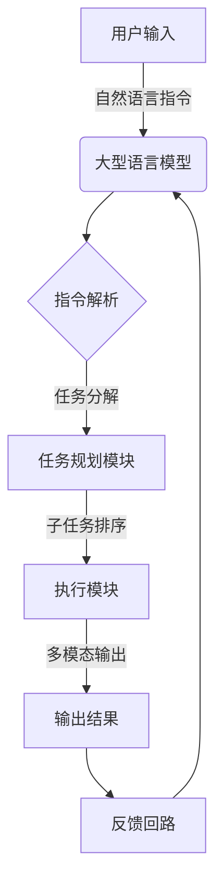

# 大语言模型应用指南：Open Interpreter

## 1. 背景介绍

### 1.1 大语言模型的兴起

近年来,大型语言模型(Large Language Models, LLMs)在自然语言处理(Natural Language Processing, NLP)领域取得了令人瞩目的进展。随着计算能力的不断提升和海量语料的积累,训练出具有数十亿甚至上百亿参数的大型语言模型成为可能。这些模型通过在海量文本数据上进行自监督学习,学习到了丰富的语言知识和上下文信息,展现出了强大的语言理解和生成能力。

### 1.2 Open Interpreter 概述

Open Interpreter 是一个基于大型语言模型的开源解释器,旨在为用户提供一种通用的、可编程的人工智能助手。它集成了自然语言理解、推理、知识库查询、任务规划等多种功能,可以根据用户的自然语言指令执行各种任务,如问答、代码生成、文本摘要、创意写作等。Open Interpreter 的核心是一个支持多模态输入输出的大型语言模型,经过了精心的指令精细化训练,能够更好地理解和执行用户的指令。

## 2. 核心概念与联系

### 2.1 大型语言模型

大型语言模型是 Open Interpreter 的核心组件,它是一个基于 Transformer 架构的自回归语言模型,通过在海量文本数据上进行自监督学习,学习到了丰富的语言知识和上下文信息。这种模型具有强大的语言理解和生成能力,可以根据上下文信息生成连贯、流畅的自然语言文本。

### 2.2 指令精细化训练

为了使大型语言模型能够更好地理解和执行用户的指令,Open Interpreter 采用了指令精细化训练(Instruction Tuning)技术。这种训练方式是在大型语言模型的基础上,利用带有指令和期望输出的数据集进行进一步的微调,使模型能够更好地理解和执行各种类型的指令。

### 2.3 多模态输入输出

Open Interpreter 支持多种模态的输入和输出,包括文本、图像、代码等。这意味着用户可以通过自然语言指令与模型进行交互,并获得相应模态的输出结果。例如,用户可以输入一个自然语言描述,模型就能生成相应的图像或代码。

### 2.4 任务规划与执行

Open Interpreter 内置了一个任务规划和执行模块,能够根据用户的指令分解出具体的子任务,并合理安排执行顺序。这个模块利用了规划算法和知识库,能够更好地理解和执行复杂的指令。



上图展示了 Open Interpreter 的核心工作流程。用户通过自然语言指令与大型语言模型进行交互,模型会对指令进行解析和任务分解,然后由任务规划模块合理安排子任务的执行顺序,最终由执行模块生成多模态的输出结果。整个过程中,系统会根据输出结果获得反馈,并对语言模型进行持续的改进。

## 3. 核心算法原理具体操作步骤

### 3.1 大型语言模型的训练

Open Interpreter 使用的大型语言模型是基于 Transformer 架构的自回归语言模型,通过自监督学习的方式在海量文本数据上进行训练。具体的训练过程如下:

1. **数据预处理**:首先需要对海量的文本语料进行预处理,包括去除噪声、分词、构建词表等步骤,将文本转换为模型可以接受的输入格式。

2. **模型初始化**:初始化 Transformer 模型的参数,包括词嵌入矩阵、位置编码、注意力层等。

3. **自监督训练**:采用自监督学习的方式,对模型进行训练。具体来说,是最大化模型在给定上文的情况下,正确预测下一个词的概率。训练目标是最小化模型在整个语料库上的交叉熵损失。

4. **梯度更新**:利用反向传播算法计算模型参数的梯度,并使用优化器(如 Adam)对模型参数进行更新。

5. **训练过程控制**:控制训练的超参数,如学习率、批量大小、训练轮数等,并采取一些技巧(如梯度裁剪)来提高训练的稳定性和效率。

通过上述步骤,大型语言模型可以在海量文本数据上进行有效的学习,获得丰富的语言知识和上下文信息,为后续的指令精细化训练和任务执行奠定基础。

### 3.2 指令精细化训练

为了使大型语言模型能够更好地理解和执行用户的指令,Open Interpreter 采用了指令精细化训练技术。具体的训练过程如下:

1. **数据集构建**:构建一个包含指令和期望输出的数据集。这个数据集可以是人工标注的,也可以是通过一些启发式规则自动生成的。

2. **模型初始化**:以预训练好的大型语言模型作为初始化模型,将其参数加载到新的模型中。

3. **微调训练**:在指令数据集上对模型进行微调训练。具体来说,是最大化模型在给定指令的情况下,正确生成期望输出的概率。训练目标是最小化模型在整个数据集上的交叉熵损失。

4. **梯度更新**:利用反向传播算法计算模型参数的梯度,并使用优化器对模型参数进行更新。

5. **训练过程控制**:控制微调训练的超参数,如学习率、批量大小、训练轮数等,并采取一些技巧来提高训练的稳定性和效率。

通过上述指令精细化训练过程,大型语言模型可以更好地理解和执行各种类型的指令,为 Open Interpreter 的核心功能奠定基础。

## 4. 数学模型和公式详细讲解举例说明

### 4.1 Transformer 模型

Open Interpreter 使用的大型语言模型是基于 Transformer 架构的自回归语言模型。Transformer 模型是一种全新的序列到序列(Sequence-to-Sequence)模型,它完全基于注意力机制(Attention Mechanism)构建,不再使用循环神经网络(RNN)或卷积神经网络(CNN)。

Transformer 模型的核心是多头自注意力(Multi-Head Self-Attention)机制,它可以同时关注输入序列中的所有位置,并捕捉它们之间的长程依赖关系。对于一个长度为 $n$ 的输入序列 $\mathbf{x} = (x_1, x_2, \dots, x_n)$,自注意力机制首先计算出一个 $n \times n$ 的注意力分数矩阵 $\mathbf{A}$,其中每个元素 $a_{ij}$ 表示模型对输入位置 $j$ 给予位置 $i$ 的注意力程度。然后,对输入序列进行加权求和,得到注意力表示:

$$\text{Attention}(\mathbf{x}) = \sum_{j=1}^n a_{ij} \mathbf{x}_j$$

多头注意力机制是将注意力机制运用到不同的子空间上,捕捉不同的依赖关系,最后将这些子空间的注意力表示进行拼接,得到最终的注意力表示。

除了注意力机制之外,Transformer 模型还包括前馈网络(Feed-Forward Network)、残差连接(Residual Connection)和层归一化(Layer Normalization)等关键组件,共同构建了一个强大的序列建模架构。

在自回归语言模型中,Transformer 的输出序列是基于输入序列和之前生成的词进行预测的。具体来说,对于长度为 $n$ 的输入序列 $\mathbf{x} = (x_1, x_2, \dots, x_n)$,模型需要生成长度为 $m$ 的输出序列 $\mathbf{y} = (y_1, y_2, \dots, y_m)$。在时间步 $t$,模型的输入是 $\mathbf{x}$ 和已生成的词 $(y_1, y_2, \dots, y_{t-1})$,输出是下一个词 $y_t$ 的概率分布:

$$P(y_t | \mathbf{x}, y_1, \dots, y_{t-1}) = \text{Transformer}(\mathbf{x}, y_1, \dots, y_{t-1})$$

通过最大化上述条件概率的对数似然,可以训练出一个强大的自回归语言模型。

### 4.2 交叉熵损失函数

在训练大型语言模型和进行指令精细化训练时,Open Interpreter 都采用了交叉熵损失函数作为优化目标。

对于一个长度为 $n$ 的目标序列 $\mathbf{y} = (y_1, y_2, \dots, y_n)$,以及模型对应的预测概率分布序列 $\hat{\mathbf{y}} = (\hat{y}_1, \hat{y}_2, \dots, \hat{y}_n)$,其中 $\hat{y}_i = P(y_i | \mathbf{x}, y_1, \dots, y_{i-1})$,交叉熵损失函数可以表示为:

$$\mathcal{L}(\mathbf{y}, \hat{\mathbf{y}}) = -\sum_{i=1}^n \log P(y_i | \mathbf{x}, y_1, \dots, y_{i-1})$$

在训练过程中,我们希望最小化这个损失函数,使模型能够更准确地预测目标序列。

对于一个包含 $N$ 个样本的训练集 $\mathcal{D} = \{(\mathbf{x}^{(1)}, \mathbf{y}^{(1)}), (\mathbf{x}^{(2)}, \mathbf{y}^{(2)}), \dots, (\mathbf{x}^{(N)}, \mathbf{y}^{(N)})\}$,总的训练目标是最小化训练集上的平均交叉熵损失:

$$\mathcal{J}(\theta) = \frac{1}{N} \sum_{i=1}^N \mathcal{L}(\mathbf{y}^{(i)}, \hat{\mathbf{y}}^{(i)}; \theta)$$

其中 $\theta$ 表示模型的参数。通过反向传播算法计算参数梯度,并使用优化器(如 Adam)对参数进行更新,就可以有效地优化模型参数,提高模型的性能。

## 5. 项目实践:代码实例和详细解释说明

在这一节,我们将通过一个简单的示例项目,展示如何使用 Open Interpreter 执行一个自然语言指令。该示例项目的目标是根据用户提供的一段自然语言描述,生成相应的Python代码。

### 5.1 导入必要的库

```python
from open_interpreter import OpenInterpreter

# 初始化 Open Interpreter
interpreter = OpenInterpreter()
```

我们首先导入 `OpenInterpreter` 类,并创建一个解释器实例。

### 5.2 定义指令

```python
instruction = "根据以下描述生成一个Python函数:计算给定数字的阶乘,即n!的值。例如,输入5,输出120。"
```

我们定义了一个自然语言指令,要求生成一个计算阶乘的Python函数。

### 5.3 执行指令

```python
result = interpreter.execute(instruction)
print(result)
```

我们调用 `execute` 方法,将指令传递给 Open Interpreter,并打印出生成的结果。

输出结果可能如下:

```python
def factorial(n):
    """
    计算给定数字的阶乘
    
    参数:
    n (int): 输入的正整数
    
    返回:
    int: n的阶乘值
    """
    result = 1
    for i in range(1, n+1):
        result *= i
    return result
```

可以看到,Open Interpreter 成功地根据指令生成了一个计算阶乘的Python函数,包括函数定义、docstring、参数说明和返回值说明。

### 5.4 代码解释

让我们来详细解释一下生成的代码:

1. **函数定义**:
   ```python
   def factorial(n):
   ```
   定义了一个名为 `factorial` 的函数,接受一个参数 `n`。

2. **docstring**:
   ```python
   """
   计算给定数字的阶乘