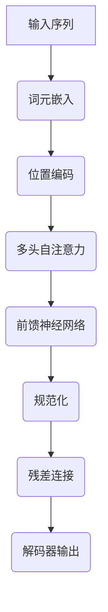

# 大语言模型应用指南：大语言模型的训练过程

## 1. 背景介绍

### 1.1 什么是大语言模型?

大语言模型(Large Language Model, LLM)是一种基于深度学习的自然语言处理(NLP)技术,旨在从海量文本数据中学习语言的语义和语法规则。它们被训练用于生成类似于人类的自然语言文本,可以应用于诸如机器翻译、文本摘要、问答系统、内容生成等广泛的NLP任务。

大语言模型的核心思想是使用自注意力(Self-Attention)机制和Transformer架构,通过预训练的方式在大规模语料库上学习语言的表示,从而获得对自然语言的深层次理解和生成能力。

### 1.2 大语言模型的重要性

近年来,大语言模型在自然语言处理领域取得了突破性进展,展现出令人惊叹的语言理解和生成能力。一些著名的大语言模型,如GPT-3、BERT、XLNet等,已经在各种NLP任务中表现出色,甚至超越了人类水平。

大语言模型的兴起,不仅推动了NLP技术的发展,也为人工智能系统赋予了更加自然、流畅的交互方式,为构建通用人工智能(Artificial General Intelligence, AGI)系统奠定了基础。因此,深入理解大语言模型的训练过程,对于提高模型性能、降低训练成本、探索模型内在机理等方面都具有重要意义。

## 2. 核心概念与联系

### 2.1 自注意力机制(Self-Attention)

自注意力机制是大语言模型的核心组成部分,它允许模型捕捉输入序列中任意两个位置之间的关系,从而更好地建模长期依赖关系。

在自注意力机制中,每个输入词元(token)都会关注整个输入序列中的所有其他词元,并根据它们之间的关联程度赋予不同的权重。这种机制使得模型能够同时考虑全局和局部信息,从而更好地理解上下文语义。

自注意力机制可以形式化表示为:

$$
\text{Attention}(Q, K, V) = \text{softmax}\left(\frac{QK^T}{\sqrt{d_k}}\right)V
$$

其中, $Q$ 表示查询(Query)向量, $K$ 表示键(Key)向量, $V$ 表示值(Value)向量, $d_k$ 是缩放因子,用于防止点积过大导致的梯度饱和问题。

### 2.2 Transformer架构

Transformer架构是一种全新的序列到序列(Sequence-to-Sequence)模型,它完全基于自注意力机制,不依赖于循环神经网络(RNN)或卷积神经网络(CNN)。Transformer架构由编码器(Encoder)和解码器(Decoder)两个主要部分组成。

编码器的作用是将输入序列映射为一系列连续的表示,而解码器则根据编码器的输出生成目标序列。两者之间通过多头自注意力机制(Multi-Head Attention)建立联系,允许模型同时关注不同的表示子空间。

Transformer架构的优势在于并行计算能力强、捕捉长期依赖关系的能力好,因此在训练大型语言模型时表现出色。

### 2.3 预训练与微调(Pre-training and Fine-tuning)

大语言模型通常采用两阶段训练策略:预训练(Pre-training)和微调(Fine-tuning)。

**预训练**阶段是在大规模无监督语料库上训练模型,目的是让模型学习通用的语言表示能力。常见的预训练目标包括掩码语言模型(Masked Language Modeling)和下一句预测(Next Sentence Prediction)等。

**微调**阶段是在特定的下游任务数据上进一步训练模型,以使模型适应特定的任务需求。在这个阶段,通常会冻结预训练模型的大部分参数,只对最后几层的参数进行微调。

通过预训练和微调的两阶段训练策略,大语言模型能够在保留通用语言理解能力的同时,针对特定任务进行优化和知识迁移,从而取得更好的性能表现。

## 3. 核心算法原理具体操作步骤

### 3.1 数据预处理

在训练大语言模型之前,需要对原始语料库进行预处理,包括文本清洗、标记化(Tokenization)、词元嵌入(Token Embedding)等步骤。

1. **文本清洗**: 去除语料库中的HTML标签、特殊字符、垃圾数据等无用信息。
2. **标记化**: 将连续的字符序列分割成一个个有意义的词元(token),如单词、子词或字符等。常用的标记化工具包括SentencePiece、WordPiece等。
3. **词元嵌入**: 将每个词元映射为一个固定长度的密集向量表示,作为模型的输入。通常使用预训练的词向量(Word Embedding)或随机初始化的向量。

### 3.2 模型架构

大语言模型通常采用基于Transformer的编码器-解码器架构,其中编码器用于捕捉输入序列的上下文信息,解码器则根据编码器的输出生成目标序列。

以GPT(Generative Pre-trained Transformer)模型为例,其架构如下所示:

1. **词元嵌入(Token Embedding)**: 将输入序列的每个词元映射为固定长度的向量表示。
2. **位置编码(Positional Encoding)**: 因为自注意力机制没有捕捉序列顺序的能力,所以需要添加位置编码来提供位置信息。
3. **多头自注意力(Multi-Head Attention)**: 捕捉输入序列中任意两个位置之间的关系,是Transformer的核心组件。
4. **前馈神经网络(Feed-Forward Network)**: 对自注意力的输出进行进一步的非线性变换,提取更高层次的特征表示。
5. **规范化(Normalization)**: 通常使用Layer Normalization或者Batch Normalization来加速训练收敛。
6. **残差连接(Residual Connection)**: 将输入和输出相加,以缓解深度网络的梯度消失问题。

上述架构通过堆叠多个编码器层,最终输出一个上下文化的序列表示,作为解码器的输入。

### 3.3 训练目标

大语言模型的预训练通常采用自监督学习(Self-Supervised Learning)的方式,其中常见的训练目标包括:

1. **掩码语言模型(Masked Language Modeling, MLM)**: 随机掩盖输入序列中的一些词元,模型需要根据上下文预测被掩盖的词元。
2. **下一句预测(Next Sentence Prediction, NSP)**: 判断两个句子是否为连续的句子对。
3. **因果语言模型(Causal Language Modeling, CLM)**: 给定前缀,模型需要预测下一个最可能出现的词元。

以MLM为例,其训练目标是最大化被掩盖词元的条件概率:

$$
\mathcal{L}_\text{MLM} = -\mathbb{E}_{x, m}\left[\sum_{i \in m}\log P(x_i|x_{\backslash m})\right]
$$

其中, $x$ 表示输入序列, $m$ 表示被掩盖的词元位置集合, $x_{\backslash m}$ 表示除去被掩盖词元的剩余序列。

通过最小化上述损失函数,模型可以学习到捕捉上下文语义的能力,从而更好地理解和生成自然语言。

### 3.4 优化算法

训练大语言模型通常采用随机梯度下降(Stochastic Gradient Descent, SGD)及其变体作为优化算法,如Adam、AdaGrad等。

为了加速训练收敛,常采用以下一些技巧:

1. **梯度裁剪(Gradient Clipping)**: 限制梯度的范数,防止梯度爆炸。
2. **学习率warmup**: 在训练初期使用较小的学习率,逐渐增大到合适的值,有助于提高模型性能。
3. **梯度累积(Gradient Accumulation)**: 由于显存限制,每次只能使用较小的批量大小进行训练。通过累积多个批次的梯度,再进行一次参数更新,可以近似使用更大的批量大小。
4. **混合精度训练(Mixed Precision Training)**: 利用半精度(FP16)或更低精度进行计算,可以减少内存占用,加速训练过程。
5. **分布式训练**: 将模型和数据并行在多个GPU甚至多个节点上进行训练,可以显著提高训练效率。

### 3.5 模型评估

在训练过程中,需要定期在验证集上评估模型的性能,以监控模型是否过拟合。常用的评估指标包括:

- 困惑度(Perplexity): 衡量模型对语料库的概率分布建模的好坏。
- BLEU分数(Bilingual Evaluation Understudy): 基于n-gram精确度和brevity惩罚项,用于评估机器翻译质量。
- ROUGE分数(Recall-Oriented Understudy for Gisting Evaluation): 基于n-gram重叠度,用于评估文本摘要质量。

除了自动评估指标外,也可以通过人工评估的方式,让人类评判者对模型生成的文本进行主观打分,从而更全面地评估模型的性能表现。

## 4. 数学模型和公式详细讲解举例说明

在上一节中,我们介绍了自注意力机制和掩码语言模型的数学表达式。现在,我们将通过具体的例子,进一步解释这些公式的含义和计算过程。

### 4.1 自注意力机制示例

假设我们有一个输入序列 "The dog chased the cat"。我们将其分词后得到词元序列 ["The", "dog", "chased", "the", "cat"]。

现在,我们来计算第三个词元 "chased" 对其他词元的注意力分数。首先,我们需要计算查询(Query)、键(Key)和值(Value)向量。假设它们的维度为 $d_k = 4$,则:

$$
\begin{aligned}
Q_\text{chased} &= [0.1, -0.2, 0.3, 0.4] \\
K_\text{The} &= [-0.1, 0.2, -0.3, 0.1] \\
K_\text{dog} &= [0.2, -0.1, 0.4, -0.2] \\
K_\text{chased} &= [0.3, 0.4, -0.2, -0.1] \\
K_\text{the} &= [-0.2, 0.3, 0.1, 0.5] \\
K_\text{cat} &= [0.4, -0.3, -0.1, 0.2] \\
V_\text{The} &= [0.1, 0.2, 0.3, 0.4] \\
V_\text{dog} &= [0.5, 0.6, 0.7, 0.8] \\
V_\text{chased} &= [0.9, 1.0, 1.1, 1.2] \\
V_\text{the} &= [1.3, 1.4, 1.5, 1.6] \\
V_\text{cat} &= [1.7, 1.8, 1.9, 2.0]
\end{aligned}
$$

接下来,我们计算 "chased" 对其他词元的注意力分数:

$$
\begin{aligned}
e_\text{The} &= \frac{Q_\text{chased} \cdot K_\text{The}^\top}{\sqrt{4}} = \frac{0.1 \times (-0.1) + (-0.2) \times 0.2 + 0.3 \times (-0.3) + 0.4 \times 0.1}{\sqrt{4}} = -0.085 \\
e_\text{dog} &= \frac{Q_\text{chased} \cdot K_\text{dog}^\top}{\sqrt{4}} = 0.115 \\
e_\text{chased} &= \frac{Q_\text{chased} \cdot K_\text{chased}^\top}{\sqrt{4}} = 0.23 \\
e_\text{the} &= \frac{Q_\text{chased} \cdot K_\text{the}^\top}{\sqrt{4}} = 0.105 \\
e_\text{cat} &= \frac{Q_\text{chased} \cdot K_\text{cat}^\top}{\sqrt{4}} = 0.035
\end{aligned}
$$

将