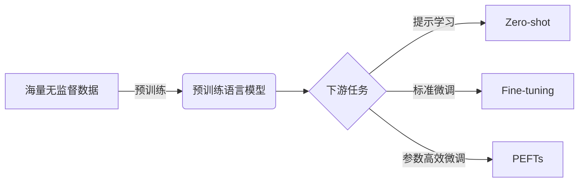

# 大语言模型应用指南：数据准备和参数微调

## 1. 背景介绍

大语言模型(Large Language Models, LLMs)如GPT-3、PaLM、LaMDA等,在自然语言处理(NLP)领域取得了巨大的突破和广泛应用。这些模型通过在海量文本数据上进行预训练,可以学习到语言的深层次语义表示和泛化能力,在机器翻译、问答系统、文本生成、对话系统等任务上取得了接近甚至超越人类的性能。

然而,直接使用预训练的大语言模型应用到下游任务时,往往达不到最优的效果。这是因为:
1. 下游任务的数据分布与预训练数据差异较大,存在domain shift问题
2. 预训练的目标与下游任务目标不完全一致,需要进行任务适配

因此,为了充分发挥大语言模型的能力,需要在下游任务的数据上对模型进行微调(finetune),使其更好地适应特定任务。本文将全面介绍大语言模型应用的两大关键技术:数据准备和参数微调,帮助大家更好地掌握和应用大语言模型。

## 2. 核心概念与联系

在讨论数据准备和参数微调之前,我们先来了解几个核心概念:

- 预训练(Pre-training):在大规模无监督数据上训练语言模型,学习通用的语言表示。主要方法有BERT的MLM和GPT的因果语言建模。
- 微调(Fine-tuning):在下游任务的监督数据上,以较小的学习率在预训练模型的基础上继续训练,使其适应特定任务。
- 提示学习(Prompt Learning):通过设计输入文本的提示模板,引导预训练模型执行特定任务,而无需微调模型参数。
- 参数高效微调(Parameter-Efficient Fine-tuning):在微调阶段只训练模型的一小部分参数,显著减少训练开销。代表方法有Adapter、Prefix Tuning、LoRA等。

它们之间的关系如下图所示:



## 3. 数据准备

数据准备是应用大语言模型的第一步,高质量的训练数据是模型性能的基础。以下是数据准备的关键步骤:

### 3.1 数据收集与清洗

- 根据任务目标,从业务日志、开源数据集、爬虫等渠道收集原始数据
- 对原始文本进行清洗,去除HTML标签、特殊字符、emoji等噪声
- 过滤掉低质量数据,如重复、错别字较多、长度异常的文本

### 3.2 数据标注

- 对于一些监督学习任务如文本分类、序列标注等,需要人工标注训练数据
- 制定标注规范,保证标注质量和一致性 
- 采用主动学习、少样本学习等方法,减少标注成本

### 3.3 数据增强

- 通过同义词替换、回译、掩码预测等方式,自动生成新的训练样本
- 引入负样本,提高模型的鲁棒性和泛化能力
- 数据增强可有效缓解标注数据不足的问题

### 3.4 数据预处理

- 将文本转换为模型输入格式,如token id、位置编码等
- 对输入进行截断、padding,保证batch内长度一致 
- 构建训练、验证、测试集,一般比例为8:1:1

## 4. 参数微调

### 4.1 微调的必要性

大语言模型在海量语料上学习到了丰富的语言知识,具备强大的语言理解和生成能力。但由于下游任务的数据分布和目标函数与预训练阶段存在差异,直接应用预训练模型的效果往往不够理想,需要在任务数据上进行微调,使其更好地适应特定任务。微调的优势主要体现在:

- 缓解了任务数据不足的问题,通过迁移学习充分利用预训练模型学习到的通用语言知识
- 更好地适应任务的数据分布,学习任务特定的模式
- 在预训练的基础上进一步提升模型性能,实现state-of-the-art

### 4.2 微调的流程

微调的一般流程如下:

1. 加载预训练模型权重
2. 根据任务需要,在预训练模型上添加新的层,如分类头、生成头等
3. 使用任务数据对整个模型进行训练,一般使用较小的学习率,如1e-5
4. 评估模型在验证集上的性能,根据需要调整超参数
5. 在测试集上评估最终性能

以下是使用PyTorch和Transformers库进行微调的简要示例:

```python
from transformers import AutoModelForSequenceClassification, AutoTokenizer, Trainer, TrainingArguments

# 加载预训练模型和tokenizer 
model_name = "bert-base-uncased"
model = AutoModelForSequenceClassification.from_pretrained(model_name, num_labels=2)
tokenizer = AutoTokenizer.from_pretrained(model_name)

# 准备训练数据
train_texts = ["text1", "text2", ...]
train_labels = [0, 1, ...]
train_encodings = tokenizer(train_texts, truncation=True, padding=True)
train_dataset = Dataset(train_encodings, train_labels)

# 定义训练参数和Trainer
training_args = TrainingArguments(
    output_dir='./results',          
    num_train_epochs=3,              
    per_device_train_batch_size=16,  
    per_device_eval_batch_size=64,   
    warmup_steps=500,               
    learning_rate=2e-5,
    logging_dir='./logs',            
)
trainer = Trainer(
    model=model,                     
    args=training_args,              
    train_dataset=train_dataset,    
)

# 开始训练
trainer.train()
```

### 4.3 微调技巧

为了进一步提升微调的效果,可以采用以下一些技巧:

- 设计良好的提示模板(prompt),引导模型生成期望的输出
- 使用更大规模的预训练模型,如GPT-3、T5等
- 采用领域自适应预训练(domain-adaptive pre-training),在目标领域语料上进一步预训练模型
- 使用多任务学习(multi-task learning),联合训练多个相关任务
- 采用对抗训练(adversarial training)、数据增强等方法,提高模型鲁棒性
- 使用参数高效微调技术,在更新一小部分参数的同时获得与全量微调相当的效果

## 5. 参数高效微调

### 5.1 参数高效微调的动机

标准的微调需要在全部或大部分模型参数上进行训练,对算力和内存要求较高,在资源受限的情况下难以应用。同时,全参数微调也可能面临过拟合、灾难性遗忘等风险。因此,研究人员提出了一系列参数高效微调(Parameter-Efficient Fine-tuning, PEFT)技术,在只训练一小部分参数的情况下,获得与全量微调相当甚至更好的效果。

### 5.2 参数高效微调方法

目前主流的参数高效微调方法包括:

- Adapter:在预训练模型的每一层中插入少量可训练参数,在微调阶段只训练这些参数。
- Prefix Tuning:在输入embedding中拼接可训练的prefix向量,在微调阶段只训练这些prefix参数。
- LoRA:在预训练模型的每一层上添加低秩分解矩阵(Low-Rank Adaptation),在微调阶段只训练这些低秩矩阵。
- BitFit:只微调预训练模型的bias参数,冻结其余参数。
- Diff Pruning:通过修剪预训练权重与微调权重的差值,实现参数高效微调。

以LoRA为例,其核心思想是将微调过程中的权重更新分解为预训练权重和低秩自适应矩阵的乘积:

$$W_{tuned} = W_{pretrained} + \Delta W = W_{pretrained} + BA$$

其中$W_{pretrained}$是预训练权重,$\Delta W$是微调过程中的权重更新,可以分解为两个低秩矩阵$B$和$A$的乘积。在微调阶段,只需要学习$B$和$A$两个矩阵,大大减少了参数量和计算开销。

LoRA的PyTorch实现如下:

```python
class LoRALayer(nn.Module):
    def __init__(self, in_features, out_features, r=8):
        super().__init__()
        self.linear = nn.Linear(in_features, out_features)
        self.lora_down = nn.Linear(in_features, r, bias=False)
        self.lora_up = nn.Linear(r, out_features, bias=False)
        self.r = r
        
    def forward(self, x):
        return self.linear(x) + self.lora_up(self.lora_down(x))

# 在预训练模型的每一层上插入LoRA层
model = BertModel.from_pretrained('bert-base-uncased') 
for name, module in model.named_modules():
    if isinstance(module, nn.Linear):
        lora_layer = LoRALayer(module.in_features, module.out_features) 
        setattr(model, name, lora_layer)

# 微调阶段只训练LoRA层的参数
for name, param in model.named_parameters():
    if 'lora' not in name:
        param.requires_grad = False
```

## 6. 实际应用场景

大语言模型已在各行各业得到广泛应用,下面列举几个典型场景:

### 6.1 智能客服

- 利用大语言模型构建客服对话系统,自动回答用户的常见问题
- 通过微调使模型学习客服业务知识库,提高回答的专业性和准确性
- 典型案例:京东JIMI、阿里小蜜等

### 6.2 内容生成 

- 利用大语言模型自动生成高质量的文本内容,如新闻报道、产品描述、文案等
- 通过提示工程引导模型生成符合需求的内容
- 典型案例:腾讯Dreamwriter、阿里达摩院文心等

### 6.3 代码生成

- 利用大语言模型根据自然语言描述自动生成代码
- 通过在编程语料上微调,使模型掌握语法和API知识
- 典型案例:GitHub Copilot、OpenAI Codex等

### 6.4 知识图谱构建

- 利用大语言模型从非结构化文本中抽取实体、关系、属性等知识
- 通过微调使模型适应特定领域的知识抽取任务
- 典型案例:复旦FastKG、清华CKBQA等

## 7. 工具和资源推荐

- 🤗Transformers:支持主流预训练模型的开源库,https://github.com/huggingface/transformers
- 🤗Datasets:支持多种常用NLP数据集的开源库,https://github.com/huggingface/datasets
- Hugging Face Hub:提供各种预训练模型的模型库,https://huggingface.co/models
- OpenPrompt:提示学习工具包,https://github.com/thunlp/OpenPrompt
- PEFT:参数高效微调工具包,https://github.com/huggingface/peft
- LMFlow:支持多种大语言模型的训练和应用平台,https://github.com/OptimalScale/LMFlow

## 8. 总结与展望

大语言模型是当前NLP领域最前沿、最有潜力的技术之一,通过在海量语料上学习通用语言知识,再结合数据准备和参数微调,可以在各种任务上取得SOTA性能。未来随着算力和数据规模的进一步提升,以及微调、提示等技术的不断创新,大语言模型的性能还将持续提高,应用领域也会更加广泛。同时,大语言模型在安全、隐私、公平等方面也面临诸多挑战,需要学界和业界的共同努力。

## 9. 常见问题

Q: 大语言模型的预训练数据需要多大规模?
A: 目前主流的大语言模型如GPT-3、PaLM的预训练数据规模都在千亿token量级,且多元化覆盖各种领域和体裁。但即使在更小的数据规模下,如十亿token量级,也可以训练出性能不错的模型。

Q: 在下游任务数据很少的情况下,如何更好地应用大语言模型?  
A: 可以采用few-shot learning的范式,通过设计提示模板(prompt)引导模型进行任务适配。也可以在目标领域语料