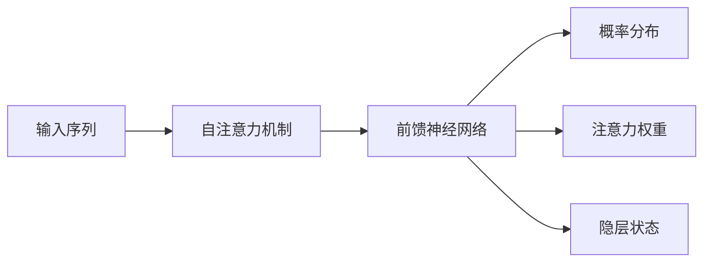

# 大语言模型应用指南：模型响应返回的参数

## 1. 背景介绍
### 1.1 大语言模型的发展历程
#### 1.1.1 早期的语言模型
#### 1.1.2 Transformer 的出现
#### 1.1.3 预训练语言模型的崛起

### 1.2 大语言模型的应用现状
#### 1.2.1 自然语言处理领域的应用
#### 1.2.2 对话系统和聊天机器人
#### 1.2.3 知识问答和信息检索

### 1.3 模型响应返回参数的重要性
#### 1.3.1 提高模型可解释性
#### 1.3.2 方便下游任务的应用
#### 1.3.3 增强人机交互体验

## 2. 核心概念与联系
### 2.1 大语言模型的基本原理
#### 2.1.1 自注意力机制
#### 2.1.2 位置编码
#### 2.1.3 前馈神经网络

### 2.2 模型响应返回参数的类型
#### 2.2.1 概率分布
#### 2.2.2 注意力权重
#### 2.2.3 隐层状态

### 2.3 模型响应返回参数之间的关系
#### 2.3.1 概率分布与注意力权重的关系
#### 2.3.2 隐层状态与概率分布的关系
#### 2.3.3 注意力权重与隐层状态的关系



## 3. 核心算法原理具体操作步骤
### 3.1 获取模型响应的概率分布
#### 3.1.1 Softmax 函数的应用
#### 3.1.2 Top-k 采样
#### 3.1.3 Nucleus 采样

### 3.2 获取模型响应的注意力权重
#### 3.2.1 自注意力机制的计算过程
#### 3.2.2 提取注意力权重矩阵
#### 3.2.3 可视化注意力权重

### 3.3 获取模型响应的隐层状态
#### 3.3.1 前馈神经网络的计算过程
#### 3.3.2 提取隐层状态向量
#### 3.3.3 降维可视化隐层状态

## 4. 数学模型和公式详细讲解举例说明
### 4.1 Softmax 函数
$$
\text{Softmax}(x_i) = \frac{e^{x_i}}{\sum_{j=1}^{n} e^{x_j}}
$$

### 4.2 自注意力机制
$$
\text{Attention}(Q, K, V) = \text{softmax}(\frac{QK^T}{\sqrt{d_k}})V
$$

### 4.3 前馈神经网络
$$
\text{FFN}(x) = \max(0, xW_1 + b_1)W_2 + b_2
$$

## 5. 项目实践：代码实例和详细解释说明
### 5.1 使用 PyTorch 获取模型响应的概率分布
```python
import torch
from transformers import GPT2LMHeadModel, GPT2Tokenizer

model = GPT2LMHeadModel.from_pretrained('gpt2')
tokenizer = GPT2Tokenizer.from_pretrained('gpt2')

input_text = "The quick brown fox"
input_ids = tokenizer.encode(input_text, return_tensors='pt')

with torch.no_grad():
    outputs = model(input_ids)
    logits = outputs.logits
    probs = torch.softmax(logits[0, -1], dim=0)

top_k = 5
top_k_probs, top_k_indices = torch.topk(probs, k=top_k)

print(f"Top {top_k} predictions:")
for i in range(top_k):
    predicted_token = tokenizer.decode([top_k_indices[i]])
    probability = top_k_probs[i].item()
    print(f"{predicted_token}: {probability:.4f}")
```

### 5.2 使用 TensorFlow 获取模型响应的注意力权重
```python
import tensorflow as tf
from transformers import TFBertModel, BertTokenizer

model = TFBertModel.from_pretrained('bert-base-uncased')
tokenizer = BertTokenizer.from_pretrained('bert-base-uncased')

input_text = "The quick brown fox jumps over the lazy dog."
input_ids = tokenizer.encode(input_text, return_tensors='tf')

outputs = model(input_ids)
attention_weights = outputs.attentions

# 输出第一层注意力权重的形状
print(f"Attention weights shape: {attention_weights[0].shape}")

# 可视化第一层注意力权重
import matplotlib.pyplot as plt
plt.imshow(attention_weights[0][0])
plt.xlabel('Key')
plt.ylabel('Query')
plt.colorbar()
plt.show()
```

### 5.3 使用 Keras 获取模型响应的隐层状态
```python
from transformers import TFAutoModel, AutoTokenizer
import tensorflow as tf

model = TFAutoModel.from_pretrained('bert-base-uncased')
tokenizer = AutoTokenizer.from_pretrained('bert-base-uncased')

input_text = "The quick brown fox jumps over the lazy dog."
input_ids = tokenizer.encode(input_text, return_tensors='tf')

hidden_states = model(input_ids).last_hidden_state

# 输出隐层状态的形状
print(f"Hidden states shape: {hidden_states.shape}")

# 降维可视化隐层状态
from sklearn.manifold import TSNE
tsne = TSNE(n_components=2, random_state=42)
hidden_states_2d = tsne.fit_transform(hidden_states[0])

plt.figure(figsize=(8, 8))
plt.scatter(hidden_states_2d[:, 0], hidden_states_2d[:, 1])
plt.xlabel('Dimension 1')
plt.ylabel('Dimension 2')
plt.show()
```

## 6. 实际应用场景
### 6.1 自然语言生成
#### 6.1.1 文本续写
#### 6.1.2 对话生成
#### 6.1.3 故事生成

### 6.2 情感分析
#### 6.2.1 基于注意力权重的情感分析
#### 6.2.2 基于隐层状态的情感分析
#### 6.2.3 多模态情感分析

### 6.3 文本分类
#### 6.3.1 基于概率分布的文本分类
#### 6.3.2 基于注意力权重的文本分类
#### 6.3.3 基于隐层状态的文本分类

## 7. 工具和资源推荐
### 7.1 开源工具包
#### 7.1.1 Transformers
#### 7.1.2 Hugging Face
#### 7.1.3 Flair

### 7.2 预训练模型
#### 7.2.1 BERT
#### 7.2.2 GPT系列
#### 7.2.3 XLNet

### 7.3 数据集
#### 7.3.1 WikiText
#### 7.3.2 Penn Treebank
#### 7.3.3 BookCorpus

## 8. 总结：未来发展趋势与挑战
### 8.1 模型响应返回参数的未来发展方向
#### 8.1.1 更细粒度的参数返回
#### 8.1.2 参数的可解释性增强
#### 8.1.3 参数的实时可视化

### 8.2 大语言模型面临的挑战
#### 8.2.1 计算资源的限制
#### 8.2.2 数据隐私和安全问题
#### 8.2.3 模型的公平性和偏见问题

### 8.3 未来研究方向展望
#### 8.3.1 模型压缩和加速技术
#### 8.3.2 联邦学习和隐私保护
#### 8.3.3 模型的可解释性和可控性

## 9. 附录：常见问题与解答
### 9.1 如何选择合适的大语言模型？
### 9.2 如何处理模型响应返回参数的噪声？
### 9.3 如何平衡模型性能和计算资源？
### 9.4 如何解决模型的偏见问题？
### 9.5 如何保护用户数据隐私？

作者：禅与计算机程序设计艺术 / Zen and the Art of Computer Programming