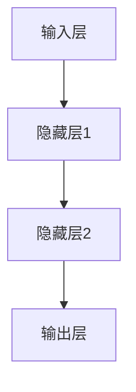
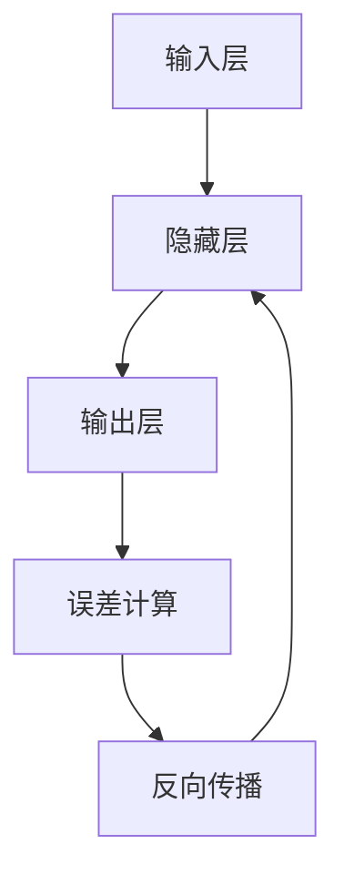
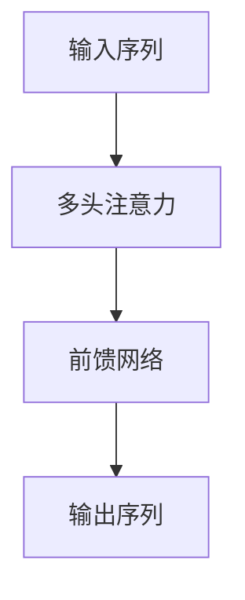

# 大语言模型应用指南：神经网络的发展历史

## 1. 背景介绍

### 1.1 人工智能的崛起

人工智能(Artificial Intelligence, AI)是当代科技领域最具变革性的力量之一。自20世纪中叶诞生以来,AI技术的发展一直备受关注,并在过去十年内取得了令人瞩目的进展。其中,神经网络(Neural Network)作为AI的核心技术之一,在语音识别、图像识别、自然语言处理等领域发挥着关键作用。

### 1.2 神经网络的重要性

神经网络是一种受生物神经系统启发而设计的计算模型,具有自主学习和模式识别的能力。它通过对大量数据进行训练,逐步优化内部参数,从而获得对特定任务的解决方案。随着计算能力和数据量的不断增长,神经网络在各个领域展现出了令人惊叹的性能表现,成为推动人工智能发展的核心动力。

### 1.3 大语言模型的兴起

在自然语言处理领域,大语言模型(Large Language Model, LLM)凭借其强大的语言理解和生成能力,成为了近年来最引人注目的技术突破。这些模型通过对海量文本数据进行预训练,获得了广博的知识储备和出色的语言表达能力,为各种语言相关任务提供了强有力的支持。

## 2. 核心概念与联系

### 2.1 神经网络的基本结构

神经网络的基本结构由多层神经元组成,每个神经元接收来自前一层的输入信号,经过加权求和和非线性激活函数的处理,产生输出信号传递给下一层。这种层层传递的结构赋予了神经网络强大的表达能力,使其能够学习复杂的映射关系。

### 2.2 前馈神经网络与反向传播算法

前馈神经网络(Feedforward Neural Network)是最基本的神经网络结构,其中信号只从输入层向输出层单向传播。为了训练这种网络,反向传播算法(Backpropagation)被广泛应用。该算法通过计算输出误差对各层参数的梯度,并沿着反方向更新参数,从而逐步减小输出误差,优化网络性能。

### 2.3 卷积神经网络与自然语言处理

卷积神经网络(Convolutional Neural Network, CNN)最初被设计用于图像处理任务,通过卷积操作和池化操作自动提取图像特征。后来,CNN也被成功应用于自然语言处理领域,例如通过将文本表示为词嵌入矩阵,利用卷积操作捕捉局部语义信息,从而实现文本分类、机器翻译等任务。

### 2.4 循环神经网络与序列建模

循环神经网络(Recurrent Neural Network, RNN)是专门设计用于处理序列数据的神经网络结构。它通过在隐藏层中引入循环连接,使得网络能够捕捉序列中的长期依赖关系,从而更好地处理文本、语音等时序数据。长短期记忆网络(Long Short-Term Memory, LSTM)和门控循环单元(Gated Recurrent Unit, GRU)等变体进一步提高了RNN的性能。

### 2.5 注意力机制与transformer模型

注意力机制(Attention Mechanism)是一种允许神经网络动态关注输入数据不同部分的机制,它极大地提高了模型的表达能力和计算效率。Transformer模型是基于注意力机制构建的一种全新的神经网络架构,它完全放弃了RNN的序列结构,而是通过自注意力(Self-Attention)机制直接捕捉输入序列中任意两个位置之间的依赖关系,从而实现了更加高效、并行化的序列建模。

### 2.6 大语言模型的预训练与微调

大语言模型通过在海量无标注文本数据上进行预训练,学习到了丰富的语言知识和上下文表示能力。预训练过程中,模型被训练去预测下一个词或是被遮蔽的词,从而获得对语言的深入理解。预训练完成后,这些模型可以通过在特定任务上进行微调(Fine-tuning),快速适应新的任务,显著提高了自然语言处理的性能和效率。

## 3. 核心算法原理具体操作步骤

### 3.1 前馈神经网络训练

1. **网络初始化**:随机初始化网络中所有可训练参数(权重和偏置)的值。
2. **前向传播**:输入数据通过网络进行前向传播,计算输出值。
3. **损失函数计算**:比较网络输出与真实标签之间的差异,计算损失函数值。
4. **反向传播**:利用链式法则,计算损失函数关于每个参数的梯度。
5. **参数更新**:使用优化算法(如梯度下降)根据梯度值更新网络参数。
6. **迭代训练**:重复步骤2-5,直到模型收敛或达到预设的迭代次数。

### 3.2 卷积神经网络训练

1. **输入预处理**:将输入数据(如图像)转换为适当的张量表示。
2. **卷积层**:对输入数据进行卷积操作,提取局部特征。
3. **池化层**:对卷积层输出进行下采样,减小特征图尺寸。
4. **全连接层**:将特征图展平,输入到全连接层进行高级特征组合。
5. **输出层**:根据任务类型(如分类或回归),设计合适的输出层。
6. **损失函数与优化**:与前馈神经网络类似,计算损失函数并进行反向传播优化。

### 3.3 循环神经网络训练

1. **输入预处理**:将序列数据(如文本)转换为适当的张量表示(如词嵌入)。
2. **RNN层**:将序列输入依次传递给RNN单元,获取每个时间步的隐藏状态。
3. **输出层**:根据任务类型(如序列标注或序列生成),设计合适的输出层。
4. **损失函数与优化**:与前馈神经网络类似,计算损失函数并进行反向传播优化。
5. **梯度裁剪**:由于RNN易出现梯度爆炸或梯度消失问题,需要对梯度进行裁剪。

### 3.4 Transformer模型训练

1. **输入嵌入**:将输入序列(如文本)转换为词嵌入表示,并添加位置编码。
2. **多头注意力**:计算输入序列中每个位置与其他位置的注意力权重。
3. **前馈网络**:对注意力输出进行非线性变换,产生新的序列表示。
4. **编码器-解码器结构**:对于序列生成任务,需要使用编码器-解码器架构。
5. **掩码机制**:在解码器中使用掩码机制,防止利用未来信息。
6. **损失函数与优化**:与前馈神经网络类似,计算损失函数并进行反向传播优化。

### 3.5 大语言模型预训练

1. **语料准备**:收集大量高质量的无标注文本语料,如网页、书籍等。
2. **词嵌入初始化**:可选择从现有词嵌入模型(如Word2Vec或GloVe)初始化。
3. **预训练任务**:设计预训练任务,如掩码语言模型(Masked Language Model)或下一句预测(Next Sentence Prediction)。
4. **预训练过程**:在海量语料上迭代训练,优化预训练任务的损失函数。
5. **模型保存**:保存预训练好的模型权重,用于后续的微调或推理任务。

### 3.6 大语言模型微调

1. **任务数据准备**:收集与目标任务相关的标注数据集。
2. **模型加载**:加载预训练好的大语言模型权重。
3. **输入处理**:将任务数据转换为模型可接受的输入格式。
4. **微调过程**:在任务数据上进行模型微调,优化任务相关的损失函数。
5. **模型评估**:在验证集或测试集上评估微调后模型的性能。
6. **模型部署**:将微调好的模型部署到生产环境中,用于实际应用。

## 4. 数学模型和公式详细讲解举例说明

### 4.1 前馈神经网络

前馈神经网络的基本计算过程可以用以下公式表示:

对于第$l$层的第$j$个神经元,其输出$a_j^{(l)}$计算如下:

$$a_j^{(l)} = g\left(\sum_{i=1}^{n^{(l-1)}} w_{ij}^{(l)}a_i^{(l-1)} + b_j^{(l)}\right)$$

其中:
- $n^{(l-1)}$是第$l-1$层的神经元数量
- $w_{ij}^{(l)}$是连接第$l-1$层第$i$个神经元与第$l$层第$j$个神经元的权重
- $b_j^{(l)}$是第$l$层第$j$个神经元的偏置项
- $g(\cdot)$是非线性激活函数,如sigmoid函数或ReLU函数

在训练过程中,我们需要最小化损失函数$J(\theta)$,其中$\theta$表示所有可训练参数(权重和偏置)的集合。常用的损失函数包括均方误差损失函数和交叉熵损失函数。

对于均方误差损失函数,公式如下:

$$J(\theta) = \frac{1}{2m}\sum_{i=1}^m\left\|y^{(i)} - \hat{y}^{(i)}\right\|^2$$

其中:
- $m$是训练样本数量
- $y^{(i)}$是第$i$个样本的真实标签
- $\hat{y}^{(i)}$是第$i$个样本的网络输出

对于交叉熵损失函数(用于分类任务),公式如下:

$$J(\theta) = -\frac{1}{m}\sum_{i=1}^m\sum_{j=1}^C y_j^{(i)}\log\hat{y}_j^{(i)}$$

其中:
- $C$是分类数量
- $y_j^{(i)}$是第$i$个样本属于第$j$类的真实标签(0或1)
- $\hat{y}_j^{(i)}$是第$i$个样本属于第$j$类的预测概率

通过反向传播算法计算损失函数关于每个参数的梯度,并使用优化算法(如梯度下降)更新参数,从而最小化损失函数,提高模型性能。

### 4.2 卷积神经网络

卷积神经网络中的卷积操作可以用以下公式表示:

$$s(i, j) = (I * K)(i, j) = \sum_{m}\sum_{n}I(i+m, j+n)K(m, n)$$

其中:
- $I$是输入特征图
- $K$是卷积核(滤波器)
- $s(i, j)$是输出特征图在位置$(i, j)$处的值
- $m$和$n$分别表示卷积核在高度和宽度上的偏移量

通过在输入特征图上滑动卷积核,并在每个位置进行点积运算,我们可以获得输出特征图。卷积操作能够有效捕捉输入数据的局部模式和空间关系。

池化操作通常在卷积层之后使用,目的是减小特征图的空间尺寸,从而降低计算复杂度并提高模型的鲁棒性。最大池化和平均池化是两种常见的池化方式。

对于最大池化,公式如下:

$$\text{max\_pool}(r, s) = \max_{(i, j) \in R}I(r+i, s+j)$$

其中:
- $R$是池化区域(如$2\times2$区域)
- $I$是输入特征图
- $\text{max\_pool}(r, s)$是输出特征图在位置$(r, s)$处的值,即池化区域内的最大值

### 4.3 循环