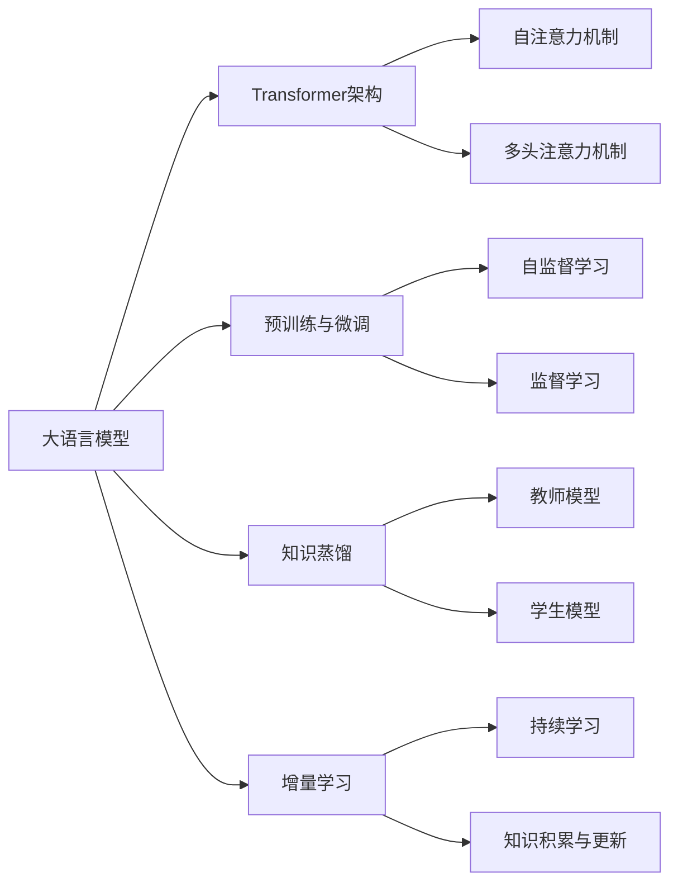

# 大语言模型应用指南：网页实时浏览

## 1. 背景介绍

### 1.1 大语言模型的崛起
近年来,随着深度学习技术的飞速发展,以Transformer为代表的大语言模型(Large Language Model, LLM)在自然语言处理(Natural Language Processing, NLP)领域取得了突破性的进展。从GPT、BERT到GPT-3,大语言模型展现出了惊人的语言理解和生成能力,为NLP应用开辟了广阔的前景。

### 1.2 大语言模型在Web领域的应用潜力
大语言模型强大的语义理解和知识表示能力,使其在Web领域具有巨大的应用潜力。传统的Web浏览方式依赖于关键词检索和超链接跳转,难以满足用户日益增长的个性化信息需求。而大语言模型可以深入理解网页内容,提取关键信息,并根据用户意图动态生成相关内容,实现更加智能化、个性化的网页浏览体验。

### 1.3 实时网页浏览的挑战与机遇
然而,将大语言模型应用于实时网页浏览仍面临诸多挑战。一方面,Web数据的规模庞大、格式多样,对模型的泛化能力和鲁棒性提出了更高要求；另一方面,实时交互对模型的推理速度和资源消耗也提出了严峻考验。如何在保证模型性能的同时,实现高效、实时的网页浏览,是一个亟待解决的难题。本文将深入探讨大语言模型在实时网页浏览中的应用,分析其关键技术、实践案例和未来发展方向,为相关研究和应用提供参考。

## 2. 核心概念与联系

### 2.1 大语言模型
大语言模型是一类基于深度神经网络,在大规模文本语料上预训练得到的语言模型。其核心思想是利用自监督学习,通过对海量无标注文本数据的建模,让模型自主学习语言的内在规律和知识,从而获得强大的语言理解和生成能力。代表性的大语言模型包括GPT系列、BERT系列等。

### 2.2 Transformer架构
Transformer是大语言模型的核心架构,由Vaswani等人于2017年提出。与传统的循环神经网络(RNN)和卷积神经网络(CNN)不同,Transformer完全基于注意力机制(Attention Mechanism),通过自注意力(Self-Attention)和多头注意力(Multi-Head Attention)捕捉序列内部和序列间的长距离依赖关系,极大地提升了模型的并行计算效率和泛化能力。

### 2.3 预训练与微调
大语言模型的训练通常分为两个阶段:预训练(Pre-training)和微调(Fine-tuning)。预训练阶段在大规模无标注语料上进行自监督学习,让模型掌握通用的语言知识和表征能力；微调阶段在特定任务的标注数据上进行监督学习,使模型适应具体的应用场景。这种"预训练+微调"的范式大大降低了任务特定数据的需求,提高了模型的泛化性和可迁移性。

### 2.4 知识蒸馏
知识蒸馏(Knowledge Distillation)是一种将大模型的知识转移到小模型的技术。其基本思路是用大模型(教师模型)的输出作为小模型(学生模型)的软目标(Soft Target),引导学生模型学习教师模型的知识和行为。通过知识蒸馏,可以在保留大模型性能的同时,大幅降低模型的参数量和推理开销,实现轻量化部署。

### 2.5 增量学习
增量学习(Incremental Learning)是一种持续学习的范式,旨在让模型在不断接收新数据的同时,保持对旧知识的记忆和利用。在Web领域,增量学习可以帮助模型适应不断变化的网页内容和用户需求,实现知识的持续积累和更新。常见的增量学习方法包括微调、参数隔离、知识蒸馏等。

### 2.6 核心概念关系图
下面使用Mermaid流程图展示上述核心概念之间的关系:

## 3. 核心算法原理与具体操作步骤

### 3.1 大语言模型的预训练算法

#### 3.1.1 基于自回归的语言模型
基于自回归的语言模型(如GPT系列)采用单向的Transformer Decoder结构,通过最大化下一个词的条件概率来学习语言的生成规律。其训练目标是最小化负对数似然损失:

$$
L(\theta)=-\sum_{i=1}^{n} \log P\left(x_{i} | x_{<i} ; \theta\right)
$$

其中,$x_i$表示第$i$个词,$x_{<i}$表示前$i-1$个词,$\theta$为模型参数。

训练步骤如下:
1. 将输入序列$x$通过词嵌入(Word Embedding)和位置编码(Positional Encoding)映射为连续向量表示。
2. 将向量表示通过多层Transformer Decoder块进行编码,捕捉序列内部的长距离依赖关系。
3. 在每个位置上,通过线性变换和Softmax函数计算下一个词的条件概率分布。
4. 计算负对数似然损失,并通过反向传播算法更新模型参数。

#### 3.1.2 基于去噪的语言模型 
基于去噪的语言模型(如BERT系列)采用双向的Transformer Encoder结构,通过重建被随机遮挡(Masking)的词来学习语言的理解规律。其训练目标是最小化被遮挡词的预测误差:

$$
L(\theta)=-\sum_{i=1}^{m} \log P\left(x_{t_{i}} | \hat{x} ; \theta\right)
$$

其中,$\hat{x}$表示被遮挡后的输入序列,$x_{t_i}$表示第$i$个被遮挡词的真实值,$m$为被遮挡词的数量。

训练步骤如下:  
1. 随机遮挡输入序列$x$中的部分词,得到被遮挡后的序列$\hat{x}$。
2. 将$\hat{x}$通过词嵌入和位置编码映射为连续向量表示。
3. 将向量表示通过多层Transformer Encoder块进行编码,捕捉序列内部的双向语义信息。
4. 在每个被遮挡位置上,通过线性变换和Softmax函数计算真实词的条件概率分布。
5. 计算被遮挡词的预测误差,并通过反向传播算法更新模型参数。

### 3.2 大语言模型的微调算法

#### 3.2.1 有监督微调
有监督微调是指在特定任务的标注数据上对预训练模型进行监督学习,使其适应具体的应用场景。以文本分类任务为例,其训练目标是最小化交叉熵损失:

$$
L(\theta)=-\sum_{i=1}^{N} \sum_{j=1}^{C} y_{i j} \log \hat{y}_{i j}
$$

其中,$N$为训练样本数,$C$为类别数,$y_{ij}$为样本$i$在类别$j$上的真实标签,$\hat{y}_{ij}$为模型预测的概率值。

微调步骤如下:
1. 在预训练模型的顶部添加任务特定的输出层(如线性分类器)。
2. 将任务数据通过预训练模型的Transformer结构进行编码,得到样本的向量表示。
3. 将样本表示通过输出层映射为类别概率分布。 
4. 计算交叉熵损失,并通过反向传播算法更新模型参数(可选择性地固定部分预训练参数)。

#### 3.2.2 无监督微调
无监督微调是指在无标注数据上对预训练模型进行自监督学习,提升其在目标领域的适应性。常见的无监督微调方法包括领域自适应预训练(Domain-Adaptive Pre-training, DAPT)和任务自适应预训练(Task-Adaptive Pre-training, TAPT)。

以DAPT为例,其训练目标是最小化目标领域数据上的语言建模损失:

$$
L(\theta)=-\sum_{i=1}^{n} \log P\left(x_{i} | x_{<i} ; \theta\right)
$$

其中,$x_i$表示目标领域数据中的第$i$个词。

DAPT的训练步骤与语言模型预训练类似,区别在于训练数据来自目标领域,且初始参数来自预训练模型。通过在目标领域数据上进一步预训练,模型可以学习领域特定的语言模式和知识,提高下游任务的性能。

### 3.3 知识蒸馏算法

知识蒸馏是一种将大模型的知识转移到小模型的技术,可以在保留大模型性能的同时降低计算开销。以软化温度(Temperature)的知识蒸馏为例,其训练目标是最小化学生模型和教师模型的软化输出之间的KL散度:

$$
L_{K D}(\theta)=\sum_{i=1}^{N} \sum_{j=1}^{C} p_{i j}^{T} \log \frac{p_{i j}^{T}}{q_{i j}^{T}}
$$

其中,$p_{ij}^T$和$q_{ij}^T$分别表示教师模型和学生模型在样本$i$类别$j$上的软化概率值,温度$T$用于控制概率分布的平滑度。

蒸馏步骤如下:
1. 在教师模型上计算训练样本的软化概率分布$p^T$。
2. 在学生模型上计算训练样本的软化概率分布$q^T$。
3. 计算软化概率分布之间的KL散度损失$L_{KD}$。
4. 计算学生模型的任务损失(如交叉熵损失)$L_{task}$。
5. 将两种损失加权求和,得到总的训练目标:$L=\alpha L_{KD}+(1-\alpha)L_{task}$。
6. 通过反向传播算法更新学生模型参数。

其中,$\alpha$为平衡因子,控制蒸馏损失和任务损失的相对重要性。

### 3.4 增量学习算法

增量学习旨在让模型在不断接收新数据的同时,保持对旧知识的记忆和利用。以基于正则化的增量学习为例,其核心思想是在更新模型参数时,引入正则化项以防止参数剧烈变化,减轻灾难性遗忘(Catastrophic Forgetting)。

假设在第$t$个增量阶段,模型参数为$\theta_t$,新增数据为$D_t$,正则化项为$R(\theta)$,则训练目标可表示为:

$$
L(\theta)=L_{D_{t}}(\theta)+\lambda R(\theta)
$$

其中,$L_{D_t}(\theta)$为新增数据上的任务损失,$\lambda$为正则化系数。

常见的正则化项包括L2正则化、弹性权重巩固(Elastic Weight Consolidation, EWC)等。以EWC为例,其正则化项为:

$$
R_{E W C}(\theta)=\sum_{i} \frac{\lambda}{2} F_{i}\left(\theta_{i}-\theta_{t-1, i}\right)^{2}
$$

其中,$F_i$为第$i$个参数在上一阶段的重要性度量(如Fisher信息矩阵),$\theta_{t-1,i}$为上一阶段的参数值。直观地,EWC通过惩罚重要参数的大幅变化,使模型在学习新知识的同时保留旧知识。

增量学习的训练步骤如下:
1. 在新增数据$D_t$上计算任务损失$L_{D_t}(\theta)$。
2. 计算正则化项$R(\theta)$(如EWC)。
3. 将任务损失和正则化项加权求和,得到总的训练目标$L(\theta)$。
4. 通过反向传播算法更新模型参数。
5. 更新正则化项的参数(如Fisher信息矩阵)。

## 4. 数学模型与公式详解

### 4.1 Transformer的自注意力机制