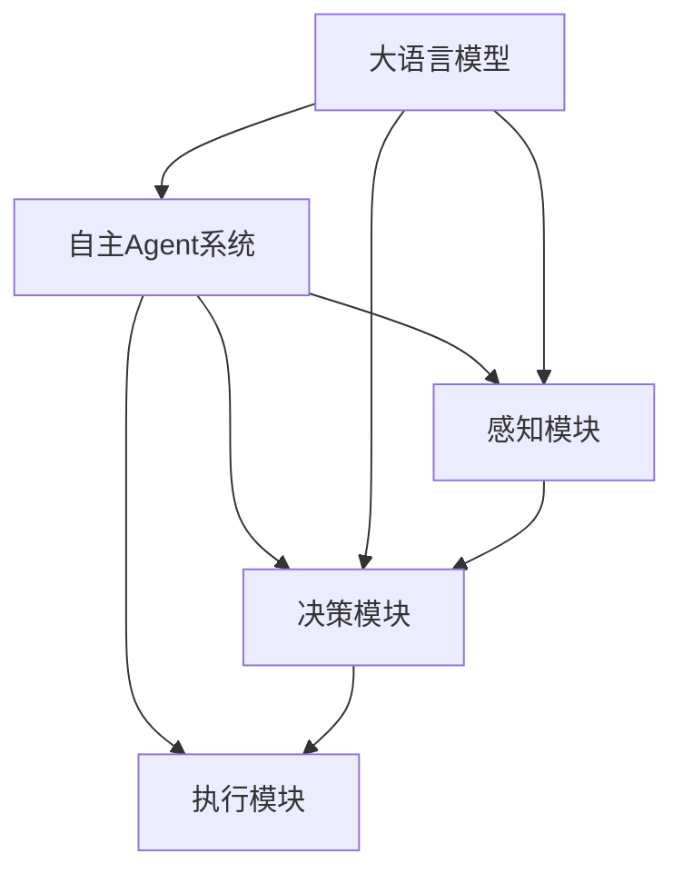

# 大语言模型应用指南：自主Agent系统案例分析（二）

## 1. 背景介绍
### 1.1 大语言模型的发展历程
#### 1.1.1 早期的语言模型
#### 1.1.2 Transformer时代的语言模型 
#### 1.1.3 大规模预训练语言模型的崛起

### 1.2 大语言模型的应用现状
#### 1.2.1 自然语言处理领域的应用
#### 1.2.2 知识问答和对话系统
#### 1.2.3 文本生成和创作辅助

### 1.3 自主Agent系统概述
#### 1.3.1 自主Agent的定义和特点
#### 1.3.2 自主Agent系统的发展历程
#### 1.3.3 大语言模型在自主Agent中的应用价值

## 2. 核心概念与联系
### 2.1 大语言模型的关键技术
#### 2.1.1 Transformer架构
#### 2.1.2 注意力机制
#### 2.1.3 预训练和微调

### 2.2 自主Agent系统的核心组件
#### 2.2.1 感知模块
#### 2.2.2 决策模块 
#### 2.2.3 执行模块

### 2.3 大语言模型与自主Agent的结合
#### 2.3.1 大语言模型作为知识库
#### 2.3.2 大语言模型用于对话理解和生成
#### 2.3.3 大语言模型辅助决策和规划



## 3. 核心算法原理具体操作步骤
### 3.1 基于Prompt的大语言模型调用
#### 3.1.1 设计Prompt模板
#### 3.1.2 few-shot learning
#### 3.1.3 思维链推理

### 3.2 基于大语言模型的对话状态跟踪
#### 3.2.1 对话历史编码
#### 3.2.2 槽位值提取
#### 3.2.3 对话策略学习

### 3.3 基于大语言模型的任务规划
#### 3.3.1 目标分解
#### 3.3.2 动作空间定义
#### 3.3.3 基于规则和逻辑的推理决策

## 4. 数学模型和公式详细讲解举例说明
### 4.1 Transformer的数学原理
Transformer是一种基于自注意力机制的序列到序列模型,其中最核心的部分是自注意力层(Self-Attention Layer)。假设输入序列为 $X=(x_1,x_2,...,x_n)$,其中 $x_i \in \mathbb{R}^d$。自注意力层的计算过程如下:

1. 计算Query矩阵 $Q$, Key矩阵 $K$ 和 Value矩阵 $V$:

$$
\begin{aligned}
Q &= XW^Q \\
K &= XW^K \\
V &= XW^V
\end{aligned}
$$

其中 $W^Q, W^K, W^V \in \mathbb{R}^{d \times d_k}$ 是可学习的权重矩阵。

2. 计算注意力权重:

$$
A = \text{softmax}(\frac{QK^T}{\sqrt{d_k}})
$$

3. 计算注意力输出:

$$
\text{Attention}(Q,K,V) = AV
$$

通过自注意力机制,模型能够捕捉序列中不同位置之间的依赖关系,从而更好地理解和生成序列。

### 4.2 策略梯度的数学推导
在强化学习中,策略梯度是一种常用的优化算法,用于直接优化策略函数 $\pi_\theta(a|s)$。假设在状态 $s$ 下采取动作 $a$ 的概率由 $\pi_\theta(a|s)$ 给出,其中 $\theta$ 是策略函数的参数。那么,策略梯度定理可以表示为:

$$
\nabla_\theta J(\theta) = \mathbb{E}_{\tau \sim p_\theta(\tau)}[\sum_{t=0}^T \nabla_\theta \log \pi_\theta(a_t|s_t) Q^{\pi_\theta}(s_t,a_t)]
$$

其中 $\tau$ 表示一条轨迹 $(s_0,a_0,r_0,s_1,a_1,r_1,...,s_T,a_T,r_T)$,$p_\theta(\tau)$ 表示在策略 $\pi_\theta$ 下生成轨迹 $\tau$ 的概率。$Q^{\pi_\theta}(s_t,a_t)$ 表示在状态 $s_t$ 下采取动作 $a_t$ 的动作值函数。

直观地理解,策略梯度定理告诉我们,可以通过增大能够获得高回报的动作的概率,同时减小获得低回报动作的概率,来提升策略的期望回报。在实践中,我们通常使用蒙特卡洛方法来估计梯度:

$$
\nabla_\theta J(\theta) \approx \frac{1}{N} \sum_{i=1}^N \sum_{t=0}^T \nabla_\theta \log \pi_\theta(a_t^{(i)}|s_t^{(i)}) \hat{Q}^{(i)}
$$

其中 $\hat{Q}^{(i)}$ 是第 $i$ 条轨迹的累积回报。

## 5. 项目实践：代码实例和详细解释说明
下面我们通过一个简单的对话系统案例,来展示如何使用大语言模型构建自主Agent。我们将使用 OpenAI 的 GPT-3 模型作为我们的大语言模型。

```python
import openai

# 设置 OpenAI API Key
openai.api_key = "your_api_key"

# 定义 Prompt 模板
prompt_template = """
你是一个智能助手,请根据用户的输入进行友好、专业、有帮助的回复。

用户: {input}
助手: """

# 定义对话函数
def chat(input_text):
    prompt = prompt_template.format(input=input_text)
    response = openai.Completion.create(
        engine="text-davinci-002",
        prompt=prompt,
        max_tokens=150,
        n=1,
        stop=None,
        temperature=0.7,
    )
    message = response.choices[0].text.strip()
    return message

# 主循环,不断接收用户输入并生成回复
while True:
    user_input = input("用户: ")
    if user_input.lower() in ["bye", "goodbye", "exit"]:
        print("助手: 再见,很高兴为您服务!")
        break
    else:
        assistant_response = chat(user_input)
        print(f"助手: {assistant_response}")
```

在这个例子中,我们首先定义了一个 Prompt 模板,其中包含了对话的上下文和角色设定。然后,我们定义了一个 `chat` 函数,接收用户输入,将其填充到 Prompt 模板中,并调用 GPT-3 的 API 生成回复。最后,我们编写了一个简单的交互循环,不断接收用户输入并生成回复,直到用户说再见为止。

通过这种方式,我们可以利用大语言模型强大的语言理解和生成能力,构建一个简单但有效的对话系统。当然,这只是一个最基本的例子,在实际应用中,我们还需要考虑更多的因素,如多轮对话管理、个性化、知识库集成等。

## 6. 实际应用场景
大语言模型驱动的自主Agent系统在许多领域都有广泛的应用前景,下面列举几个具体的应用场景:

### 6.1 智能客服
利用大语言模型构建智能客服系统,可以自动理解用户问题并给出恰当的回复,大大减轻人工客服的压力,提升用户体验。

### 6.2 虚拟助手
类似 Siri、Alexa 这样的虚拟助手,背后都是大语言模型在支撑。通过语音交互,用户可以让虚拟助手完成打电话、发消息、设置提醒等各种日常任务。

### 6.3 智能教育
将大语言模型应用到教育领域,可以构建智能教学助手。学生可以与助手进行互动,获得个性化的学习指导和知识点解答,提升学习效率。

### 6.4 医疗健康
大语言模型可以帮助构建医疗健康领域的智能应用,如智能问诊系统、健康咨询助手等。通过与患者进行对话,系统可以收集症状信息,给出初步的诊断建议,提供医疗知识普及。

### 6.5 金融服务
在金融领域,大语言模型可以用于构建智能投顾助手,根据用户的风险偏好和投资目标,提供个性化的理财规划和产品推荐。

## 7. 工具和资源推荐
### 7.1 大语言模型平台
- OpenAI API (https://openai.com/)
- Hugging Face (https://huggingface.co/) 
- Google BERT (https://github.com/google-research/bert)

### 7.2 开源对话系统框架
- DeepPavlov (https://deeppavlov.ai/)
- Rasa (https://rasa.com/)
- ParlAI (https://parl.ai/)

### 7.3 相关论文和教程
- Attention Is All You Need (https://arxiv.org/abs/1706.03762) 
- Language Models are Few-Shot Learners (https://arxiv.org/abs/2005.14165)
- The Illustrated Transformer (https://jalammar.github.io/illustrated-transformer/)

## 8. 总结：未来发展趋势与挑战
大语言模型和自主Agent系统的结合,为人机交互和智能应用开辟了新的可能性。未来,我们可以期待看到更多基于大语言模型的智能助手、虚拟员工,甚至是数字人。它们将在各行各业发挥越来越重要的作用,成为人类的得力助手。

然而,要真正实现大语言模型驱动的自主Agent系统,我们还面临许多挑战:

- 可控性:如何确保大语言模型生成的内容符合伦理道德标准,不会产生有害影响?
- 个性化:如何让Agent更好地理解和适应每个用户的个性化需求?
- 知识集成:如何将领域知识更好地集成到大语言模型中,提升Agent的专业能力?
- 安全性:如何保护用户隐私数据,防止恶意攻击和滥用?

这些都是值得学术界和工业界共同探索和攻克的难题。相信通过不断的研究和创新,我们终将迎来大语言模型驱动的自主Agent系统的繁荣发展。

## 9. 附录：常见问题与解答
### 9.1 大语言模型需要多少训练数据?
训练一个高质量的大语言模型通常需要海量的文本数据,以 GPT-3 为例,它使用了 4500 亿个 token 的训练数据,相当于 500 多亿个单词。不过,对于特定领域的应用,我们可以在通用大语言模型的基础上,使用较少的领域数据进行微调,以实现领域适配。

### 9.2 大语言模型的推理速度如何?
大语言模型的推理速度取决于多个因素,如模型大小、硬件配置、输入长度等。在单个 GPU 上,GPT-3 的推理速度可以达到每秒几十个 token。如果需要实时交互,可以通过模型蒸馏、量化、剪枝等技术进行加速。

### 9.3 如何处理大语言模型生成的不确定性?
大语言模型是一种概率生成模型,其输出存在不确定性。为了提高可控性,我们可以采取以下策略:

- 调节温度参数,降低生成的多样性
- 使用 Top-k 采样,只考虑概率最高的 k 个词
- 对生成结果进行后处理和过滤
- 引入外部知识库,对生成内容进行校验

### 9.4 大语言模型会取代人类吗?
大语言模型虽然在许多任务上展现了惊人的能力,但它们仍然是基于模式匹配和统计学习的工具。它们缺乏人类的常识推理、因果思维、情感等高层次能力。因此,大语言模型是人类智能的有益补充,但不太可能完全取代人类。未来,人机协作将成为主流,大语言模型将在其中扮演重要角色。

作者：禅与计算机程序设计艺术 / Zen and the Art of Computer Programming