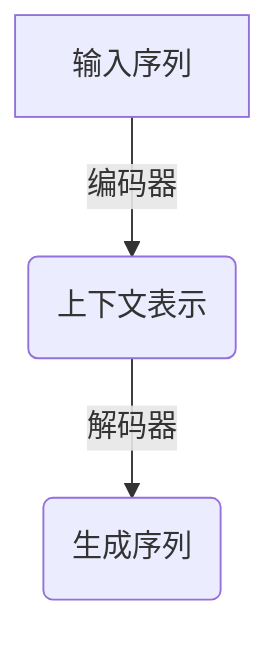
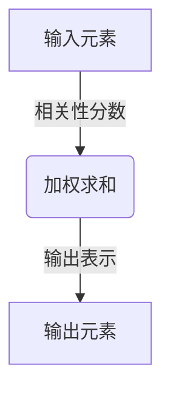
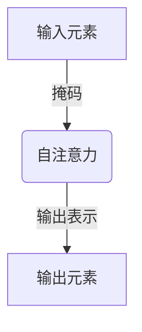
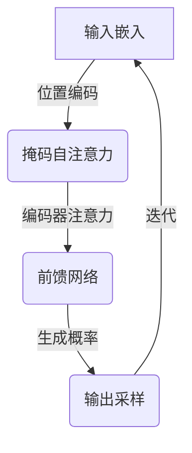

# 大语言模型应用指南：自回归模型与文本生成

## 1.背景介绍

### 1.1 自然语言处理的重要性

在当今信息时代,自然语言处理(NLP)已经成为人工智能领域中最重要和最具挑战性的研究方向之一。自然语言是人类交流和表达思想的主要工具,因此能够让机器理解和生成自然语言对于实现人机交互至关重要。随着大数据和计算能力的不断提高,NLP技术在许多领域得到了广泛应用,如机器翻译、智能问答系统、文本摘要、情感分析等。

### 1.2 语言模型在NLP中的作用

语言模型是NLP中的一个核心概念,旨在捕捉语言的统计规律和语义关系。传统的语言模型通常基于n-gram统计,只能捕捉局部的语法和语义信息。而近年来,benefiting from 大数据和深度学习技术的发展,基于神经网络的大语言模型(Large Language Model,LLM)展现出了强大的语言理解和生成能力,能够学习到全局的语义和上下文信息。

### 1.3 大语言模型的兴起

自2018年以来,一系列基于Transformer的大型语言模型相继问世,如GPT、BERT、XLNet等,展现出了令人惊叹的性能。其中,GPT(Generative Pre-trained Transformer)模型在自然语言生成任务上取得了突破性进展,可以生成看似人类水平的连贯、流畅的文本。这些大语言模型通过在大规模语料库上进行预训练,学习到丰富的语言知识,为下游的NLP任务提供了强有力的基础模型。

## 2.核心概念与联系

### 2.1 自回归语言模型

自回归语言模型(Autoregressive Language Model)是一种常用的语言模型架构,旨在估计一个序列的概率分布。具体来说,它通过学习一个条件概率模型,预测序列中下一个元素的概率分布,条件于之前的元素:

$$P(x_1, x_2, ..., x_n) = \prod_{t=1}^{n}P(x_t|x_1, x_2, ..., x_{t-1})$$

其中$x_t$表示序列中的第t个元素。这种架构常用于文本生成任务,因为它可以一个元素一个元素地生成序列。

### 2.2 Transformer模型

Transformer是一种基于注意力机制的序列到序列模型,由Vaswani等人在2017年提出。它完全基于注意力机制,摒弃了RNN和CNN等传统架构,大大提高了并行计算能力。Transformer的编码器捕捉输入序列的上下文信息,解码器则根据编码器的输出和之前生成的元素,自回归地预测序列的下一个元素。



由于Transformer架构的高度并行性和长距离依赖建模能力,它在机器翻译、文本生成等序列到序列任务上表现出色。

### 2.3 注意力机制

注意力机制是Transformer的核心,允许模型在编码和解码时,对不同位置的输入元素赋予不同的权重,从而捕捉长距离依赖关系。具体来说,对于每个位置的输出元素,注意力机制会计算其与所有输入元素的相关性分数,然后对输入元素进行加权求和,得到该位置的表示。



注意力机制赋予了模型"注意力"的能力,使其能够灵活地关注不同位置的输入信息,极大提高了模型的表达能力。

### 2.4 掩码自注意力

在自回归语言模型中,解码器需要避免利用将来的信息,即在预测第t个元素时,只能访问前t-1个元素。为此,Transformer引入了掩码自注意力(Masked Self-Attention)机制,对未来位置的元素施加掩码,确保模型不会利用这些信息。



掩码自注意力使得解码器只关注当前和过去的信息,保证了自回归语言模型的正确性。

## 3.核心算法原理具体操作步骤

### 3.1 Transformer解码器

Transformer解码器是一个基于自注意力的自回归模型,用于根据编码器的输出和之前生成的元素,预测序列的下一个元素。它的核心步骤如下:

1. **输入嵌入**:将输入序列(前t-1个元素)映射为嵌入向量。
2. **位置编码**:为每个位置添加位置信息,使模型能够捕捉元素在序列中的位置。
3. **掩码自注意力**:计算自注意力,同时对未来位置的元素施加掩码。
4. **编码器-解码器注意力**:计算输入嵌入与编码器输出的注意力,融合编码器的上下文信息。
5. **前馈网络**:将注意力输出通过前馈网络进行变换。
6. **生成概率**:对最后一个位置的输出应用softmax,得到下一个元素的概率分布。
7. **输出采样**:从概率分布中采样一个元素作为输出。
8. **迭代**:将采样的元素附加到输入序列,重复上述步骤,直到达到终止条件(如生成特殊结束符)。



该过程是自回归的,每次生成一个元素,直到完成整个序列的生成。注意力机制在每个步骤中发挥着关键作用,捕捉相关信息,指导生成过程。

### 3.2 Beam Search解码

在实践中,通常不直接从概率分布中采样,而是使用Beam Search算法,以获得更高质量的输出序列。Beam Search维护了一组当前最可能的候选序列(beam),在每一步,它从这些候选序列中选择概率最高的前K个,扩展到下一步,剪枝掉其他低概率的候选序列。

具体步骤如下:

1. 初始化:将beam设置为只包含起始符<s>的一个序列。
2. 迭代:
   a. 对于beam中的每个候选序列,计算其下一个元素的概率分布。
   b. 对每个序列,从概率分布中采样K个元素,形成K个新的候选序列。
   c. 计算所有新候选序列的累积概率(之前概率的乘积)。
   d. 从所有新候选序列中,选择累积概率最高的前K个,作为新的beam。
3. 终止:当任一候选序列生成终止符</s>时,返回该序列作为最终输出。

Beam Search通过保留多个候选序列,并在每一步剪枝低概率序列,可以有效提高输出质量。但它也增加了计算开销,需要在质量和效率之间权衡。

### 3.3 Top-K/Top-p采样

除了Beam Search,还有其他一些解码策略,如Top-K采样和Top-p采样(Nucleus Sampling)。它们旨在通过控制采样过程,生成更加多样化、创新性更强的输出。

- **Top-K采样**:在每一步,只从概率分布的前K个最高概率元素中采样,忽略其他低概率元素。
- **Top-p采样**:首先将概率从高到低排序,然后选择最小的TopIdxs个元素,使它们的累积概率之和大于p,只从这些元素中采样。

这些策略通过限制采样空间,可以避免生成低概率的、不合理的元素,同时也增加了输出的多样性和创新性。合理选择K或p的值,可以在质量和多样性之间达成平衡。

## 4.数学模型和公式详细讲解举例说明

### 4.1 自注意力机制

自注意力是Transformer的核心机制,它允许模型在编码和解码时,对不同位置的输入元素赋予不同的权重,从而捕捉长距离依赖关系。具体来说,对于每个位置的输出元素$y_i$,自注意力机制计算如下:

$$y_i = \sum_{j=1}^{n}\alpha_{ij}(x_jW^V)$$

其中:
- $x_j$是第j个输入元素
- $W^V$是一个可学习的值向量映射矩阵
- $\alpha_{ij}$是注意力权重,反映了$y_i$对$x_j$的关注程度

注意力权重$\alpha_{ij}$是通过一个兼容性函数计算得到的,常用的是缩放点积注意力:

$$\alpha_{ij} = \frac{(x_iW^Q)(x_jW^K)^T}{\sqrt{d_k}}$$

其中:
- $W^Q$和$W^K$分别是查询向量和键向量的映射矩阵
- $d_k$是缩放因子,用于防止点积的值过大导致softmax饱和

softmax函数确保了注意力权重的非负性和归一化:

$$\alpha_{ij} = \frac{e^{(x_iW^Q)(x_jW^K)^T/\sqrt{d_k}}}{\sum_{l=1}^{n}e^{(x_iW^Q)(x_lW^K)^T/\sqrt{d_k}}}$$

通过这种机制,模型可以自动学习到不同输入元素对输出的重要性,灵活地聚焦于相关信息。

### 4.2 掩码自注意力

在自回归语言模型中,解码器需要避免利用将来的信息。为此,Transformer引入了掩码自注意力机制。具体来说,对于序列$\mathbf{x} = (x_1, x_2, ..., x_n)$,在计算第$i$个位置的注意力权重时,我们需要屏蔽掉所有$j>i$的输入元素,即:

$$\alpha_{ij} = \begin{cases}
\frac{e^{(x_iW^Q)(x_jW^K)^T/\sqrt{d_k}}}{\sum_{l=1}^{i}e^{(x_iW^Q)(x_lW^K)^T/\sqrt{d_k}}} & j \leq i\\
0 & j > i
\end{cases}$$

通过这种掩码机制,解码器在预测第$i$个元素时,只能关注前$i-1$个元素,避免了利用将来信息的问题。

### 4.3 交叉熵损失

在训练自回归语言模型时,常用的目标函数是交叉熵损失。假设我们有一个长度为$n$的目标序列$\mathbf{y} = (y_1, y_2, ..., y_n)$,以及模型生成的概率分布序列$\hat{\mathbf{y}} = (\hat{y}_1, \hat{y}_2, ..., \hat{y}_n)$,其中$\hat{y}_i = P(y_i|\mathbf{x}, y_1, ..., y_{i-1})$是模型预测第$i$个元素为$y_i$的概率。则交叉熵损失定义为:

$$\mathcal{L}(\mathbf{y}, \hat{\mathbf{y}}) = -\sum_{i=1}^{n}\log P(y_i|\mathbf{x}, y_1, ..., y_{i-1})$$

即目标序列中每个元素的负对数概率之和。在训练过程中,我们希望最小化这个损失函数,使模型能够更好地预测目标序列。

## 5.项目实践：代码实例和详细解释说明

为了更好地理解自回归语言模型的实现细节,我们将使用PyTorch构建一个简单的GPT(Generative Pre-trained Transformer)模型,并在一个小型语料库上进行训练和生成。

### 5.1 数据预处理

首先,我们需要对文本数据进行预处理,将其转换为模型可以接受的格式。我们将使用PyTorch内置的`torchtext`库来构建词表(vocabulary)和数据加载器(data loader)。

```python
import torchtext

# 构建词表
tokenizer = lambda x: x.split()
vocab = torchtext.vocab.build_vocab_from_iterator(map(tokenizer, data), specials=["<unk>"])
vocab.set_default_index(vocab["<unk>"])

# 构建数