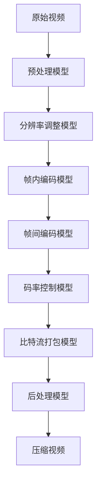

# 实战案例：使用模型管道进行视频压缩任务

## 1.背景介绍

随着视频内容在互联网上的普及,视频压缩技术变得越来越重要。高质量的视频文件往往体积庞大,传输和存储成本高昂。有效的视频压缩可以大幅降低文件大小,同时保持视频质量,从而优化网络传输和存储资源。

视频压缩是一个复杂的过程,需要处理视频的多个方面,包括视频编码、分辨率调整、码率控制等。传统的视频压缩方法通常需要手动调整多个参数,效果并不理想。近年来,基于深度学习的视频压缩方法逐渐兴起,展现出优异的压缩性能。

本文将介绍如何使用模型管道(Model Pipeline)进行视频压缩任务。模型管道是一种将多个模型有序组合的方法,可以将复杂的任务分解为多个子任务,由不同的模型分别处理。通过模型管道,我们可以灵活地组合各种视频压缩技术,实现高效、高质量的视频压缩。

## 2.核心概念与联系

在介绍模型管道之前,我们先了解一些核心概念:

### 2.1 视频编码

视频编码是将视频数据转换为适合传输和存储的压缩格式的过程。常见的视频编码标准包括H.264、VP9、AV1等。编码器通过消除视频帧之间的冗余信息来实现压缩。

### 2.2 分辨率调整

分辨率调整指的是改变视频的分辨率(宽度和高度)。降低分辨率可以减小视频文件大小,但也会降低视频质量。相反,提高分辨率可以增强视频质量,但会增加文件大小。

### 2.3 码率控制

码率控制是调节视频编码的比特率的过程。较低的比特率会产生较小的文件大小,但也会降低视频质量。较高的比特率可以提高视频质量,但会增加文件大小。

### 2.4 模型管道

模型管道是一种将多个模型有序组合的方法,每个模型负责处理特定的子任务。模型之间可以串行或并行执行,输入和输出通过管道传递。模型管道可以灵活地组合不同的模型,实现复杂的任务。

这些概念之间存在密切联系。视频编码是压缩视频数据的核心步骤,而分辨率调整和码率控制则是影响压缩效果和视频质量的关键因素。模型管道将这些技术有机结合,实现高效、高质量的视频压缩。

## 3.核心算法原理具体操作步骤

使用模型管道进行视频压缩任务通常包括以下步骤:

1. **预处理**:对原始视频进行预处理,如裁剪、旋转、降噪等,以优化后续压缩效果。

2. **分辨率调整**:根据需求调整视频分辨率,通常是降低分辨率以减小文件大小。可以使用传统的插值算法或基于深度学习的超分辨率模型。

3. **帧内编码**:对每个视频帧进行编码,消除帧内的冗余信息。常用的帧内编码算法包括DCT、小波变换等。

4. **帧间编码**:利用相邻帧之间的相关性,进一步消除帧间的冗余信息。常见的帧间编码技术包括运动估计、运动补偿等。

5. **码率控制**:根据目标文件大小或码率,动态调整量化参数,在视频质量和文件大小之间寻求平衡。

6. **比特流打包**:将编码后的视频数据打包成标准格式的比特流,如H.264、VP9等。

7. **后处理**:对压缩后的视频进行后处理,如添加元数据、加密等。

在这个过程中,我们可以使用多个专门的模型分别处理不同的子任务。例如,使用超分辨率模型进行分辨率调整,使用基于CNN的模型进行帧内编码,使用基于RNN的模型进行帧间编码,使用基于强化学习的模型进行码率控制。这些模型通过管道有序连接,输入和输出依次传递,最终实现高效的视频压缩。

下面是一个使用模型管道进行视频压缩的流程图:



通过模型管道,我们可以灵活地组合和优化各个子任务,实现高效、高质量的视频压缩。下面我们将详细介绍每个子任务的原理和实现方法。

## 4.数学模型和公式详细讲解举例说明

在视频压缩过程中,涉及到多种数学模型和公式,下面我们将详细讲解其中的几个关键部分。

### 4.1 离散余弦变换(DCT)

离散余弦变换是一种将信号从空间域转换到频率域的技术,广泛应用于图像和视频编码中。DCT可以将图像或视频帧分解为不同频率的余弦函数,从而实现能量压缩。

对于一个 $N \times N$ 的图像块 $f(x,y)$,二维DCT变换可以表示为:

$$
F(u,v) = \alpha(u)\alpha(v)\sum_{x=0}^{N-1}\sum_{y=0}^{N-1}f(x,y)\cos\left[\frac{(2x+1)u\pi}{2N}\right]\cos\left[\frac{(2y+1)v\pi}{2N}\right]
$$

其中, $\alpha(u)$ 和 $\alpha(v)$ 是归一化因子,定义为:

$$
\alpha(u) = \begin{cases}
\frac{1}{\sqrt{N}}, & u=0 \\
\sqrt{\frac{2}{N}}, & u\neq0
\end{cases}
$$

DCT变换后,大部分能量集中在低频分量,而高频分量的能量较小。通过量化和熵编码,我们可以有效地压缩DCT系数,从而实现图像或视频的压缩。

### 4.2 运动估计和运动补偿

运动估计和运动补偿是视频编码中常用的帧间编码技术,可以有效地消除相邻帧之间的冗余信息。

运动估计的目标是找到当前帧和参考帧之间的运动矢量,描述像素在两帧之间的位移。常用的运动估计算法包括全像素搜索、三步搜索、六线性插值等。

设当前帧的像素为 $f(x,y)$,参考帧的像素为 $g(x,y)$,运动矢量为 $(u,v)$,则运动补偿可以表示为:

$$
f(x,y) \approx g(x-u,y-v)
$$

通过运动补偿,我们可以使用参考帧的像素值来预测当前帧的像素值,从而消除帧间冗余。

运动估计和运动补偿通常由专门的硬件或软件模块实现,也有一些基于深度学习的算法,如基于CNN的运动估计模型。

### 4.3 码率-失真优化

在视频编码中,我们需要在视频质量(失真)和码率(文件大小)之间寻求平衡。这可以通过码率-失真优化来实现。

设视频的失真度为 $D$,码率为 $R$,则码率-失真优化问题可以表示为:

$$
\min_{\mathbf{q}} D(\mathbf{q}) + \lambda R(\mathbf{q})
$$

其中, $\mathbf{q}$ 是量化参数向量, $\lambda$ 是一个权重因子,用于平衡失真和码率。

常见的失真度量包括均方误差(MSE)、峰值信噪比(PSNR)等。码率可以通过熵编码后的比特流大小来估计。

传统的码率控制算法通常采用基于模型的方法,如 $\rho$-域率失真模型。近年来,基于深度强化学习的码率控制算法也取得了不错的效果,可以直接从数据中学习码率-失真优化策略。

通过合理的码率-失真优化,我们可以在视频质量和文件大小之间取得平衡,实现高效的视频压缩。

## 5.项目实践:代码实例和详细解释说明

为了更好地理解模型管道在视频压缩任务中的应用,我们将提供一个基于PyTorch的代码示例,并对关键部分进行详细解释。

### 5.1 导入所需库

```python
import torch
import torch.nn as nn
import torchvision
```

我们将使用PyTorch作为深度学习框架,torchvision库提供了一些视频处理的工具。

### 5.2 定义模型

我们将定义四个模型,分别用于分辨率调整、帧内编码、帧间编码和码率控制。

#### 5.2.1 分辨率调整模型

我们使用一个基于CNN的超分辨率模型来进行分辨率调整。

```python
class SuperResolutionModel(nn.Module):
    def __init__(self):
        super(SuperResolutionModel, self).__init__()
        # 定义模型结构
        ...

    def forward(self, x):
        # 前向传播
        ...
        return out
```

#### 5.2.2 帧内编码模型

我们使用一个基于CNN的模型来进行帧内编码,类似于图像压缩。

```python
class IntraFrameEncoderModel(nn.Module):
    def __init__(self):
        super(IntraFrameEncoderModel, self).__init__()
        # 定义模型结构
        ...

    def forward(self, x):
        # 前向传播
        ...
        return out
```

#### 5.2.3 帧间编码模型

我们使用一个基于RNN的模型来进行帧间编码,利用相邻帧之间的时间相关性。

```python
class InterFrameEncoderModel(nn.Module):
    def __init__(self):
        super(InterFrameEncoderModel, self).__init__()
        # 定义模型结构
        ...

    def forward(self, x):
        # 前向传播
        ...
        return out
```

#### 5.2.4 码率控制模型

我们使用一个基于强化学习的模型来进行码率控制,动态调整量化参数。

```python
class RateControlModel(nn.Module):
    def __init__(self):
        super(RateControlModel, self).__init__()
        # 定义模型结构
        ...

    def forward(self, x):
        # 前向传播
        ...
        return out
```

### 5.3 构建模型管道

接下来,我们将这些模型组合成一个模型管道,按顺序执行各个子任务。

```python
class VideoCompressionPipeline(nn.Module):
    def __init__(self):
        super(VideoCompressionPipeline, self).__init__()
        self.super_resolution = SuperResolutionModel()
        self.intra_encoder = IntraFrameEncoderModel()
        self.inter_encoder = InterFrameEncoderModel()
        self.rate_control = RateControlModel()

    def forward(self, x):
        # 分辨率调整
        x = self.super_resolution(x)
        
        # 帧内编码
        intra_coded = self.intra_encoder(x)
        
        # 帧间编码
        inter_coded = self.inter_encoder(intra_coded)
        
        # 码率控制
        compressed = self.rate_control(inter_coded)
        
        return compressed
```

在 `forward` 函数中,我们按顺序执行各个子任务:首先进行分辨率调整,然后进行帧内编码和帧间编码,最后进行码率控制,得到压缩后的视频数据。

### 5.4 训练和测试

接下来,我们可以使用视频数据集对模型进行训练和测试。

```python
# 准备数据集
train_dataset = ...
test_dataset = ...

# 创建模型实例
model = VideoCompressionPipeline()

# 定义损失函数和优化器
criterion = ...
optimizer = ...

# 训练循环
for epoch in range(num_epochs):
    for data in train_dataset:
        inputs, targets = data
        outputs = model(inputs)
        loss = criterion(outputs, targets)
        
        optimizer.zero_grad()
        loss.backward()
        optimizer.step()

# 测试循环
for data in test_dataset:
    inputs, targets = data
    outputs = model(inputs)
    # 计算评估指标,如PSNR、码率等
```

在训练过程中,我们可以使用合适的损失函数,如MSE损失、码率-失真损