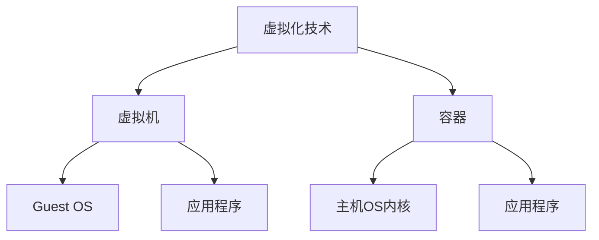
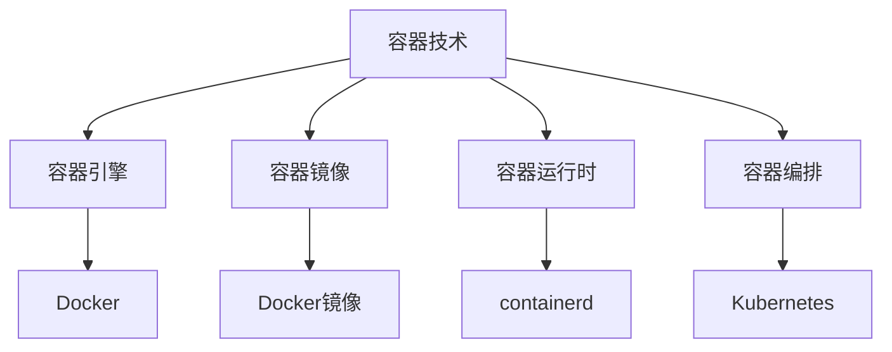
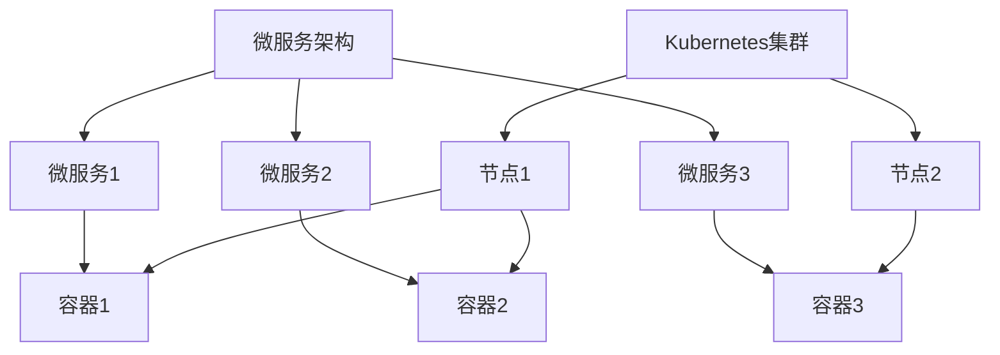

# 容器 原理与代码实例讲解

## 1.背景介绍

### 1.1 什么是容器?

容器是一种操作系统级虚拟化技术,它可以将应用程序及其依赖项打包在一个可移植的环境中,使其可以在任何Linux系统上一致地运行。与传统虚拟机不同,容器不需要包含整个操作系统,而是直接共享主机操作系统内核,因此容器比虚拟机更加轻量级和高效。

容器技术的出现解决了应用程序在不同环境下运行时遇到的"在我的机器上运行没问题"的困扰,促进了DevOps实践和微服务架构的发展。

### 1.2 容器的优势

1. **一致的运行环境**: 容器将应用程序及其依赖项打包在一个可移植的环境中,确保了应用程序在任何环境下的一致性运行。

2. **轻量级和高效**: 与传统虚拟机相比,容器直接共享主机操作系统内核,因此更加轻量级和高效。

3. **快速部署和扩展**: 容器的启动时间很短,可以快速部署和扩展应用程序。

4. **资源隔离和安全性**: 容器提供了进程、网络和文件系统等资源的隔离,增强了应用程序的安全性和稳定性。

5. **DevOps友好**: 容器技术促进了DevOps实践,使得应用程序的构建、测试和部署更加自动化和一致。

6. **微服务架构**: 容器为微服务架构提供了理想的运行环境,每个微服务可以打包在一个独立的容器中,实现了高度解耦和灵活扩展。

### 1.3 主流容器技术

目前,主流的容器技术包括Docker和Kubernetes。

- **Docker**是最早也是最受欢迎的容器技术,它提供了容器的构建、分发和运行等功能。

- **Kubernetes**是Google开源的容器编排系统,它可以自动化容器的部署、扩展和管理,提供了高可用性和负载均衡等功能。

## 2.核心概念与联系

### 2.1 容器和虚拟机的区别

虚拟机和容器都是一种虚拟化技术,但它们在实现方式和资源利用率上存在显著差异。



- **虚拟机**在硬件层上运行一个完整的操作系统,包括内核、系统库和应用程序。每个虚拟机都是一个独立的操作系统实例,因此资源占用较大,启动速度较慢。

- **容器**直接共享主机操作系统内核,只包含应用程序及其依赖项。容器之间相互隔离,但共享同一个操作系统内核,因此资源占用较小,启动速度更快。

### 2.2 容器的核心组件

容器技术由多个核心组件组成,它们协同工作以实现容器的构建、分发和运行。



- **容器引擎**,如Docker,提供了容器的构建、分发和运行等功能。

- **容器镜像**,如Docker镜像,是一个只读模板,包含了应用程序及其依赖项。

- **容器运行时**,如containerd,负责管理容器的生命周期。

- **容器编排**,如Kubernetes,用于自动化容器的部署、扩展和管理。

### 2.3 容器与微服务架构

容器技术为微服务架构提供了理想的运行环境。每个微服务可以打包在一个独立的容器中,实现了高度解耦和灵活扩展。



- 每个微服务被打包在一个独立的容器中,实现了高度解耦。

- Kubernetes集群管理和编排多个容器,实现了微服务的自动化部署和扩展。

- 容器之间通过网络进行通信,实现了微服务之间的松散耦合。

## 3.核心算法原理具体操作步骤

### 3.1 容器的隔离机制

容器通过Linux内核的多种命名空间(Namespace)和控制组(Cgroups)实现了资源的隔离和限制。

#### 3.1.1 命名空间(Namespace)

命名空间是Linux内核用来隔离资源的一种机制,它为进程提供了一个独立的视图,使得进程只能看到属于自己的资源。主要包括以下几种命名空间:

1. **PID 命名空间**: 用于隔离进程ID,使得每个容器中的进程只能看到自己的进程。

2. **Network 命名空间**: 用于隔离网络资源,如网络接口、IP地址、路由表等。

3. **IPC 命名空间**: 用于隔离进程间通信资源,如消息队列和共享内存。

4. **Mount 命名空间**: 用于隔离文件系统挂载点,使得每个容器拥有独立的文件系统视图。

5. **UTS 命名空间**: 用于隔离主机名和域名。

6. **User 命名空间**: 用于隔离用户和用户组ID。

#### 3.1.2 控制组(Cgroups)

控制组(Cgroups)是Linux内核用于限制和监控资源使用的机制,它可以对CPU、内存、磁盘I/O等资源进行限制和优先级控制。

Cgroups通过以下几个步骤实现资源限制:

1. **创建控制组**: 为每个容器创建一个控制组。

2. **设置限制**: 为每个控制组设置CPU、内存等资源的限制。

3. **分配进程**: 将容器中的进程分配到相应的控制组中。

4. **监控和限制**: 内核根据设置的限制对进程的资源使用进行监控和限制。

### 3.2 容器镜像的构建

容器镜像是容器的只读模板,包含了应用程序及其依赖项。Docker提供了Dockerfile来定义镜像的构建过程。

#### 3.2.1 Dockerfile

Dockerfile是一个文本文件,包含了一系列指令,用于构建容器镜像。以下是一个简单的Dockerfile示例:

```dockerfile
# 基础镜像
FROM ubuntu:18.04

# 作者信息
LABEL maintainer="example@example.com"

# 更新软件源
RUN apt-get update

# 安装依赖包
RUN apt-get install -y python3 pip

# 复制应用程序代码
COPY app.py /app/

# 设置工作目录
WORKDIR /app

# 安装Python依赖项
RUN pip install --no-cache-dir -r requirements.txt

# 暴露端口
EXPOSE 8000

# 运行命令
CMD ["python3", "app.py"]
```

#### 3.2.2 构建步骤

使用以下命令从Dockerfile构建容器镜像:

```bash
docker build -t my-app .
```

Docker会按照Dockerfile中的指令逐步构建镜像,每个指令都会创建一个新的镜像层。

1. 从基础镜像(ubuntu:18.04)开始。

2. 更新软件源并安装依赖包(python3、pip)。

3. 复制应用程序代码到镜像中。

4. 设置工作目录并安装Python依赖项。

5. 暴露容器端口(8000)。

6. 设置容器启动命令(python3 app.py)。

最终,我们得到一个包含应用程序及其依赖项的可运行容器镜像。

### 3.3 容器的运行和管理

#### 3.3.1 运行容器

使用以下命令从镜像运行一个容器:

```bash
docker run -d -p 8000:8000 my-app
```

- `-d` 参数表示在后台运行容器。

- `-p` 参数用于映射容器端口到主机端口。

#### 3.3.2 管理容器

Docker提供了多种命令用于管理容器的生命周期:

- `docker ps`: 列出正在运行的容器。

- `docker stop <container_id>`: 停止容器。

- `docker start <container_id>`: 启动容器。

- `docker rm <container_id>`: 删除容器。

- `docker logs <container_id>`: 查看容器日志。

- `docker exec -it <container_id> /bin/bash`: 进入容器的交互式Shell。

#### 3.3.3 容器编排

对于大规模的容器应用程序,我们需要使用容器编排系统,如Kubernetes,来自动化容器的部署、扩展和管理。

Kubernetes提供了多种资源对象,如Pod、Deployment、Service等,用于定义和管理容器应用程序。以下是一个简单的Deployment示例:

```yaml
apiVersion: apps/v1
kind: Deployment
metadata:
  name: my-app
spec:
  replicas: 3
  selector:
    matchLabels:
      app: my-app
  template:
    metadata:
      labels:
        app: my-app
    spec:
      containers:
      - name: my-app
        image: my-app:latest
        ports:
        - containerPort: 8000
```

这个Deployment定义了一个包含3个副本的应用程序,每个副本由一个容器组成,使用`my-app:latest`镜像,并暴露了8000端口。

## 4.数学模型和公式详细讲解举例说明

在容器技术中,资源限制和调度是一个重要的问题。我们可以使用数学模型和公式来描述和优化资源的分配和利用。

### 4.1 资源限制模型

假设我们有一个主机,它有$C$个CPU核心和$M$GB内存。我们需要在这个主机上运行$N$个容器,每个容器需要$c_i$个CPU核心和$m_i$GB内存。我们的目标是确保所有容器都能够获得足够的资源,同时最大化资源利用率。

我们可以将这个问题建模为一个整数线性规划问题:

$$
\begin{aligned}
\max \quad & \sum_{i=1}^{N} x_i \\
\text{s.t.} \quad & \sum_{i=1}^{N} c_i x_i \leq C \\
& \sum_{i=1}^{N} m_i x_i \leq M \\
& x_i \in \{0, 1\}, \quad i = 1, \ldots, N
\end{aligned}
$$

其中:

- $x_i$ 是一个二进制变量,表示容器$i$是否被分配资源。
- 目标函数 $\sum_{i=1}^{N} x_i$ 最大化被分配资源的容器数量。
- 第一个约束条件 $\sum_{i=1}^{N} c_i x_i \leq C$ 确保分配给容器的CPU核心总数不超过主机的CPU核心数。
- 第二个约束条件 $\sum_{i=1}^{N} m_i x_i \leq M$ 确保分配给容器的内存总量不超过主机的内存容量。

通过求解这个整数线性规划问题,我们可以得到一个最优的资源分配方案,确保尽可能多的容器获得所需资源,同时不超过主机的资源限制。

### 4.2 资源调度算法

在容器编排系统中,资源调度是一个关键的问题。我们需要合理地将容器调度到不同的节点上,以实现资源的高效利用和负载均衡。

一种常见的资源调度算法是基于bin-packing的算法。我们可以将节点看作是容器,将容器看作是物品,目标是将物品尽可能紧凑地装入容器中,以最小化容器的数量。

具体来说,我们可以使用First Fit Decreasing (FFD)算法来进行资源调度。FFD算法的步骤如下:

1. 按照容器的资源需求从大到小排序。

2. 从第一个节点开始,尝试将每个容器放入第一个有足够剩余资源的节点中。

3. 如果没有节点有足够的剩余资源,则创建一个新的节点,并将容器放入新节点中。

4. 重复步骤2和3,直到所有容器