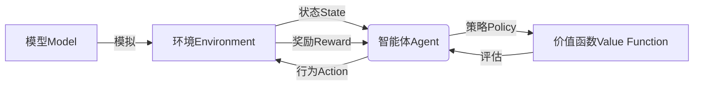
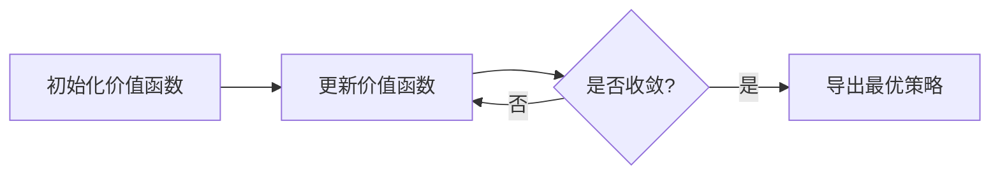
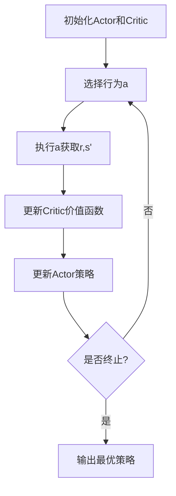

这是一篇关于强化学习(Reinforcement Learning, RL)原理与代码实例讲解的技术博客文章。

# 强化学习RL原理与代码实例讲解

## 1.背景介绍

### 1.1 什么是强化学习

强化学习(Reinforcement Learning, RL)是机器学习的一个重要分支,它研究如何基于环境反馈来学习行为策略,以最大化预期的长期回报。与监督学习和无监督学习不同,强化学习没有提供标准答案,而是通过与环境的交互来学习。

### 1.2 强化学习的应用场景

强化学习在很多领域有广泛的应用,如机器人控制、游戏AI、自动驾驶、资源管理优化、智能交通控制等。任何需要基于环境反馈来学习决策的场景,都可以使用强化学习来解决。

## 2.核心概念与联系

### 2.1 强化学习基本元素

强化学习系统由以下几个核心元素组成:

- **环境(Environment)**:智能体与之交互的外部世界。
- **状态(State)**:环境的当前情况。
- **奖励(Reward)**:环境对智能体行为的反馈,指导智能体去寻找获得最大化累积奖励的策略。
- **策略(Policy)**:智能体在每个状态下采取行动的策略或行为准则。
- **价值函数(Value Function)**:评估一个状态的好坏或一个状态-行为对的价值。
- **模型(Model)**:模拟环境的状态转移和奖励。



### 2.2 强化学习过程

强化学习的过程可以概括为:

1. 智能体根据当前状态和策略选择行为
2. 环境根据智能体的行为进行状态转移并返回新状态和奖励
3. 智能体观察新状态和奖励,更新策略和价值函数
4. 循环上述过程

### 2.3 强化学习分类

根据是否利用环境模型,强化学习可分为:

- **基于模型(Model-based RL)**: 利用已知或学习到的环境模型,通过规划或搜索来优化策略。
- **无模型(Model-free RL)**: 不需要环境模型,直接从环境交互数据中学习策略或价值函数。

根据目标是否最大化长期累积奖励,可分为:

- **基于价值(Value-based)**: 学习状态或状态-行为对的价值函数,再导出策略。
- **基于策略(Policy-based)**: 直接学习映射状态到行为的策略函数。
- **Actor-Critic**: 同时学习价值函数和策略函数,结合两者的优点。

## 3.核心算法原理具体操作步骤

### 3.1 动态规划(Dynamic Programming)

动态规划是最基本和最老的强化学习算法,它需要完全了解环境的转移概率和奖励函数(即已知模型)。动态规划算法包括:

- 策略迭代(Policy Iteration)
- 价值迭代(Value Iteration)

这些算法通过不断更新价值函数或策略,最终收敛到最优解。

#### 3.1.1 策略迭代算法步骤

1. 初始化一个随机策略 $\pi_0$
2. 对于当前策略 $\pi_i$,求解其价值函数 $V^{\pi_i}$(通过贝尔曼方程)
3. 使用 $V^{\pi_i}$ 对策略 $\pi_i$ 进行改进,得到新策略 $\pi_{i+1}$
4. 重复步骤2-3,直到策略收敛


#### 3.1.2 价值迭代算法步骤  

1. 初始化一个任意的价值函数 $V_0$
2. 计算新的价值函数 $V_{k+1}$ 根据贝尔曼最优方程:
   $$V_{k+1}(s) = \max_a \sum_{s'} P(s'|s,a)[R(s,a,s') + \gamma V_k(s')]$$
3. 重复步骤2,直到价值函数收敛
4. 从收敛的价值函数 $V^*$ 导出最优策略 $\pi^*$



### 3.2 时序差分学习(Temporal Difference Learning)

时序差分(TD)学习是无模型的强化学习算法,它通过从环境中收集的样本数据来估计价值函数或直接学习策略。主要算法有:

- Q-Learning
- Sarsa
- Actor-Critic算法

#### 3.2.1 Q-Learning算法步骤

Q-Learning是最经典的无模型、基于价值的强化学习算法。它直接学习状态-行为对的Q值函数,而不需要学习状态价值函数。算法步骤:

1. 初始化Q表格 $Q(s,a)$ ,所有状态-行为对的值设为任意值
2. 对每个episode:
    - 初始化起始状态 $s$
    - 对于每个时间步:
        - 选择行为 $a$ (基于 $\epsilon$-greedy 策略)
        - 执行行为 $a$,观察奖励 $r$ 和下一状态 $s'$
        - 更新Q值:
          $$Q(s,a) \leftarrow Q(s,a) + \alpha[r + \gamma\max_{a'}Q(s',a') - Q(s,a)]$$
        - $s \leftarrow s'$
3. 直到Q值收敛

```mermaid
flowchart TD
    A[初始化Q表格] --> B[选择行为a]
    B --> C[执行a获取r,s']
    C --> D[更新Q(s,a)]
    D --> E{是否终止?}
    E --是--> F[输出最优策略]
    E --否--> B
```

#### 3.2.2 Sarsa算法步骤

Sarsa是另一种基于价值的无模型算法,它直接学习策略 $\pi$ 对应的Q函数 $Q^\pi$。与Q-Learning不同,Sarsa在更新Q值时使用下一个行为 $a'$ 是由策略 $\pi$ 决定的,而不是最大化Q值。算法步骤:

1. 初始化Q表格 $Q(s,a)$,所有值设为任意值
2. 对每个episode:
    - 初始化起始状态 $s$,选择 $a$ 根据策略 $\pi$ 从 $s$ 出发
    - 对于每个时间步:
        - 执行行为 $a$,观察奖励 $r$ 和下一状态 $s'$
        - 根据策略 $\pi$ 从 $s'$ 选择下一行为 $a'$  
        - 更新Q值:
          $$Q(s,a) \leftarrow Q(s,a) + \alpha[r + \gamma Q(s',a') - Q(s,a)]$$
        - $s \leftarrow s', a \leftarrow a'$
3. 直到Q值收敛

#### 3.2.3 Actor-Critic算法步骤

Actor-Critic算法同时学习价值函数(Critic)和策略函数(Actor)。Critic评估当前策略并更新价值函数,Actor根据价值函数指导来更新策略。算法步骤:

1. 初始化Actor的策略 $\pi_\theta(s,a)$ 和Critic的价值函数 $V_w(s)$
2. 对每个episode:
    - 初始化起始状态 $s$
    - 对于每个时间步:
        - 根据Actor的策略 $\pi_\theta$ 选择行为 $a$
        - 执行行为 $a$,观察奖励 $r$ 和下一状态 $s'$  
        - 更新Critic的价值函数 $V_w(s)$
        - 使用TD误差 $\delta = r + \gamma V_w(s') - V_w(s)$ 更新Actor的策略 $\pi_\theta$
        - $s \leftarrow s'$
3. 直到收敛



## 4.数学模型和公式详细讲解举例说明  

### 4.1 马尔可夫决策过程(Markov Decision Process)

强化学习问题通常建模为**马尔可夫决策过程(Markov Decision Process, MDP)**。MDP是一个离散时间随机控制过程,具有以下主要元素:

- 一组有限状态 $\mathcal{S}$
- 一组有限行为 $\mathcal{A}$  
- 状态转移概率 $P(s'|s,a)$,表示从状态 $s$ 执行行为 $a$ 转移到状态 $s'$ 的概率
- 奖励函数 $R(s,a,s')$,表示从状态 $s$ 执行行为 $a$ 转移到 $s'$ 的奖励
- 折扣因子 $\gamma \in [0,1)$,用于权衡未来奖励的重要性

MDP的目标是找到一个策略 $\pi: \mathcal{S} \rightarrow \mathcal{A}$,使得期望的累积折扣奖励最大化:

$$\max_\pi \mathbb{E}\left[\sum_{t=0}^\infty \gamma^t R(s_t, a_t, s_{t+1}) | \pi\right]$$

其中 $s_0$ 是初始状态, $a_t = \pi(s_t)$ 是在状态 $s_t$ 下执行的行为。

### 4.2 价值函数(Value Function)

价值函数用于评估一个状态或状态-行为对的好坏。在强化学习中,主要有两种价值函数:

**状态价值函数 $V^\pi(s)$**:在策略 $\pi$ 下,从状态 $s$ 开始执行,期望获得的累积折扣奖励:

$$V^\pi(s) = \mathbb{E}_\pi\left[\sum_{t=0}^\infty \gamma^t R(s_t, a_t, s_{t+1}) | s_0 = s\right]$$

**状态-行为价值函数 $Q^\pi(s,a)$**:在策略 $\pi$ 下,从状态 $s$ 开始执行行为 $a$,期望获得的累积折扣奖励:  

$$Q^\pi(s,a) = \mathbb{E}_\pi\left[\sum_{t=0}^\infty \gamma^t R(s_t, a_t, s_{t+1}) | s_0 = s, a_0 = a\right]$$

价值函数满足以下**贝尔曼方程(Bellman Equation)**:

$$\begin{aligned}
V^\pi(s) &= \sum_a \pi(a|s) \left(R(s,a) + \gamma \sum_{s'} P(s'|s,a) V^\pi(s')\right) \\
Q^\pi(s,a) &= R(s,a) + \gamma \sum_{s'} P(s'|s,a) \sum_{a'} \pi(a'|s') Q^\pi(s',a')
\end{aligned}$$

我们可以使用动态规划或时序差分学习来求解价值函数。

### 4.3 贝尔曼最优方程(Bellman Optimality Equation)

贝尔曼最优方程给出了最优价值函数和最优策略的关系:

$$\begin{aligned}
V^*(s) &= \max_a Q^*(s,a) \\
&= \max_a \left(R(s,a) + \gamma \sum_{s'} P(s'|s,a) V^*(s')\right) \\
Q^*(s,a) &= R(s,a) + \gamma \sum_{s'} P(s'|s,a) \max_{a'} Q^*(s',a')
\end{aligned}$$

最优策略 $\pi^*$ 可以从最优价值函数 $V^*$ 或 $Q^*$ 导出:

$$\pi^*(s) = \arg\max_a Q^*(s,a)$$

### 4.4 策略梯度算法(Policy Gradient)

策略梯度是一种基于策略的强化学习算法,它直接学习映射状态到行为的策略函数 $\pi_\theta(a|s)$,其中 $\theta$ 