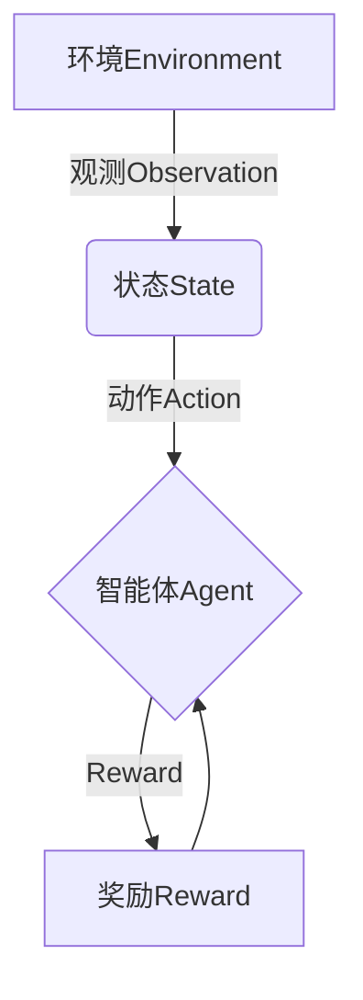

# 强化学习Reinforcement Learning在智慧交通系统中的创新应用

## 1.背景介绍

### 1.1 智慧交通系统概述

随着城市化进程的不断加快,交通拥堵、能源消耗和环境污染等问题日益严重,亟需建立一个高效、绿色、智能的综合交通运输系统来优化交通流量,提高运输效率。智慧交通系统(Intelligent Transportation Systems, ITS)正是为解决这一挑战而提出的新型综合交通管理和信息服务系统。

智慧交通系统将先进的信息技术、数据通信传输技术、电子传感技术、控制技术、计算机技术和管理科学与交通运输系统有机地结合在一起,旨在实现交通信息的实时、准确和高效获取、处理和应用,从而提高道路通行能力、缩短出行时间、降低能源消耗和污染排放、保证行车安全。

### 1.2 智慧交通系统面临的挑战

尽管智慧交通系统具有广阔的应用前景,但其在实际部署和运行过程中仍面临诸多挑战:

1. **复杂多变的交通环境**:交通系统涉及多种交通工具、路况信息和参与者,系统的输入输出呈现高度动态和不确定性。

2. **实时决策的需求**:为保证交通高效有序,需要对瞬息万变的交通状况做出实时的调度和决策。

3. **多目标优化的矛盾**:在优化过程中需要权衡交通效率、能耗、安全性等多个目标之间的矛盾和平衡。

4. **大规模交通数据的处理**:现代城市交通系统每天产生大量的多源异构数据,对数据处理和建模能力提出了巨大挑战。

面对上述挑战,传统的基于经验规则或数学建模的交通控制和决策方法已显得捉襟见肘。强化学习(Reinforcement Learning)作为一种前沿的机器学习范式,具备处理复杂环境、实时决策和多目标优化的独特优势,为智能化交通系统的发展带来了新的契机和可能。

## 2.核心概念与联系

### 2.1 强化学习的核心概念

强化学习是机器学习领域的一个重要分支,它研究如何基于环境反馈来学习一个最优决策序列,以期最大化长期累积奖励。强化学习系统通常由四个核心要素组成:

1. **环境(Environment)**:智能体与之交互的外部世界,如交通系统。

2. **状态(State)**:环境的当前状态,如道路拥堵程度、车辆位置等。

3. **动作(Action)**:智能体可采取的行为,如调整信号灯时长、发布交通引导等。

4. **奖励(Reward)**:环境对智能体行为的反馈评价,如减少拥堵程度的奖赏。

智能体的目标是学习一个最优策略(Optimal Policy),通过不断与环境交互、获取奖励反馈,逐步优化自身的决策序列,最终实现长期累积奖励的最大化。

### 2.2 强化学习与智慧交通的契合

强化学习在解决智慧交通问题方面具有独特的优势:

1. **处理复杂动态环境**:交通系统是一个高度动态、不确定的复杂环境,强化学习能够通过试错学习来逐步适应环境的变化。

2. **实时顺序决策**:交通调度需要根据实时交通状态做出一系列连续决策,强化学习擅长学习最优决策序列。

3. **多目标优化**:在交通优化中需要平衡效率、能耗、安全等多个目标,强化学习能够通过设置合理的奖励函数来实现多目标优化。

4. **无需人工标注数据**:传统监督学习需要大量人工标注的数据,而强化学习可以通过与环境交互自主获取数据,降低了数据成本。

5. **可解释性和可控性**:相比于黑箱的深度学习模型,强化学习的决策过程具有较好的可解释性和可控性,有利于系统的安全部署。

基于以上优势,将强化学习应用于智慧交通系统成为了一个备受关注的研究热点。

## 3.核心算法原理具体操作步骤

强化学习算法主要分为基于价值函数(Value Function)的算法和基于策略(Policy)的算法两大类。前者旨在估计每个状态或状态-动作对的长期价值,再由此推导出最优策略;后者则直接对策略进行参数化建模,通过策略梯度的方式优化策略参数。

本节将分别介绍两种算法范式的核心原理和具体操作步骤。

### 3.1 基于价值函数的算法

#### 3.1.1 Q-Learning算法

Q-Learning是基于价值函数的强化学习算法中最经典和最广泛使用的一种。它旨在估计每个状态-动作对的长期价值Q(s,a),再由此推导出最优策略。算法步骤如下:

1. 初始化Q表格,对所有状态-动作对赋予任意初值。

2. 对于每个Episode(即一个完整的交互序列):
    
    a) 初始化环境状态s
    
    b) 对于每个时间步:
        
        i) 根据当前Q值,选择动作a(基于ε-greedy或其他策略)
        
        ii) 执行动作a,获得奖励r和新状态s'
        
        iii) 根据Bellman方程更新Q(s,a):
        
        $$Q(s,a) \leftarrow Q(s,a) + \alpha[r + \gamma\max_{a'}Q(s',a') - Q(s,a)]$$
        
        其中,α为学习率,γ为折现因子。
        
        iv) 将s'作为新的当前状态
        
    c) 直到Episode结束
    
3. 重复步骤2,直到收敛

通过不断与环境交互并更新Q表格,最终Q值将收敛到最优状态-动作价值函数,从而可以得到最优策略π*(s) = argmax_a Q*(s,a)。

#### 3.1.2 Sarsa算法

Sarsa算法与Q-Learning类似,不同之处在于它直接估计状态-动作-状态序列的长期价值Q(s,a,s'),而非状态-动作对的价值Q(s,a)。算法步骤如下:

1. 初始化Q表格,对所有状态-动作-状态序列赋予任意初值。

2. 对于每个Episode:
    
    a) 初始化环境状态s,选择动作a(基于ε-greedy或其他策略)
    
    b) 对于每个时间步:
        
        i) 执行动作a,获得奖励r和新状态s'
        
        ii) 选择新动作a'(基于ε-greedy或其他策略)
        
        iii) 根据Bellman方程更新Q(s,a,s'):
        
        $$Q(s,a,s') \leftarrow Q(s,a,s') + \alpha[r + \gamma Q(s',a',s'') - Q(s,a,s')]$$
        
        iv) 将s'作为新的当前状态,a'作为新的当前动作
        
    c) 直到Episode结束
    
3. 重复步骤2,直到收敛

Sarsa算法的策略推导方式与Q-Learning相同,即π*(s) = argmax_a Q*(s,a,s')。

#### 3.1.3 Deep Q-Network (DQN)算法

传统的Q-Learning和Sarsa算法需要维护一个离散状态空间的Q表格,在面对连续高维状态时将受到"维数灾难"的限制。Deep Q-Network (DQN)算法通过使用深度神经网络来拟合Q函数,从而突破了这一限制。其核心思路是:

1. 使用一个深度卷积神经网络(CNN)或全连接网络(DNN)来拟合Q(s,a;θ),其中θ为网络参数。

2. 在每个时间步,选择动作a = argmax_a Q(s,a;θ)。

3. 执行动作a,获得奖励r和新状态s'。

4. 从经验回放池(Experience Replay)中采样出一批转移(s,a,r,s')。

5. 计算目标Q值y = r + γ max_a' Q(s',a';θ-)。其中θ-为目标网络参数,用于估计下一状态的最大Q值,以提高训练稳定性。

6. 将(s,a,y)作为训练样本,最小化损失函数L = E[(y - Q(s,a;θ))^2],即用y作为监督信号来更新θ。

7. 每隔一定步数,将θ-更新为θ,以跟上Q网络的变化。

8. 重复步骤2-7,直至收敛。

DQN算法将Q函数拟合为一个深度神经网络,从而能够处理高维连续状态,极大拓展了强化学习的应用范围。

### 3.2 基于策略的算法

#### 3.2.1 策略梯度算法

策略梯度(Policy Gradient)算法直接对策略π(a|s;θ)进行参数化建模,通过梯度上升的方式优化策略参数θ,使得长期累积奖励最大化。算法步骤如下:

1. 初始化策略参数θ。

2. 对于每个Episode:
    
    a) 初始化环境状态s_0
    
    b) 对于每个时间步t:
        
        i) 根据当前策略π(a|s_t;θ)选择动作a_t
        
        ii) 执行动作a_t,获得奖励r_t和新状态s_{t+1}
        
        iii) 计算累积奖励R_t = Σ_k γ^k r_{t+k}
        
        iv) 更新策略参数θ,使得J(θ) = E[R_t]最大化
        
        $$\theta \leftarrow \theta + \alpha\nabla_\theta\log\pi(a_t|s_t;\theta)R_t$$
        
        其中α为学习率。
        
    c) 直到Episode结束
    
3. 重复步骤2,直至收敛

策略梯度算法直接优化策略参数,无需维护价值函数,但存在高方差和收敛慢的问题。为了提高算法性能,通常会结合重要性采样、基线函数、优势函数等技术。

#### 3.2.2 Actor-Critic算法

Actor-Critic算法将策略梯度与价值函数估计相结合,分为两个模块:Actor用于生成动作并更新策略参数,Critic用于评估动作价值并指导Actor更新。算法步骤如下:

1. 初始化Actor策略π(a|s;θ)和Critic价值函数V(s;w)的参数θ和w。

2. 对于每个Episode: 
    
    a) 初始化环境状态s_0
    
    b) 对于每个时间步t:
        
        i) Actor根据π(a|s_t;θ)选择动作a_t
        
        ii) 执行动作a_t,获得奖励r_t和新状态s_{t+1}
        
        iii) Critic根据TD误差计算优势函数A:
        
        $$A = r_t + \gamma V(s_{t+1};w) - V(s_t;w)$$
        
        iv) 更新Critic价值函数参数w,使得TD误差最小化:
        
        $$w \leftarrow w + \beta\nabla_w(r_t + \gamma V(s_{t+1};w) - V(s_t;w))^2$$
        
        v) 更新Actor策略参数θ,使得J(θ) = E[A]最大化:
        
        $$\theta \leftarrow \theta + \alpha\nabla_\theta\log\pi(a_t|s_t;\theta)A$$
        
        其中α,β为学习率。
        
    c) 直到Episode结束
    
3. 重复步骤2,直至收敛

Actor-Critic算法将策略梯度与时序差分(TD)学习相结合,利用Critic提供的优势函数A来减小策略梯度的方差,从而提高了算法的收敛速度和稳定性。

## 4.数学模型和公式详细讲解举例说明

在强化学习算法中,数学模型和公式扮演着至关重要的角色,为算法的理论基础和实现细节提供了坚实的支撑。本节将重点讲解强化学习中的几个核心数学模型和公式。

### 4.1 马尔可夫决策