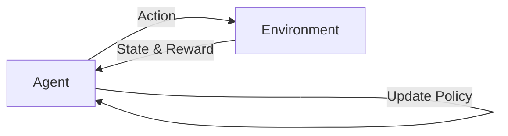

# 强化学习Reinforcement Learning在能效管理系统的应用案例

## 1. 背景介绍

### 1.1 能效管理的重要性

在当今世界,能源效率和可持续发展已成为全球关注的焦点。随着能源需求的不断增长和化石燃料资源的日益枯竭,提高能源利用效率,减少能源浪费,已成为各国政府、企业和个人的共同责任。高效的能效管理不仅可以节约能源成本,还能减少温室气体排放,缓解气候变化压力。

### 1.2 人工智能在能效管理中的应用前景

人工智能技术的快速发展为能效管理领域带来了新的机遇。机器学习、深度学习等AI技术可以通过对海量能耗数据进行分析和优化,找出提高能效的最佳方案。其中,强化学习(Reinforcement Learning,RL)作为一种重要的机器学习范式,通过智能体(Agent)与环境的交互,不断尝试和学习,以获得最优策略,在能效管理领域展现出广阔的应用前景。

### 1.3 本文的主要内容

本文将重点探讨强化学习在能效管理系统中的应用案例。首先,我们将介绍强化学习的核心概念和基本原理。然后,详细阐述强化学习在能效管理中的典型应用场景和案例,包括建筑能耗优化、工业设备能效控制、数据中心能效管理等。同时,我们还将讨论强化学习在实际应用中面临的挑战和未来的发展方向。

## 2. 核心概念与联系

### 2.1 强化学习的定义与特点

强化学习(Reinforcement Learning,RL)是机器学习的一个重要分支,它旨在使智能体(Agent)通过与环境的交互,学习如何采取最优行动以获得最大的累积奖励。与监督学习和非监督学习不同,强化学习不需要预先标注的训练数据,而是通过不断的试错和反馈来优化策略。

强化学习的核心要素包括:
- 智能体(Agent):负责与环境交互并做出决策的主体。
- 环境(Environment):智能体所处的外部世界,提供观察状态和奖励反馈。
- 状态(State):环境在某一时刻的表征。
- 行动(Action):智能体根据当前状态采取的动作。 
- 奖励(Reward):环境对智能体行动的即时反馈,用于引导智能体学习最优策略。
- 策略(Policy):将状态映射为行动的决策函数。

强化学习的目标是通过不断优化策略,使智能体在与环境的长期交互中获得最大的累积奖励。这一过程可以用如下的Mermaid流程图表示:

### 2.2 马尔可夫决策过程(MDP)

马尔可夫决策过程(Markov Decision Process,MDP)是强化学习问题的标准数学形式化表示。MDP由一个五元组 $(S,A,P,R,\gamma)$ 定义:

- 状态空间 $S$:所有可能的状态集合。
- 行动空间 $A$:在每个状态下可采取的行动集合。
- 状态转移概率 $P(s'|s,a)$:在状态 $s$ 下采取行动 $a$ 后转移到状态 $s'$ 的概率。
- 奖励函数 $R(s,a)$:在状态 $s$ 下采取行动 $a$ 后获得的即时奖励。
- 折扣因子 $\gamma \in [0,1]$:用于平衡即时奖励和未来奖励的相对重要性。

MDP的目标是找到一个最优策略 $\pi^*$,使得在该策略下智能体能获得最大的期望累积奖励:

$$V^{\pi^*}(s) = \max_{\pi} \mathbb{E}\left[\sum_{t=0}^{\infty} \gamma^t R(s_t,a_t) | s_0=s, \pi \right]$$

其中,$V^{\pi^*}(s)$ 表示在状态 $s$ 下遵循最优策略 $\pi^*$ 的状态值函数。

### 2.3 强化学习与能效管理的联系

能效管理问题可以很自然地建模为一个强化学习问题。在能效管理场景中,智能体可以是负责控制能源系统的决策模块,环境则是建筑、工厂、数据中心等能源消耗实体。智能体通过观察环境的状态(如温度、湿度、设备运行参数等),采取相应的控制行动(如调节设备运行模式、优化资源调度等),以期获得最大的能效提升和成本节约。

强化学习在能效管理中的优势主要体现在以下几个方面:
1. 自适应性:强化学习智能体可以根据环境的动态变化自主调整策略,适应不同的能耗模式和外部条件。
2. 长期优化:强化学习考虑行动的长期累积效果,能够权衡当前收益和未来收益,实现全局最优。
3. 无需建模:强化学习无需对环境进行精确建模,通过试错学习直接优化控制策略。
4. 泛化能力:训练好的强化学习模型可以迁移和泛化到类似的能效管理场景,具有较好的实用性。

## 3. 核心算法原理与操作步骤

### 3.1 Q-learning算法

Q-learning是一种经典的无模型(model-free)强化学习算法,它通过学习动作-状态值函数 $Q(s,a)$ 来逼近最优策略。Q-learning的核心思想是利用贝尔曼方程(Bellman Equation)来迭代更新Q值:

$$Q(s_t,a_t) \leftarrow Q(s_t,a_t) + \alpha \left[ r_t + \gamma \max_{a} Q(s_{t+1},a) - Q(s_t,a_t) \right]$$

其中,$\alpha \in (0,1]$ 是学习率,$r_t$ 是在状态 $s_t$ 下采取行动 $a_t$ 后获得的即时奖励。

Q-learning算法的具体操作步骤如下:
1. 初始化Q表 $Q(s,a)$,对所有状态-行动对赋予初始值(通常为0)。
2. 重复以下步骤直至收敛:
   - 根据当前状态 $s_t$,使用 $\epsilon$-贪婪策略选择一个行动 $a_t$。
   - 执行行动 $a_t$,观察环境反馈的下一状态 $s_{t+1}$ 和奖励 $r_t$。
   - 根据贝尔曼方程更新 $Q(s_t,a_t)$。
   - 将当前状态更新为 $s_{t+1}$。
3. 输出最优策略 $\pi^*(s) = \arg\max_a Q(s,a)$。

### 3.2 深度Q网络(DQN)算法

Q-learning在状态和行动空间较大时会面临维度灾难问题。为了解决这一问题,深度Q网络(Deep Q-Network,DQN)算法使用深度神经网络来近似Q函数,将状态作为网络输入,各个行动的Q值作为网络输出。

DQN算法的核心是利用经验回放(Experience Replay)和目标网络(Target Network)来稳定训练过程。经验回放通过记录智能体与环境交互的轨迹 $(s_t,a_t,r_t,s_{t+1})$,并从中随机采样小批量数据来更新网络参数,打破了数据的相关性。目标网络是一个与Q网络结构相同但参数更新频率较低的网络,用于计算目标Q值,提高训练稳定性。

DQN算法的具体操作步骤如下:
1. 初始化Q网络 $Q(s,a;\theta)$ 和目标网络 $\hat{Q}(s,a;\hat{\theta})$,其中 $\theta$ 和 $\hat{\theta}$ 分别为两个网络的参数。
2. 初始化经验回放缓冲区 $D$。
3. 重复以下步骤直至收敛:
   - 根据当前状态 $s_t$,使用 $\epsilon$-贪婪策略选择一个行动 $a_t$。
   - 执行行动 $a_t$,观察环境反馈的下一状态 $s_{t+1}$ 和奖励 $r_t$。
   - 将转移样本 $(s_t,a_t,r_t,s_{t+1})$ 存入经验回放缓冲区 $D$。
   - 从 $D$ 中随机采样一个小批量转移样本 $(s_j,a_j,r_j,s_{j+1})$。
   - 计算目标Q值:$y_j = r_j + \gamma \max_{a'} \hat{Q}(s_{j+1},a';\hat{\theta})$。
   - 最小化TD误差,更新Q网络参数:$\theta \leftarrow \theta - \alpha \nabla_{\theta} \frac{1}{N} \sum_j (y_j - Q(s_j,a_j;\theta))^2$。
   - 每隔一定步数将目标网络参数 $\hat{\theta}$ 更新为Q网络参数 $\theta$。
4. 输出最优策略 $\pi^*(s) = \arg\max_a Q(s,a;\theta)$。

## 4. 数学模型与公式详解

### 4.1 MDP的贝尔曼方程

在MDP中,最优状态值函数 $V^*(s)$ 和最优动作值函数 $Q^*(s,a)$ 满足贝尔曼最优性方程:

$$V^*(s) = \max_a Q^*(s,a) = \max_a \mathbb{E} \left[ R(s,a) + \gamma V^*(s') \right]$$

$$Q^*(s,a) = \mathbb{E} \left[ R(s,a) + \gamma \max_{a'} Q^*(s',a') \right]$$

其中,期望 $\mathbb{E}$ 是对下一状态 $s'$ 的分布 $P(s'|s,a)$ 取的。这两个方程揭示了最优值函数的递归性质,即当前状态(或状态-行动对)的最优值等于即时奖励加上下一状态最优值的折现。

### 4.2 策略梯度定理

策略梯度定理给出了期望累积奖励 $J(\theta)$ 关于策略参数 $\theta$ 的梯度:

$$\nabla_{\theta} J(\theta) = \mathbb{E}_{\tau \sim p_{\theta}(\tau)} \left[ \sum_{t=0}^T \nabla_{\theta} \log \pi_{\theta}(a_t|s_t) Q^{\pi_{\theta}}(s_t,a_t) \right]$$

其中,$\tau$ 表示一条完整的状态-行动轨迹 $(s_0,a_0,s_1,a_1,\dots,s_T,a_T)$,$p_{\theta}(\tau)$ 是在策略 $\pi_{\theta}$ 下生成轨迹 $\tau$ 的概率。这个定理指出,策略梯度等于动作对数概率关于参数的梯度乘以动作值函数,再对轨迹取期望。

### 4.3 无模型预测与控制

无模型预测旨在学习值函数 $V^{\pi}(s)$ 或 $Q^{\pi}(s,a)$,常用的算法包括蒙特卡洛(Monte Carlo)和时序差分(Temporal Difference)方法。以Q-learning为例,其无模型控制过程可以总结为:

$$Q(s_t,a_t) \leftarrow Q(s_t,a_t) + \alpha \left[ r_t + \gamma \max_{a} Q(s_{t+1},a) - Q(s_t,a_t) \right]$$

$$\pi(s) = \arg\max_a Q(s,a)$$

即通过贝尔曼方程更新动作值函数,再根据贪婪策略选取最优行动。重复这一过程直至 $Q(s,a)$ 收敛到 $Q^*(s,a)$。

## 5. 项目实践:能效管理案例

下面我们以一个简单的建筑能效优化案例来说明强化学习的应用。假设我们要控制一栋办公楼的空调系统,目标是在满足舒适度要求的同时最小化能耗。

### 5.1 MDP建模

首先,我们将问题建模为一个MDP:
- 状态 $s$:室内温度、湿度、时间等环境参数。
- 行动 $a$:空调开关、温度设定等控制指令。
- 奖励 $r$:舒适度得分与能耗成本的加权和。
- 状