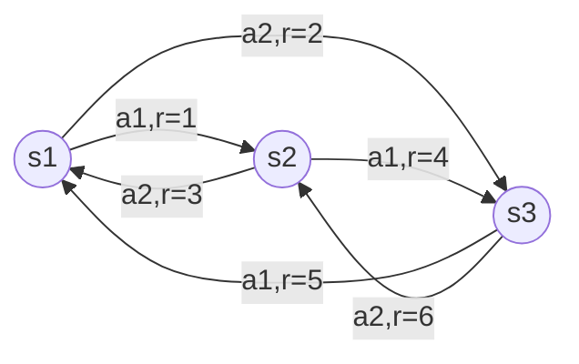

# 强化学习Reinforcement Learning在自然语言处理的前沿进展

## 1. 背景介绍
### 1.1 强化学习的概念与发展历程
强化学习(Reinforcement Learning, RL)是一种重要的机器学习范式,其灵感来源于心理学中的行为主义理论。与监督学习和无监督学习不同,强化学习是一种试错式学习,通过智能体(Agent)与环境的交互,根据环境反馈的奖励信号来不断调整和优化决策,最终学习到最优策略。强化学习经历了从早期的动态规划、时间差分学习、Q-Learning,到深度强化学习的快速发展,并在围棋、视频游戏、机器人控制等领域取得了令人瞩目的成就。

### 1.2 自然语言处理的主要任务与挑战
自然语言处理(Natural Language Processing, NLP)是人工智能的一个重要分支,旨在赋予计算机理解、生成和处理人类语言的能力。NLP涉及的主要任务包括文本分类、命名实体识别、情感分析、机器翻译、文本摘要、问答系统、对话系统等。NLP面临的主要挑战在于自然语言的复杂性、歧义性和多变性,以及语义理解、知识表示、推理决策等方面的困难。

### 1.3 强化学习与自然语言处理的结合
近年来,强化学习开始被引入到自然语言处理领域,为许多NLP任务提供了新的思路和方法。将强化学习应用于NLP,一方面可以利用强化学习的探索机制来处理语言数据的多样性和不确定性,另一方面可以通过奖励函数来引导模型学习符合特定目标的策略。本文将重点介绍强化学习在自然语言处理领域的前沿进展,探讨其核心概念、算法原理、数学模型、实践应用以及面临的机遇与挑战。

## 2. 核心概念与联系
### 2.1 马尔可夫决策过程(MDP)
马尔可夫决策过程是强化学习的理论基础。MDP由状态集合S、动作集合A、状态转移概率P、奖励函数R和折扣因子γ组成。在每个时间步,智能体根据当前状态采取一个动作,环境根据状态转移概率转移到下一个状态并给出奖励反馈,智能体的目标是最大化累积奖励的期望。
 
### 2.2 策略(Policy)与价值函数(Value Function)
策略是智能体的行为准则,定义了在每个状态下应该采取的动作。价值函数用来评估状态的好坏,分为状态价值函数V(s)和动作价值函数Q(s,a)。状态价值函数表示从状态s开始遵循某个策略所能获得的期望回报,动作价值函数表示在状态s下采取动作a然后遵循某个策略所能获得的期望回报。策略和价值函数的学习是强化学习的核心问题。

### 2.3 探索与利用(Exploration vs. Exploitation)
探索与利用是强化学习中的一个基本矛盾。探索是指尝试新的动作以发现可能更优的策略,利用是指基于已有经验采取当前最优动作以获得更多奖励。过度探索会降低学习效率,过度利用则可能陷入局部最优。如何在探索和利用之间取得平衡是强化学习的一大挑战。常见的平衡策略有ε-贪婪、UCB等。

### 2.4 奖励塑造(Reward Shaping)
奖励塑造是一种通过修改奖励函数来引导智能体学习特定行为的技术。设计合理的奖励函数对强化学习至关重要,但在实践中往往很困难。奖励塑造可以在原始奖励的基础上引入额外的奖励信号,加速学习过程并避免次优策略。但奖励塑造也可能改变最优策略,需要谨慎使用。

### 2.5 多智能体强化学习(Multi-Agent RL)
多智能体强化学习是指在包含多个智能体的环境中进行决策优化,智能体之间既存在竞争又存在合作。相比单智能体,多智能体面临的挑战包括信息不完全、策略协调、稳定性等。多智能体强化学习在博弈、交通调度、网络优化等领域有广泛应用。

## 3. 核心算法原理具体操作步骤
### 3.1 Q-Learning算法
Q-Learning是一种经典的无模型、异策略的强化学习算法,通过更新动作价值函数来逼近最优策略。其基本步骤如下:

1. 随机初始化Q(s,a)
2. 重复循环直到收敛:
   1) 根据ε-贪婪策略选择动作a
   2) 执行动作a,观察奖励r和下一状态s'
   3) 更新Q值:
      Q(s,a) ← Q(s,a) + α[r + γ max_a' Q(s',a') - Q(s,a)]
   4) s ← s'
3. 返回最优策略π*: π*(s) = argmax_a Q(s,a)

其中α为学习率,γ为折扣因子。Q-Learning的收敛性得到了理论证明,但其探索效率和稳定性有待提高。

### 3.2 SARSA算法
SARSA(State-Action-Reward-State-Action)是另一种常用的TD控制算法,与Q-Learning的区别在于其使用同策略更新,即下一状态的动作a'由当前策略产生,而不是贪婪选取。SARSA的更新公式为:

Q(s,a) ← Q(s,a) + α[r + γ Q(s',a') - Q(s,a)]

相比Q-Learning,SARSA能更好地评估和改进正在执行的策略,但可能难以收敛到最优策略。

### 3.3 DQN算法
DQN(Deep Q-Network)算法将深度神经网络引入Q-Learning,极大地提升了强化学习处理高维状态空间的能力。DQN在原始Q-Learning的基础上主要做了两点改进:

1. 经验回放(Experience Replay):将智能体与环境交互产生的转移样本(s,a,r,s')存入回放缓冲区,之后从中随机抽取小批量样本来更新网络参数,打破了样本之间的相关性。

2. 目标网络(Target Network):每隔一定步数将当前Q网络的参数复制给目标Q网络,用目标网络来计算TD目标值,提高了学习的稳定性。

DQN的损失函数定义为:

L(θ) = E[(r + γ max_a' Q(s',a';θ') - Q(s,a;θ))^2]

其中θ为当前Q网络参数,θ'为目标Q网络参数。DQN及其变体在Atari游戏、图像分类等领域取得了突破性进展。

### 3.4 策略梯度算法
策略梯度(Policy Gradient)算法直接以参数化的策略函数为优化目标,通过随机梯度上升来更新策略参数,使得预期回报最大化。常见的策略梯度算法包括REINFORCE、Actor-Critic等。以REINFORCE为例,其参数更新公式为:

θ ← θ + α ∇_θ log π_θ(a|s) v_t

其中v_t为蒙特卡洛估计的状态值。策略梯度算法能够直接优化策略,适用于连续动作空间,但通常需要大量样本,方差较大。

### 3.5 PPO算法
近年来,PPO(Proximal Policy Optimization)算法因其稳定性和样本效率受到广泛关注。PPO在TRPO的基础上做了简化,通过限制策略更新幅度来避免策略偏离太远。PPO的目标函数为:

L(θ) = min( r_t(θ) A_t, clip(r_t(θ), 1-ε, 1+ε) A_t )

其中r_t(θ)为概率比,A_t为优势函数,ε为超参数。PPO在连续控制、机器人、自然语言处理等领域展现出优异表现。

## 4. 数学模型和公式详细讲解举例说明
本节我们以策略梯度算法为例,详细推导其数学模型和优化目标。

假设智能体的策略为参数化的条件概率分布π_θ(a|s),其中θ为策略参数。定义智能体在状态s下执行动作a的概率为:

$p(a|s) = \pi_\theta(a|s) = \frac{e^{\phi(s,a)^T\theta}}{\sum_{a'}e^{\phi(s,a')^T\theta}}$

其中φ(s,a)为状态-动作特征向量。那么在一个完整的交互序列τ=(s_0,a_0,r_1,s_1,a_1,...)下,其联合概率为:

$p(\tau|\theta) = p(s_0)\prod_{t=0}^{T-1} \pi_\theta(a_t|s_t)p(s_{t+1}|s_t,a_t)$

定义该序列的累积回报为:

$R(\tau) = \sum_{t=1}^T \gamma^{t-1}r_t$

那么策略梯度算法的优化目标是最大化预期累积回报:

$J(\theta) = E_{\tau\sim p(\tau|\theta)}[R(\tau)] = \int_\tau p(\tau|\theta)R(\tau)d\tau$

根据对数导数技巧,可以将梯度改写为:

$\nabla_\theta J(\theta) = E_{\tau\sim p(\tau|\theta)}[R(\tau)\nabla_\theta \log p(\tau|\theta)]$

$= E_{\tau\sim p(\tau|\theta)}[(\sum_{t=1}^T \gamma^{t-1}r_t)(\sum_{t=0}^{T-1}\nabla_\theta \log \pi_\theta(a_t|s_t))]$

$= E_{\tau\sim p(\tau|\theta)}[\sum_{t=0}^{T-1} \nabla_\theta \log \pi_\theta(a_t|s_t)(\sum_{t'=t+1}^T \gamma^{t'-t-1}r_{t'})]$

$= E_{\tau\sim p(\tau|\theta)}[\sum_{t=0}^{T-1} \nabla_\theta \log \pi_\theta(a_t|s_t)Q^{\pi_\theta}(s_t,a_t)]$

其中$Q^{\pi_\theta}(s_t,a_t)$为状态-动作值函数。上式给出了策略梯度的形式,可以使用蒙特卡洛方法对其进行无偏采样估计:

$\nabla_\theta J(\theta) \approx \frac{1}{N} \sum_{n=1}^N \sum_{t=0}^{T_n-1} \nabla_\theta \log \pi_\theta(a_t^n|s_t^n)(\sum_{t'=t}^{T_n-1} \gamma^{t'-t}r_{t'+1}^n)$

其中N为采样的序列数,T_n为第n个序列的长度。这就是REINFORCE算法的基本公式。在实践中,我们通常引入基准线b(s)来减小梯度估计的方差:

$\nabla_\theta J(\theta) \approx \frac{1}{N} \sum_{n=1}^N \sum_{t=0}^{T_n-1} \nabla_\theta \log \pi_\theta(a_t^n|s_t^n)(Q^{\pi_\theta}(s_t^n,a_t^n)-b(s_t^n))$

常见的基准线选择包括状态值函数$V^{\pi_\theta}(s)$、时间差分误差$\delta_t$等。

下面我们以一个简单的例子来说明策略梯度的计算过程。考虑一个只有3个状态(s1,s2,s3)和2个动作(a1,a2)的MDP,折扣因子γ=1,状态转移和奖励函数如下图所示:

假设策略参数θ=[0.5, 1.0],特征向量φ(s,a)跟状态和动作的one-hot编码拼接而成。现在我们从s1开始,执行了一个如下的序列:

τ = (s1,a2,r=2,s3,a1,r=5,s1,a1,r=1,s2,a2,r=3)

那么该序列的累积回报为:

$R(\tau) = 2 + 5 + 1 + 3 = 11$

根据策略梯度定理,参数θ的梯