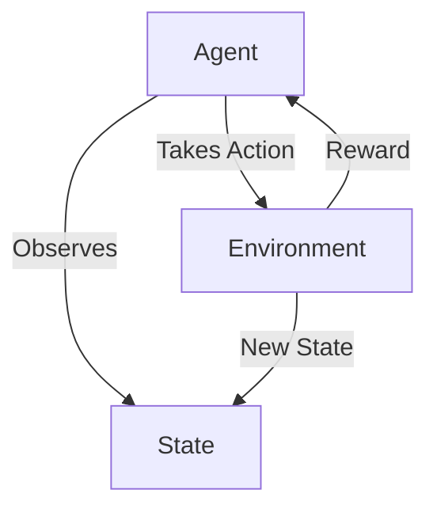

# 强化学习在气候变化领域的应用

## 1. 背景介绍

### 1.1 气候变化的严峻形势

近年来,气候变化已经成为全球关注的重大环境问题。根据联合国政府间气候变化专门委员会(IPCC)的最新报告,全球平均气温自工业化以来已经上升约1.1°C,海平面上升约20厘米。这种变化主要是由于人类活动产生的温室气体排放所致,如果不采取有效的减缓和适应措施,将会给人类社会和自然生态系统带来灾难性的后果。

### 1.2 应对气候变化的重要性

为了应对日益严峻的气候变化,各国政府、企业和公众都在积极采取行动,旨在减缓温室气体排放、提高能源利用效率、发展可再生能源等。然而,气候系统的复杂性和不确定性,使得制定有效的减缓和适应策略成为一个巨大的挑战。

### 1.3 人工智能在气候变化领域的作用

人工智能(AI)技术在气候变化领域展现出巨大的应用潜力。通过大数据分析、机器学习等技术,可以更准确地预测气候变化趋势,优化能源系统,提高资源利用效率。其中,强化学习(Reinforcement Learning)作为人工智能的一个重要分支,在解决气候变化相关问题中发挥着越来越重要的作用。

## 2. 核心概念与联系

### 2.1 强化学习概述

强化学习是机器学习的一种范式,它通过与环境的交互来学习如何映射状态到行为,从而最大化预期的长期回报。与监督学习和无监督学习不同,强化学习没有提供标注的训练数据,而是通过试错来学习。

强化学习系统由四个核心组件组成:

1. **Agent(智能体)**: 观察环境,选择并执行行为。
2. **Environment(环境)**: 代表实际问题或任务所处的情况。
3. **State(状态)**: 环境的当前状态。
4. **Reward(奖励)**: 对智能体执行行为的反馈,用于指导智能体朝着目标优化。

智能体与环境进行交互,观察当前状态,执行行为,获得奖励,并根据奖励调整策略,最终学习到一个最优策略。



### 2.2 强化学习与气候变化问题的联系

气候变化问题可以被建模为一个序列决策过程,其中:

- **状态**包括气温、降水量、海平面高度等气候指标,以及相关的社会经济指标。
- **行为**是人类可以采取的减缓和适应措施,如减排、能源转型、基础设施建设等。
- **奖励**可以是减少的温室气体排放量、降低的气候风险或者提高的社会经济福利。

通过与环境交互并获得奖励,强化学习算法可以学习到最优的策略,指导人类采取有效的行动来应对气候变化。

## 3. 核心算法原理具体操作步骤

强化学习算法主要分为基于价值的算法(Value-based)和基于策略的算法(Policy-based)两大类。本节将介绍其中两种经典算法的原理和具体操作步骤。

### 3.1 Q-Learning算法

Q-Learning是一种基于价值的强化学习算法,它通过估计状态-行为对的价值函数(Q函数)来学习最优策略。算法步骤如下:

1. 初始化Q表格,所有状态-行为对的Q值设为0或随机值。
2. 对于每个时间步:
   - 观察当前状态$s$。
   - 根据$\epsilon$-贪婪策略选择行为$a$,即以$\epsilon$的概率随机选择行为,以$1-\epsilon$的概率选择Q值最大的行为。
   - 执行选择的行为$a$,观察下一状态$s'$和获得的奖励$r$。
   - 更新Q表格中$(s,a)$对应的Q值:

$$Q(s,a) \leftarrow Q(s,a) + \alpha \Big[r + \gamma \max_{a'} Q(s',a') - Q(s,a)\Big]$$

其中,$\alpha$是学习率,$\gamma$是折扣因子。

3. 重复步骤2,直到收敛或达到最大迭代次数。

Q-Learning算法的优点是简单、稳定,但当状态空间和行为空间很大时,查表的效率会变低。

### 3.2 Deep Q-Network (DQN)算法

Deep Q-Network将Q-Learning与深度神经网络相结合,用神经网络来拟合Q函数,从而解决了大状态空间和大行为空间的问题。算法步骤如下:

1. 初始化评估网络$Q(s,a;\theta)$和目标网络$\hat{Q}(s,a;\theta^-)$,两个网络的权重相同。
2. 初始化经验回放池$D$。
3. 对于每个时间步:
   - 观察当前状态$s$。
   - 根据$\epsilon$-贪婪策略选择行为$a=\max_a Q(s,a;\theta)$。
   - 执行选择的行为$a$,观察下一状态$s'$和获得的奖励$r$。
   - 将$(s,a,r,s')$存入经验回放池$D$。
   - 从$D$中随机采样一个批次的转换$(s_j,a_j,r_j,s'_j)$。
   - 计算目标Q值:$y_j = r_j + \gamma \max_{a'} \hat{Q}(s'_j,a';\theta^-)$。
   - 更新评估网络的权重$\theta$,使$Q(s_j,a_j;\theta)$接近$y_j$。
   - 每隔一定步数,将评估网络$\theta$的权重复制到目标网络$\theta^-$。

4. 重复步骤3,直到收敛或达到最大迭代次数。

DQN算法通过经验回放池和目标网络的引入,提高了训练的稳定性和收敛性。

## 4. 数学模型和公式详细讲解举例说明

### 4.1 马尔可夫决策过程(MDP)

强化学习问题通常被建模为马尔可夫决策过程(Markov Decision Process, MDP)。MDP由一个五元组$\langle\mathcal{S}, \mathcal{A}, \mathcal{P}, \mathcal{R}, \gamma\rangle$定义,其中:

- $\mathcal{S}$是状态空间的集合。
- $\mathcal{A}$是行为空间的集合。
- $\mathcal{P}$是转移概率函数,定义为$\mathcal{P}_{ss'}^a = \Pr(s_{t+1}=s'|s_t=s,a_t=a)$,表示在状态$s$执行行为$a$后,转移到状态$s'$的概率。
- $\mathcal{R}$是奖励函数,定义为$\mathcal{R}_s^a = \mathbb{E}[r_{t+1}|s_t=s,a_t=a]$,表示在状态$s$执行行为$a$后获得的预期奖励。
- $\gamma \in [0,1)$是折扣因子,用于权衡即时奖励和长期奖励的重要性。

在气候变化问题中,状态可以包括气温、降水量、海平面高度等气候指标,以及相关的社会经济指标;行为可以是减排、能源转型、基础设施建设等措施;奖励可以是减少的温室气体排放量、降低的气候风险或者提高的社会经济福利。

### 4.2 价值函数和贝尔曼方程

在强化学习中,我们希望找到一个最优策略$\pi^*$,使得在该策略下的期望回报最大化:

$$\pi^* = \arg\max_\pi \mathbb{E}_\pi\Big[\sum_{t=0}^\infty \gamma^t r_{t+1}\Big]$$

为此,我们定义状态价值函数$V^\pi(s)$和状态-行为价值函数$Q^\pi(s,a)$:

$$V^\pi(s) = \mathbb{E}_\pi\Big[\sum_{t=0}^\infty \gamma^t r_{t+1}|s_0=s\Big]$$

$$Q^\pi(s,a) = \mathbb{E}_\pi\Big[\sum_{t=0}^\infty \gamma^t r_{t+1}|s_0=s,a_0=a\Big]$$

价值函数满足贝尔曼方程:

$$V^\pi(s) = \sum_{a\in\mathcal{A}}\pi(a|s)\Big(R_s^a + \gamma\sum_{s'\in\mathcal{S}}P_{ss'}^a V^\pi(s')\Big)$$

$$Q^\pi(s,a) = R_s^a + \gamma\sum_{s'\in\mathcal{S}}P_{ss'}^a V^\pi(s')$$

我们可以通过求解贝尔曼方程,找到最优价值函数$V^*(s)$和$Q^*(s,a)$,进而得到最优策略$\pi^*$。

### 4.3 举例说明

假设我们有一个简化的气候变化问题,状态空间包括当前温室气体浓度和海平面高度两个指标,行为空间包括减排和基础设施建设两种选择。我们定义奖励函数为:

$$R(s,a) = -\alpha \times \text{温室气体浓度} - \beta \times \text{海平面高度} - \gamma \times \text{成本}(a)$$

其中,$\alpha$、$\beta$和$\gamma$是权重系数,用于平衡不同目标的重要性。

我们可以使用Q-Learning或DQN算法来学习最优策略。以Q-Learning为例,在每个时间步,我们观察当前状态$s=(c,h)$,其中$c$是温室气体浓度,$h$是海平面高度。然后根据$\epsilon$-贪婪策略选择行为$a$,执行该行为,获得奖励$r$和下一状态$s'=(c',h')$。接着,我们更新Q表格中$(s,a)$对应的Q值:

$$Q(c,h,a) \leftarrow Q(c,h,a) + \alpha \Big[r + \gamma \max_{a'} Q(c',h',a') - Q(c,h,a)\Big]$$

重复这个过程,直到Q值收敛,我们就可以得到最优策略$\pi^*(s)=\arg\max_a Q^*(s,a)$。

## 5. 项目实践:代码实例和详细解释说明

为了更好地理解强化学习在气候变化领域的应用,我们将通过一个简化的Python示例来演示如何使用Q-Learning算法解决一个基本的气候控制问题。

### 5.1 问题描述

假设我们有一个简化的气候系统,其状态由温室气体浓度(GHG)和平均气温(Temp)两个指标表示。我们可以采取两种行为:减排(Mitigate)和适应(Adapt),目标是最小化温室气体浓度、气温升高和采取行动的成本。

### 5.2 环境构建

我们首先定义环境类`ClimateEnv`,包括状态转移函数和奖励函数:

```python
import numpy as np

class ClimateEnv:
    def __init__(self):
        self.ghg_level = 400  # 初始温室气体浓度(ppm)
        self.temp = 15        # 初始平均气温(°C)
        
    def step(self, action):
        # 状态转移函数
        if action == 0:  # 减排
            self.ghg_level = max(280, self.ghg_level - 10)
        elif action == 1:  # 适应
            self.temp = max(10, self.temp - 1)
        else:
            raise ValueError("Invalid action!")
        
        # 计算奖励
        ghg_cost = self.ghg_level - 280
        temp_cost = max(0, self.temp - 14)
        action_cost = 10 if action == 0 else 5
        reward = -ghg_cost - temp_cost - action_cost
        
        return (self.ghg_level, self.temp), reward
    
    def reset(self):
        self.ghg_level = 400
        self.temp = 15
        return (self.ghg_level, self.temp)
```

### 5.3 Q-Learning算法实现

接下来,我们实现Q-Learning算法:

```python
import numpy as np

class QLearning:
    def __init__(self, env, alpha=0.1, gamma=0.9, epsilon=0.1):
        self.env = env
        self.alpha = alpha    # 学习率
        self.gamma = gamma    # 折扣因子
        self.epsilon = epsilon  # 探索率
        
        # 初始化Q表格
        self.q_table = np.zeros((500, 