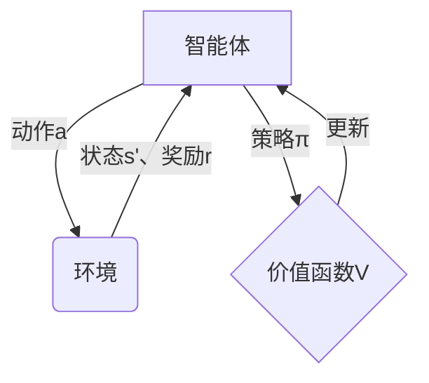

# 强化学习进阶原理与代码实战案例讲解

## 1. 背景介绍

### 1.1 什么是强化学习？

强化学习(Reinforcement Learning, RL)是机器学习的一个重要分支,它关注智能体通过与环境交互来学习行为策略的问题。与监督学习不同,强化学习没有给定的输入-输出数据对,智能体需要通过试错来学习如何在特定环境中采取行动以最大化长期累积奖励。

强化学习的核心思想是基于马尔可夫决策过程(Markov Decision Process, MDP),通过与环境交互获得反馈奖励,不断优化决策策略,最终达到最优化目标。这种学习方式类似于人类和动物通过反复实践和奖惩机制来获得经验的过程。

### 1.2 强化学习的应用场景

随着算力和数据的不断增长,强化学习在诸多领域展现出巨大的应用潜力,例如:

- **游戏AI**: DeepMind的AlphaGo凭借强化学习战胜了人类顶尖棋手,展现了强化学习在复杂决策过程中的卓越表现。
- **机器人控制**: 通过模拟训练,强化学习可以学习复杂的机器人运动控制策略。
- **自动驾驶**: 强化学习可以模拟各种复杂的驾驶场景,学习安全有效的自动驾驶策略。
- **智能系统优化**: 在数据中心负载均衡、网络路由优化等场景,强化学习可以学习最优的资源调度策略。
- **智能投资决策**: 量化投资领域正在探索利用强化学习进行投资组合优化和交易策略制定。

## 2. 核心概念与联系

### 2.1 马尔可夫决策过程(MDP)

马尔可夫决策过程是强化学习的核心数学模型。MDP由以下几个要素组成:

- **状态(State) S**: 环境的当前状态,包含足够信息以描述当前情况。
- **动作(Action) A**: 智能体可以执行的动作集合。
- **转移概率(Transition Probability) P**: 在当前状态执行某个动作后,转移到下一状态的概率分布,即 $P(s' | s, a)$。
- **奖励函数(Reward Function) R**: 环境给予智能体的奖励或惩罚信号,用于评估当前行为的好坏,即 $R(s, a, s')$。
- **折扣因子(Discount Factor) γ**: 用于权衡即时奖励和长期回报的权重,取值范围 $0 \leq \gamma \leq 1$。

智能体的目标是学习一个策略 $\pi: S \rightarrow A$,使得在MDP中获得的长期累积奖励最大化:

$$G_t = \sum_{k=0}^{\infty} \gamma^k r_{t+k+1}$$

其中 $G_t$ 表示从时刻 t 开始的累积奖励,r 为奖励值。



### 2.2 价值函数和贝尔曼方程

为了评估一个策略的好坏,我们引入**价值函数(Value Function)**的概念。价值函数表示在当前状态下执行某个策略所能获得的长期累积奖励的期望值。

- **状态价值函数(State-Value Function) V(s)**: 表示在状态 s 下执行策略 $\pi$ 所能获得的长期累积奖励的期望值。
- **动作价值函数(Action-Value Function) Q(s, a)**: 表示在状态 s 下执行动作 a,之后再执行策略 $\pi$ 所能获得的长期累积奖励的期望值。

价值函数满足一组著名的**贝尔曼方程(Bellman Equations)**,描述了当前状态的价值与下一状态价值之间的递推关系:

$$V^{\pi}(s) = \mathbb{E}_{\pi}\left[r_{t+1} + \gamma V^{\pi}(s_{t+1}) | s_t = s\right]$$

$$Q^{\pi}(s, a) = \mathbb{E}_{\pi}\left[r_{t+1} + \gamma \max_{a'} Q^{\pi}(s_{t+1}, a') | s_t = s, a_t = a\right]$$

贝尔曼方程为求解最优策略提供了理论基础,也是强化学习算法的核心。

### 2.3 探索与利用权衡

在学习过程中,智能体需要权衡**探索(Exploration)**和**利用(Exploitation)**之间的平衡:

- **探索**: 尝试新的行为,以发现潜在的更优策略。
- **利用**: 利用已学习到的最优策略来获取最大化奖励。

过度探索会导致浪费资源,而过度利用又可能陷入次优解。常见的探索策略包括 $\epsilon$-贪婪(epsilon-greedy)、软max(softmax)等。

## 3. 核心算法原理具体操作步骤

强化学习算法主要分为三大类:基于价值函数(Value-based)、基于策略(Policy-based)和基于模型(Model-based)。我们将重点介绍两种经典且具有代表性的算法:Q-Learning和策略梯度(Policy Gradient)。

### 3.1 Q-Learning

Q-Learning是一种基于价值函数的强化学习算法,它直接学习状态-动作价值函数 Q(s, a)。算法步骤如下:

1. 初始化 Q 表格,所有 Q(s, a) 值设为任意值(如 0)。
2. 对于每个时间步:
    a) 根据当前状态 s,选择动作 a(通常使用 $\epsilon$-贪婪策略)。
    b) 执行动作 a,获得奖励 r 和新状态 s'。
    c) 更新 Q(s, a) 值:
    
    $$Q(s, a) \leftarrow Q(s, a) + \alpha \left[r + \gamma \max_{a'} Q(s', a') - Q(s, a)\right]$$
    
    其中 $\alpha$ 为学习率。
3. 重复步骤 2,直到收敛。

Q-Learning的优点是简单、高效,适用于离散状态空间和动作空间。但对于连续空间或大规模问题,Q表格将变得非常庞大,存在维数灾难问题。

### 3.2 策略梯度(Policy Gradient)

策略梯度是一种基于策略的强化学习算法,它直接学习策略函数 $\pi_\theta(a|s)$,表示在状态 s 下选择动作 a 的概率,其中 $\theta$ 为策略的参数。算法步骤如下:

1. 初始化策略参数 $\theta$。
2. 对于每个时间步:
    a) 根据当前策略 $\pi_\theta(a|s)$ 选择动作 a。
    b) 执行动作 a,获得奖励 r 和新状态 s'。
    c) 计算累积奖励 $G_t = \sum_{k=t}^{T} \gamma^{k-t} r_k$。
    d) 更新策略参数 $\theta$:
    
    $$\theta \leftarrow \theta + \alpha \nabla_\theta \log \pi_\theta(a_t|s_t) G_t$$
    
    其中 $\alpha$ 为学习率。
3. 重复步骤 2,直到收敛。

策略梯度算法可以直接处理连续动作空间,并且通过神经网络来近似策略函数,可以应对高维状态空间。但是它的收敛性能往往不如基于价值函数的算法,并且存在高方差问题。

## 4. 数学模型和公式详细讲解举例说明

在强化学习中,我们经常需要处理序列数据,例如状态-动作-奖励序列。为了有效地捕捉序列数据中的长期依赖关系,我们通常会使用**递归神经网络(Recurrent Neural Network, RNN)**或**长短期记忆网络(Long Short-Term Memory, LSTM)**等模型。

### 4.1 策略梯度的数学模型

在策略梯度算法中,我们使用神经网络来近似策略函数 $\pi_\theta(a|s)$。假设我们有一个含有参数 $\theta$ 的神经网络,其输入为状态 s,输出为动作概率分布 $\pi_\theta(a|s)$。我们的目标是最大化期望累积奖励 $J(\theta)$:

$$J(\theta) = \mathbb{E}_{\pi_\theta}\left[\sum_{t=0}^{T} \gamma^t r_t\right]$$

根据策略梯度定理,我们可以计算目标函数 $J(\theta)$ 关于参数 $\theta$ 的梯度:

$$\nabla_\theta J(\theta) = \mathbb{E}_{\pi_\theta}\left[\sum_{t=0}^{T} \nabla_\theta \log \pi_\theta(a_t|s_t) G_t\right]$$

其中 $G_t = \sum_{k=t}^{T} \gamma^{k-t} r_k$ 为从时刻 t 开始的累积奖励。

在实际计算中,我们通常使用蒙特卡罗采样来近似期望值,并使用小批量梯度下降法来更新网络参数 $\theta$。

### 4.2 Actor-Critic 算法

Actor-Critic 算法是一种结合了价值函数和策略的强化学习算法,它由两个独立的神经网络组成:

- **Actor 网络**:近似策略函数 $\pi_\theta(a|s)$,用于选择动作。
- **Critic 网络**:近似价值函数 $V_w(s)$ 或 $Q_w(s, a)$,用于评估当前状态或状态-动作对的价值。

Actor 网络根据 Critic 网络提供的价值估计,通过策略梯度算法来更新策略参数 $\theta$。同时,Critic 网络也会根据实际获得的奖励来更新价值函数参数 $w$。

Actor-Critic 算法结合了基于价值函数和基于策略的优点,通常具有更好的收敛性能和稳定性。

### 4.3 深度 Q 网络(Deep Q-Network, DQN)

深度 Q 网络是一种结合 Q-Learning 和深度神经网络的算法,它使用神经网络来近似 Q 函数 $Q(s, a; \theta)$,其中 $\theta$ 为网络参数。

在训练过程中,DQN 会维护两个神经网络:

- **在线网络(Online Network)**: 用于选择动作和更新 Q 值。
- **目标网络(Target Network)**: 用于计算 Q 值目标,其参数是在线网络参数的复制。

目标网络的参数会定期复制在线网络的参数,以保持稳定性。同时,DQN 还引入了经验回放(Experience Replay)和固定 Q 目标(Fixed Q-Targets)等技术来提高算法的稳定性和收敛性能。

DQN 算法在许多经典游戏中表现出色,展现了深度强化学习在高维观测空间中的强大能力。

## 5. 项目实践:代码实例和详细解释说明

为了更好地理解强化学习算法的实现细节,我们将通过一个简单的网格世界(GridWorld)游戏来实践 Q-Learning 算法。

### 5.1 问题描述

在一个 4x4 的网格世界中,智能体(Agent)的目标是从起点(S)到达终点(G)。每一步,智能体可以选择上下左右四个方向中的一个进行移动。如果移动到了障碍物(H)处,则会被阻挡;如果移动到了终点,则获得 +1 的奖励,否则获得 -0.04 的惩罚。我们的目标是通过 Q-Learning 算法训练智能体找到从起点到终点的最优路径。

```
+---------------+
|   |   |   |   |
|   | H |   | G |
|   |   |   |   |
| S |   |   |   |
+---------------+
```

### 5.2 Q-Learning 实现

我们将使用 Python 和 NumPy 库来实现 Q-Learning 算法。完整代码如下:

```python
import numpy as np

# 初始化 Q 表格
Q = np.zeros((4, 4, 4))

# 设置超参数
alpha = 0.1  # 学习率
gamma = 0.9  # 折扣因子
epsilon = 0.1  # 探索概率

# 定义动作
actions = ['up', 'down', 'left', 'right']

# 定义奖励
rewards = np.full((4, 4), -0.04)
rewards[3, 3]