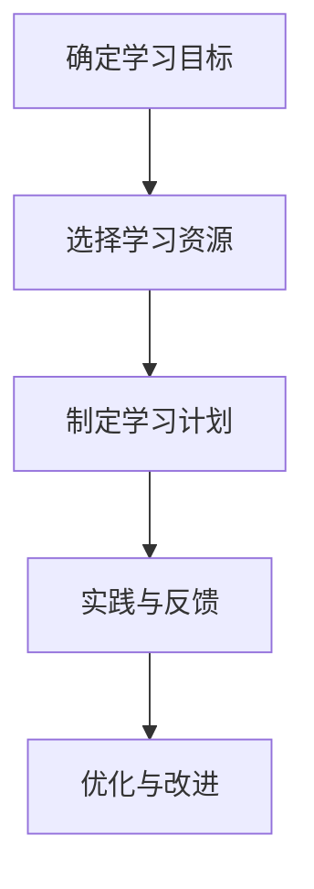

# 持续学习：概念与重要性

## 1.背景介绍

在当今快速发展的科技时代，持续学习已经成为每个IT从业者的必备技能。无论是人工智能、云计算、大数据还是区块链技术，每一项新兴技术都在不断地演进和更新。对于程序员、软件架构师和技术领导者来说，保持技术的前沿性和竞争力，持续学习显得尤为重要。

持续学习不仅仅是为了跟上技术的步伐，更是为了提升自身的解决问题能力和创新能力。通过不断地学习和实践，技术人员可以更好地理解复杂系统的内部机制，从而设计出更高效、更可靠的解决方案。

## 2.核心概念与联系

### 2.1 持续学习的定义

持续学习（Continuous Learning）是指在职业生涯中不断地获取新知识、技能和经验的过程。它不仅包括正式的教育和培训，还包括自学、实践和从他人那里学习。

### 2.2 持续学习与终身学习的区别

虽然持续学习和终身学习（Lifelong Learning）有很多相似之处，但它们在应用范围和目标上有所不同。终身学习强调的是在整个生命过程中不断学习，而持续学习更侧重于职业生涯中的持续进步和技能提升。

### 2.3 持续学习的核心要素

- **主动性**：持续学习需要个人主动去寻找学习资源和机会。
- **适应性**：能够快速适应新技术和新环境。
- **实践性**：通过实际项目和问题解决来巩固所学知识。
- **反馈机制**：通过反馈不断改进和提升自己的技能。

## 3.核心算法原理具体操作步骤

### 3.1 学习路径规划

在持续学习的过程中，合理的学习路径规划是至关重要的。以下是一个典型的学习路径规划步骤：

1. **确定学习目标**：明确自己需要掌握的技术和技能。
2. **选择学习资源**：选择合适的书籍、在线课程、博客和论坛。
3. **制定学习计划**：根据自己的时间安排，制定详细的学习计划。
4. **实践与反馈**：通过项目实践和代码编写来巩固所学知识，并通过反馈不断改进。

### 3.2 学习算法的应用

在学习新技术时，掌握核心算法是非常重要的。以下是一个典型的学习算法的应用步骤：

1. **理解算法原理**：通过阅读文献和教材，理解算法的基本原理和应用场景。
2. **实现算法**：通过编写代码实现算法，并进行测试和优化。
3. **应用算法**：在实际项目中应用算法，解决具体问题。
4. **优化算法**：根据实际应用中的反馈，不断优化和改进算法。

### 3.3 Mermaid 流程图示例

以下是一个学习路径规划的Mermaid流程图：



## 4.数学模型和公式详细讲解举例说明

### 4.1 数学模型在持续学习中的应用

数学模型在持续学习中起着至关重要的作用。通过数学模型，我们可以更好地理解和分析学习过程中的各种现象和问题。

### 4.2 线性回归模型

线性回归模型是最常见的数学模型之一，它可以帮助我们理解变量之间的线性关系。在持续学习中，我们可以使用线性回归模型来分析学习效果和学习时间之间的关系。

线性回归模型的公式如下：

$$
y = \beta_0 + \beta_1 x + \epsilon
$$

其中，$y$ 是因变量，$x$ 是自变量，$\beta_0$ 和 $\beta_1$ 是回归系数，$\epsilon$ 是误差项。

### 4.3 实例讲解

假设我们要分析学习时间（$x$）和学习效果（$y$）之间的关系。我们可以收集一组数据，并使用线性回归模型进行分析。以下是一个简单的Python代码示例：

```python
import numpy as np
import matplotlib.pyplot as plt
from sklearn.linear_model import LinearRegression

# 生成示例数据
x = np.array([1, 2, 3, 4, 5]).reshape(-1, 1)
y = np.array([2, 3, 5, 7, 11])

# 创建线性回归模型
model = LinearRegression()
model.fit(x, y)

# 预测
y_pred = model.predict(x)

# 绘制结果
plt.scatter(x, y, color='blue')
plt.plot(x, y_pred, color='red')
plt.xlabel('学习时间')
plt.ylabel('学习效果')
plt.title('学习时间与学习效果的关系')
plt.show()
```

## 5.项目实践：代码实例和详细解释说明

### 5.1 项目背景

为了更好地理解持续学习的重要性，我们将通过一个实际项目来展示如何在学习过程中应用所学知识。假设我们要开发一个简单的推荐系统，通过持续学习来不断优化推荐算法。

### 5.2 项目需求分析

- **功能需求**：实现一个简单的推荐系统，根据用户的历史行为推荐相关内容。
- **技术需求**：使用Python编程语言，结合机器学习算法实现推荐系统。

### 5.3 项目实现步骤

#### 5.3.1 数据准备

首先，我们需要准备一组用户行为数据。以下是一个简单的数据示例：

```python
import pandas as pd

# 创建示例数据
data = {
    'user_id': [1, 1, 2, 2, 3, 3],
    'item_id': [101, 102, 101, 103, 102, 104],
    'rating': [5, 3, 4, 2, 5, 1]
}

df = pd.DataFrame(data)
print(df)
```

#### 5.3.2 数据预处理

在数据预处理阶段，我们需要对数据进行清洗和转换，以便后续的算法应用。

```python
# 数据预处理
user_item_matrix = df.pivot(index='user_id', columns='item_id', values='rating').fillna(0)
print(user_item_matrix)
```

#### 5.3.3 算法实现

我们将使用协同过滤算法来实现推荐系统。以下是一个简单的协同过滤算法实现示例：

```python
from sklearn.metrics.pairwise import cosine_similarity

# 计算用户相似度
user_similarity = cosine_similarity(user_item_matrix)
print(user_similarity)

# 根据用户相似度进行推荐
def recommend(user_id, user_similarity, user_item_matrix, top_n=2):
    similar_users = user_similarity[user_id - 1].argsort()[::-1][1:top_n + 1]
    recommended_items = user_item_matrix.iloc[similar_users].mean(axis=0).sort_values(ascending=False)
    return recommended_items.index.tolist()

# 推荐结果
recommended_items = recommend(1, user_similarity, user_item_matrix)
print(recommended_items)
```

### 5.4 结果分析与优化

通过上述代码，我们可以得到推荐结果。接下来，我们可以通过不断地调整算法参数和优化数据预处理步骤，来提升推荐系统的性能。

## 6.实际应用场景

### 6.1 企业级应用

在企业级应用中，持续学习可以帮助技术团队保持技术的前沿性，从而提升企业的竞争力。例如，互联网公司可以通过持续学习来不断优化搜索引擎算法，提高用户体验。

### 6.2 教育领域

在教育领域，持续学习可以帮助教师和学生不断提升教学和学习效果。例如，教师可以通过持续学习来掌握最新的教学方法和技术，从而提升教学质量。

### 6.3 医疗领域

在医疗领域，持续学习可以帮助医生和医疗研究人员掌握最新的医疗技术和研究成果，从而提升医疗服务质量和研究水平。

## 7.工具和资源推荐

### 7.1 在线学习平台

- **Coursera**：提供丰富的在线课程，涵盖各个技术领域。
- **edX**：提供高质量的在线课程，适合各个层次的学习者。
- **Udacity**：专注于技术领域的在线教育，提供实用的项目实践课程。

### 7.2 技术博客和论坛

- **Stack Overflow**：全球最大的技术问答社区，适合解决具体的技术问题。
- **Medium**：提供丰富的技术博客文章，涵盖各个技术领域。
- **GitHub**：全球最大的代码托管平台，适合学习和分享代码。

### 7.3 书籍推荐

- **《代码大全》**：软件开发领域的经典书籍，适合各个层次的程序员。
- **《算法导论》**：算法领域的经典书籍，适合深入学习算法原理和应用。
- **《深度学习》**：深度学习领域的经典书籍，适合学习深度学习的基本原理和应用。

## 8.总结：未来发展趋势与挑战

### 8.1 未来发展趋势

随着科技的不断发展，持续学习将变得越来越重要。未来，人工智能和自动化技术将进一步推动持续学习的发展，使得学习过程更加智能化和个性化。

### 8.2 持续学习的挑战

尽管持续学习有很多优势，但也面临一些挑战。例如，学习资源的选择和时间的管理是持续学习中的两个重要问题。此外，如何将所学知识应用到实际工作中，也是一个需要解决的问题。

## 9.附录：常见问题与解答

### 9.1 如何选择合适的学习资源？

选择学习资源时，可以根据自己的学习目标和兴趣来选择。同时，可以参考他人的推荐和评价，选择高质量的学习资源。

### 9.2 如何管理学习时间？

管理学习时间时，可以制定详细的学习计划，并合理安排学习时间和休息时间。此外，可以使用一些时间管理工具，如番茄工作法，来提高学习效率。

### 9.3 如何将所学知识应用到实际工作中？

将所学知识应用到实际工作中时，可以通过项目实践和问题解决来巩固所学知识。此外，可以通过与同事和专家的交流，获取更多的实践经验和建议。

---

作者：禅与计算机程序设计艺术 / Zen and the Art of Computer Programming