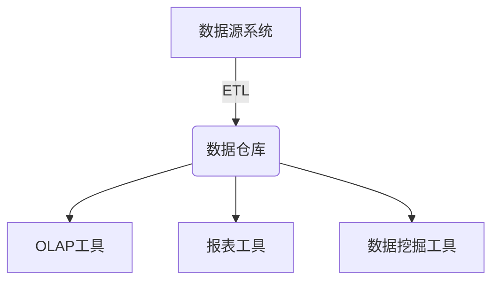
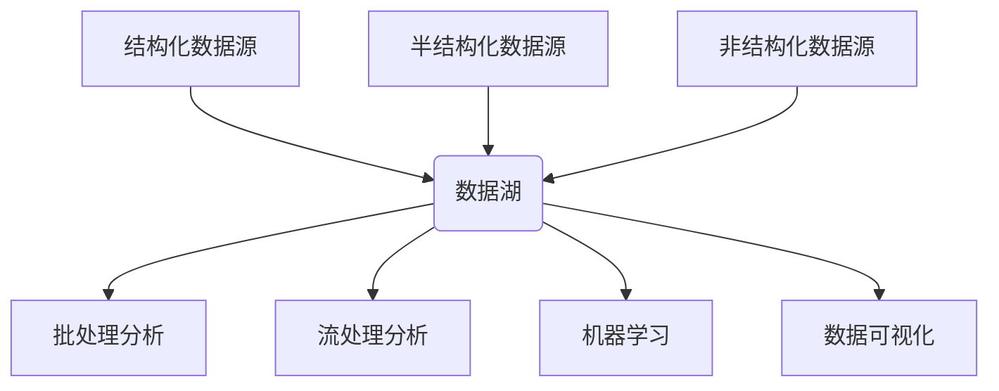
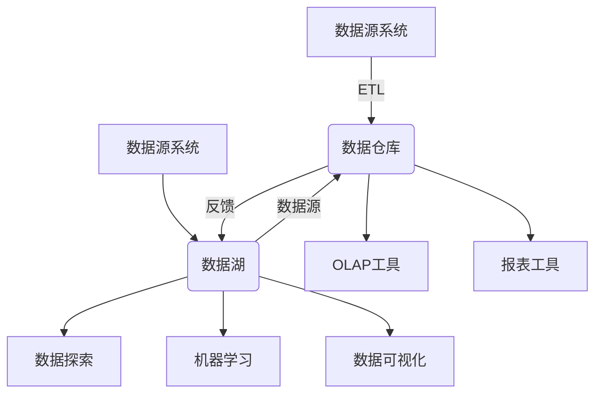

# 数据仓库与数据湖原理与代码实战案例讲解

## 1. 背景介绍

### 1.1 数据爆炸时代

在当今的数字化时代,数据正以前所未有的规模和速度被产生。根据IDC的预测,到2025年,全球数据量将达到175ZB(1ZB=1万亿GB)。这种数据爆炸式增长主要源于以下几个方面:

- 移动设备和物联网的快速普及
- 社交媒体平台的广泛使用
- 各行业数字化转型的加速
- 人工智能和大数据分析的兴起

### 1.2 数据价值挖掘的重要性

尽管数据量的激增给企业带来了存储和管理上的挑战,但同时也蕴藏着巨大的商业价值。通过对这些海量数据进行深入分析和智能挖掘,企业可以获得以下价值:

- 洞察客户行为和偏好,改善产品和服务
- 优化内部运营流程,降低成本和提高效率
- 发现新的商业机会和增长点
- 制定更加精准的业务决策

因此,如何高效管理和利用这些数据资产,成为企业保持竞争力的关键因素。

### 1.3 数据仓库和数据湖的兴起

为了满足企业对数据存储、集成和分析的需求,数据仓库和数据湖这两种数据管理架构应运而生。它们分别针对不同的数据类型和应用场景,为企业提供了灵活、可扩展的解决方案。

## 2. 核心概念与联系

### 2.1 数据仓库

数据仓库(Data Warehouse)是一种面向主题的、集成的、非易失的、随时间变化的数据集合,用于支持管理决策过程。它通常采用多维数据模型,将来自不同源系统的数据进行ETL(提取、转换、加载)处理,然后加载到中央仓库中,供分析和查询使用。

数据仓库的主要特点包括:

- 面向主题:按照业务领域或主题进行数据组织
- 集成:将来自不同源系统的数据进行清洗和整合
- 非易失:仓库中的数据是只读的,不会被修改或删除
- 随时间变化:保存历史数据,支持跨时间维度的分析

数据仓库架构通常采用星型或雪花型模式,由事实表和维度表组成。事实表存储度量值,维度表存储描述性数据。

### 2.2 数据湖

数据湖(Data Lake)是一种存储各种结构化、半结构化和非结构化数据的集中式存储库。与数据仓库不同,数据湖采用扁平化的架构,以原始格式存储数据,无需预先定义模式。数据可以在需要时才进行处理和分析。

数据湖的主要特点包括:

- 存储各种数据:支持结构化、半结构化和非结构化数据
- 原始数据存储:以原始格式存储数据,无需预先处理
- 廉价存储:利用分布式存储技术,成本较低
- 灵活处理:数据可以根据需求进行处理和分析

数据湖架构通常基于分布式文件系统(如HDFS)和分布式计算框架(如Apache Spark)构建。

### 2.3 数据仓库与数据湖的关系

数据仓库和数据湖并非完全对立的概念,它们在数据管理和分析过程中可以互为补充:

- 数据湖可以作为数据仓库的数据源,为数据仓库提供原始数据
- 数据仓库可以将处理后的数据反馈到数据湖,供进一步分析和处理
- 数据湖可以作为数据科学家的"沙箱",用于探索性分析和模型训练
- 数据仓库可以为数据湖提供结构化的元数据和治理能力

总的来说,数据仓库侧重于为决策支持提供高质量的数据,而数据湖则为数据科学家和分析师提供了灵活的数据探索和处理环境。

## 3. 核心算法原理具体操作步骤

### 3.1 数据仓库构建流程

构建数据仓库是一个复杂的过程,涉及多个步骤和技术。以下是典型的数据仓库构建流程:

1. **需求分析与规划**
   - 确定业务需求和分析目标
   - 设计数据模型和架构
   - 制定项目计划和资源分配

2. **数据源评估与集成**
   - 识别和评估数据源系统
   - 设计ETL流程和映射规则
   - 构建ETL工具和数据集成平台

3. **数据质量管理**
   - 定义数据质量标准和指标
   - 实施数据清洗和标准化流程
   - 建立数据质量监控和报告机制

4. **数据仓库构建**
   - 设计和实现数据模型(星型或雪花型)
   - 创建维度表和事实表
   - 加载和刷新数据

5. **元数据管理**
   - 建立元数据存储库
   - 捕获和维护元数据
   - 提供元数据查询和报告功能

6. **性能优化**
   - 监控和分析查询性能
   - 实施索引、分区和其他优化技术
   - 调整硬件资源和配置

7. **安全与治理**
   - 实施访问控制和安全策略
   - 建立数据治理流程和标准
   - 确保数据合规性和隐私保护

8. **部署与维护**
   - 部署数据仓库到生产环境
   - 建立监控和报警机制
   - 执行定期维护和升级

### 3.2 数据湖构建流程

与数据仓库相比,数据湖的构建流程相对简单,但同样需要考虑多个方面。以下是典型的数据湖构建流程:

1. **需求分析与规划**
   - 确定数据湖的用途和目标
   - 评估数据源和数据类型
   - 设计数据湖架构和技术栈

2. **数据摄取**
   - 构建数据摄取管道
   - 支持各种数据格式和协议
   - 实现数据复制和传输

3. **数据存储**
   - 部署分布式文件系统(如HDFS)
   - 确定数据存储格式和压缩策略
   - 实施数据生命周期管理策略

4. **元数据管理**
   - 捕获和维护元数据
   - 提供元数据查询和搜索功能
   - 支持数据发现和数据资产管理

5. **数据处理与分析**
   - 部署分布式计算框架(如Apache Spark)
   - 支持批处理和流处理
   - 集成机器学习和数据可视化工具

6. **数据治理与安全**
   - 建立数据治理策略和流程
   - 实施访问控制和安全措施
   - 确保数据质量和合规性

7. **监控与优化**
   - 监控数据湖的性能和使用情况
   - 优化存储、计算和网络资源
   - 实施故障恢复和容错机制

8. **部署与维护**
   - 部署数据湖到生产环境
   - 建立监控和报警机制
   - 执行定期维护和升级

无论是数据仓库还是数据湖,构建过程都需要全面考虑数据管理的各个方面,包括架构设计、数据集成、数据质量、元数据管理、性能优化、安全与治理等。只有通过严格的规划和实施,才能确保数据资产的高质量和高效利用。

## 4. 数学模型和公式详细讲解举例说明

在数据仓库和数据湖的设计和优化过程中,常常需要借助一些数学模型和公式来量化和评估系统的性能和效率。以下是一些常见的数学模型和公式:

### 4.1 数据压缩

数据压缩是减小数据存储空间和传输开销的有效手段。在数据仓库和数据湖中,常用的压缩算法包括:

- **RLE(Run-Length Encoding)**: 适用于存在大量重复数据的场景,将连续的重复值编码为一个值和重复次数的形式。压缩率取决于数据的重复程度。

- **字典编码**: 将重复出现的字符串或值映射到一个短的编码,从而减小存储空间。压缩率取决于数据的重复程度和字典大小。

- **熵编码**: 根据数据的统计特性,为出现频率高的值分配较短的编码,出现频率低的值分配较长的编码。常用的熵编码算法包括霍夫曼编码和算术编码。压缩率取决于数据的熵值。

假设原始数据大小为$S$,压缩后的数据大小为$S'$,则压缩率可以用下式表示:

$$
压缩率 = \frac{S - S'}{S} \times 100\%
$$

压缩率越高,存储空间和传输开销就越小。但同时也需要考虑压缩和解压缩的CPU开销。

### 4.2 数据分区

在大型数据集中,合理的数据分区策略可以提高查询性能和并行处理效率。常见的分区技术包括:

- **水平分区**: 根据某些列值将数据划分到不同的分区中,每个分区存储一部分数据行。
- **垂直分区**: 根据列将数据划分到不同的分区中,每个分区存储一部分列。
- **组合分区**: 结合水平和垂直分区,将数据划分到多个小分区中。

假设查询需要扫描的数据量为$D$,数据被划分为$n$个分区,查询只需要访问$k$个分区,则查询效率的提升可以用下式表示:

$$
效率提升 = \frac{D}{D - \frac{k}{n}D} = \frac{n}{n - k}
$$

当$k \ll n$时,效率提升将非常显著。但过多的分区也会增加元数据开销和查询调度开销,因此需要权衡分区粒度。

### 4.3 数据倾斜

在分布式数据处理系统中,数据倾斜是一个常见的性能瓶颈。数据倾斜是指数据在不同的分区或节点之间分布不均匀,导致部分节点负载过重,而其他节点负载较轻。

假设有$n$个节点,第$i$个节点的负载为$w_i$,理想情况下每个节点的负载应该是$\overline{w} = \frac{1}{n}\sum_{i=1}^{n}w_i$。我们可以使用方差或标准差来衡量数据倾斜的程度:

$$
方差 = \frac{1}{n}\sum_{i=1}^{n}(w_i - \overline{w})^2
$$

$$
标准差 = \sqrt{\frac{1}{n}\sum_{i=1}^{n}(w_i - \overline{w})^2}
$$

方差或标准差越大,说明数据倾斜越严重。解决数据倾斜的常见方法包括:

- 优化数据分区策略,使数据尽量均匀分布
- 使用数据采样和数据倾斜检测机制
- 实施动态负载均衡和任务调度策略

### 4.4 查询优化

在数据仓库中,查询优化是提高查询性能的关键技术。常见的查询优化策略包括:

- **索引**: 建立合适的索引可以加速数据查找,但索引也会增加存储和维护开销。
- **连接优化**: 优化连