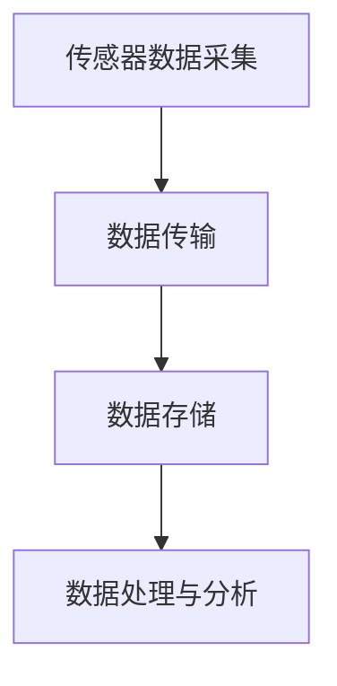
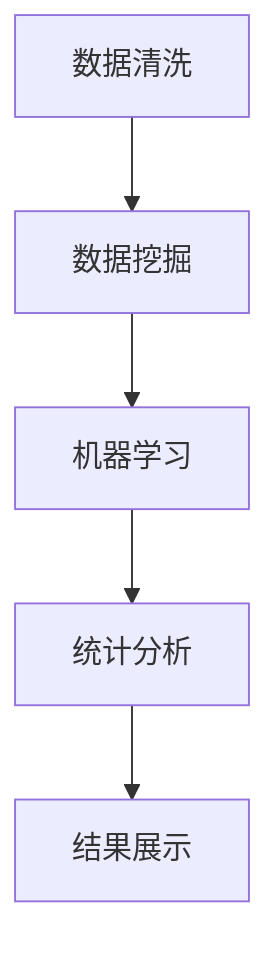
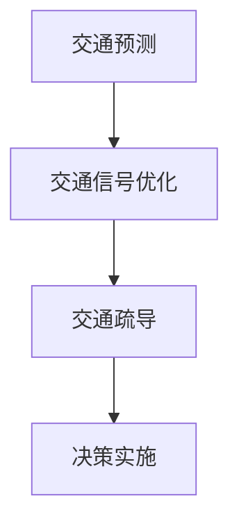

# 数据收集在交通领域的应用

## 1.背景介绍

在现代社会，交通系统的复杂性和规模不断增加，交通管理和优化成为了一个重要的研究领域。数据收集在交通领域的应用，能够帮助我们更好地理解交通流量、预测交通状况、优化交通管理策略，从而提高交通系统的效率和安全性。随着物联网（IoT）、大数据和人工智能技术的发展，数据收集在交通领域的应用变得越来越广泛和深入。

## 2.核心概念与联系

### 2.1 数据收集

数据收集是指通过各种手段和技术获取交通系统中的相关数据。这些数据可以包括车辆位置、速度、交通流量、道路状况、天气信息等。数据收集的手段包括传感器、摄像头、GPS设备、移动应用等。

### 2.2 数据处理与分析

数据处理与分析是指对收集到的数据进行清洗、整理、分析和建模，以提取有用的信息和知识。数据处理与分析的技术包括数据清洗、数据挖掘、机器学习、统计分析等。

### 2.3 数据驱动的决策

数据驱动的决策是指基于数据分析的结果，制定和优化交通管理策略。数据驱动的决策可以帮助交通管理部门更好地预测交通状况、优化交通信号控制、制定交通疏导方案等。

### 2.4 数据收集与交通管理的联系

数据收集是交通管理的基础，通过数据收集可以获取交通系统的实时状态和历史数据，为交通管理提供决策支持。数据处理与分析是数据收集和交通管理之间的桥梁，通过对数据的分析，可以提取有用的信息和知识，为交通管理提供科学依据。

## 3.核心算法原理具体操作步骤

### 3.1 数据收集算法

数据收集算法主要包括传感器数据采集、数据传输和数据存储等步骤。以下是一个典型的数据收集流程图：



### 3.2 数据处理与分析算法

数据处理与分析算法主要包括数据清洗、数据挖掘、机器学习和统计分析等步骤。以下是一个典型的数据处理与分析流程图：



### 3.3 数据驱动的决策算法

数据驱动的决策算法主要包括交通预测、交通信号优化和交通疏导等步骤。以下是一个典型的数据驱动的决策流程图：



## 4.数学模型和公式详细讲解举例说明

### 4.1 交通流量模型

交通流量模型是描述交通流量变化规律的数学模型。常见的交通流量模型包括宏观模型和微观模型。宏观模型主要描述交通流量的整体变化规律，微观模型主要描述单个车辆的行为。

#### 4.1.1 宏观模型

宏观模型常用的数学公式包括连续性方程和流量-密度关系式。连续性方程描述了交通流量的守恒性，流量-密度关系式描述了交通流量与交通密度之间的关系。

$$
\frac{\partial \rho}{\partial t} + \frac{\partial (\rho v)}{\partial x} = 0
$$

其中，$\rho$ 表示交通密度，$v$ 表示交通速度，$x$ 表示空间位置，$t$ 表示时间。

#### 4.1.2 微观模型

微观模型常用的数学公式包括车辆跟驰模型和车道变换模型。车辆跟驰模型描述了车辆之间的跟驰行为，车道变换模型描述了车辆的车道变换行为。

$$
a_i(t) = f(v_i(t), \Delta v_i(t), s_i(t))
$$

其中，$a_i(t)$ 表示第 $i$ 辆车在时间 $t$ 的加速度，$v_i(t)$ 表示第 $i$ 辆车在时间 $t$ 的速度，$\Delta v_i(t)$ 表示第 $i$ 辆车与前车的速度差，$s_i(t)$ 表示第 $i$ 辆车与前车的距离。

### 4.2 交通信号优化模型

交通信号优化模型是通过优化交通信号的配时方案，提高交通系统的通行效率。常见的交通信号优化模型包括固定配时模型和自适应配时模型。

#### 4.2.1 固定配时模型

固定配时模型是指交通信号的配时方案在一定时间内保持不变。固定配时模型的优化目标是最小化交通延误或最大化交通流量。

$$
\min \sum_{i=1}^{N} D_i
$$

其中，$D_i$ 表示第 $i$ 个路口的交通延误，$N$ 表示路口的数量。

#### 4.2.2 自适应配时模型

自适应配时模型是指交通信号的配时方案根据实时交通状况进行动态调整。自适应配时模型的优化目标是最小化交通延误或最大化交通流量。

$$
\min \sum_{i=1}^{N} D_i(t)
$$

其中，$D_i(t)$ 表示第 $i$ 个路口在时间 $t$ 的交通延误，$N$ 表示路口的数量。

## 5.项目实践：代码实例和详细解释说明

### 5.1 数据收集代码实例

以下是一个使用Python进行数据收集的代码实例，利用GPS设备获取车辆位置数据：

```python
import serial
import time

def read_gps_data():
    ser = serial.Serial('/dev/ttyUSB0', 9600, timeout=1)
    while True:
        line = ser.readline().decode('ascii', errors='replace')
        if line.startswith('$GPGGA'):
            data = line.split(',')
            latitude = float(data[2])
            longitude = float(data[4])
            print(f'Latitude: {latitude}, Longitude: {longitude}')
        time.sleep(1)

if __name__ == '__main__':
    read_gps_data()
```

### 5.2 数据处理与分析代码实例

以下是一个使用Python进行数据处理与分析的代码实例，利用Pandas库对交通流量数据进行清洗和分析：

```python
import pandas as pd

# 读取交通流量数据
data = pd.read_csv('traffic_data.csv')

# 数据清洗
data = data.dropna()  # 删除缺失值
data = data[data['speed'] > 0]  # 删除速度为0的数据

# 数据分析
average_speed = data['speed'].mean()
traffic_density = data['density'].mean()

print(f'Average Speed: {average_speed}')
print(f'Traffic Density: {traffic_density}')
```

### 5.3 数据驱动的决策代码实例

以下是一个使用Python进行数据驱动的决策的代码实例，利用Scikit-learn库进行交通流量预测：

```python
import pandas as pd
from sklearn.model_selection import train_test_split
from sklearn.linear_model import LinearRegression

# 读取交通流量数据
data = pd.read_csv('traffic_data.csv')

# 特征选择
X = data[['time', 'day_of_week', 'weather']]
y = data['traffic_flow']

# 数据分割
X_train, X_test, y_train, y_test = train_test_split(X, y, test_size=0.2, random_state=42)

# 模型训练
model = LinearRegression()
model.fit(X_train, y_train)

# 模型预测
y_pred = model.predict(X_test)

# 结果展示
print(f'Predicted Traffic Flow: {y_pred}')
```

## 6.实际应用场景

### 6.1 智能交通信号控制

智能交通信号控制是指利用数据收集和分析技术，优化交通信号的配时方案，提高交通系统的通行效率。通过实时监测交通流量和交通状况，智能交通信号控制系统可以动态调整交通信号的配时方案，减少交通延误和拥堵。

### 6.2 交通流量预测

交通流量预测是指利用数据收集和分析技术，预测未来的交通流量变化趋势。通过对历史交通流量数据的分析和建模，可以预测未来的交通流量变化，为交通管理部门提供决策支持。

### 6.3 交通事故预警

交通事故预警是指利用数据收集和分析技术，预测和预警可能发生的交通事故。通过对交通流量、道路状况、天气信息等数据的分析，可以识别出潜在的交通事故风险，提前采取预防措施，减少交通事故的发生。

### 6.4 智能导航

智能导航是指利用数据收集和分析技术，为车辆提供最优的行驶路线。通过实时监测交通流量和交通状况，智能导航系统可以动态调整行驶路线，避免交通拥堵，提高行驶效率。

## 7.工具和资源推荐

### 7.1 数据收集工具

- **传感器**：用于采集交通流量、速度、车辆位置等数据的设备。
- **摄像头**：用于监控交通状况和识别交通事件的设备。
- **GPS设备**：用于获取车辆位置和行驶轨迹的设备。
- **移动应用**：用于收集用户的交通行为和出行数据的应用程序。

### 7.2 数据处理与分析工具

- **Pandas**：用于数据清洗和分析的Python库。
- **NumPy**：用于科学计算和数据处理的Python库。
- **Scikit-learn**：用于机器学习和数据挖掘的Python库。
- **TensorFlow**：用于深度学习和神经网络的开源框架。

### 7.3 数据可视化工具

- **Matplotlib**：用于数据可视化的Python库。
- **Seaborn**：基于Matplotlib的高级数据可视化库。
- **Plotly**：用于交互式数据可视化的开源库。

### 7.4 数据源

- **交通流量数据集**：提供交通流量、速度、车辆位置等数据的公开数据集。
- **天气数据集**：提供天气信息的公开数据集。
- **道路状况数据集**：提供道路状况和交通事件信息的公开数据集。

## 8.总结：未来发展趋势与挑战

### 8.1 未来发展趋势

随着物联网、大数据和人工智能技术的不断发展，数据收集在交通领域的应用将会更加广泛和深入。未来，智能交通系统将会更加智能化和自动化，通过数据收集和分析技术，实现交通系统的全面优化和智能管理。

### 8.2 挑战

尽管数据收集在交通领域的应用前景广阔，但仍然面临一些挑战。首先，数据的准确性和完整性是一个重要问题，数据的质量直接影响到分析结果的准确性。其次，数据的隐私和安全问题也是一个重要挑战，如何保护用户的隐私和数据的安全是一个亟待解决的问题。最后，数据的处理和分析技术还需要不断改进和优化，以应对复杂多变的交通状况。

## 9.附录：常见问题与解答

### 9.1 数据收集的主要手段有哪些？

数据收集的主要手段包括传感器、摄像头、GPS设备、移动应用等。

### 9.2 数据处理与分析的主要技术有哪些？

数据处理与分析的主要技术包括数据清洗、数据挖掘、机器学习、统计分析等。

### 9.3 数据驱动的决策的主要应用场景有哪些？

数据驱动的决策的主要应用场景包括智能交通信号控制、交通流量预测、交通事故预警、智能导航等。

### 9.4 数据收集在交通领域的应用面临哪些挑战？

数据收集在交通领域的应用面临的主要挑战包括数据的准确性和完整性、数据的隐私和安全问题、数据的处理和分析技术等。

### 9.5 如何提高数据的准确性和完整性？

提高数据的准确性和完整性的方法包括使用高质量的传感器和设备、进行数据清洗和预处理、采用多源数据融合技术等。

### 9.6 如何保护数据的隐私和安全？

保护数据的隐私和安全的方法包括采用数据加密技术、建立数据访问控制机制、进行数据匿名化处理等。

### 9.7 数据处理和分析技术的发展趋势是什么？

数据处理和分析技术的发展趋势包括深度学习和神经网络技术的应用、实时数据处理和分析技术的发展、数据可视化技术的进步等。

---

作者：禅与计算机程序设计艺术 / Zen and the Art of Computer Programming