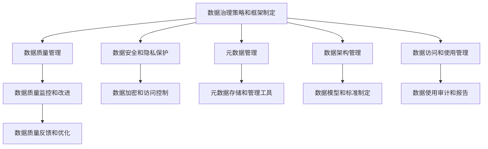

# 数据治理与数据治理行业协会的合作与交流

## 1.背景介绍

### 1.1 数据治理的重要性

在当今数据驱动的时代,数据已经成为企业最宝贵的资产之一。随着数据量的快速增长和数据类型的多样化,确保数据的质量、安全性和合规性成为企业面临的重大挑战。这就引出了数据治理的概念,旨在建立一个有效的框架,管理和优化企业数据资产的整个生命周期。

数据治理不仅关注数据本身,还关注数据相关的人员、流程和技术,以确保数据的可靠性、一致性和可用性。良好的数据治理有助于提高数据质量,减少数据重复和冗余,加强数据安全和隐私保护,并支持更好地数据驱动决策。

### 1.2 数据治理行业协会的作用

由于数据治理涉及多个方面,需要跨部门和跨组织的协作。因此,数据治理行业协会的作用就显得尤为重要。这些协会通常由来自不同行业和领域的数据治理专家、从业人员和利益相关方组成,旨在促进最佳实践的分享、标准的制定和行业发展的推动。

数据治理行业协会可以提供宝贵的资源、培训和认证,帮助企业建立和完善数据治理框架。它们还举办会议和活动,为数据治理专业人士提供互相学习和交流的平台。

## 2.核心概念与联系  

### 2.1 数据治理的核心概念

数据治理涉及以下几个核心概念:

1. **数据质量管理**: 确保数据的准确性、完整性、一致性和及时性。
2. **数据安全和隐私保护**: 保护敏感数据免受未经授权的访问、修改或泄露。
3. **数据生命周期管理**: 管理数据从创建到归档或销毁的整个生命周期。
4. **元数据管理**: 捕获和维护关于数据的描述性信息,以支持数据发现和理解。
5. **数据架构管理**: 设计和管理企业数据架构,以支持业务需求和数据集成。
6. **数据访问和使用管理**: 确保数据被适当地访问和使用,满足业务需求和合规性要求。

### 2.2 数据治理与其他领域的联系

数据治理与企业的其他领域密切相关,包括但不限于:

1. **信息技术(IT)**: 数据治理需要与IT基础设施、数据平台和数据管理工具紧密集成。
2. **业务流程管理**: 数据治理需要与业务流程和决策相结合,以确保数据支持业务目标。
3. **合规性和风险管理**: 数据治理有助于确保企业遵守相关法规和标准,并降低数据相关风险。
4. **数据分析和商业智能**: 高质量的数据是进行有效数据分析和制定数据驱动决策的前提。

## 3.核心算法原理具体操作步骤

数据治理通常涉及以下几个关键步骤:



1. **数据治理策略和框架制定**: 确立数据治理的愿景、原则、政策和流程,明确数据治理的职责和角色。建立数据治理委员会或理事会,负责制定和执行数据治理战略。

2. **数据质量管理**: 制定数据质量标准和指标,监控数据质量,并采取必要的措施进行改进。这可能涉及数据剖析、数据清理和数据标准化等步骤。

3. **数据安全和隐私保护**: 实施适当的安全控制措施,如数据加密、访问控制和审计跟踪,以保护敏感数据免受未经授权的访问、修改或泄露。制定数据隐私政策并确保遵守相关法规。

4. **元数据管理**: 建立元数据存储库,捕获和维护有关数据资产的元数据,包括数据定义、数据lineage、数据质量指标等。元数据有助于数据发现、理解和管理。

5. **数据架构管理**: 设计和管理企业数据架构,包括数据模型、数据标准和数据集成。确保数据架构支持业务需求并促进数据共享和互操作性。

6. **数据访问和使用管理**: 制定数据访问和使用政策,确保数据被适当地访问和使用。实施数据使用审计和报告机制,以监控数据使用情况并确保合规性。

7. **持续监控和改进**: 持续监控数据治理计划的执行情况,收集反馈并进行必要的调整和优化。建立数据治理绩效指标,并定期审查和报告。

需要注意的是,数据治理是一个持续的过程,需要不断优化和完善。它还需要企业内部各部门和利益相关方的参与和协作。

## 4.数据模型和公式详细讲解举例说明  

在数据治理中,数据模型和公式扮演着重要角色,尤其是在数据质量管理和度量方面。以下是一些常见的数据质量指标及其公式:

### 4.1 完整性

完整性指数据是否缺失或不完整。它可以通过以下公式计算:

$$
完整性 = \frac{无缺失值的记录数}{总记录数}
$$

例如,如果一个表有1000条记录,其中950条记录没有缺失值,那么完整性就是0.95或95%。

### 4.2 准确性

准确性指数据是否正确反映了它所描述的实体或事物。它可以通过以下公式计算:

$$
准确性 = \frac{正确记录数}{总记录数}
$$

例如,如果一个表有1000条记录,其中980条记录是准确的,那么准确性就是0.98或98%。

### 4.3 一致性

一致性指数据在不同来源或不同时间点是否保持一致。它可以通过以下公式计算:

$$
一致性 = \frac{一致记录数}{总记录数}
$$

例如,如果一个表有1000条记录,其中960条记录在不同来源或时间点保持一致,那么一致性就是0.96或96%。

### 4.4 及时性

及时性指数据是否及时更新或反映当前状态。它可以通过以下公式计算:

$$
及时性 = \frac{及时更新的记录数}{总记录数}
$$

例如,如果一个表有1000条记录,其中970条记录及时更新,那么及时性就是0.97或97%。

### 4.5 唯一性

唯一性指数据中是否存在重复记录。它可以通过以下公式计算:

$$
唯一性 = \frac{唯一记录数}{总记录数}
$$

例如,如果一个表有1000条记录,其中990条记录是唯一的,那么唯一性就是0.99或99%。

这些指标和公式可以帮助企业量化和监控数据质量,从而识别并解决数据质量问题。在实际应用中,企业可能需要根据自身需求定制特定的数据质量指标和计算方法。

## 5.项目实践:代码实例和详细解释说明

为了更好地理解数据治理在实践中的应用,我们将使用Python编程语言和一些常见的数据处理库,如Pandas和NumPy,来演示一些数据质量管理和数据清理的示例。

### 5.1 数据加载和探索

首先,我们需要加载一些示例数据。在这个例子中,我们将使用一个包含客户信息的CSV文件。

```python
import pandas as pd

# 加载CSV文件
data = pd.read_csv('customer_data.csv')

# 查看数据的前5行
print(data.head())

# 获取数据的基本信息
print(data.info())
```

上面的代码将加载名为`customer_data.csv`的CSV文件,并使用Pandas库将其读入DataFrame对象。然后,我们可以使用`head()`方法查看数据的前5行,并使用`info()`方法获取数据的基本信息,如列名、数据类型和缺失值情况。

### 5.2 处理缺失值

处理缺失值是数据质量管理的一个重要方面。我们可以使用Pandas库提供的各种方法来处理缺失值。

```python
# 查找缺失值
print(data.isnull().sum())

# 删除包含缺失值的行
data_cleaned = data.dropna()

# 用特定值填充缺失值
data_filled = data.fillna(0)
```

上面的代码首先使用`isnull().sum()`方法查找每一列中缺失值的数量。然后,我们可以使用`dropna()`方法删除包含任何缺失值的行,或者使用`fillna()`方法用特定值(在这个例子中是0)填充缺失值。

### 5.3 数据标准化

数据标准化是确保数据一致性的一种方式。例如,我们可能需要将地址信息标准化为一种统一的格式。

```python
import re

# 定义标准化地址的函数
def standardize_address(address):
    # 去除多余空格
    address = re.sub(r'\s+', ' ', address.strip())
    
    # 将地址转换为大写
    address = address.upper()
    
    # 其他标准化规则...
    
    return address

# 应用标准化函数
data['Address'] = data['Address'].apply(standardize_address)
```

在上面的示例中,我们定义了一个名为`standardize_address`的函数,用于标准化地址字符串。该函数执行以下操作:

1. 使用正则表达式去除多余空格
2. 将地址转换为大写

然后,我们使用Pandas的`apply()`方法将该函数应用于`Address`列,从而标准化所有地址。

### 5.4 数据验证

数据验证是确保数据质量的另一个重要步骤。我们可以定义一些规则或约束条件,并检查数据是否符合这些条件。

```python
# 定义验证规则
def validate_email(email):
    # 使用正则表达式检查电子邮件格式
    pattern = r'^[\w\.-]+@[\w\.-]+\.\w+$'
    return bool(re.match(pattern, email))

# 应用验证规则
invalid_emails = data[~data['Email'].apply(validate_email)]
print(invalid_emails)
```

在这个例子中,我们定义了一个名为`validate_email`的函数,用于验证电子邮件地址的格式是否有效。该函数使用正则表达式匹配电子邮件地址的模式。

然后,我们使用Pandas的布尔索引和`apply()`方法找出所有无效的电子邮件地址。`~`运算符用于取反,因此`~data['Email'].apply(validate_email)`将返回一个布尔序列,指示哪些电子邮件地址无效。

通过这些示例,我们可以看到如何使用Python和数据处理库来执行一些基本的数据质量管理和数据清理任务。在实际项目中,您可能需要根据具体需求定制和扩展这些代码。

## 6.实际应用场景

数据治理在各个行业和领域都有广泛的应用,以下是一些典型的应用场景:

### 6.1 金融服务

在金融服务行业,数据治理对于确保数据的准确性、完整性和合规性至关重要。良好的数据治理有助于降低操作风险、防止欺诈行为,并支持更好的风险管理和投资决策。

### 6.2 医疗保健

医疗保健领域涉及大量敏感的患者数据,因此数据治理对于保护患者隐私、确保数据安全性和提高数据质量都至关重要。数据治理还有助于促进不同医疗系统之间的数据共享和互操作性。

### 6.3 制造业

在制造业中,数据治理可以帮助企业管理产品数据、供应链数据和客户数据等。通过确保这些数据的质量和一致性,企业可以优化生产流程、改善产品质量和提高客户满意度。

### 6.4 零售